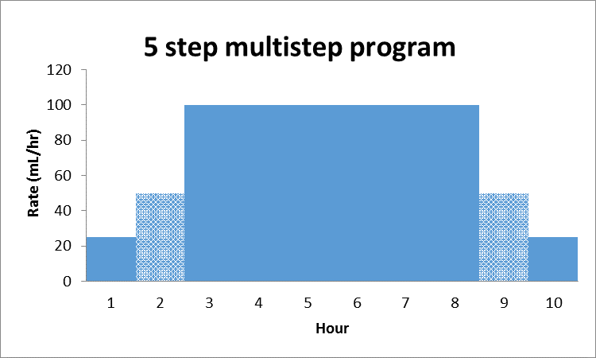
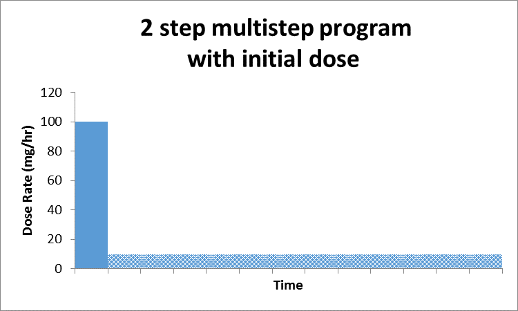
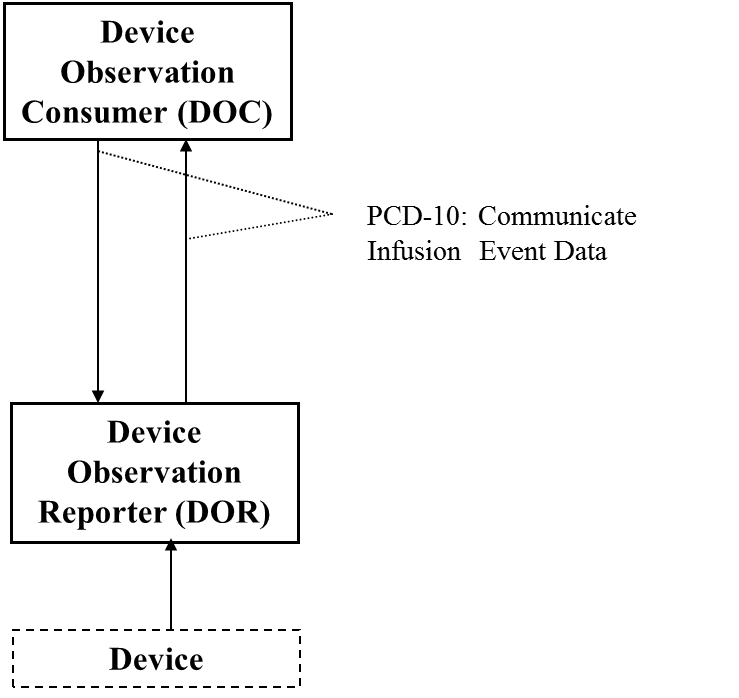
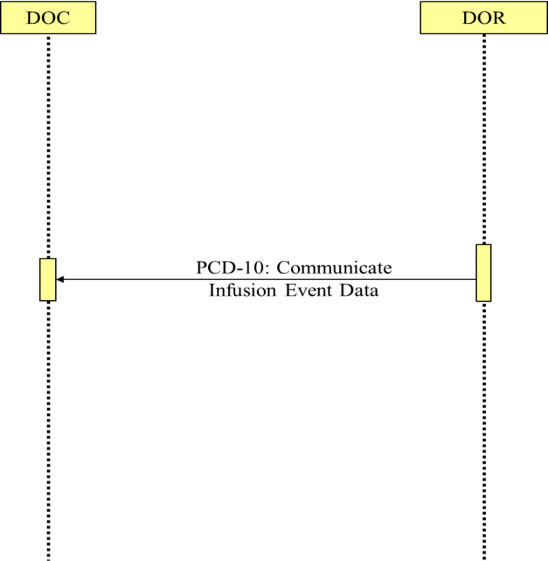

*Integrating the Healthcare Enterprise*

image:extracted-media-tf1/media/image1.jpeg[IHE_LOGO_for_tf-docs,width=171,height=88]

*IHE Devices (DEV)*

*Technical Framework*

*Volume 1*

*IHE PCD TF-1*

*Profiles*

*Revision 10.0 – Final Text*

*November 4, 2024*

*Please verify you have the most recent version of this document,* which is published https://profiles.ihe.net/DEV/index.html[here].

CONTENTS

link:#introduction[1 Introduction link:#introduction[5]]

link:#introduction-to-ihe[1.1 Introduction to IHE link:#introduction-to-ihe[5]]

link:#introduction-to-ihe-devices-dev[1.2 Introduction to IHE Devices (DEV) link:#introduction-to-ihe-devices-dev[5]]

link:#intended-audience[1.3 Intended Audience link:#intended-audience[6]]

link:#pre-requisites-and-reference-material[1.4 Pre-requisites and Reference Material link:#pre-requisites-and-reference-material[6]]

link:#actors[1.4.1 Actors link:#actors[6]]

link:#transactions[1.4.2 Transactions link:#transactions[6]]

link:#ihe-integration-statements[1.4.3 IHE Integration Statements link:#ihe-integration-statements[6]]

link:#_Toc181620082[1.5 Overview of Technical Framework Volume 1 link:#_Toc181620082[7]]

link:#comment-process[1.6 Comment Process link:#comment-process[7]]

link:#copyright-licenses[1.7 Copyright Licenses link:#copyright-licenses[7]]

link:#trademark[1.8 Trademark link:#trademark[7]]

link:#disclaimer-regarding-patent-rights[1.9 Disclaimer Regarding Patent Rights link:#disclaimer-regarding-patent-rights[7]]

link:#history-of-document-changes[1.10 History of Document Changes link:#history-of-document-changes[8]]

link:#devices-integration-profiles[2 Devices Integration Profiles link:#devices-integration-profiles[9]]

link:#required-actor-groupings-and-bindings[2.1 Required Actor Groupings and Bindings link:#required-actor-groupings-and-bindings[9]]

link:#security-implications[2.2 Security Implications link:#security-implications[10]]

link:#profiles-overview[2.3 Profiles Overview link:#profiles-overview[10]]

link:#product-implementations[2.4 Product Implementations link:#product-implementations[10]]

link:#dependencies-between-integration-profiles[2.5 Dependencies between Integration Profiles link:#dependencies-between-integration-profiles[10]]

link:#rosetta-terminology-mapping-rtm[2.6 Rosetta Terminology Mapping (RTM) link:#rosetta-terminology-mapping-rtm[11]]

link:#device-enterprise-communication-dec-profile[3 Device Enterprise Communication (DEC) Profile link:#device-enterprise-communication-dec-profile[13]]

link:#dec-actors-and-transactions[3.1 DEC Actors and Transactions link:#dec-actors-and-transactions[13]]

link:#patient-demographics-recommended-transactions[3.1.1 Patient Demographics – Recommended Transactions link:#patient-demographics-recommended-transactions[14]]

link:#dec-profile-options[3.2 DEC Profile Options link:#dec-profile-options[14]]

link:#_Toc181620100[3.3 DEC Overview link:#_Toc181620100[15]]

link:#note-on-patient-identification[3.3.1 Note on Patient Identification link:#note-on-patient-identification[16]]

link:#dec-use-cases[3.4 DEC Use Cases link:#dec-use-cases[16]]

link:#standard-use-cases[3.4.1 Standard Use Cases link:#standard-use-cases[16]]

link:#case-dec-1-communicate-patient-identified-dec-data-to-emrehr[3.4.1.1 Case DEC-1: Communicate patient identified DEC data to EMR/EHR link:#case-dec-1-communicate-patient-identified-dec-data-to-emrehr[16]]

link:#case-dec-2-communicate-validated-periodic-dec-data-to-emrehr[3.4.1.2 Case DEC-2: Communicate validated periodic DEC data to EMR/EHR link:#case-dec-2-communicate-validated-periodic-dec-data-to-emrehr[16]]

link:#optional-use-cases-for-automatic-patient-demographics-acquisition[3.4.2 Optional Use Cases for Automatic Patient Demographics Acquisition link:#optional-use-cases-for-automatic-patient-demographics-acquisition[17]]

link:#case-dec-id-1-patient-id-known-in-adt-locally-available[3.4.2.1 Case DEC-ID-1: Patient ID known in ADT&#44; locally available link:#case-dec-id-1-patient-id-known-in-adt-locally-available[18]]

link:#case-dec-id-2-patient-id-known-in-adt-not-locally-available[3.4.2.2 Case DEC-ID-2: Patient ID known in ADT&#44; not locally available link:#case-dec-id-2-patient-id-known-in-adt-not-locally-available[18]]

link:#case-dec-id-3-patient-id-not-known-in-adt-locally-available[3.4.2.3 Case DEC-ID-3 Patient ID not known in ADT&#44; locally available link:#case-dec-id-3-patient-id-not-known-in-adt-locally-available[18]]

link:#case-dec-id-4-patient-id-not-known-in-adt-not-locally-available.[3.4.2.4 Case DEC-ID-4: Patient ID not known in ADT&#44; not locally available. link:#case-dec-id-4-patient-id-not-known-in-adt-not-locally-available.[18]]

link:#other-clinical-examples[3.4.2.5 Other Clinical Examples link:#other-clinical-examples[19]]

link:#point-of-care-infusion-verification-piv-profile[4 Point-of-Care Infusion Verification (PIV) Profile link:#point-of-care-infusion-verification-piv-profile[20]]

link:#piv-actors-and-transactions[4.1 PIV Actors and Transactions link:#piv-actors-and-transactions[20]]

link:#_Toc181620114[4.2 Integration Profile Options link:#_Toc181620114[21]]

link:#piv-overview[4.3 PIV Overview link:#piv-overview[21]]

link:#piv-process-flow[4.3.1 PIV Process Flow link:#piv-process-flow[23]]

link:#use-cases[4.4 Use Cases link:#use-cases[23]]

link:#integration-profile-safety-and-security-considerations[4.5 Integration Profile Safety and Security Considerations link:#integration-profile-safety-and-security-considerations[26]]

link:#implantable-device-cardiac-observation-idco[5 Implantable Device – Cardiac – Observation (IDCO) link:#implantable-device-cardiac-observation-idco[26]]

link:#idco-actors-and-transactions[5.1 IDCO Actors and Transactions link:#idco-actors-and-transactions[27]]

link:#_Toc181620121[5.2 IDCO Integration Profile Options link:#_Toc181620121[28]]

link:#idco-use-cases[5.3 IDCO Use Cases link:#idco-use-cases[28]]

link:#use-case-idco-1-implantable-cardiac-device-in-clinic-follow-up[5.3.1 Use Case IDCO-1: Implantable Cardiac Device In-Clinic Follow-up link:#use-case-idco-1-implantable-cardiac-device-in-clinic-follow-up[28]]

link:#use-case-idco2-implantable-cardiac-device-in-clinic-follow-up-with-networked-programmer-that-translates-information[5.3.2 Use Case IDCO2: Implantable Cardiac Device In-Clinic Follow-up with Networked Programmer that Translates Information link:#use-case-idco2-implantable-cardiac-device-in-clinic-follow-up-with-networked-programmer-that-translates-information[29]]

link:#use-case-idco-3-implantable-cardiac-device-remote-follow-up[5.3.3 Use Case IDCO-3: Implantable Cardiac Device Remote Follow-up link:#use-case-idco-3-implantable-cardiac-device-remote-follow-up[29]]

link:#use-case-idco-4-remote-monitoring-of-implanted-cardiac-devices[5.3.4 Use Case IDCO-4: Remote Monitoring of Implanted Cardiac Devices link:#use-case-idco-4-remote-monitoring-of-implanted-cardiac-devices[30]]

link:#idco-process-flow[5.4 IDCO Process Flow link:#idco-process-flow[30]]

link:#idco-patient-identification-considerations[5.5 IDCO Patient Identification Considerations link:#idco-patient-identification-considerations[32]]

link:#idco-security-considerations[5.6 IDCO Security Considerations link:#idco-security-considerations[32]]

link:#alert-communication-management-acm-integration-profile[6 Alert Communication Management (ACM) Integration Profile link:#alert-communication-management-acm-integration-profile[34]]

link:#acm-actors-and-transactions[6.1 ACM Actors and Transactions link:#acm-actors-and-transactions[35]]

link:#acm-integration-profile-options[6.2 ACM Integration Profile Options link:#acm-integration-profile-options[36]]

link:#actor-descriptions[6.3 Actor Descriptions link:#actor-descriptions[37]]

link:#alert-reporter-ar-actor[6.3.1 Alert Reporter (AR) Actor link:#alert-reporter-ar-actor[37]]

link:#alert-manager-am-actor[6.3.2 Alert Manager (AM) Actor link:#alert-manager-am-actor[38]]

link:#alert-consumer-acon-actor[6.3.3 Alert Consumer (ACON) Actor link:#alert-consumer-acon-actor[40]]

link:#alert-communicator-ac-actor[6.3.4 Alert Communicator (AC) Actor link:#alert-communicator-ac-actor[40]]

link:#acm-use-cases[6.4 ACM Use Cases link:#acm-use-cases[41]]

link:#acm-process-flow[6.4.1 ACM Process Flow link:#acm-process-flow[42]]

link:#acm-use-cases-1[6.4.2 ACM Use Cases link:#acm-use-cases-1[43]]

link:#case-a1-location-sourced[6.4.2.1 Case A1: Location Sourced link:#case-a1-location-sourced[43]]

link:#case-a2-identified-patient-source[6.4.2.2 Case A2: Identified Patient Source link:#case-a2-identified-patient-source[44]]

link:#case-a3-same-as-a1a2-with-escalation-with-cancel-at-alert-source[6.4.2.3 Case A3: Same as A1/A2 with Escalation with Cancel at Alert Source link:#case-a3-same-as-a1a2-with-escalation-with-cancel-at-alert-source[46]]

link:#case-a4-same-as-a1a2-with-escalation-with-cancel-at-communication-endpoint[6.4.2.4 Case A4: Same as A1/A2 with Escalation with Cancel at Communication Endpoint link:#case-a4-same-as-a1a2-with-escalation-with-cancel-at-communication-endpoint[46]]

link:#case-a5-same-as-a1a2-with-escalation-with-cancel-at-alert-manager[6.4.2.5 Case A5: Same as A1/A2 with Escalation with Cancel at Alert Manager link:#case-a5-same-as-a1a2-with-escalation-with-cancel-at-alert-manager[46]]

link:#case-a6-information-with-no-destination-other-than-logging-by-the-alert-manager-am-or-alert-consumer-actor[6.4.2.6 Case A6: Information with no destination other than logging by the Alert Manager (AM) or Alert Consumer Actor link:#case-a6-information-with-no-destination-other-than-logging-by-the-alert-manager-am-or-alert-consumer-actor[46]]

link:#case-a7-equipment-sourced-alert[6.4.2.7 Case A7: Equipment Sourced Alert link:#case-a7-equipment-sourced-alert[47]]

link:#acm-security-considerations[6.5 ACM Security Considerations link:#acm-security-considerations[47]]

link:#_Toc181620149[7 Infusion Pump Event Communication (IPEC) Integration Profile link:#_Toc181620149[48]]

link:#actorstransactions[7.1 Actors/Transactions link:#actorstransactions[49]]

link:#_Toc181620151[7.2 IPEC Options link:#_Toc181620151[50]]

link:#ipec-actor-groupings-and-profile-interactions[7.3 IPEC Actor Groupings and Profile Interactions link:#ipec-actor-groupings-and-profile-interactions[50]]

link:#infusion-pump-event-communication-process-flow[7.4 Infusion Pump Event Communication Process Flow link:#infusion-pump-event-communication-process-flow[51]]

link:#standard-use-cases-1[7.4.1 Standard Use Cases link:#standard-use-cases-1[51]]

link:#case-ipec-1-communicate-event-data-to-emrehr[7.4.1.1 Case IPEC-1: Communicate event data to EMR/EHR link:#case-ipec-1-communicate-event-data-to-emrehr[51]]

link:#ipec-security-considerations[7.5 IPEC Security Considerations link:#ipec-security-considerations[51]]

link:#_Toc181620157[Appendices link:#_Toc181620157[52]]

link:#appendix-a-rosetta-terminology-mapping-rtm[Appendix A Rosetta Terminology Mapping (RTM) link:#appendix-a-rosetta-terminology-mapping-rtm[52]]

link:#a.1-problem-statement[A.1 Problem Statement link:#a.1-problem-statement[52]]

link:#a.2-key-use-case[A.2 Key Use Case link:#a.2-key-use-case[53]]

link:#_Toc181620161[Glossary link:#_Toc181620161[54]]

== Introduction

This document, Volume 1 of the IHE Devices (DEV) Technical Framework, describes the clinical use cases, actors, content module, and transaction requirements for the Devices profiles.

=== Introduction to IHE

Integrating the Healthcare Enterprise (IHE) is an international initiative to promote the use of standards to achieve interoperability among health information technology (HIT) systems and effective use of electronic health records (EHRs). IHE provides a forum for care providers, HIT experts and other stakeholders in several clinical and operational domains to reach consensus on standards-based solutions to critical interoperability issues.

The primary output of IHE is system implementation guides, called IHE profiles. IHE publishes each profile through a well-defined process of public review and Trial Implementation and gathers profiles that have reached Final Text status into an IHE Technical Framework, of which this volume is a part.

For general information regarding IHE, refer to http://www.ihe.net[www.ihe.net].

=== Introduction to IHE Devices (DEV)

The Devices (DEV) domain is concerned with use cases in which at least one actor is a regulated patient-centric point-of-care medical device that communicates with at least one other actor such as a medical device or information system.

The DEV domain coordinates with and supports other domains, such as Radiology (medical imaging), IT Infrastructure and Pathology and Laboratory Medicine to ensure consistency in use cases involving regulated medical devices as they occur throughout the Enterprise.

*DEV Vision Statement*

The DEV domain is the nexus for vendors and providers to jointly define and demonstrate unambiguous interoperability specifications, called profiles, which are based on industry standards, and which can be brought to market.

*DEV Mission Statement*

The DEV domain, working with regional and national deployment committees, will apply the proven, use case driven IHE processes to:

* Deliver the technical framework for the IHE DEV domain profiles
* Test conformance with published IHE DEV profiles using test plans, tools and scripts at Connectathons
* Demonstrate marketable solutions at public trade shows

The DEV domain manages the development and maintenance of the http://wiki.ihe.net/index.php?title=PCD_Profiles[DEV Profiles] and the https://wiki.ihe.net/index.php/DEV_Technical_Framework[DEV Technical Framework].

=== Intended Audience

The intended audience of IHE Technical Frameworks Volume 1 (Profiles) is:

* Those interested in integrating healthcare information systems and workflows
* IT departments of healthcare institutions
* Technical staff of vendors participating in the IHE initiative

=== Pre-requisites and Reference Material

It is strongly recommended that, prior to reading this volume, readers familiarize themselves with the concepts defined in the https://profiles.ihe.net/GeneralIntro/[IHE Technical Frameworks General Introduction].

Additional reference material available includes:

==== Actors 

Actors are information systems or components of information systems that produce, manage, or act on information associated with operational activities in the enterprise.

For information on actors for all domains and their brief descriptions, see IHE Technical Frameworks General Introduction, https://profiles.ihe.net/GeneralIntro/ch-A.html[Appendix A] - Actors.

==== Transactions

Transactions are interactions between actors that transfer the required information through standards-based messages.

For information on transactions defined for all domains, their transactions numbers, and a brief description, see IHE Technical Frameworks General Introduction, https://profiles.ihe.net/GeneralIntro/ch-B.html[Appendix B - Transactions].

==== IHE Integration Statements

IHE Integration Statements provide a consistent way to document high level IHE implementation status in products between vendors and users.

The instructions and template for IHE Integration Statements can be found in the IHE Technical Frameworks General Introduction, https://profiles.ihe.net/GeneralIntro/ch-F.html[Appendix F] - Integration Statements.

IHE also provides the IHE Product Registry (http://www.ihe.net/IHE_Product_Registry/[http://www.ihe.net/IHE_Product_Registry]) as a resource for vendors and purchasers of HIT systems to communicate about the IHE compliance of such systems. Vendors can use the Product Registry to generate and register Integration Statements.

=== Overview of Technical Framework Volume 1

Volume 1 is comprised of several distinct sections:

* Section 1 provides background and reference material.
* Section 2 presents the conventions used in this volume to define the profiles and provides an overview of the defined profiles.
* Sections 3 and beyond define Devices profiles, actors, and requirements in detail.

The appendices in Volume 1 provide clarification of uses cases or other details.

For a brief overview of additional Technical Framework Volumes (TF-2, TF-3, TF-4), please see the IHE Technical Frameworks General Introduction, https://profiles.ihe.net/GeneralIntro/ch-5.html[Section 5].

=== Comment Process

IHE International welcomes comments on this document and the IHE initiative. Comments on the IHE initiative can be submitted by sending an email to the co-chairs and secretary of the Devices domain committees at devdev@ihe.net. Comments on this document can be submitted at https://www.ihe.net/DEV_Public_Comments/[https://www.ihe.net/DEV_Public_Comments].

=== Copyright Licenses

IHE technical documents refer to, and make use of, a number of standards developed and published by several standards development organizations. Please refer to the IHE Technical Frameworks General Introduction, https://profiles.ihe.net/GeneralIntro/ch-9.html[Section 9 - Copyright Licenses] for copyright license information for frequently referenced base standards. Information pertaining to the use of IHE International copyrighted materials is also available there.

=== Trademark

IHE^®^ and the IHE logo are trademarks of the Healthcare Information Management Systems Society in the United States and trademarks of IHE Europe in the European Community. Please refer to the IHE Technical Frameworks General Introduction, https://profiles.ihe.net/GeneralIntro/ch-10.html[Section 10 - Trademark] for information on their uses.

=== Disclaimer Regarding Patent Rights

Attention is called to the possibility that implementation of the specifications in this document may require use of subject matter covered by patent rights. By publication of this document, no position is taken with respect to the existence or validity of any patent rights in connection therewith. IHE International is not responsible for identifying Necessary Patent Claims for which a license may be required, for conducting inquiries into the legal validity or scope of Patents Claims or determining whether any licensing terms or conditions provided in connection with submission of a Letter of Assurance, if any, or in any licensing agreements are reasonable or non-discriminatory. Users of the specifications in this document are expressly advised that determination of the validity of any patent rights, and the risk of infringement of such rights, is entirely their own responsibility. Further information about the IHE International patent disclosure process including links to forms for making disclosures is available at http://www.ihe.net/Patent_Disclosure_Process/[http://www.ihe.net/Patent_Disclosure_Process]. Please address questions about the patent disclosure process to the secretary of the IHE International Board: secretary@ihe.net.

===  History of Document Changes

This section provides a brief summary of changes and additions to this document.

[width="100%",cols="14%,14%,72%",options="header",]
|===
|Date |Document Revision |Change Summary
|2014-11-04 |4.0 |Added Alert Consumer to Alert Communication Management Profile. Rearranged material to conform to current template for Technical Framework Volume 1.
|2015-10-14 |5.0 |Updated ACM Profile with approved CPs and housekeeping corrections.
|2016-11-09 |6.0 |Added cross-reference to ITI mACM Profile
|2017-11-09 |7.0 |Updated ACM Profile for CP 132 ACM Use Case A6 to indicate that the Alert Consumer (ACon) is an additional recipient and that the decision to log only is implementation specific.
|2018-10-23 |8.0 |Updated some wording in Section 1 and links to the General Introduction and associated appendices.
|2019-12-12 |9.0 a|
Infusion Pump Event Communication (IPEC) has been accepted by IHE DEV Technical and Planning Committees for Final Text status; therefore, Section 7 Infusion Pump Event Communication (IPEC) has been added to this Technical Framework document.

Volume 1 changes in accepted Change Proposals 139-146 have been applied, specifically PIV extensions for bolus and multistep in CP 139. Other CPs did not affect Volume 1 material.

|NOV 2024 |10.0 |Updates due to Patient Care Device name change to Devices and to reflect current template.
|===

== Devices Integration Profiles

IHE Integration Profiles offer a common language that healthcare professionals and vendors can use to discuss integration needs of healthcare enterprises and the integration capabilities of information systems in precise terms. Integration Profiles specify implementations of standards that are designed to meet identified clinical needs. They enable users and vendors to state which IHE capabilities they require or provide, by reference to the detailed specifications of the IHE Devices Technical Framework.

IHE Integration Profiles are defined in terms of IHE actors (defined in Volume 1), transactions (defined in Volume 2), and content modules (defined in Volume 3). Actors are information systems or components of information systems that produce, manage, or act on information associated with clinical and operational activities in healthcare. Transactions are interactions between actors that communicate the required information through standards-based messages. Content modules define how the content used in a transaction is structured. A content module is specified to be independent of the transaction in which it appears.

Vendor products support an Integration Profile by implementing the appropriate actor(s) and transactions. A given product may implement more than one actor and more than one integration profile.

IHE profiles which have reached the status of _Final Text_ are published as part of the domain’s Technical Framework Volumes 1-4. Prior to Final Text status, IHE profiles are published independently as _Profile Supplements_ with the status of _Public Comment_ or _Trial Implementation_.

For a list and short description of Devices profiles, see https://wiki.ihe.net/index.php/Profiles%23IHE_Devices_Profiles[https://wiki.ihe.net/index.php/Profiles#IHE_Devices_Profiles]. The list includes all of the profiles in this document (Final Text) and may include profiles in the Trial Implementation and Public Comment stage.

=== Required Actor Groupings and Bindings

The IHE Technical Framework relies on the concepts of _required actor groupings_ and _bindings_.

Required actor groupings may be defined between two or more IHE actors. Actors are grouped to combine the features of existing actors. This allows reuse of features of an existing actor and does not recreate those same features in another actor. Internal communication between grouped actors is not specified by IHE. An example of grouped actors in the IHE Radiology Scheduled Workflow Profile is the grouping between the Image Manager and Image Archive.

Additionally, required actor groupings may cross profile boundaries. For example, an XDS Document Registry is required to be grouped with an ATNA Secure Node. Required actor groupings are defined in each profile definition in Volume 1. To comply with an actor in an IHE profile, a system must perform all transactions required for that actor in that profile. Actors supporting multiple Integration Profiles must support all of the transactions of each profile. (Note: In previous versions of IHE Technical Framework documents, the concept of profile dependencies existed. For simplification, profile dependencies have been combined with required actor groupings and are enumerated/repeated within each profile in Volume 1.)

Bindings refer to content modules. Bindings map data from a content module to the metadata of a specific transport profile. Bindings for content modules, and the associated concepts, are defined in Volume 3.

=== Security Implications

IHE transactions often contain information that must be protected in conformance with privacy laws, regulations and best practices. This protection is documented in the Security Considerations section of each profile, which communicates security/privacy concerns that the implementers need to be aware of, assumptions made about security/privacy pre-conditions and, where appropriate, key elements of a risk mitigation strategy to be applied.

=== Profiles Overview

A brief overview of Devices profiles is provided on the IHE Wiki at https://wiki.ihe.net/index.php/Profiles%23IHE_Devices_Profiles[https://wiki.ihe.net/index.php/Profiles#IHE_Devices_Profiles]. The list includes all of the profiles in this document (Final Text) and may include profiles in the Trial Implementation and Public Comment stage.

=== Product Implementations

As described in detail in the https://profiles.ihe.net/GeneralIntro/index.html[IHE Technical Frameworks General Introduction], an implementer chooses specific profiles, actors, and options to implement for their product. To comply with an actor in an IHE profile, a system must perform all the required transactions for that actor in that profile.

To communicate the conformance of a product offering with IHE profiles, implementers provide an IHE Integration Statement describing which IHE integration profiles, IHE actors and options are incorporated.

Further discussion about integration statements and a sample form can be found in the IHE Technical Frameworks General Introduction, https://profiles.ihe.net/GeneralIntro/ch-F.html[Appendix F]. To make consumers aware of the product integration statement, enter it in the IHE Product Registry (http://product-registry.ihe.net/).

=== Dependencies between Integration Profiles 

Dependencies among IHE Integration Profiles exist when implementation of one integration profile is a prerequisite for achieving the functionality defined in another integration profile. Table 2.5-1 defines the required dependencies. Some dependencies require that an actor supporting one profile be grouped with one or more actors supporting other integration profiles.

There are of course other useful synergies that occur when different combinations of profiles are implemented, but those are not described in the table below. For instance, actors of the various DEV profiles may implement profiles of the IT Infrastructure domain for user or node authentication, audit trails, patient identifier cross-referencing, etc.

Table 2.5-1: Devices Integration Profile Dependencies

[width="100%",cols="25%,32%,23%,20%",options="header",]
|===
|Integration Profile |Depends on |Dependency Type |Purpose
|Device Enterprise Communication (DEC) |Consistent Time |Each actor implementing DEC shall be grouped with the Time Client |Required for consistent time-stamping of messages and data
|Point-of-Care Infusion Verification (PIV) |Consistent Time |Each actor implementing PIV shall be grouped with the Time Client |Required for consistent time-stamping of messages and data
|Alert Communication Management (ACM) |Consistent Time |Each actor implementing ACM shall be grouped with the Time Client |Required for consistent time-stamping of messages and data
|Implantable Device - Cardiac – Observation (IDCO) |None |N/A |N/A
|Infusion Pump Event Communication (IPEC) |Consistent Time |Each actor implementing IPEC shall be grouped with the Time Client |Required for consistent time-stamping of messages and data
|===

Vendor products support an Integration Profile by implementing the appropriate actor-transactions as outlined in the Integration Profile in Section 3. A product may implement more than one actor and more than one Integration Profile.

To support a dependent profile, an actor must implement all required transactions in the pre-requisite profiles in addition to those in the dependent profile. In some cases, the prerequisite is that the actor selects any one of a given set of profiles.

Actors are information systems or components of information systems that produce, manage, or act on information associated with operational activities in the enterprise.

Transactions are interactions between actors that transfer the required information through standards-based messages.

=== Rosetta Terminology Mapping (RTM)

The Rosetta Terminology Mapping has general application in IHE DEV Profiles.

The primary purpose of the Rosetta Terminology Mapping (RTM) managed value set is to _harmonize the use of existing ISO/IEEE 11073-10101 nomenclature terms_ by systems compliant with IHE DEV profiles. The RTM Profile also specifies the _units-of-measure_ and _enumerated values_ permitted for each numeric parameter to facilitate safe and interoperable communication between devices and systems. Use of RTM is required in IHE-DEV profiles.

The Rosetta Table also is designed to serve as a temporary repository that can be used to define _new nomenclature terms_ that are currently not present in the ISO/IEEE 11073-10101 nomenclature. Based on our experience to date, well over 100 new terms will be required, principally in the area of ventilator and ventilator settings. The RTM will also serve as a framework for capturing new terms to support the IEEE 11073 ‘Personal Health Devices’ (PHD) initiative. Additional information on RTM can be found in Appendix A.

== Device Enterprise Communication (DEC) Profile

The Device Enterprise Communication Integration Profile supports communication of vendor independent, multi-modality Patient Care Devices data to Enterprise Applications using consistent semantics. It accomplishes this by mapping PCD data from proprietary syntax and semantics into a single syntactic and semantic representation for communication to the enterprise. The PCD data is time stamped with a consistent enterprise time. Options are provided to allow applications to filter particular PCD data of interest.

=== DEC Actors and Transactions

The following figure diagrams the actors involved with this profile and the transactions between actors.

Figure 3.1-1: DEC Integration Profile with Actors and Transactions

Table 3.1-1: DEC - Actors and Transactions lists the transactions for each actor directly involved in the DEC Integration Profile. In order to claim support of this Integration Profile, an implementation must perform the required transactions (labeled “R”). Transactions labeled “O” are optional. A complete list of options defined by this Integration Profile that implementations may choose to support is listed in Section 3.2.

Table 3.1-1: DEC - Actors and Transactions

[width="100%",cols="22%,44%,16%,18%",options="header",]
|===
|Actors |Transactions |Optionality |Section in Volume 2
|Device Observation Consumer |Communicate PCD Data [PCD-01] |R |Section 3.1
|Device Observation Reporter |Communicate PCD Data [PCD-01] |R |Section 3.1
|===

Refer to Table 2.5-1: Devices Integration Profile Dependencies for other profiles that may be pre-requisites for this profile.

==== Patient Demographics – Recommended Transactions

While not required, it is recommended that IHE transactions be employed for acquisition of Patient Demographics from other systems. The recommended transactions include:

____
*Patient Demographics Query* – This transaction contains the Patient Demographics information in response to a specific query on a specific patient. [ITI-21]

*Patient Identity Feed* - This transaction is broadcast from the Patient Demographics supplier when changes to the patient demographics occur. [ITI-30]

*Patient Encounter Management* - The Patient Encounter Source registers or updates an encounter (inpatient, outpatient, pre-admit, etc.) and forwards the information to other systems implementing the Patient Encounter Consumer. This information will include the patient’s location and care providers for a particular (usually current) encounter. [ITI-31]
____

=== DEC Profile Options

Many actors have options defined in order to accommodate variations in use across domains or implementations. Options that may be selected for this integration profile are listed in Table 3.2-1: DEC - Actors and Options along with the actors to which they apply. A subset of these options is required for implementation by actors in this profile (although they may be truly optional in other profiles).

Table 3.2-1: DEC - Actors and Options

[width="100%",cols="38%,43%,19%",options="header",]
|===
|Actor |Option Name |Section in Volume 2
|Device Observation Reporter |_No option (assumes MLLP Transport)_ |Appendix I
| |_Web Services (WS*) Transport Option (rather than default MLLP Transport)_ |Appendix J
|Device Observation Consumer |_None (assumes MLLP Transport)_ |Appendix I
| |_Web Services (WS*) Transport Option (rather than default MLLP Transport)_ |Appendix J
|===

=== DEC Overview

In a recent HIMSS survey of requirements for Devices (DEV), the respondents identified Enterprise Sharing of PCD data as their highest priority. Goals include shortening decision time, increasing productivity, minimizing transcription errors, and obtaining increased contextual information regarding the data.

PCD data includes:

* Periodic physiologic data (heart rate, invasive blood pressure, respiration rate, etc.)
* Aperiodic physiologic data (non-invasive blood pressure, patient weight, cardiac output, etc.)
* Alarm and alert information
* Device settings and the ability to manipulate those settings
* CLIA waived (or equivalent international waiver) point-of-care laboratory tests (i.e., home blood glucose, etc.)

PCD data may also include contextual data such as the patient ID, caregiver identification, and physical location of the device.

The Device Enterprise Communication (DEC) Profile addresses the need for consistent communication of PCD data to the enterprise. Enterprise recipients of PCD data include, but are not limited to, Clinical Decision Support applications, Clinical Data Repositories (CDRs), Electronic Medical Record applications (EMRs), and Electronic Health Records (EHRs).

The current profile does not address issues of privacy, security, and confidentiality associated with cross-enterprise communication of PCD data. The assumption is made that the DEC Profile is implemented in a single enterprise on a secure network. These aspects are on the IHE DEV roadmap for subsequent years.

The current profile does not address use cases and transactions associated with either open loop or closed loop control of patient care devices. Real-time data such as alarms and alerts, waveforms (ECG, EEG, etc.) is currently not addressed.

==== Note on Patient Identification

Patient Identification is perhaps the most essential infrastructural component of any interoperability and communication process, particularly when PCD data is exported to the enterprise. It is the key element in medical device, communication, data analysis, reporting and record keeping. Automation of the entry of patient identification to patient care device has the potential for improving throughput, reducing errors, increasing safety and device and drug effectiveness, and efficiency. It is strongly recommended that implementations use IHE compliant transactions for acquisition of Patient Identification credentials. These transactions include ITI-21, ITI-30 and ITI-31. Other mechanisms such as bar code or RFID are also perfectly valid alternatives or complements.

=== DEC Use Cases

This Section describes the specific use cases and interactions defined for the DEC Workflow Profile. There are both standard Use Cases as well as optional Use Cases.

==== Standard Use Cases

===== Case DEC-1: Communicate patient identified DEC data to EMR/EHR

Data from all of the patient care devices associated with a particular patient is communicated by a Gateway, Device or Clinical Information System (CIS) implementing the Device Observation Reporter to an EMR/EHR, implementing the Device Observation Consumer. Examples include data from bedside monitors, ventilators, and infusion pumps. Discrete parameters representing both periodic and aperiodic data are typically communicated at an interval of no less than once per minute. The data is time stamped with a consistent time across the data from the respective patient care devices.

The primary intent is communication of structured data; however, provisions are made for inclusion of unstructured data. The application provides facilities to bind an authoritative enterprise patient identifier required for inclusion of the PCD data in the patient record. The workflow for associating the authoritative enterprise patient identifier to the PCD data is outside the scope of the current DEV Technical Framework.

===== Case DEC-2: Communicate validated periodic DEC data to EMR/EHR

This Use Case builds on Case DEC-1 by communicating only data which has been validated by a caregiver by identifying the caregiver in the PCD data. The workflow implementing validation is outside the scope of the current DEV TF.

image:extracted-media-tf1/media/image2.emf[extracted-media-tf1/media/image2]

Figure 3.4.1.2-1: DEC Process Flow (No filtering)

==== Optional Use Cases for Automatic Patient Demographics Acquisition

The following examples describe which actors typical systems might be expected to support. This is not intended to define requirements, but rather to provide illustrative examples.

* A general purpose observation reporting gateway which combines the Device Observation Reporter and patient demographics.
* A patient care device which bundles the Device Observation Reporter and patient demographics.
* Patient Demographic Data that can be used in identifying the patient includes the following:
* Partial or complete patient name (printed on the patient record or wrist band, or related by the patient)
* Patient ID (from printed barcode, bedside chart, RFID, scan, etc.)
* Date of Birth / age range

Note: Bed ID is not accepted by the Joint Commission as a means of patient identity verification.

Patient Identification Binding Use Cases: The caregiver connects the patient to a patient care device. The patient is physically identified by the caregiver, using some institutionally unique protocol for identification such as verification of information contained on a wristband. The caregiver uses the information from the physical patient identification to authorize an electronic identification, made by the device or an independent device or system, binding the patient’s electronic identity to all data communicated from the patient care device. The verification may involve direct entry of data to the device being bound, a gateway, or an actor residing in a separate system. It may be based on direct physical identification of the patient by the caregiver or on confirmation by the caregiver of an electronic identification made by the device in concert with other devices or systems. The verification may also include fully automated binding when a unique logical authentication can be made. The end result is that data communicated from the patient care device contains an authoritative institutionally unique electronic identifier.

===== Case DEC-ID-1: Patient ID known in ADT, locally available

Note: The following are Use Cases in support of automatic acquisition of patient demographics. They do not map into any specific DEV profiles or transactions.

A patient is connected to a bedside monitor of a cardiac monitoring system (e.g., central station with continuous ADT feed via PAM broadcasts that includes a number of bedside monitors. The patient may or may not be able to provide positive ID information. Demographic information used to identify a patient includes: partial or complete patient name (printed on the patient record or told by the patient); Patient MRN (this may be obtained from printed barcode, a bedside chart, etc.); Partial ID entry or scan; Date of birth / age range. _Note: Bed ID is not permitted as an identifier in accord with Joint Commission standards.)_ Caregiver selects the patient from a pick list on the system console, in response to prompts by caregiver. System information includes showing the Medical Record Number (MRN), full name, age, sex, room/bed, and admit date. The central station binds the patient identity information with the device data.

===== Case DEC-ID-2: Patient ID known in ADT, not locally available

In the event that the patient above is not registered in the cardiac monitoring system, due to ADT lag or other situations, caregiver can execute a PDQ query of the patient registry to receive a pick list of patients and enter the patient ID into the system

===== Case DEC-ID-3 Patient ID not known in ADT, locally available

This is the John/Jane Doe patient, for whom the system has set up a Proxy Identification. The Proxy Identification is determined by either method, in accord with institutional policy and later linked with the true patient ID via ITI-PAM.

===== Case DEC-ID-4: Patient ID not known in ADT, not locally available.

This is the case of a patient presenting in the ER who is not registered in the system, where care must continue and identification may follow. When the patient demographics are unknown, time and device MAC address can be sent automatically, providing unique identification to the data. This last approach can also be used to create an audit trail as a complement to the other binding mechanisms.

===== Other Clinical Examples

*DEC-ID-A*: A patient is connected to an infusion device. The infusion device is connected to the network but is not managed by an infusion or drug administration management application. Caregiver scans barcode of the patient and the device. Caregiver is presented with a display of patient IDs from ADT and device ID from an authoritative database. Caregiver confirms.

*DEC-ID-B*: A patient is connected to an infusion device. The infusion device is connected to the network but is not managed by an infusion or drug administration management application. No ADT feed is available to confirm the ID. Caregiver confirms patient’s wristband identity through interactive communication with patient. The Patient ID wristband is scanned (barcode, RFID, etc.) and bound to the PCD.

*DEC-ID-C*: A patient is connected to a ventilator. The ventilator is connected to the network but is not managed by a system. Ventilator and patient have RFID tags. Proximity of the tags implies binding of patient’s ADT identification and device’s ID from an authoritative database. Verification of an existing Order for a Ventilator for the identified patient is required. If verified, Patient Id is bound to PCD.

== Point-of-Care Infusion Verification (PIV) Profile

The Point-of-Care Infusion Verification Profile supports the electronic transfer of infusion parameters from a Bedside Computer assisted Medication Administration (BCMA) system to an infusion pump, including general purpose, syringe, or patient-controlled analgesia (PCA) pumps. This capability will reduce errors by eliminating keystroke errors and by increasing the use of automatic dosage checking facilitated by the onboard drug libraries in “smart pump” systems. In addition to the reduction of medication administration errors, this integration may also increase caregiver productivity and provide more contextual information regarding infusion data.

Electronic transfer of infusion information from a pump to a clinical information system once an infusion has started can be accomplished using the Communicate PCD Data [PCD-01], possibly with Subscribe to PCD Data [PCD-02] transactions of the IHE DEV Device Enterprise Communication (DEC) Profile, as well as Communicate Infusion Event Data [PCD-10] of the IHE DEV Infusion Pump Event Communication (IPEC) Profile.

The goal of the proposed integration is to bring infusion systems into the electronic medication administration and documentation process.

=== PIV Actors and Transactions

Figure 4.1-1 shows the actors involved in the Point-of-Care Infusion Verification Integration Profile and the relevant transactions between them.

Figure 4.1-1: Point-of-Care Infusion Verification Actor Diagram

Table 4.1-1 lists the transactions for each actor directly involved in the Point-of-Care Infusion Verification Profile. In order to claim support of this Integration Profile, an implementation must perform the required transactions (labeled “R”). Transactions labeled “O” involve optional actors. A complete list of options defined by this Integration Profile and that implementations may choose to support is listed in Section 3.3.

Table 4.1-1: Point-of-Care Infusion Verification Integration Profile - Actors and Transactions

[width="100%",cols="31%,37%,16%,16%",]
|===
|Actors |Transactions |Optionality |Section in Vol. 2
|Infusion Order Programmer |Communicate Infusion Order [PCD-03] |R |3.3
|Infusion Order Consumer |Communicate Infusion Order [PCD-03] |R |3.3
|===

=== Integration Profile Options

Options that may be selected for this Integration Profile are listed in the Table 4.2-1 along with the actors to which they apply. Dependencies between options when applicable are specified in notes.

Table 4.2-1: Evidence Documents - Actors and Options

[width="100%",cols="34%,27%,39%",]
|===
|Actor |Options |Section in Volume 2
|Infusion Order Programmer |_No options defined_ |- -
|Infusion Order Consumer |_No options defined_ |- -
|===

=== PIV Overview 

The goal of the proposed integration is to bring infusion systems into the electronic medication administration process. The following primary steps comprise this process:

* Order medication
* Verify order
* Prepare and dispense medication
* Administer medication

While medication errors can occur at each point in this process, this profile is concerned with the “Administer medication” step, where half of the errors made by clinicians involve infusions.

These errors usually involve a breach of one of the 5 Rights of Medication Administration:

* Right Patient
* Right Drug
* Right Dose
* Right Route
* Right Time

It is the caregiver’s responsibility to ensure that these rights are reviewed prior to administering each drug or starting each infusion.

Because manual programming of the pump may still result in administration errors, this profile was developed to support automated programming of the pump, thereby closing the loop between the clinician who uses a BCMA system to verify the 5 Rights and the actual programming of the pump.

The Point-of-Care Infusion Verification Profile supports the electronic transfer of infusion parameters from a Bedside Computer assisted Medication Administration (BCMA) system to an infusion pump. This capability will reduce errors by eliminating keystroke errors and by increasing the use of automatic dosage checking facilitated by the onboard drug libraries in “smart pump” systems. In addition to the reduction of medication administration errors, this integration may also increase caregiver productivity and provide more contextual information regarding infusion data.

Electronic transfer of infusion information from a pump to a clinical information system once an infusion has started can be accomplished using the Communicate PCD Data [PCD-01] or Subscribe to PCD Data [PCD-02]) transactions of the IHE DEV Device Enterprise Communication (DEC) Profile, as well as the Communicate Infusion Event Data [PCD-10] transaction of the IHE DEV Infusion Pump Event Communication (IPEC) Profile.

The profile includes the following steps (note that the workflow supported by the BCMA application may not necessarily occur in the order specified):

* Clinician uses BCMA to administer an IV
* Clinician identifies self, medication, patient, pump
* Clinician confirms or edits infusion parameters for an IV medication order using the BCMA
* Infusion parameters are transmitted to pump
* Clinician confirms settings directly on pump and starts infusion

==== PIV Process Flow 

Figure 4.3-1 shows the sequence diagram for this profile.

Figure 4.3-1: Basic Process Flow in Point-of-Care Infusion Verification Profile

=== Use Cases

The PIV Profile supports the following use cases:

*New bag/syringe/container*

*Subsequent bag/syringe/container of same medication*

An infusion order that is used to program an initial or subsequent bag, syringe or other container.

*Rate change or titration of an existing infusion*

An order specifying a titration or change of rate on an existing infusion.

*Patient controlled analgesia (PCA)*

A PCA order for an initial or subsequent bag, syringe or other container on a PCA pump with complete settings including

[arabic]
. Loading dose (initial bolus)
. Patient dose (PCA dose, patient bolus)
. Lockout interval (lockout time)
. Continuous rate (basal rate)
. Dose limit (per hour, per x hours)

*Bolus from an existing infusion*

A bolus can be programmed under the following conditions:

* An infusion is currently programmed on the pump.
* A bolus of the same medication is ordered (i.e., there is a new order in the EHR).
* The EHR workflow provides the nurse the capability to administer the bolus from the same bag or syringe using the PIV [PCD-03] transaction to send the bolus order to the pump.
* No assumption is made about the behavior of the pump once the bolus has been delivered. Depending on the pump type or model it may stop, alarm, or resume delivering the underlying infusion.

*Multistep*

Multistep refers to a type of program that can deliver a single medication and concentration in a sequence of 2 or more steps where each step may contain different settings for rate, dose, dosing unit, VTBI, and/or duration depending on the pump model.

*Example 1 – Cyclic TPN*

Medication – TPN 1000 mL

Step 1 – 25 mL/hr x 1 hr

Step 2 – 50 mL/hr x 1 hr

Step 3 – 100 mLhr x 6 hr

Step 4 – 50 mL/hr x 1 hr

Step 5 – 25 mL/hr x 1 hr

*Example 2 - Initial dose followed by continuous infusion*

Medication – Drug A 500 mg/500 mL

Step 1 – 50 mg over 30 min (100 mg/hr)

Step 2 – 10 mg/hr

Note: Step 1 in this example is sometimes referred to as a “bolus” or “loading dose”.

*Supported use cases*

Programming a new multistep infusion

Programming a new infusion with an initial bolus or loading dose

*Excluded use cases*

* Ramp/taper modes
* Initial bolus or loading dose of the same medication with a _different_ concentration
* Other types of bolus doses
* Change of dose, rate, or other delivery parameters of one or more steps in a confirmed multistep program

* Some pump models may support changing manually.

* Adding or removing a step to a confirmed multistep program

* Some pump models may support manual addition or deletion of a step.

* Cancelling or clearing a confirmed multistep program

* Done manually on pump by user.

=== Integration Profile Safety and Security Considerations 

This profile relies on the BCMA system to verify the clinician and patient, as well as the correct medication and infusion parameters, prior to initiating the Communicate Infusion Order transaction.

Although the profile provides infusion settings for an infusion pump, the infusion is not started automatically. The clinician must always verify all settings and start the infusion directly on the pump.

== Implantable Device – Cardiac – Observation (IDCO)

Cardiac physicians follow patients with implantable cardiac devices from multiple manufacturers. These devices are categorized as implantable pacemakers, cardioverter defibrillators, cardiac resynchronization therapy devices, and implantable cardiac monitor devices. As part of patient follow-up an interrogation of an implanted cardiac device is performed (either in-clinic or remotely from a patient’s residence). These initial device interrogations (solicited or unsolicited) are typically performed by manufacturer provided interrogation equipment using manufacturer specific protocols. Information is collected regarding the implanted device (attributes, settings and status), the patient (demographics and observations) and therapy (delivery and results).

To improve workflow efficiencies cardiology and electrophysiology practices require the management of “key” information in a central system such as an EHR or a device clinic management system.

To address this requirement, the Implantable Device – Cardiac – Observation (IDCO) Profile defines a standards based translation and transfer of summary device interrogation information from the manufacturer provided interrogation equipment to the information management system.

The IDCO Profile specifies a mechanism for the translation, transmission, processing, and storage of discrete data elements and report attachments associated with cardiac device interrogations (observations).

=== IDCO Actors and Transactions

Figure 5.1-1 shows the actors directly involved in the IDCO Integration Profile and the relevant transactions between them. Other actors that may be indirectly involved due to their participation in other related profiles are not necessarily shown.

image:extracted-media-tf1/media/image6.emf[extracted-media-tf1/media/image6]

Figure 5.1-1: IDCO Actor Diagram

See Section 5.5 Patient Identification for details concerning how patient identity is managed.

Table 5.1-1 lists the transactions for each actor directly involved in the IDCO Profile. In order to claim support of this Integration Profile, an implementation must perform the required transactions (labeled “R”). Transactions labeled “O” are optional. A complete list of options defined by this Integration Profile and that implementations may choose to support is listed in Volume 1, Section 5.2.

Table 5.1-1: IDCO Integration Profile - Actors and Transactions

[width="100%",cols="31%,37%,16%,16%",options="header",]
|===
|Actors |Transactions |Optionality |Section in Volume 2
|Implantable Device – Cardiac – Reporter |Communicate IDC Observation [PCD-09] |R |3.9
|Implantable Device – Cardiac – Consumer |Communicate IDC Observation [PCD-09] |R |3.9
|===

=== IDCO Integration Profile Options

Options that may be selected for this Integration Profile are listed in the Table 5.2-1 along with the actors to which they apply. Dependencies between options when applicable are specified in notes.

Table 5.2-1: IDCO - Actors and Options

[width="100%",cols="36%,46%,18%",options="header",]
|===
|Actor |Options |Section in Volume 2
|Implantable Device – Cardiac – Reporter |PV1 – Patient Visit |3.9.4.1.2.3
| |OBX – Encapsulated PDF or Reference Pointer |3.9.4.1.2.7
|Implantable Device – Cardiac – Consumer |PV1 – Patient Visit |3.9.4.1.2.3
| |OBX – Encapsulated PDF or Reference Pointer |3.9.4.1.2.7
|===

Patient Visit Option – Because this is an unsolicited observation and the Implantable Device – Cardiac – Reporter will not be aware of an associated order, this segment is optional. The Implantable Device – Cardiac – Reporter may want to track the interrogation as a visit using this segment.

Encapsulated PDF or Reference Pointer Option - observations or additional analyses may be provided in an encapsulated PDF containing displayable information or as a reference pointer to an external report.

=== IDCO Use Cases

==== Use Case IDCO-1: Implantable Cardiac Device In-Clinic Follow-up

*Clinical Context:*

Alex Everyman presents at the implantable cardiac device follow-up clinic for his appointment. Alex will present for follow-up 7-10 days after implant and every 3-6 months thereafter, depending on the therapy protocol.

Dr. Tom Electrode, a cardiac physician, and Nicci Nightingale, a registered nurse (R.N.), work in the implantable cardiac device follow-up clinic.

Nicci interrogates the device using a cardiac device programmer. The programmer extracts the device data (e.g., settings, status, events) from the device. Nicci reviews and verifies the device data and initiates a transfer of the data from the programmer to a translator system. A necessary subset of the data that represents a summary is converted by the translator system from a proprietary data format to a standard HL7 format. The data is then transmitted using HL7 messaging to the EHR or device clinic management system.

This summary data is sent as an unsolicited observation message.

Notes:

[arabic]
. In the area of Electrophysiology, a "programmer" is a commonly used term to describe a specialized computer that is capable of communicating with an implanted device. Programmers are used to interrogate implanted devices (as are “interrogators”) and "program", or make changes to the cardiac device settings.
. In this use case, the translator system is a clinical information computer system that can receive proprietary structured data from the programmer and perform the necessary transformation and communication protocols to communicate effectively with the EMR.
. Electrocardiograms are not currently addressed in the HL7 standards. They can be sent as a PDF attachment to the HL7 message.

*IHE Context:*

In the use case, the translator system equates to the Implantable Device – Cardiac – Reporter and the EHR or device clinic management system equates to the Implantable Device – Cardiac – Consumer. The HL7 formatted cardiac device message is the [PCD-09] transaction.

==== Use Case IDCO2: Implantable Cardiac Device In-Clinic Follow-up with Networked Programmer that Translates Information

*Clinical Context:*

Same as in-clinic use case above with the following change. The programmer communicates directly with an EHR or device clinic management system, acting as a translator system.

*IHE Context:*

Same as in-clinic use case above with the following change. The programmer assumes the role the actor Implantable Device – Cardiac – Reporter.

==== Use Case IDCO-3: Implantable Cardiac Device Remote Follow-up

*Clinical Context:*

Portions of the previous use case also apply to Alex Everyman having his device followed remotely. Alex will present to an interrogation device located outside of the clinic (e.g., in Alex’s residence) which will capture the state of his implanted device and will transmit the information to a translator system. The translator system converts the data into an HL7 message and communicates the summary data to the clinic's EHR.

*IHE Context:*

Same as in-clinic use case 5.3.1 above. It is recommended that the Implantable Device – Cardiac – Reporter be grouped with the Secure Node of the ATNA Profile to secure communications for remote follow-ups if data is sent across an un-trusted network.

==== Use Case IDCO-4: Remote Monitoring of Implanted Cardiac Devices

*Clinical Context:*

The translator system described in use case IDCO-3 may be implemented as a service, e.g., the device manufacturer or a monitoring service. This system may collect data provided on a periodic basis to enable early detection of trends and problems, or provide other event information. This system may also provide various types of value-added services, such as data aggregation and analysis, trending, statistical reports, and the ability to review and verify data before sending to the EMR. Depending on user selectable settings in the translator system, detailed information concerning the current status of the patient and reports may be sent to the recipient system.

*IHE Context:*

The same as the Remote Follow-up use case above. The additional data aggregation or rendering can be sent as a PDF attachment to the HL7 message.

These types of value-added services are likely to be provided by a party that will send the results over the Internet. It is recommended that the Implantable Device – Cardiac – Reporter be grouped with the Secure Node of the ATNA Profile to secure communications for remote follow-ups if data is sent across an un-trusted network.

=== IDCO Process Flow

image:extracted-media-tf1/media/image7.emf[extracted-media-tf1/media/image7]

Figure 5.4-1: Basic Process Flow in IDCO Profile

Note: Device, Interrogator, and steps 1 thru 4, 6 and 7 are informative and are not formal actors or transactions of the IDCO Profile.

[arabic]
. Send Interrogation – The Device sends information in a manufacturer-proprietary manner to the Interrogator.

[arabic, start=6]
. Send Interrogation – The Interrogator sends information in a manufacturer-proprietary manner to the Implantable Device – Cardiac – Reporter.
. Validate and Review – The Implantable Device – Cardiac – Reporter validates the information. This may include the clinician reviewing and approving the information.
. Translate Information – The Implantable Device – Cardiac – Reporter translates/maps/transforms the information into the proper HL7 format.
. Send Observation – The Implantable Device – Cardiac – Reporter sends the device information to the Observation Consumer using the [PCD-09] transaction.
. Receive Observation – The Implantable Device – Cardiac – Consumer receives the observation message.
. Process Observation – The Implantable Device – Cardiac – Consumer further processes the observation message for inclusion within derivative products, such as clinical reports, databases, or trans-coded / reformatted results.

=== IDCO Patient Identification Considerations

This profile assumes a pre-coordinated association of identifiers across the two Patient Identifier Domains: the device manufacturer systems providing the observations and the clinics receiving the observations.

Depending on local regulations, each implantable cardiac device manufacturer may be obligated to maintain a registry that maps a unique device identifier with the patient in which it is implanted. In some locales, this mapping is the strict responsibility of the implanting or other organization. Specific patient identification information is typically not stored in the device but is made available in the registry or by other means. Consequently, the Implantable Device – Cardiac – Reporter is only required to send this identifier which represents the patient to device relationship for an implanted device as part of the [PCD-09] transaction. This identifier by normative convention is the concatenation of a unique industry wide manufacturer id, unique manufacturer model number, and unique manufacturer serial number.

This profile specifies one actor, the Implantable Device – Cardiac – Consumer, as the endpoint for observation messages. The Implantable Device – Cardiac – Consumer will have pre-coordinated a cross-reference of patient identifiers across the two Patient Identifier Domains. This will be done by storing the unique device identifier within the patient’s record. This will typically be the patient’s unique identity but could be the patient’s location in emergency situations.

In some cases, the Implantable Device – Cardiac – Reporter will have detailed patient identification information like name, address, etc. In these cases, the Implantable Device – Cardiac – Reporter can send this information as part of the [PCD-09] transaction.

=== IDCO Security Considerations

This profile does not require the use of ATNA. There are several implementation models for this profile that do not require transmission of data over public networks including intra-institutional, VPN, etc. However, when public networks are used, ATNA is one option for secure transport over those networks. It is recommended that the Implantable Device – Cardiac – Reporter be grouped with the Secure Node of the ATNA Profile to secure communications for remote follow-ups if data is sent across an un-trusted network.

== Alert Communication Management (ACM) Integration Profile

Alert Communication Management defines the communication of alerts (physiologic alarms, technical alarms, and advisories) from alert reporting systems to alert consumer or alert manager systems and from alert manager systems to alert communicator systems.

Figure 6-1: What is an Alert?

This is an alert (alarms and advisories) distribution solution providing the following:

* Communication from an alert gateway to an alert consumer, manager, or distributor
* Communication to an alert communicator for dissemination to people using both wired and wireless communication devices, typically clinicians, physicians, or other healthcare staff, for responding to patient needs or related workflows

The primary use of the IHE DEV Alert Communications Management (ACM) Profile is to serve in communication of alert information from alert reporting systems, such as patient care devices, location service systems (LS/RTLS/RFID), or equipment management systems (CMMS/CEMS) to an alert manager system communicating with additional means of notification to caregivers. Notification devices would include those capable of supporting this profile, in particular [PCD-06] and [PCD-07].

Consolidation of alerts is out of scope for this profile.

The definition of escalation actions in response to a notification not being responded to is outside the scope of this profile.

=== ACM Actors and Transactions

Figure 6.1-1 shows the actors directly involved in the ACM Integration Profile and the relevant transactions between them. Other actors that may be indirectly involved due to their participation in other related profiles, etc. are not necessarily shown.

Figure 6.1-1: ACM Profile Actor Diagram

Table 6.1-1 lists the transactions for each actor directly involved in the ACM Profile. In order to claim support of this Integration Profile, an implementation must perform the required transactions (labeled “R”). Transactions labeled “O” are optional. A complete list of options defined by this Integration Profile and that implementations may choose to support is listed in Section 6.2.

Table 6.1-1: ACM Integration Profile – Actors and Transactions

[width="100%",cols="22%,37%,13%,15%,13%",options="header",]
|===
|Actors |Transactions |Direction |Optionality |Section in Vol. 2
|Alert Reporter (AR) |Report Alert [PCD-04] |Outbound |R |3.4
| |Report Alert Status [PCD-05] |Inbound |O |3.5
|Alert Manager (AM) |Report Alert [PCD-04] |Inbound |R |3.4
| |Disseminate Alert [PCD-06] |Outbound |R |3.6
| |Report Dissemination Alert Status [PCD-07] |Inbound |R |3.7
| |Report Alert Status [PCD-05] |Outbound |O |3.5
|Alert Consumer |Report Alert [PCD-04] |Inbound |R |3.7
|Alert Communicator (AC) |Disseminate Alert [PCD-06] |Inbound |R |3.6
| |Report Dissemination Alert Status [PCD-07] |Outbound |R |3.7
|===

Evidentiary data for ECG or other physiological waveforms are defined in a separate format specification, Waveform Content Module (WCM). WCM evidentiary data can optionally be included in ACM Report Alert [PCD-04] messages and optionally processed by the Alert Manager into evidentiary data and/or graphical snippet attachments to the Disseminate Alert [PCD-06] message.

The capability for the Alert Manager to optionally synthesize a static graphical snippet and provide that to the Alert Communicator is provided so that the Alert Communicator can avoid implementing the algorithms needed to synthesize the graphical snippet from the HL7 evidentiary data.

Figure 6.1-2: ACM Profile Actor Diagram

=== ACM Integration Profile Options

Options that may be selected for the ACM Integration Profile are listed in Table 6.2-1 ACM Actor Options along with the actors to which they apply.

Through use of the Disseminate and Report Alert Status Option, an ACM Alert Manager, Alert Communicator, and its population of endpoint communication devices can be shared between HL7 v2.6 based Alert Reporter Actors of the ACM Profile and FHIR DSTU2 based Alert Reporters of the ITI mACM Profile. An Alert Consumer can make use of this option and it does not affect its lack of requirement for support of communication with an Alert Communicator (AC). For definitions of ITI mACM actors and transactions, and for mapping of FHIR data items to ACM PCD-04 HL7 v2.6 data items, refer to the ITI mACM Profile.

Table 6.2-1: ACM Actor Options

[width="100%",cols="12%,71%,17%",options="header",]
|===
|Actor |Options a|
Section in

Volume 2

|AR |May send additional alert notification recipients in [PCD-04] |B.7.1.1
|AR |Receives Report Alert Status in [PCD-05] |B.7.1.1
|AR |Can send WCM data in [PCD-04] |B.7.1.1
|AM |Processes additional alert notification recipients in [PCD-04] |B.7.1.1
|AM |Sends Report Alert Status in [PCD-05] |B.7.1.1
|AM |Can send WCM data from PCD-04 in [PCD-06] |B.7.1.1
|AM |Can send WCM [PCD-04] based data as graphical snippet in [PCD-06] |B.7.1.1
|ACON |Can receive WCM data in [PCD-04] |B.7.1.1
|AC |Can receive WCM evidentiary data in [PCD-06] and present graphics |B.7.1.1
|AC |Can receive WCM graphics snippet in [PCD-06] and present it |B.7.1.1
|AM |Disseminate and Report Alert Status (in support of ITI mACM) |B.7.1.1
|ACON |Disseminate and Report Alert Status (in support of ITI mACM) |B.7.1.1
|===

If protocol specific proper default processing is performed in Alert Manager for HL7 and in Alert Communicator for WCTP implementations there should be no need for the above transaction specific options. The options are for Connectathon vendor actor matching to identify WCM specific capability testing partners.

=== Actor Descriptions

==== Alert Reporter (AR) Actor

This actor originates the alert (an alarm, either physiological or technical, or an advisory).

The semantics and data types used to represent alert type, alert priority, alert inactivation state and escalation and de-escalation of priority in the messages of this actor are based on IEC 60601-1-8 definitions.

The Alert Reporter (AR) is responsible for receiving optional Report Alert Status [PCD-05] transactions sent by the Alert Manager (AM). The [PCD-05] transaction serves to inform the Alert Reporter (AR) as to alert notification recipients (who and/or communication device), delivery confirmation status, read receipt, and endpoint communication device operator responses.

Receipt of Report Alert Status [PCD-05] transactions shall at a minimum be logged. How the Alert Reporter (AR) responds to Report Alert Status [PCD-05] transactions besides logging is beyond the scope of the ACM Profile.

The Alert Reporter can optionally include WCM evidentiary data in the Report Alert [PCD-04] message.

A single source can produce multiple, possibly concurrent, alerts.

A single Report Alert transaction can contain at most a single alert.

This profile specifies the required data and data types produced by this actor.

This profile specifies communication of the data produced by this actor.

This actor may optionally cancel an outstanding alert condition.

This may optionally indicate cancellation of any related escalation.

An outstanding alert condition may be optionally escalated via follow-on alert.

This actor may aggregate and adapt alerts from multiple sources as needed to make them interoperable with the Alert Manager. It does not need to be the original source of the alert data.

In large alert source populations, an aggregation system may be useful for concentration and possible alert coordination (smart alerting).

==== Alert Manager (AM) Actor

This actor receives alerts from the Alert Reporter, manages them, and dispatches them to the Alert Communicator.

The semantics and data types used to represent alert type, alert priority, alert inactivation state and escalation and de-escalation of priority in the messages of this actor are based on IEC 60601-1-8 definitions.

The Alert Manager (AM) is responsible for sending optional Report Alert Status [PCD-05] transactions to the Alert Reporter (AR) as a result of alert notification dissemination status updates received from the Alert Communicator (AC) in Report Dissemination Alert Status [PCD-07] transactions. The [PCD-05] transaction serves to inform the Alert Reporter (AR) as to alert notification recipients (who and/or communication device), delivery confirmation status, read receipt, and endpoint communication device operator responses.

There is a one-to-many nature of the [PCD-04] transaction into many [PCD-05] transactions. A single [PCD-04] transaction from the Alert Reporter to the Alert Manager can be sent to multiple recipients. Think of unit-wide code alert notifications (which could be tens of recipients) or a clinician and their buddies (typically two recipients). This results in multiple [PCD-06] transactions from the Alert Manager to the Alert Communicator. Each [PCD-06] transaction from the Alert Manager to the Alert Communicator can result in multiple [PCD-07] dissemination and reply status updates from the Alert Communicator back to the Alert Manager.

The Alert Manager may take WCM evidentiary data from the Report Alert [PCD-04] message and optionally send that to the Alert Communicator (AC) as WCTP message attachments in the Disseminate Alert [PCD-06] message as either or both of the original [PCD-04] message in its entirety or as a graphical snippet synthesized by the Alert Manager into a graphical snippet.

This profile specifies the required data and data types produced by this actor in communication with the Alert Communicator and Alert Reporter Actors.

If the following is performed, it is likely performed within the Alert Manager.

* Alert formatting for dissemination
* Alert harmonization across multiple similar and dissimilar Alert Reporter
* Any additional alert priority actions following any performed by the Alert Reporter
* Alert mapping of recipients to Alert Communicator endpoints,
* Additional recipients are optionally indicated in the Report Alert [PCD-04] transaction
* Alert dissemination escalation
* Alert dissemination sequencing to Alert Communicator endpoints
* Alert dissemination escalation to Alert Communicator endpoints
* Location to staff assignments
* Patient identification to staff assignments
* Equipment to patient to staff assignments
* Staff to Alert Communicator endpoint assignments
* Alert reporting
* Alert caching

To accomplish assignments the Alert Manager may receive HL7 ADT or SCH message feeds from one or more sourcing systems for the following purposes:

* Identify patients
* Assign resources to patients (staff, equipment, rooms)

This profile specifies the required data and data types produced by this actor.

The protocol used in the communication of the data to/from the Alert Manager (AM) and the Alert Communicator (AC) is the Wireless Communication Transfer Protocol (WCTP).

==== Alert Consumer (ACON) Actor

Alert Consumer – The Alert Consumer (ACON) receives the alert from the Alert Reporter (AR) and uses the alert information strictly as a consumer of the alert being raised.

The Alert Consumer may receive WCM evidentiary data from the Report Alert [PCD-04] message.

There is no implementation requirement for how the Alert Consumer ultimately uses the alert information.

==== Alert Communicator (AC) Actor

The Alert Communicator (AC) is not responsible for taking action in the event that the endpoint operator has received but not responded to the notification. Actions for non-response by the Alert Communicator (AC) endpoint operator (clinical user) are within the scope of the Alert Manager (AM). These actions are commonly referred to as escalation whether it is repeatedly sending the same message to the same recipient or to alternate recipients. The definition of such actions has been identified as out-of-scope for the ACM Profile.

The Alert Communicator (AC) receives alerts from the Alert Manager (AM). Endpoint devices are connected either directly or indirectly to the Alert Communicator (AC). The Alert Communicator (AC) may utilize a locally controlled or public infrastructure.

The protocol for communication between the Alert Manager (AM) and the Alert Communicator (AC) shall be WCTP.

The Alert Communicator may optionally take WCM related WCTP attachments from the Disseminate Alert [PCD-06] message and display an attached graphical snippet with appropriate and display data safe scaling to fit the display of the endpoint communication device or may take content from an evidentiary data attachment and synthesize an endpoint communication device display appropriate waveform graphical snippet and display it on the device.

The capability for the Alert Manager to optionally synthesize a static graphical snippet and provide that to the Alert Communicator is provided so that the Alert Communicator doesn’t have to implement the algorithms needed to synthesize the graphical snippet from the HL7 evidentiary data.

This profile does not specify the protocol used in the communication of the data to the final destination as it is potentially not controllable by the Alert Communicator (AC).

This profile does not specify the presentation of the data at the endpoint as that is beyond its control.

This profile does not specify the human interface at the endpoint as that is beyond its control.

This profile does make recommendations as to the significant data items to be included in alert notifications with consideration for ePHI (electronic Patient Healthcare Information). The correlation of what data items are to be sent for specific alerts is defined in IHE DEV Profiles in conjunction with alert inclusion in the IHE DEV Rosetta Terminology Mapping (RTM) activities.

It is recognized that in healthcare communication there are certain data items which should not be transported over unsecured and unencrypted communication connections. A number of controls come into play including HIPAA requirements and ePHI guidelines. It is the responsibility of the deploying parties to insure that capabilities are put into place and monitored to assure that information protection requirements are met.

WCTP was originally defined by the Personal Communications Industry Association (PCIA) consortium. The PCIA is not an SDO and is not at this time actively sustaining or enhancing WCTP. WCTP is in popular and stable use by a number of wide area communication service providers. The protocol provides the capabilities required by Alert Manager to Alert Communicator communication, specifically Internet common practice recognized HTTP or HTTPS securable application to application communication, reliable TCP/IP transport, extensible XML data envelope, transactions for application to individual person communication, and communication status responses for closed loop confirmations for delivery to Alert Communicator (AC), delivery to endpoint device, read by device operator, and operator responses. With permission from the PCIA, this ACM Profile includes and adopts version 1.3 update 1 of the WCTP protocol as defined by PCIA at http://www.wctp.org[www.wctp.org] for use in Alert Manager (AC) to Alert Communicator (AC) communication. Corrections and extensions to this capture of the protocol are the responsibility of the Alert Communication Management (ACM) Working Group (WG) within the Devices (DEV) domain of IHE. As the protocol has been in live operation with major communication carriers for some time, the risk of changes required for corrective actions is perceived as low. The protocol includes defined areas for client-server agreed two-party extensions. The ACM Profile will make use of that capability as needs arise.

Not all of the WCTP protocol possible request/response transactions are required for Alert Manager (AM) to Alert Communicator (AC) communication. Later sections of this document identify the specifics.

=== ACM Use Cases

Alert Communication Management is meant to improve clinical efficiency by using technology to deliver the right alerts, with the right priority, to the right individuals via devices with the right content, and through configuration escalating communication of alerts to devices associated with other individuals.

The following are the use cases. The use cases are noticeably generic and not so much focused on the alert clinical purpose as they are focused on the system interactions. The use cases may be directly applicable to other IHE domains, and may be supplemented with additional use cases to serve specific needs in other domains.

Figure 6.4.1-1: Basic Process Flow in ACM Profile

==== ACM Process Flow

Each actor is identified below. Actor identity is implicitly identified in the alert (for example, through MSH-21 Message Profile, identifying the message as [PCD-04] by OID, which is sent by an ACM Alert Reporter, which is identified in MSH-3 Sending Application).

The functional units comprising an actor may be provided by one or more vendors in one or more systems. Reducing the total number of systems is preferred, but is not required.

Data flow of individual use model messaging communication indicates the command response sequences and directions.

==== ACM Use Cases

===== Case A1: Location Sourced 

Use Case – Patient wants a pillow. Patient pulls nurse call. Nurse call system lights the room’s dome light and light at central station. Nurse call system, operating as an Alert Reporter (AR) sends Report Alert [PCD-04] to Alert Manager (AM) indicating nurse call alert. The Alert Manager (AM) logs receipt of the alert. The Alert Manager (AM) identifies the appropriate nurse based upon configured nurse to patient assignments, identifies the appropriate Alert Communicator (AC) and destination communication device based upon nurse to device configuration in Alert Manager (AM), sends Disseminate Alert [PCD-06] to nurse’s communication device. The Alert Manager (AM) logs the dissemination to the Alert Communicator (AC). The Alert Manager (AM) sends a Report Alert Status [PCD-05] to the Alert Reporter (AR) to inform the Alert Reporter (AR) of the status of the communication of the alert to the Alert Communication (AC) which may indicate successfully sent or not. The nurse receives the alert on their assigned device. The information minimally includes the patient location (room number). The Alert Manager (AM) sends a Report Alert Status [PCD-05] to the Alert Reporter (AR) to inform the Alert Reporter (AR) of the delivery confirmation status which may indicate delivered or not delivered. The nurse replies to the alert on the communication device, the Alert Communicator (AC) sends a Report Dissemination Alert Status [PCD-07] to the Alert Manager (AM). The Alert Manager (AM) sends a Report Alert Status [PCD-05] to the Alert Reporter (AR) to inform the Alert Reporter (AR) of the nurse response to the alert notification. The nurse goes to the room, determines the needs of the patient, and provides the patient with a pillow. The nurse then resets the nurse call pull. The nurse call system turns off the room’s dome light and the light at the central station. The nurse call system, operating as an Alert Reporter (AR) sends Report Alert [PCD-04] to Alert Manager (AM) indicating reset of the nurse call alert. The Alert Manager (AM) receives the alert turns off any configured alert escalation and logs the alert.

===== Case A2: Identified Patient Source

Use Case – Alert occurs on PCD assigned to patient. PCD or PCD gateway system, operating as an Alert Reporter (AR) sends Report Alert [PCD-04] to Alert Manager (AM) indicating PCD alert. The Alert Manager (AM) logs receipt of the alert. The Alert Manager (AM) identifies the appropriate nurse based upon configured nurse to patient assignments, identifies the appropriate Alert Communicator (AC) and destination communication device based upon nurse to device configuration in Alert Manager (AM), sends Disseminate Alert [PCD-06] to nurse’s communication device. The Alert Manager (AM) logs the dissemination to the Alert Communicator (AC). The Alert Manager (AM) sends a Report Alert Status [PCD-05] to the Alert Reporter (AR) to inform the Alert Reporter (AR) of the status of the communication of the alert to the Alert Communication (AC) which may indicate successfully sent or not. The nurse receives the alert on their assigned device. The information minimally includes the patient identification. The Alert Manager (AM) sends a Report Alert Status [PCD-05] to the Alert Reporter (AR) to inform the Alert Reporter (AR) of the delivery confirmation status which may indicate delivered or not delivered. The nurse replies to the alert on the communication device, the Alert Communicator (AC) sends a Report Dissemination Alert Status [PCD-07] to the Alert Manager (AM). The Alert Manager (AM) sends a Report Alert Status [PCD-05] to the Alert Reporter (AR) to inform the Alert Reporter (AR) of the nurse response to the alert notification. The nurse goes to the room, determines the needs of the patient, and responds to the PCD alert. The nurse then clears the PCD alert. The PCD or PCD gateway system, operating as an Alert Reporter (AR) sends Report Alert [PCD-04] to Alert Manager (AM) indicating reset of the PCD alert. The Alert Manager (AM) receives the alert turns off any configured alert escalation and logs the alert.

=====  Case A3: Same as A1/A2 with Escalation with Cancel at Alert Source

Use Case 3: (same as use case 1 or 2 with escalation with cancel at source) if the communication destination is inaccessible or the target individual is indicated as unavailable, then the alert is rerouted to one or more alternatives with escalation to higher levels of responsibility until the alert is canceled at its source and the alert system notified of the cancel.

=====  Case A4: Same as A1/A2 with Escalation with Cancel at Communication Endpoint 

Use Case 4: (same as use case 1 or 2 with escalation with cancel of any active Alert Manager (AM) escalation actions at communication endpoint) if the communication destination is inaccessible or the target individual is indicated as unavailable then the alert is rerouted to one or more alternatives with escalation to higher levels of responsibility until the alert is canceled by a recipient at a communication endpoint.

=====  Case A5: Same as A1/A2 with Escalation with Cancel at Alert Manager

Use Case 5: (same as use case 1 or 2 with escalation with cancel of any active Alert Manager (AM) escalation actions at alert management system) if the communication destination is inaccessible or the target individual is indicated as unavailable then the alert is rerouted to one or more alternatives with escalation to higher levels of responsibility until the alert is canceled by a user on the Alert Manager (AM), however not automatically via algorithms in the Alert Manager (AM).

=====  Case A6: Information with no destination other than logging by the Alert Manager (AM) or Alert Consumer Actor

Use Case 6: The use case for this is to log information from the Alert Reporter (AR) with the Alert Manager (AM) and not to disseminate the information to the Alert Communicator (AC). The information can be information meant to be used in concert with alerts received from the Alert Reporter (AR), or for logs or information not meant for dissemination to users, but used in reporting alert environment after the fact.

This is also applicable to the Alert Consumer (ACon) actor where there is no presumption of any Disseminate Alert [PCD-06] message generation.

This is also applicable to the Alert Consumer (ACon) actor where there is no presumption of any Disseminate Alert [PCD-06] message generation.

=====  Case A7: Equipment Sourced Alert

Use Case 7: The use case for this alert is to communicate medical equipment management events from devices when those events are not patient focused, such as battery low or failure to charge or malfunctioning of alerts. Such indications are device specific, patient independent, and potentially location independent.

=== ACM Security Considerations

This profile itself does not impose specific requirements for authentication, encryption, or auditing, leaving these matters to site-specific policy or agreement. The IHE DEV Technical Framework identifies security requirements across all DEV profiles.

== Infusion Pump Event Communication (IPEC) Integration Profile

The Infusion Pump Event Communication (IPEC) Profile is based on the general observation reporting in the Device Enterprise Communication (DEC) Profile. Infusion Pump Event Communication uses the same general form of interactions among Device Observation Reporter and Device Observation Consumer Actors.

The principal intended uses of IHE Device Enterprise Communication in acute care are to communicate device data to enterprise information systems for:

* Reporting, charting and trending physiological data to assist clinicians in tracking the patients physiological state for situational awareness and care planning
* Near-real-time response to clinically or technically actionable events and situations
* Provision of information for an archival record of device observations, possibly including events, that are clinical, technical, or both

Device Enterprise Communications (DEC) is chiefly designed for the first goal listed based on periodic observation reporting, but has always provided for episodic and event reporting as a subtype of general event reporting.

The Infusion Pump Event Communication Integration Profile is designed to address the third goal of reporting events, specifically infusion pump events. It defines a means for communicating significant events related to medication administration by infusion pumps.

*Events in Medical Device Communications*

An event, in the context of medical device communications, is an occurrence about which it is desired to communicate information between devices and information systems. Events are communicated as soon after their occurrence as is technically feasible, in contrast to other observation reporting from devices to information systems which capture the trend of continuously-varying physiological characteristics indicating the patient’s clinical status by communicating observations at regular time intervals. These characteristics are usually then displayed to clinical users in a spreadsheet-like grid or on a trend graph.

One special sort of event is an episodic measurement, that is, one that is not automatically initiated on a regular, timed basis, such as a spot blood pressure cuff reading, or a non-continuous cardiac output measurement. These are initiated manually and the receiving information system has no foreknowledge of when they will occur.

Another special case is an alarm or advisory, where the key outcome of the alert is meant to be some action by a person. The Alert Communication Management (ACM) Profile is focused on the human notification aspect of this.

*Relation of Infusion Pump Event Communication to Alert Communication Management (ACM) Profile*

_See the https://www.ihe.net/resources/technical_frameworks/#GenIntro[IHE Technical Frameworks General Introduction Appendix D: Glossary] for definitions of the terms Advisory, Alarm, and Alert._

Alert Communication Management has provided expanded formats with additional attributes for alarms and advisories, with emphasis on transmitting the information to specific individuals who need to be notified at the point of care via portable devices. For purposes of this discussion, a distinction is made between events and alerts.

* Events are operational milestones and key parameter changes. For example, during normal execution of an infusion therapy, non-alarm conditions such as start of delivery, change of rate, switchover from piggyback to primary drug, completion of delivery, transition to KVO, etc. are important to full recording or state awareness for the therapeutic process.
* Alerts, which are distinct from events and are intended to engage a response from the clinician, are supported by the Alert Communication Management Profile.

Clinical information systems must communicate, for real-time high-reliability review and action, and record for documentation purposes:

* Exception Events – physiological or technical, which may indicate conditions either in the patient or in the equipment in use by those caring for the patient, which need attention at stated levels of urgency. These include alarms, appropriately processed for human notification using the Alert Communication Management Profile, but may in addition need to be communicated to information systems for other purposes than immediate notification of persons, such as documentation.
* State transitions – operationally significant changes between discrete states of physiological or technical conditions (for example, “modes” and “settings” for a device, “warning or alarm limit” or “action limit” for a measured physiological parameter).
* Priority may be evaluated by the original sending device or by business rules and clinical protocols in downstream systems. Sources for raw and derived data and interpretations of priority must be documented for audit/forensic purposes, potentially by additions to content of message.

=== Actors/Transactions

Figure 7.1-1 shows the actors directly involved in the Infusion Pump Event Communication Integration Profile and the relevant transactions between them. Other actors that may be indirectly involved due to their participation in Device Enterprise Communications (DEC) or Point-of-care Infusion Verification (PIV), etc., are not necessarily shown.

Figure 7.1-1: Infusion Pump Event Communication Actor Diagram

Table 7.1-1 lists the transactions for each actor directly involved in the Infusion Pump Event Communication Profile. In order to claim support of this Integration Profile, an implementation must perform the required transactions (labeled “R”). Transactions labeled “O” are optional.

Table 7.1-1: Infusion Pump Event Communication Integration Profile - Actors and Transactions

[width="100%",cols="31%,32%,16%,21%",options="header",]
|===
|Actors |Transactions |Optionality |Section in Vol. 2
|Device Observation Reporter |Communicate Infusion Event Data |R |3.10
|Device Observation Consumer |Communicate Infusion Event Data |R |3.10
|===

=== IPEC Options

The Infusion Pump Event Communication Profile does not define any options.

=== IPEC Actor Groupings and Profile Interactions

None

=== Infusion Pump Event Communication Process Flow

==== Standard Use Cases

===== Case IPEC-1: Communicate event data to EMR/EHR

Data from all of the patient care devices associated with a particular patient is communicated by a Gateway, Device or Clinical Information System (CIS) implementing the DOR Actor to an EMR/EHR, implementing the DOC Actor. This document only covers event data received from infusion pumps. Discrete parameters representing the device’s state at or near the time of the event are included. The data is time stamped with a consistent time across the data from the respective patient care devices.

The primary intent is communication of structured data; however, provisions are made for inclusion of unstructured data. The application provides facilities to bind an authoritative enterprise patient identifier required for inclusion of the PCD data in the patient record. The workflow for associating the authoritative enterprise patient identifier to the PCD data is outside the scope of the current DEV TF.

Figure 7.4.1.1-1: Basic Process Flow in Infusion Pump Event Communication Profile

=== IPEC Security Considerations

The IPEC Profile does not address issues of privacy, security, and confidentiality associated with cross-enterprise communication of PCD data. The assumption is made that the IPEC Profile is implemented in a single enterprise on a secure network.

[#_Toc181620157 .anchor]####Appendices

== Appendix A Rosetta Terminology Mapping (RTM)

=== A.1 Problem Statement

The majority of PCD devices use vendor-specific or proprietary nomenclatures and terminologies. As a result, even though information may be exchanged using standards-based transactions such as Device Enterprise Communication (DEC), semantic interoperability requires that the content be mapped to a standard nomenclature as well. This mapping is often inconsistent and subject to loss of semantic precision when mapping from a specific term to a more generic term.

The RTM value set identifies the core set of semantics appropriate for medical devices typically used in acute care settings (e.g., physiological monitors, ventilators, infusion pumps, etc.) and mapping them to a standard terminology. The RTM mapping effort initially focused on numeric parameters and their associated units of measurement and enumerated values. The RTM mapping effort currently is focused on numeric parameters and associated units of measure and enumerated values, and will likely be expanded to include aspects of the observation hierarchy expressed in OBR-4 and event content models in the future.

The RTM information is represented in a uniform manner e.g., in a machine-readable form that is easily adaptable by industry, as a set of Excel worksheets and a set of XML files for publication and distribution. This will facilitate use by production systems, but more importantly, facilitate comparison between vendors that have (or will) implement the nomenclature standards in their systems, with the following goals:

* identify terms that are missing from the standard nomenclature
* ensure correct and consistent use if multiple representations are possible
* ensure correct and consistent use of units-of-measure
* ensure correct and consistent use of enumerated values
* ensure correct and consistent identification of ‘containment hierarchy’

During the development of the RTM and later, gaps in the standardized medical device terminology will be identified. In these cases, proposals will be made for adding the semantics to the appropriate terminologies. Although the immediate focus of the RTM will be to standardize the content in transaction profiles such as DEC, which are typically between a device data gateway and enterprise level applications, the standardized terms should also support direct device communication, enabling semantic interoperability literally from the sensor to the EHR.

The availability of the RTM information will also facilitate development of tools that can more rigorously validate messages, such as enforcing the use of the correct units-of-measure and correct enumerated values associated with specific numeric values. For example, ST segment deviation will be expressed in "uV" or "mV", rather than the traditional "mm". This will promote greater interoperability, clarity and correctness which will in turn benefit patient safety.

The consistent and correct use of standard nomenclatures such as ISO/IEEE 11073-10101 and UCUM for medical device and system data exchange will facilitate further development of real-time clinical decision support, smart alarms, safety interlocks, clinical algorithms, and data mining and other clinical research. This work can also be expanded at a future date to support events and alarms, waveforms, device settings and other critical monitoring information.

=== A.2 Key Use Case

A patient is monitored at home. A potentially life-threatening cardiac event is detected and reported to a remote monitoring service that confirms and forwards the event to his caregiver. The patient is subsequently admitted to the ER complaining about chest pain. A diagnostic 12-lead is taken followed by continuous vital signs monitoring or telemetry for further observation. Following a series of premonitory episodes of ST segment deviation, the patient exhibits short runs of ventricular ectopy that rapidly devolve into ventricular tachycardia and then fibrillation, all along triggering alarms from the monitor. The patient is cardioverted in the ER and scheduled for CABG surgery. During surgery, the patient is connected to well over a dozen medical devices (e.g., multiparameter patient monitor, anesthesia machine, multiple infusion pumps, bypass machine, etc.) and the data from these devices and systems is displayed in a unified and comprehensible manner and automatically charted. After successful surgery, the patient is monitored in the ICU. The patient is discharged a week later to continue his recovery at home, where, among other things, he uses a spirometer with a low-cost wireless interface to facilitate recovery. He also exercises while walking around inside and outside the house attached to a wireless sensor that records and transmits his ECG via his cell phone to a remote monitoring service. The patient also has follow-up visits to cardiac rehab, where his ECG and glucose measurements are taken before and after exercise, with all the data also electronically recorded. This information is ultimately stored in the patient's personal health record and made available for a follow-up clinical research study regarding the cardiac medications he was taking.

The key point of this comprehensive but realistic use case is that the patient's data is "touched" by well over three dozen medical devices and systems designed and manufactured by nearly an equal number of different vendors. An essential first step towards achieving interoperability across all these devices and systems is that they use a shared and common semantic foundation.

== Glossary

Please see the IHE Technical Frameworks General Introduction, https://profiles.ihe.net/GeneralIntro/ch-D.html[Appendix D - Glossary] for the IHE Glossary.
