*Integrating the Healthcare Enterprise*

image:extracted-media-tf2/media/image1.jpeg[IHE_LOGO_for_tf-docs,width=171,height=88]

IHE Devices (DEV)

Technical Framework

Volume 2

IHE DEV TF-2

Transactions

*Revision 10.0 – Final Text*

*November 4, 2024*

*Please verify you have the most recent version of this document,* which is published https://profiles.ihe.net/DEV/index.html[here].

*CONTENTS*

link:#introduction[1 Introduction link:#introduction[8]]

link:#introduction-to-ihe[1.1 Introduction to IHE link:#introduction-to-ihe[8]]

link:#intended-audience[1.2 Intended Audience link:#intended-audience[8]]

link:#overview-of-technical-framework-volume-2[1.3 Overview of Technical Framework Volume 2 link:#overview-of-technical-framework-volume-2[8]]

link:#comment-process[1.4 Comment Process link:#comment-process[9]]

link:#copyright-licenses[1.5 Copyright Licenses link:#copyright-licenses[9]]

link:#_Toc181625088[1.6 Trademark link:#_Toc181625088[9]]

link:#disclaimer-regarding-patent-rights[1.7 Disclaimer Regarding Patent Rights link:#disclaimer-regarding-patent-rights[9]]

link:#history-of-document-changes[1.8 History of Document Changes link:#history-of-document-changes[10]]

link:#conventions[2 Conventions link:#conventions[12]]

link:#transaction-modeling-and-profiling-conventions[2.1 Transaction Modeling and Profiling Conventions link:#transaction-modeling-and-profiling-conventions[12]]

link:#additional-standards-profiling-conventions[2.2 Additional Standards Profiling Conventions link:#additional-standards-profiling-conventions[12]]

link:#use-of-coded-entities-and-coding-schemes[2.3 Use of Coded Entities and Coding Schemes link:#use-of-coded-entities-and-coding-schemes[12]]

link:#ihe-devices-transactions[3 IHE Devices Transactions link:#ihe-devices-transactions[13]]

link:#communicate-pcd-data-pcd-01[3.1 Communicate PCD Data [PCD-01] link:#communicate-pcd-data-pcd-01[13]]

link:#scope[3.1.1 Scope link:#scope[13]]

link:#use-case-roles[3.1.2 Use Case Roles link:#use-case-roles[13]]

link:#referenced-standards[3.1.3 Referenced Standards link:#referenced-standards[14]]

link:#messages[3.1.4 Messages link:#messages[14]]

link:#dor-communicates-with-doc[3.1.4.1 DOR communicates with DOC link:#dor-communicates-with-doc[14]]

link:#pcd-01-communicate-pcd-data-orur01oru_r01-static-definition[3.1.4.1.1 PCD-01 Communicate PCD Data (ORU^R01^ORU_R01) static definition link:#pcd-01-communicate-pcd-data-orur01oru_r01-static-definition[15]]

link:#trigger-events[3.1.4.1.2 Trigger events link:#trigger-events[16]]

link:#message-semantics[3.1.4.1.3 Message Semantics link:#message-semantics[17]]

link:#expected-actions[3.1.4.1.4 Expected Actions link:#expected-actions[17]]

link:#security-considerations[3.1.5 Security Considerations link:#security-considerations[17]]

link:#pcd-02-reserved[3.2 [PCD-02] Reserved link:#pcd-02-reserved[18]]

link:#communicate-infusion-order-pcd-03[3.3 Communicate Infusion Order [PCD-03] link:#communicate-infusion-order-pcd-03[18]]

link:#scope-1[3.3.1 Scope link:#scope-1[18]]

link:#use-case-roles-1[3.3.2 Use Case Roles link:#use-case-roles-1[18]]

link:#referenced-standards-1[3.3.3 Referenced Standards link:#referenced-standards-1[18]]

link:#messages-1[3.3.4 Messages link:#messages-1[18]]

link:#pcd-03-communicate-infusion-order-rgvo15rgv_o15-static-definition[3.3.4.1 PCD-03 Communicate Infusion Order (RGV^O15^RGV_O15) static definition link:#pcd-03-communicate-infusion-order-rgvo15rgv_o15-static-definition[19]]

link:#rgvo15rgv_o15-pharmacytreatment-give-message[3.3.4.2 RGV^O15^RGV_O15 Pharmacy/Treatment Give Message link:#rgvo15rgv_o15-pharmacytreatment-give-message[19]]

link:#trigger-events-1[3.3.4.3 Trigger Events link:#trigger-events-1[21]]

link:#message-semantics-1[3.3.4.4 Message Semantics link:#message-semantics-1[21]]

link:#msh-message-header-segment[3.3.4.4.1 MSH – Message Header Segment link:#msh-message-header-segment[21]]

link:++#pid---patient-identification-segment++[3.3.4.4.2 PID - Patient Identification Segment link:++#pid---patient-identification-segment++[23]]

link:#pv1-patient-visit-segment[3.3.4.4.3 PV1 Patient Visit Segment link:#pv1-patient-visit-segment[23]]

link:++#orc---common-order-segment++[3.3.4.4.4 ORC - Common Order Segment link:++#orc---common-order-segment++[23]]

link:++#rxg---pharmacytreatment-give-segment++[3.3.4.4.5 RXG - Pharmacy/Treatment Give Segment link:++#rxg---pharmacytreatment-give-segment++[23]]

link:#usage-notes-for-rxg-17-18-23-and-24[3.3.4.4.6 Usage notes for RXG 17&#44; 18&#44; 23&#44; and 24 link:#usage-notes-for-rxg-17-18-23-and-24[28]]

link:#tq1-timing-quantity-segment[3.3.4.4.7 TQ1 Timing Quantity Segment link:#tq1-timing-quantity-segment[30]]

link:++#rxr---pharmacytreatment-route-segment++[3.3.4.4.8 RXR - Pharmacy/Treatment Route Segment link:++#rxr---pharmacytreatment-route-segment++[32]]

link:++#obx---observationresult-segment++[3.3.4.4.9 OBX - Observation/Result segment link:++#obx---observationresult-segment++[33]]

link:#rate-change-titration-bolus-from-existing-infusion-and-multistep[3.3.4.4.10 Rate change&#44; titration&#44; Bolus from existing infusion&#44; and Multistep link:#rate-change-titration-bolus-from-existing-infusion-and-multistep[38]]

link:#rate-change-or-titration[3.3.4.4.10.1 Rate change or titration link:#rate-change-or-titration[38]]

link:#bolus-from-existing-infusion[3.3.4.4.10.2 Bolus from existing infusion link:#bolus-from-existing-infusion[38]]

link:#multistep[3.3.4.4.10.3 Multistep link:#multistep[39]]

link:#expected-actions-1[3.3.4.4.11 Expected Actions link:#expected-actions-1[41]]

link:#rrgo16rrg_o16-pharmacytreatment-give-acknowledgement-message[3.3.5 RRG^O16^RRG_O16 Pharmacy/Treatment Give Acknowledgement Message link:#rrgo16rrg_o16-pharmacytreatment-give-acknowledgement-message[42]]

link:#msh-message-header-segment-1[3.3.5.1 MSH – Message Header Segment link:#msh-message-header-segment-1[43]]

link:++#msa---message-acknowledgement-segment++[3.3.5.2 MSA - Message Acknowledgement segment link:++#msa---message-acknowledgement-segment++[43]]

link:++#err---error-segment++[3.3.5.3 ERR - Error segment link:++#err---error-segment++[43]]

link:#report-alert-pcd-04[3.4 Report Alert [PCD-04] link:#report-alert-pcd-04[43]]

link:#scope-2[3.4.1 Scope link:#scope-2[43]]

link:#use-case-roles-2[3.4.2 Use Case Roles link:#use-case-roles-2[44]]

link:#referenced-standards-2[3.4.3 Referenced Standards link:#referenced-standards-2[44]]

link:#messages-2[3.4.4 Messages link:#messages-2[45]]

link:#alert-reporter-reports-to-alert-manageralert-consumer[3.4.4.1 Alert Reporter reports to Alert Manager/Alert Consumer link:#alert-reporter-reports-to-alert-manageralert-consumer[45]]

link:#hl7-conformance-statement[3.4.4.1.1 HL7 Conformance Statement link:#hl7-conformance-statement[45]]

link:#pcd-04-report-alert-orur40oru_r40-static-definition[3.4.4.1.2 PCD-04 Report Alert (ORU^R40^ORU_R40) static definition link:#pcd-04-report-alert-orur40oru_r40-static-definition[45]]

link:#trigger-events-2[3.4.4.1.3 Trigger Events link:#trigger-events-2[47]]

link:#message-semantics-2[3.4.4.1.4 Message Semantics link:#message-semantics-2[47]]

link:#expected-actions-2[3.4.4.1.5 Expected Actions link:#expected-actions-2[48]]

link:#security-considerations-1[3.4.4.1.6 Security Considerations link:#security-considerations-1[48]]

link:#report-alert-status-pcd-05[3.5 Report Alert Status [PCD-05] link:#report-alert-status-pcd-05[49]]

link:#scope-3[3.5.1 Scope link:#scope-3[49]]

link:#use-case-roles-3[3.5.2 Use Case Roles link:#use-case-roles-3[49]]

link:#referenced-standard[3.5.3 Referenced Standard link:#referenced-standard[49]]

link:#messages-3[3.5.4 Messages link:#messages-3[49]]

link:#alert-manager-status-updates-to-alert-reporter[3.5.4.1 Alert Manager status updates to Alert Reporter link:#alert-manager-status-updates-to-alert-reporter[50]]

link:#trigger-events-3[3.5.4.1.1 Trigger Events link:#trigger-events-3[50]]

link:#message-semantics-3[3.5.4.1.2 Message Semantics link:#message-semantics-3[50]]

link:#hl7-conformance-statement-1[3.5.4.1.3 HL7 Conformance Statement link:#hl7-conformance-statement-1[51]]

link:#pcd-05-report-alert-status-orar41ora_r41-static-definition[3.5.4.1.4 PCD-05 Report Alert Status (ORA^R41^ORA_R41) static definition link:#pcd-05-report-alert-status-orar41ora_r41-static-definition[51]]

link:#expected-actions-3[3.5.4.1.5 Expected Actions link:#expected-actions-3[53]]

link:#security-considerations-2[3.5.4.1.6 Security Considerations link:#security-considerations-2[55]]

link:#disseminate-alert-pcd-06[3.6 Disseminate Alert [PCD-06] link:#disseminate-alert-pcd-06[55]]

link:#scope-4[3.6.1 Scope link:#scope-4[55]]

link:#use-case-roles-4[3.6.2 Use Case Roles link:#use-case-roles-4[55]]

link:#referenced-standard-1[3.6.3 Referenced Standard link:#referenced-standard-1[56]]

link:#messages-4[3.6.4 Messages link:#messages-4[56]]

link:#alert-manager-disseminate-alert-to-alert-communicator[3.6.4.1 Alert Manager disseminate alert to Alert Communicator link:#alert-manager-disseminate-alert-to-alert-communicator[56]]

link:#hl7-conformance-statement-2[3.6.4.1.1 HL7 Conformance Statement link:#hl7-conformance-statement-2[56]]

link:#pcd-06-disseminate-alert-static-definition[3.6.4.1.2 PCD-06 Disseminate Alert static definition link:#pcd-06-disseminate-alert-static-definition[56]]

link:#trigger-events-4[3.6.4.1.3 Trigger Events link:#trigger-events-4[57]]

link:#message-semantics-4[3.6.4.1.4 Message Semantics link:#message-semantics-4[57]]

link:#_Toc181625170[3.6.4.1.5 Expected Actions link:#_Toc181625170[57]]

link:#security-considerations-3[3.6.4.1.6 Security Considerations link:#security-considerations-3[58]]

link:#report-dissemination-alert-status-pcd-07[3.7 Report Dissemination Alert Status [PCD-07] link:#report-dissemination-alert-status-pcd-07[58]]

link:#scope-5[3.7.1 Scope link:#scope-5[58]]

link:#use-case-roles-5[3.7.2 Use Case Roles link:#use-case-roles-5[58]]

link:#_Toc181625175[3.7.3 Referenced Standards link:#_Toc181625175[59]]

link:#messages-5[3.7.4 Messages link:#messages-5[59]]

link:#alert-communicator-status-updates-to-alert-manager[3.7.4.1 Alert Communicator status updates to Alert Manager link:#alert-communicator-status-updates-to-alert-manager[59]]

link:#trigger-events-5[3.7.4.2 Trigger Events link:#trigger-events-5[59]]

link:#message-semantics-5[3.7.4.2.1 Message Semantics link:#message-semantics-5[61]]

link:#hl7-conformance-statement-3[3.7.4.2.2 HL7 Conformance Statement link:#hl7-conformance-statement-3[61]]

link:#pcd-07-report-dissemination-alert-status-static-definition[3.7.4.2.3 PCD-07 Report Dissemination Alert Status static definition link:#pcd-07-report-dissemination-alert-status-static-definition[61]]

link:#expected-actions-5[3.7.4.2.4 Expected Actions link:#expected-actions-5[61]]

link:#security-considerations-4[3.7.4.2.5 Security Considerations link:#security-considerations-4[62]]

link:#pcd-08-reserved[3.8 [PCD-08] Reserved link:#pcd-08-reserved[62]]

link:#communicate-idc-observations-pcd-09[3.9 Communicate IDC Observations [PCD-09] link:#communicate-idc-observations-pcd-09[62]]

link:#scope-6[3.9.1 Scope link:#scope-6[62]]

link:#use-case-roles-6[3.9.2 Use Case Roles link:#use-case-roles-6[62]]

link:#referenced-standard-2[3.9.3 Referenced Standard link:#referenced-standard-2[63]]

link:#messages-6[3.9.4 Messages link:#messages-6[63]]

link:#hl7-oru-observation[3.9.4.1 HL7 ORU Observation link:#hl7-oru-observation[64]]

link:#trigger-events-6[3.9.4.1.1 Trigger Events link:#trigger-events-6[64]]

link:#message-semantics-6[3.9.4.1.2 Message Semantics link:#message-semantics-6[64]]

link:#msh-segment-message-header[3.9.4.1.2.1 MSH Segment – Message Header link:#msh-segment-message-header[65]]

link:#pid-segment-patient-identification[3.9.4.1.2.2 PID Segment – Patient Identification link:#pid-segment-patient-identification[66]]

link:#pv1-segment-patient-visit-optional[3.9.4.1.2.3 PV1 Segment – Patient Visit (Optional) link:#pv1-segment-patient-visit-optional[68]]

link:#obr-segment-observation-request[3.9.4.1.2.4 OBR Segment – Observation Request link:#obr-segment-observation-request[68]]

link:#obx-segments-pulse-generator-and-lead-observation-results[3.9.4.1.2.5 OBX Segments – Pulse Generator and Lead Observation Results link:#obx-segments-pulse-generator-and-lead-observation-results[70]]

link:#ieee-1073.1.1.3-idc-term-mapping-to-obx-segment[3.9.4.1.2.6 IEEE 1073.1.1.3 IDC term mapping to OBX segment link:#ieee-1073.1.1.3-idc-term-mapping-to-obx-segment[73]]

link:#obx-segment-with-encapsulated-pdf-or-reference-pointer-to-external-report-optional[3.9.4.1.2.7 OBX Segment with Encapsulated PDF or Reference Pointer to External Report [Optional] link:#obx-segment-with-encapsulated-pdf-or-reference-pointer-to-external-report-optional[73]]

link:#nte-segment-notes-and-comments-optional[3.9.4.1.2.8 NTE Segment – Notes and Comments [Optional] link:#nte-segment-notes-and-comments-optional[75]]

link:#expected-actions-6[3.9.4.1.3 Expected Actions link:#expected-actions-6[76]]

link:#implantable-device-cardiac-consumer[3.9.4.1.3.1 Implantable Device – Cardiac – Consumer link:#implantable-device-cardiac-consumer[76]]

link:#security-considerations-5[3.9.5 Security Considerations link:#security-considerations-5[76]]

link:#communicate-infusion-event-data-pcd-10[3.10 Communicate Infusion Event Data [PCD-10] link:#communicate-infusion-event-data-pcd-10[76]]

link:#scope-7[3.10.1 Scope link:#scope-7[76]]

link:#use-case-roles-7[3.10.2 Use Case Roles link:#use-case-roles-7[76]]

link:#referenced-standard-3[3.10.3 Referenced Standard link:#referenced-standard-3[77]]

link:#messages-7[3.10.4 Messages link:#messages-7[78]]

link:#_Toc181625209[3.10.4.1 Communicate Infusion Event Data link:#_Toc181625209[78]]

link:#trigger-events-7[3.10.4.1.1 Trigger Events link:#trigger-events-7[78]]

link:#message-semantics-7[3.10.4.1.2 Message Semantics link:#message-semantics-7[78]]

link:#expected-actions-7[3.10.4.1.3 Expected Actions link:#expected-actions-7[79]]

link:#_Toc181625213[Appendices link:#_Toc181625213[80]]

link:#appendix-a-mapping-isoieee-11073-domain-information-model-to-hl7[Appendix A Mapping ISO/IEEE 11073 Domain Information Model to HL7 link:#appendix-a-mapping-isoieee-11073-domain-information-model-to-hl7[81]]

link:#a.1-isoieee-nomenclature-mapping-to-hl7-obx-3[A.1 ISO/IEEE Nomenclature mapping to HL7 OBX-3 link:#a.1-isoieee-nomenclature-mapping-to-hl7-obx-3[84]]

link:#appendix-b-common-segment-descriptions[Appendix B Common Segment Descriptions link:#appendix-b-common-segment-descriptions[86]]

link:#b.1-msh-message-header-segment[B.1 MSH – Message Header Segment link:#b.1-msh-message-header-segment[86]]

link:#b.2-msa-message-acknowledgement-segment[B.2 MSA – Message Acknowledgement Segment link:#b.2-msa-message-acknowledgement-segment[91]]

link:#b.3-err-error-segment[B.3 ERR – Error Segment link:#b.3-err-error-segment[92]]

link:++#b.4-nte---notes-and-comment-segment++[B.4 NTE - Notes and Comment Segment link:++#b.4-nte---notes-and-comment-segment++[96]]

link:++#b.5-pid---patient-identification-segment++[B.5 PID - Patient Identification segment link:++#b.5-pid---patient-identification-segment++[97]]

link:#b.5.1-pid-segment-requirements-for-acm-transaction-pcd-04[B.5.1 PID Segment requirements for ACM Transaction PCD-04 link:#b.5.1-pid-segment-requirements-for-acm-transaction-pcd-04[104]]

link:++#b.6-pv1---patient-visit-segment++[B.6 PV1 - Patient Visit Segment link:++#b.6-pv1---patient-visit-segment++[105]]

link:#b.6.1-pv1-patient-visit-segment-in-acm-transaction-pcd-04[B.6.1 PV1 Patient Visit Segment in ACM Transaction PCD-04 link:#b.6.1-pv1-patient-visit-segment-in-acm-transaction-pcd-04[108]]

link:#b.7-obr-observation-request-segment[B.7 OBR – Observation Request segment link:#b.7-obr-observation-request-segment[108]]

link:#b.7.1-obr-observation-request-segment-in-acm-transaction-pcd-04[B.7.1 OBR Observation Request Segment in ACM Transaction [PCD-04] link:#b.7.1-obr-observation-request-segment-in-acm-transaction-pcd-04[116]]

link:#b.8-obx-observation-result-segment[B.8 OBX – Observation Result Segment link:#b.8-obx-observation-result-segment[117]]

link:#b.8.1-obx-4-in-a-flattened-representation-of-a-device[B.8.1 OBX-4 in a 'flattened' representation of a device link:#b.8.1-obx-4-in-a-flattened-representation-of-a-device[120]]

link:#b.8.2-obx-4-in-a-hierarchical-representation-of-a-device[B.8.2 OBX-4 in a hierarchical representation of a device link:#b.8.2-obx-4-in-a-hierarchical-representation-of-a-device[120]]

link:#b.8.3-device-related-and-metric-related-obx-segments-in-hierarchy-are-tied-together-by-their-obx-4-values[B.8.3 'Device-related' and 'metric-related' OBX segments in hierarchy are tied together by their OBX-4 values link:#b.8.3-device-related-and-metric-related-obx-segments-in-hierarchy-are-tied-together-by-their-obx-4-values[120]]

link:#b.8.4-dictionary-ordering-of-device-related-and-metric-related-obx-segments[B.8.4 Dictionary ordering of 'device-related' and 'metric-related' OBX segments link:#b.8.4-dictionary-ordering-of-device-related-and-metric-related-obx-segments[122]]

link:#b.8.5-obx-4-sub-id-in-alert-communication-management-transactions-pcd-04-pcd-06-pcd-07[B.8.5 OBX-4 Sub-id in Alert Communication Management transactions ([PCD-04]&#44; [PCD-06]&#44; [PCD-07]) link:#b.8.5-obx-4-sub-id-in-alert-communication-management-transactions-pcd-04-pcd-06-pcd-07[123]]

link:#b.8.6-obx-11-observation-result-status-in-report-alert-pcd-04[B.8.6 OBX-11 Observation Result Status in Report Alert [PCD-04] link:#b.8.6-obx-11-observation-result-status-in-report-alert-pcd-04[137]]

link:#b.8.7-time-stamps-and-time-synchronization[B.8.7 Time Stamps and Time Synchronization link:#b.8.7-time-stamps-and-time-synchronization[141]]

link:#b.8.8-device-time-synchronization-capabilities[B.8.8 Device Time Synchronization Capabilities link:#b.8.8-device-time-synchronization-capabilities[143]]

link:#b.8.9-device-andor-dor-synchronization-protocol[B.8.9 Device and/or DOR Synchronization Protocol link:#b.8.9-device-andor-dor-synchronization-protocol[144]]

link:#b.9-orc-common-order-segment[B.9 ORC – Common Order Segment link:#b.9-orc-common-order-segment[145]]

link:#b.9.1-orc-observation-control-segment-in-acm-transaction-pcd-04[B.9.1 ORC Observation Control Segment in ACM Transaction [PCD-04] link:#b.9.1-orc-observation-control-segment-in-acm-transaction-pcd-04[149]]

link:#b.9.2-orc-observation-control-segment-in-piv-application-acknowledgment-rrgo16rrg_o16-pharmacytreatment-give-acknowledgement[B.9.2 ORC Observation Control Segment in PIV Application Acknowledgment (RRG^O16^RRG_O16 Pharmacy/Treatment Give Acknowledgement) link:#b.9.2-orc-observation-control-segment-in-piv-application-acknowledgment-rrgo16rrg_o16-pharmacytreatment-give-acknowledgement[150]]

link:#b.10-prt-participation-information-segment[B.10 PRT Participation Information Segment link:#b.10-prt-participation-information-segment[150]]

link:#b.10.1-prt-participation-information-segment-in-acm-transaction-pcd-04[B.10.1 PRT Participation Information Segment in ACM Transaction [PCD-04] link:#b.10.1-prt-participation-information-segment-in-acm-transaction-pcd-04[151]]

link:#b.10.2-prt-participation-information-segment-in-acm-transaction-pcd-05[B.10.2 PRT Participation Information Segment in ACM Transaction [PCD-05] link:#b.10.2-prt-participation-information-segment-in-acm-transaction-pcd-05[154]]

link:#b.10.3-future-prt-segment-use-to-support-unique-device-identifiers-in-the-pcd-profiles[B.10.3 Future PRT segment use to support Unique Device Identifiers in the PCD Profiles link:#b.10.3-future-prt-segment-use-to-support-unique-device-identifiers-in-the-pcd-profiles[157]]

link:#appendix-c-common-data-types[Appendix C Common Data Types link:#appendix-c-common-data-types[171]]

link:#c.1-cne-data-type-coded-with-no-exceptions[C.1 CNE Data Type – coded with no exceptions link:#c.1-cne-data-type-coded-with-no-exceptions[171]]

link:#_Toc181625246[C.2 CWE Data Type – coded with exceptions link:#_Toc181625246[172]]

link:#c.3-cx-data-type[C.3 CX Data Type link:#c.3-cx-data-type[173]]

link:#c.4-dtm-datetime[C.4 DTM – date/time link:#c.4-dtm-datetime[173]]

link:#c.5-entity-identifier-ei-data-type[C.5 Entity Identifier (EI) Data Type link:#c.5-entity-identifier-ei-data-type[174]]

link:#c.6-hierarchic-designator-hd-data-type[C.6 Hierarchic Designator (HD) Data Type link:#c.6-hierarchic-designator-hd-data-type[176]]

link:#c.7-pl-data-type[C.7 PL Data Type link:#c.7-pl-data-type[177]]

link:#c.8-xpn-data-type[C.8 XPN Data Type link:#c.8-xpn-data-type[180]]

link:#c.9-xtn-data-type[C.9 XTN Data Type link:#c.9-xtn-data-type[181]]

link:#appendix-d-reserved[Appendix D Reserved link:#appendix-d-reserved[182]]

link:#appendix-e-examples-of-messages[Appendix E Examples of Messages link:#appendix-e-examples-of-messages[183]]

link:#e.1-pcd-01-case-c1-communicate-periodic-data-to-clinical-information-system-cis[E.1 PCD-01 Case C1: Communicate periodic data to Clinical Information System (CIS) link:#e.1-pcd-01-case-c1-communicate-periodic-data-to-clinical-information-system-cis[183]]

link:#e.1.1-example-of-pcd-01-observation-report-physiological-monitor[E.1.1 Example of PCD-01 Observation Report (Physiological Monitor) link:#e.1.1-example-of-pcd-01-observation-report-physiological-monitor[183]]

link:#e.1.2-example-of-pcd-01-episodic-observation-report[E.1.2 Example of PCD-01 Episodic Observation Report link:#e.1.2-example-of-pcd-01-episodic-observation-report[184]]

link:#e.2-examples-of-transaction-pcd-03-communicate-infusion-order[E.2 Examples of transaction [PCD-03]: Communicate Infusion Order link:#e.2-examples-of-transaction-pcd-03-communicate-infusion-order[185]]

link:#e.2.1-storyboard[E.2.1 Storyboard link:#e.2.1-storyboard[185]]

link:#e.2.2-interaction-diagram[E.2.2 Interaction Diagram link:#e.2.2-interaction-diagram[186]]

link:#e.2.3-messages[E.2.3 Messages link:#e.2.3-messages[187]]

link:#e.3-acm-pcd-04-example-messages[E.3 ACM [PCD-04] Example Messages link:#e.3-acm-pcd-04-example-messages[189]]

link:++#e.3.1-alert---numeric-limit-alarm++[E.3.1 Alert - Numeric Limit Alarm link:++#e.3.1-alert---numeric-limit-alarm++[189]]

link:++#e.3.2-alert---qualitative-non-numeric-alarm++[E.3.2 Alert - Qualitative (non-numeric) Alarm link:++#e.3.2-alert---qualitative-non-numeric-alarm++[190]]

link:#appendix-f-hl7-message-profiling-convention[Appendix F HL7 Message Profiling Convention link:#appendix-f-hl7-message-profiling-convention[192]]

link:#appendix-g-hl7-implementation-notes[Appendix G – HL7 Implementation Notes link:#appendix-g-hl7-implementation-notes[193]]

link:#g.1-acknowledgment-modes[G.1 Acknowledgment Modes link:#g.1-acknowledgment-modes[193]]

link:#g.2-use-of-osi-object-identifier-oid[G.2 Use of OSI Object Identifier (OID) link:#g.2-use-of-osi-object-identifier-oid[193]]

link:#appendix-h-ihe-integration-statements[Appendix H – IHE Integration Statements link:#appendix-h-ihe-integration-statements[194]]

link:#appendix-i-message-transport-using-mllp[Appendix I – Message Transport using MLLP link:#appendix-i-message-transport-using-mllp[195]]

link:#appendix-j-message-transport-using-ws[Appendix J – Message Transport using WS* link:#appendix-j-message-transport-using-ws[196]]

link:#j.1-sample-wsdl-file-and-schema[J.1 Sample WSDL file and schema link:#j.1-sample-wsdl-file-and-schema[196]]

link:#j.2-sample-pcd-01-message-and-response[J.2 Sample PCD-01 message and response link:#j.2-sample-pcd-01-message-and-response[198]]

link:#appendix-k-message-transport-using-wctp-acm-transactions-pcd-06-and-pcd-07[Appendix K – Message Transport Using WCTP (ACM Transactions [PCD-06] and PCD-07) link:#appendix-k-message-transport-using-wctp-acm-transactions-pcd-06-and-pcd-07[201]]

link:#k.1-abbreviations-and-definitions[K.1 Abbreviations and definitions link:#k.1-abbreviations-and-definitions[201]]

link:#k.2-pre-configuration[K.2 Pre-Configuration link:#k.2-pre-configuration[201]]

link:#k.3-endpoint-device-addressing[K.3 Endpoint Device Addressing link:#k.3-endpoint-device-addressing[201]]

link:#k.4-polling-versus-push-responses[K.4 Polling Versus Push Responses link:#k.4-polling-versus-push-responses[201]]

link:#k.5-constraints[K.5 Constraints link:#k.5-constraints[202]]

link:#k.6-transactions[K.6 Transactions link:#k.6-transactions[202]]

link:#k.7-wctp-xml-element-common-data-items[K.7 WCTP XML Element Common Data Items link:#k.7-wctp-xml-element-common-data-items[203]]

link:#k.8-wctp-clientserver-messages-and-responses[K.8 WCTP client–server messages and responses link:#k.8-wctp-clientserver-messages-and-responses[208]]

link:#k.8.1-administrative-wctp-versionquery[K.8.1 Administrative – wctp-VersionQuery link:#k.8.1-administrative-wctp-versionquery[209]]

link:#k.8.2-administrative-wctp-versionresponse[K.8.2 Administrative – wctp-VersionResponse link:#k.8.2-administrative-wctp-versionresponse[209]]

link:#_Toc181625286[K.8.3 Administrative – wctp-VersionResponse link:#_Toc181625286[209]]

link:#k.8.4-ihe-pcd-06-wctp-submitrequest-no-mcr[K.8.4 IHE PCD-06 – wctp-SubmitRequest – no MCR link:#k.8.4-ihe-pcd-06-wctp-submitrequest-no-mcr[210]]

link:#k.8.5-ihe-pcd-06-wctp-submitrequest-unpaired-mcr[K.8.5 IHE PCD-06 – wctp-SubmitRequest – Unpaired MCR link:#k.8.5-ihe-pcd-06-wctp-submitrequest-unpaired-mcr[210]]

link:#k.8.6-ihe-pcd-06-wctp-submitrequest-paired-mcr[K.8.6 IHE PCD-06 – wctp-SubmitRequest – Paired MCR link:#k.8.6-ihe-pcd-06-wctp-submitrequest-paired-mcr[211]]

link:#k.8.7-ihe-pcd-06-wctp-submitrequest-call-back-phone-number[K.8.7 IHE PCD-06 – wctp-SubmitRequest – Call Back Phone Number link:#k.8.7-ihe-pcd-06-wctp-submitrequest-call-back-phone-number[212]]

link:#k.8.8-ihe-pcd-07-synchronous-response-to-wctp-submitrequest-received-by-communications-status-update[K.8.8 IHE PCD-07 – Synchronous response to wctp-SubmitRequest – Received by communications status update link:#k.8.8-ihe-pcd-07-synchronous-response-to-wctp-submitrequest-received-by-communications-status-update[213]]

link:#k.8.9-wctp-pollformessages-general-poll-for-pre-connectathonvirtual-connectathon-testing[K.8.9 wctp-PollForMessages – general poll (for Pre-Connectathon/Virtual Connectathon testing) link:#k.8.9-wctp-pollformessages-general-poll-for-pre-connectathonvirtual-connectathon-testing[214]]

link:#k.8.10-wctp-pollresponse-general-poll-for-pre-connectathonvirtual-connectathon-testing[K.8.10 wctp-PollResponse – general poll (for Pre-Connectathon/Virtual Connectathon testing) link:#k.8.10-wctp-pollresponse-general-poll-for-pre-connectathonvirtual-connectathon-testing[214]]

link:#k.8.11-wctp-pollresponse-message-status-update-for-pre-connectathonvirtual-connectathon-testing[K.8.11 wctp-PollResponse message status update (for Pre-Connectathon/Virtual Connectathon testing) link:#k.8.11-wctp-pollresponse-message-status-update-for-pre-connectathonvirtual-connectathon-testing[215]]

link:#k.8.12-wctp-pollresponse-message-status-update-acknowledgement-for-pre-connectathonvirtual-connectathon-testing[K.8.12 wctp-PollResponse message status update acknowledgement (for Pre-Connectathon/Virtual Connectathon testing) link:#k.8.12-wctp-pollresponse-message-status-update-acknowledgement-for-pre-connectathonvirtual-connectathon-testing[215]]

link:#k.8.13-wctp-pollresponse-message-reply-not-in-response-to-an-mcr-based-wctp-submitrequest-for-pre-connectathonvirtual-connectathon-testing[K.8.13 wctp-PollResponse (message reply&#44; not in response to an MCR based wctp-SubmitRequest) (for Pre-Connectathon/Virtual Connectathon testing) link:#k.8.13-wctp-pollresponse-message-reply-not-in-response-to-an-mcr-based-wctp-submitrequest-for-pre-connectathonvirtual-connectathon-testing[215]]

link:++#k.8.14-ihe-pcd-07-asynchronous-status-update-delivered---delivery-confirmation++[K.8.14 IHE PCD-07 asynchronous status update (DELIVERED - delivery confirmation) link:++#k.8.14-ihe-pcd-07-asynchronous-status-update-delivered---delivery-confirmation++[216]]

link:++#k.8.15-ihe-pcd-07-asynchronous-status-update-read---read-receipt++[K.8.15 IHE PCD-07 asynchronous status update (READ - read receipt) link:++#k.8.15-ihe-pcd-07-asynchronous-status-update-read---read-receipt++[216]]

link:#k.8.16-ihe-pcd-07-asynchronous-reply-message-with-mcr-and-uri-response[K.8.16 IHE PCD-07 asynchronous reply message with MCR and URI response link:#k.8.16-ihe-pcd-07-asynchronous-reply-message-with-mcr-and-uri-response[217]]

link:#k.8.17-ihe-dev-specific-wctp-extensions-to-pcd-06-wctp-submitrequest-for-wcm-attachments[K.8.17 IHE DEV specific WCTP extensions to PCD-06 wctp-SubmitRequest for WCM attachments link:#k.8.17-ihe-dev-specific-wctp-extensions-to-pcd-06-wctp-submitrequest-for-wcm-attachments[217]]

link:#k.8.18-ihe-pcd-specific-wctp-extensions-to-wctp-submitrequest-for-alert-information[K.8.18 IHE PCD specific WCTP extensions to wctp-SubmitRequest for alert information link:#k.8.18-ihe-pcd-specific-wctp-extensions-to-wctp-submitrequest-for-alert-information[219]]

link:#k.8.19-ihe-pcd-specific-wctp-extensions-to-pcd-07-transactions-for-alerts[K.8.19 IHE PCD specific WCTP extensions to PCD-07 transactions for alerts link:#k.8.19-ihe-pcd-specific-wctp-extensions-to-pcd-07-transactions-for-alerts[221]]

link:#k.8.20-ihe-pcd-06-wctp-ihepcdsubmitrequestupdate[K.8.20 IHE PCD-06 wctp-IHEPCDSubmitRequestUpdate link:#k.8.20-ihe-pcd-06-wctp-ihepcdsubmitrequestupdate[222]]

link:++#appendix-l---alert-alarm-fatigue++[Appendix L - Alert (Alarm) Fatigue link:++#appendix-l---alert-alarm-fatigue++[224]]

link:#appendix-m-infusion-pump-events[Appendix M Infusion Pump Events link:#appendix-m-infusion-pump-events[226]]

link:#m.1-basic-infusion-events[M.1 Basic Infusion Events link:#m.1-basic-infusion-events[226]]

link:#_Toc181625307[M.1.1 Event Message – PCD-10 Communicate Infusion Event Data link:#_Toc181625307[228]]

link:#m.1.2-infusion-pump-events[M.1.2 Infusion Pump Events link:#m.1.2-infusion-pump-events[229]]

link:#m.1.2.1-infusion-event-parameters[M.1.2.1 Infusion Event Parameters link:#m.1.2.1-infusion-event-parameters[231]]

link:#m.1.2.2-infusion-event-sample-message[M.1.2.2 Infusion Event Sample Message link:#m.1.2.2-infusion-event-sample-message[272]]

link:#m.1.2.3-definition-of-pillarrackslot-topology[M.1.2.3 Definition of Pillar/Rack/Slot topology link:#m.1.2.3-definition-of-pillarrackslot-topology[274]]

link:#m.1.2.3-specifying-a-pump-location-within-a-pillar-and-rack[M.1.2.3 Specifying a pump location within a Pillar (and Rack) link:#m.1.2.3-specifying-a-pump-location-within-a-pillar-and-rack[276]]

link:#glossary[Glossary link:#glossary[283]]

== Introduction

This document, Volume 2 of the IHE Devices (DEV) Technical Framework, defines transactions used in IHE Patient Care Device profiles.

=== Introduction to IHE

Integrating the Healthcare Enterprise (IHE) is an international initiative to promote the use of standards to achieve interoperability among health information technology (HIT) systems and effective use of electronic health records (EHRs). IHE provides a forum for care providers, HIT experts and other stakeholders in several clinical and operational domains to reach consensus on standards-based solutions to critical interoperability issues.

The primary output of IHE is system implementation guides, called IHE Profiles. IHE publishes each profile through a well-defined process of public review and trial implementation and gathers profiles that have reached final text status into an IHE Technical Framework, of which this volume is a part.

For general information regarding IHE, refer to http://www.ihe.net[www.ihe.net]. It is strongly recommended that, prior to reading this volume, the reader familiarizes themselves with the concepts defined in the https://profiles.ihe.net/GeneralIntro/index.html[IHE Technical Frameworks General Introduction]

=== Intended Audience 

The intended audience of IHE Devices Technical Framework Volume 2 is:

* IT departments of healthcare institutions
* Technical staff of vendors participating in the IHE initiative
* Experts involved in standards development

=== Overview of Technical Framework Volume 2

Volume 2 is comprised of several distinct sections:

* Section 1 provides background and reference material.
* Section 2 presents the conventions used in this volume to define the transactions.
* Section 3 defines <Domain Name> transactions in detail, specifying the roles for each actor, the standards employed, the information exchanged, and in some cases, implementation options for the transaction.

The appendices in Volume 2 provide clarification of technical details of the IHE data model and transactions. Code and message samples may also be stored on the IHE Google Drive. In this case, explicit links to the applicable Google Drive folder will be provided in the transaction text.

Due to the length of the document, some domains may divide Volume 2 into smaller volumes labeled 2a, 2b, etc. In this case, the Volume 2 appendices are gathered in Volume 2x.

For a brief overview of additional Technical Framework Volumes (TF-1, TF-3, TF-4), please see the IHE Technical Frameworks General Introduction, https://profiles.ihe.net/GeneralIntro/ch-5.html[Section 5 - Structure of the IHE Technical Frameworks].

Code and message samples may also be stored on the IHE Google Drive. In this case, explicit links to Google Drive will be provided in the transaction text.

=== Comment Process

IHE International welcomes comments on this document and the IHE initiative. Comments on the IHE initiative can be submitted by sending an email to the co-chairs and secretary of the Devices domain committees at dev@ihe.net. Comments on this document can be submitted at http://ihe.net/Domain_acronym_Public_Comments.

=== Copyright Licenses

IHE technical documents refer to, and make use of, a number of standards developed and published by several standards development organizations. Please refer to the IHE Technical Frameworks General Introduction, https://profiles.ihe.net/GeneralIntro/ch-9.html[Section 9 - Copyright Licenses] for copyright license information for frequently referenced base standards. Information pertaining to the use of IHE International copyrighted materials is also available there.

=== Trademark

IHE® and the IHE logo are trademarks of the Healthcare Information Management Systems Society in the United States and trademarks of IHE Europe in the European Community. Please refer to the IHE Technical Frameworks General Introduction, https://profiles.ihe.net/GeneralIntro/ch-10.html[Section 10 - Trademark] for information on their use.

=== Disclaimer Regarding Patent Rights

Attention is called to the possibility that implementation of the specifications in this document may require use of subject matter covered by patent rights. By publication of this document, no position is taken with respect to the existence or validity of any patent rights in connection therewith. IHE International is not responsible for identifying Necessary Patent Claims for which a license may be required, for conducting inquiries into the legal validity or scope of Patents Claims or determining whether any licensing terms or conditions provided in connection with submission of a Letter of Assurance, if any, or in any licensing agreements are reasonable or non-discriminatory. Users of the specifications in this document are expressly advised that determination of the validity of any patent rights, and the risk of infringement of such rights, is entirely their own responsibility. Further information about the IHE International patent disclosure process including links to forms for making disclosures is available at http://www.ihe.net/Patent_Disclosure_Process/[[.underline]#http://www.ihe.net/Patent_Disclosure_Process#]. Please address questions about the patent disclosure process to the secretary of the IHE International Board: mailto:secretary@ihe.net[[.underline]#secretary@ihe.net#].

=== History of Document Changes

This section provides a brief summary of changes and additions to this document.

[width="100%",cols="16%,13%,71%",options="header",]
|===
|Date |Document Revision |Change Summary
|2014-11-04 |4.0 |Incorporated approved Change Proposals Nos. 86-106 excluding withdrawn proposals. Integrated Sections 1 and 2 from 2014 Technical Framework Vol. 2 Templates and deleted material from Appendices which are now included by reference from the General Introduction. IHE Glossary is now included by reference.
|2015-10-14 |5.0 |Updated ACM Profile to include all approved CPs and for housekeeping. Incorporated other applicable CPs through CP 121.
|2016-11-09 |6.0 |Incorporated applicable CPs through CP 128
|2017-11-09 |7.0 |Incorporated ACM Profile CP 129 to add additional attributes from [PCD-04] to [PCD-06] and [PCD-07] messages, CP 130 to add table of minimally required attributes, CP 131 for [PCD-06] update messages, and to add a mapping table of ISO 60601-1-8 alarm signal states to ACM [PCD-04] attribute values.
|2018-10-23 |8.0 a|
Incorporated into ACM Profile approved CPs

135 – Change [PCD-05] to use R41 instead of R42

136 – Add URI action to paired and unpaired MCR choices

137 – Add Presentation ID to [PCD-06]

And to correct incorrect statement regarding ACM Profile not using OBX-7 in [PCD-04] transactions.

|2019-12-12 |9.0 a|
Infusion Pump Event Communications approved by IHE PCD Technical and Planning Committees as Final Text, so transaction detail from Profile Supplement added to this Technical Framework volume and Appendix M with additional transaction details.

Incorporated approved Change Proposals

139 and 140 – PIV Adding detail about supported use cases including bolus from existing infusion (see CP-PCD-141) and (see CP-PCD-142) multistep.

143 – ACM use optional OBX instance for display text

144 – PIV – additional values for route of administration in RXR segment

145 – ACM add timing diagram (informative)

146 – add Appendix discussing Alarm Fatigue in relation to ACM Profile

|NOV 2024 |10.0 a|
Incorporated approved Change Proposals

Since Patient Care Devices (PCD) is now a Program of the IHE Devices (DEV) Domain, the proper prefix for the CP, is CP-DEV- rather than CP-PCD- to avoid confusion the older, more familiar forms may continue in use for a time during the transition.

PCD-147 - Adding TCI Mode Information (IPEC Profile)

PCD-148 - Adding information regarding Channel Relay Mode

PCD-149 - Adding information regarding additional Route values

PCD-150 –Change PCD-05 field requirements and MSH-16 in PCD-04

PCD-151 -ACM HL7 Conformance OBR-3 and OBR-2

PCD-152 – MEMDMC Use of MDC_OBS_MEM in OBR-4 in PCD-15

PCD-153 –ACM Change PCD-05 PRT-9 from O or C to CE and occurrences to 0..1

PCD-154 –ACM AR optional PCD-05 filtering

PCD-155 –IPEC Identifying infusion pump pillars / slots / racks

PCD-156 – Corrections to documentation for bolus from existing infusion

PCD-157 – ACM AM optional PCD-05 retransmission

PCD-158 –DEC OBX-17 additional MeasureMode Table

PCD-159 –Correcting information in section E.2.3 Messages

PCD-161 - ACM alert identifier in OBR segment

DEV-001 – PCD-03 appendix example corrections

DEV-002 – PCD-03 OBR-2 Placer Order Number

DEV-009 – Remove N as a valid value for OBX-11 in IDCO messages

DEV-010 – Clarify OBX and ED segments

DEV-011 – DEC OBR-4 allow MDC Codes

DEV-014 - Update MDCX terms to final MDC terms from 11073-10101b

Updates to coincide with latest template version

|===

== Conventions

This document has adopted the following conventions for representing the framework concepts and specifying how the standards upon which the IHE Technical Framework is based shall be applied .

=== Transaction Modeling and Profiling Conventions

In order to maintain consistent documentation, modeling methods for IHE transactions and profiling conventions for frequently used standards are maintained in the IHE Technical Frameworks General Introduction, https://profiles.ihe.net/GeneralIntro/ch-E.html[Appendix E - Standards Profiling and Documentation Conventions]. Methods described include the Unified Modeling Language (UML) and standards conventions include DICOM, HL7 v2.x, HL7 Clinical Document Architecture (CDA) Documents, etc. These conventions are critical to understanding this volume and should be reviewed prior to reading this text.

=== Additional Standards Profiling Conventions

This section defines profiling conventions for standards which are not described in the https://profiles.ihe.net/GeneralIntro/index.html[IHE Technical Frameworks General Introduction].

None.

=== Use of Coded Entities and Coding Schemes

Where applicable, coding schemes required by the DICOM^®^, HL7^®^, LOINC^®^, and SNOMED^®^ standards are used in IHE Profiles. In the cases where such resources are not explicitly identified by standards, implementations may utilize any resource (including proprietary or local) provided any licensing/copyright requirements are satisfied.

IHE does produce and maintain certain terminology. OIDs and URNs have been assigned for specific uses. The IHE process for managing OIDs and URNs is described at http://wiki.ihe.net/index.php/OID_Registration.

== IHE Devices Transactions

This section defines each IHE Devices transaction in detail, specifying the standards used and the information transferred.

=== Communicate PCD Data [PCD-01]

This section specifies transaction [PCD-01] of the IHE Devices Technical Framework, which is used to transmit patient care device data between systems. Transaction [PCD-01] is used by the Device Observation Reporter and Device Observation Consumer Actors. Note that these actor names are linked to abstract functions rather than to physical devices; a Device Observation Reporter may be implemented in a freestanding system, or it may be implemented in the Patient Care Device itself.

==== Scope

This transaction is used to communicate PCD Data from:

* A Device Observation Reporter (DOR) to a Device Observation Consumer (DOC).

==== Use Case Roles

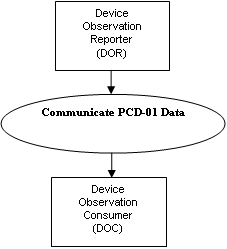

Figure 3.1.2-1: Communicate PCD Data

[width="100%",cols="22%,78%",options="header",]
|===
|*Actor* |Device Observation Reporter (DOR)
|*Role* |Sends PCD Data to DOC
|*Actor* |Device Observation Consumer (DOC)
|*Role* |Receives PCD Data from DOR
|===

==== Referenced Standards

* HL7 - HL7 Version 2.6 Chapter 7 Observation Reporting
* HL7 – HL7 Version 2.7 Chapter 7 Observation Reporting – PRT Participation Segment with added fields for Unique Device Identification (UDI)
* ISO/IEEE 11073-10201 Domain Information Model
* ISO/IEEE 11073-10101 Nomenclature
* ISO/IEEE 11073-10102-2012 Nomenclature - Annotated ECG defines additional ECG lead identifiers and code offsets > 65 that shall be used as needed by sending systems and shall be understood by receiving systems.

*Note:* The code offsets 0 to 65 originally defined by ISO/IEEE 11073-10101:2004 Annex A are identical to those defined by ISO/IEEE 11073-10102-2012 and can convey the ECG leads typically reported by a traditional 12-lead resting, stress or Holter ECG in a compatible manner without pre-coordination.

The IHE Devices Technical Framework uses an information model and a nomenclature from the IEEE 11073. The information model is defined in ISO/IEEE 11073-10201 Health Informatics – Point-of-care medical device communication – Part 10201: Domain Information Model. The nomenclature is defined in ISO/IEEE 11073-10101 Health Informatics – Point -of-care medical device communication – Part 10101: Nomenclature. Familiarity with these standards is necessary for implementers of the Device Observation Reporter and Device Observation Consumer Actors.

HL7 V2.6 Chapter 7 Observation Reporting defines the general HL7 syntax and coding requirements related to observation reporting, used for PCD data communications in the DEV TF. Familiarity with HL7 Chapter 7 is necessary for implementers of the DEV TF transactions.

This Technical Framework specifies conventions that are used to represent the information model hierarchy for medical devices embodied in the IEEE 11073 Domain Information Model within the syntactic and semantic conventions of HL7 v. 2.6

Definitions of HL7 Data Types used in PCD transactions, with comments on any specializations for PCD, are given in Appendix C, Common Data Types in this volume.

==== Messages

The following interaction diagrams illustrate potential implementations.

===== DOR communicates with DOC

The [PCD-01] transaction is used to communicate PCD data from: Device Observation Reporter (DOR) to a Device Observation Consumer (DOC).

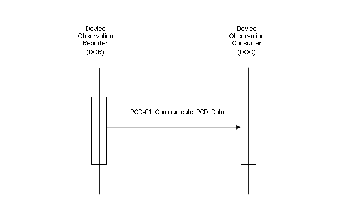

Figure 3.1.4.1-1: Communicate PCD Data Interaction Diagram

====== PCD-01 Communicate PCD Data (ORU^R01^ORU_R01) static definition 

The PCD-01 Communicate PCD Data message is used to communicate PCD data

* From a Device Observation Reporter (DOR) to a Device Observation Consumer (DOC)

Common HL7 segments (MSH, MSA, ERR, NTE, PID, PV1, OBR, OBX, ORC, PRT) and data types (CWE, CNE, CX, EI, HD, PL, DTM, XPN, XTN) used in IHE PCD transactions are defined in Appendix B, “Common Segment Descriptions”, and Appendix C, "Common Data Types". Note that this message structure differs from the basic HL7 version 2.6 by allowing for the appearance of PRT segments, a segment new in HL7 version 2.7, in certain locations. This is to allow for the need for new participation data needed in transactions added to the ACM Profile in this Technical Framework revision, and for planned future extensions to support FDA Unique Device Identifiers. See Section B.10 for details on the PRT segment.

The static message is defined with the repeating segment group called "Order Observation". This group can repeat within the message so that a device needs to send only one message with multiple orders.

[width="100%",cols="19%,39%,12%,10%,20%",options="header",]
|===
|Segment |Meaning |Usage |Card |HL7 chapter
|MSH |Message Header |R |[1..1] |2
|[\{SFT}] |Software Segment |X |[0..0] |2
|[UAC] |User Authentication Credential |O |[0..1] |
|\{ |--- PATIENT_RESULT begin | | |
| [ |--- PATIENT begin | | |
| PID |Patient Identification |R |[1..1] |3
| [PD1] |Additional Demographics |X |[0..0] |3
| [\{PRT}] | | | |
| [\{NTE}] |Notes and Comments |X |[0 0] |2
|  [\{NK1}] |Next of Kin/Associated Parties |O |[0..3] |3
|  [ |--- VISIT begin | | |
|   PV1 |Patient Visit |R |[1..1] |3
|   [PV2] |Patient Visit – Additional Info |X |[0..0] |3
|   [\{PRT}] | | | |
|  ] |--- VISIT end | | |
| ] |--- PATIENT end | | |
| \{ |---ORDER_OBSERVATION begin | | |
|  [ORC] |Order Common |X |[0..0] |4
|  OBR |Observation Request |R |[1..1] |7
|  [\{NTE}] |Notes and Comments |O |[0..1] |2
|  [\{PRT}] | | | |
|  [\{ |--- TIMING_QTY begin | | |
|   TQ1 |Timing/Quantity |R |[1..1] |4
|   [\{TQ2}] |Timing/Quantity Order Sequence |X |[0..0] |4
|  }] |--- TIMING_QTY end | | |
|  [CTD] |Contact Data |X |[0..0] |11
|  [\{ |--- OBSERVATION begin | | |
|   OBX |Observation Result |R |[1..1] |7
|   [\{PRT}] | | | |
|   [\{NTE}] |Notes and comments |O |[0..1] |2
|  }] |--- OBSERVATION end | | |
|  [\{FT1}] |Financial Transaction |X |[0..0] |6
|  [\{CTI}] |Clinical Trial Identification |X |[0..0] |7
|  [\{ |--- SPECIMEN begin | | |
|   SPM |Specimen |X |[0..0] |7
|   [\{OBX}] |Observation related to Specimen |X |[0..0] |7
|  }] |--- SPECIMEN end | | |
| } |--- ORDER_OBSERVATION end | | |
|} |--- PATIENT_RESULT end | | |
|[DSC] |Continuation Pointer |X |[0..0] |2
|===

====== Trigger events

The ORU^R01^ORU_R01 message is an unsolicited update initiated by the Device Observation Reporter. The ORU^R01 can be sent with or without a preceding order, since it is common in a clinical setting for device data to be reported without a specific order having been transacted in the information system (that is, the reporting is the result of a "standing order" for monitoring in a particular clinical situation).

While a DOR may be implemented directly on a medical device, it is more often implemented on a gateway or intermediary device as an application which implements the DOR, receiving data from one or more patient care devices using either standards-based or proprietary protocols which are outside the current scope of the IHE DEV TF.

In general, the DOR sends periodic reports at an interval of between several times per minute (high acuity) and a maximum interval of 24 hours (chronic, home health) with a typical interval of 1 minute. The minimum and maximum intervals are configured at implementation. The DOR may also send aperiodic reports for "event type" information. The DOR shall not do interpolation of data received from the PCD source.

====== Message Semantics

Refer to the HL7 standard for the ORU message of HL7 2.6 Chapter 7 and the general message semantics.

The ORU^OR1^ORU_R01 message structure provides the mechanisms for mapping the hierarchical structure of an IEEE 11073 containment tree to a series of OBX messages each of which is optionally qualified by a note which immediately follows the respective OBX. See the discussion of how the containment is represented using a "dotted notation" in field OBX-4 Observation Sub-ID in Appendix B, Section B.8.

See Appendix A.1 ISO/IEEE Nomenclature mapping to HL7 OBX-3 for further information on the mapping rules.

Examples of ORU^R01^ORU_R01 messages implemented in HL7 Encoding Rules (ER7) are provided in Appendix E.

====== Expected Actions

The ORU^R01^ORU_R01 message is sent from the DOR to the DOC. Upon receipt, the DOC validates the message and responds with an acknowledgement as defined in Appendix G.1.1 Acknowledgment Modes.

==== Security Considerations

During the profile development there were no unusual security or privacy concerns identified. There are no mandatory security controls, but the implementer is encouraged to use the underlying security and privacy profiles from ITI that are appropriate to the transports such as the Audit Trail and Node Authentication (ATNA) Profile. The operational environment risk assessment, following ISO 80001, will determine the actual security and safety controls employed.

=== [PCD-02] Reserved

=== Communicate Infusion Order [PCD-03]

This section specifies transaction [PCD-03] of the IHE Devices Technical Framework. Transaction [PCD-03] is used by the Infusion Order Programmer and Infusion Order Consumer.

Since the IOC is typically a gateway rather than an infusion pump, all of the information specified in the Communicate Infusion Order [PCD-03] transaction is not necessarily provided to or used to program the device.

Note: See related detail on infusion pump device models and data models in the Device Specialization – Infusion Pump PCD profiles for large volume, syringe, and patient controlled analgesia (PCA) pumps.

==== Scope

This transaction is used to communicate Infusion Order parameters from an Infusion Order Programmer (IOP) to an Infusion Order Consumer (IOC).

==== Use Case Roles

[width="100%",cols="17%,83%",options="header",]
|===
|*Actor* |Infusion Order Programmer
|*Role* |Sends Infusion Order parameters to IOC
|*Actor* |Infusion Order Consumer
|*Role* |Receives Infusion Order parameters from IOP and in turn programs the pump
|===

==== Referenced Standards

* HL7 - HL7 Version 2.6 Ch4 Order Entry
* ISO/IEEE 11073-10101 Nomenclature
* ISO/IEEE 11073-10201 Domain Information Model

==== Messages

The following interaction diagram illustrates the implementation.

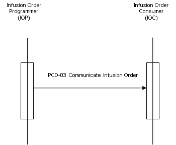

Figure 3.3.4-1: Communicate Infusion Order

===== PCD-03 Communicate Infusion Order (RGV^O15^RGV_O15) static definition

The PCD-03 Communicate Infusion Order message is used to communicate infusion data from an Infusion Order Programmer (IOP) to an Infusion Order Consumer (IOC).

Since the IOC is typically a gateway rather than an infusion pump, all of the information specified in the Communicate Infusion Order [PCD-03] transaction is not necessarily provided to or used to program the device.

All HL7 segments used in the [PCD-03] transaction are defined within this document.

===== RGV^O15^RGV_O15 Pharmacy/Treatment Give Message

Table 3.3.4.2-1: RGV^O15^RGV_O15 Pharmacy/Treatment Give Message

[width="100%",cols="20%,31%,16%,16%,17%",options="header",]
|===
|Segment |Meaning |Usage |Card |HL7 Chapter
|MSH |Message Header |R |[1..1] |2
|[\{ SFT }] |Software |X | |2
|[\{ NTE }] |Notes and Comments (for Header) |X | |2
|[ |--- PATIENT begin | | |
|PID |Patient Identification |R |[1..1] |3
|[\{ NTE }] |Notes and Comments (for PID) |X | |2
|[\{ AL1 }] |Allergy Information |X | |2
|[ |--- PATIENT_VISIT begin | | |
|PV1 |Patient Visit |O |[0..1] |3
|[ PV2 ] |Patient Visit – Additional Info |X | |3
|] |--- PATIENT_VISIT end | | |
|] |--- PATIENT end | | |
|\{ |--- ORDER begin | | |
|ORC |Common Order |R |[1..1] |4
|[\{ |--- TIMING begin | | |
|TQ1 |Timing/Quantity |X | |4
|[\{ TQ2 }] |Timing/Quantity Order Sequence |X | |4
|}] |--- TIMING end | | |
|[ |--- ORDER_DETAIL begin | | |
|RXO |Pharmacy /Treatment Order |X | |4
|[ |--- ORDER_DETAIL_SUPPLEMENT begin | | |
|\{ NTE } |Notes and Comments (for RXO) |X | |2
|\{ RXR } |Pharmacy/Treatment Route |X | |4
|[\{ |--- COMPONENTS begin | | |
|RXC |Pharmacy/Treatment Component |X | |4
|[\{ NTE }] |Notes and Comments (for each RXC) |X | |2
|}] |--- COMPONENTS end | | |
|] |--- ORDER_DETAIL_SUPPLEMENT end | | |
|] |--- ORDER_DETAIL end | | |
|[ |--- ENCODING begin | | |
|RXE |Pharmacy/Treatment Encoded Order |X | |4
|\{ |--- TIMING_ENCODED begin | | |
|TQ1 |Timing/Quantity |X | |4
|[\{ TQ2 }] |Timing/Quantity Order Sequence |X | |4
|} |--- TIMING_ENCODED end | | |
|\{ RXR } |Pharmacy/Treatment Route |X | |4
|[\{ RXC }] |Pharmacy/Treatment Component |X | |4
|] |--- ENCODING end | | |
|\{ |--- GIVE begin | | |
|RXG |Pharmacy/Treatment Give |R |[1..1] |4
|\{ |--- TIMING_GIVE begin | | |
|TQ1 |Timing/Quantity |O |[0..1] |4
|[\{ TQ2 }] |Timing/Quantity Order Sequence |X | |4
|} |--- TIMING_GIVE end | | |
|\{ RXR } |Pharmacy/Treatment Route |R |[1..1] |4
|[\{ RXC }] |Pharmacy/Treatment Component |X | |4
|\{ |--- OBSERVATION begin | | |
|[ OBX ] |Observation/Results |R |[1..n] |7
|[\{ NTE }] |Notes and Comments (for OBX) |X | |2
|} |--- OBSERVATION end | | |
|} |--- GIVE end | | |
|} |--- ORDER end | | |
|===

===== Trigger Events

The RGV^O15^RGV_O15 message is generated by the Infusion Order Programmer when the caregiver initiates an action to administer a medication using an IV pump.

===== Message Semantics

Refer to the HL7 standard for the RGV message in HL7 2.6 Chapter 4 for the general message semantics.

====== MSH – Message Header Segment

This segment defines the intent, source, destination, and some specifics of the syntax of a message. See HL7 v2.6: chapter 2 Message control. For MSH usage in IHE Devices Technical Framework profiles, refer to Appendix B.1 of this volume. MSH-15 and MSH-16 fields have special considerations in PCD 03:

*MSH-15 Accept Acknowledgement Type (ID), required:*

____
This is required for all messages. The Accept Acknowledgement Type field shall be valued with “AL” (always) by the IOP in a RGV^O15 message and by the IOC in a RRG^O16 message.

The receiving application must transmit the accept acknowledgement on the same network connection as the initiating RGV^ O15 or RRG^O16 message
____

*MSH-16 Application Acknowledgement Type (ID), required:*

____
This is required for all messages. The application acknowledgement field informs the receiver whether the sender can process application acknowledgements and under what conditions to send the additional acknowledgement. For RGV^O15 messages, the value shall be “AL”, and for RRG^O16 the value shall be “NE”. The receiving system must send (or not send) application acknowledgements as specified by this field.

When the sending an application acknowledgement, the receiving application must initiate a new network connection for the transaction. Here is an example of an IOP to IOC transaction:
____

[arabic]
. image:extracted-media-tf2/media/image5.emf[Description: visio02,width=441,height=274]The IOP sends a RGV^O15 message on the IOC’s port 3000 with MSH-15=”AL” and MSH-16=”AL”.
. The IOC receives the message on port 3000 and transmits an ACK^O15 to the IOP on the same network connection with MSH-15=’NE’ and MSH-16=’NE’, since the sender does not need to reply to an Accept Acknowledgement .

image:extracted-media-tf2/media/image6.emf[Description: EnhAck02,width=457,height=284]

[arabic, start=3]
. After completing application processing, the IOC transmits a RRG^O16 on a different network connection (e.g., the IOP’s port 3001) with MSH-15=”AL” and MSH-16=”NE”.
. The IOP receives the message on port 3001 and sends an ACK^O16 to the IOC on the same network connection with MSH-15=’NE’ and MSH-16=’NE’, since the sender does not need to reply to an Accept Acknowledgement.

The table below identifies the possible values for MSH-16:

Table 3.3.4.4.1-1: Possible Values for MSH-16 in PCD-03 RGV^O15 and RRG^O16 Messages

[width="100%",cols="20%,29%,51%",options="header",]
|===
|Value |Description |Comments
|AL |Always |The sender expects to receive an application acknowledgement in addition to the accept acknowledgement. This value shall be used in RGV^O15 messages.
|NE |Never |The sender does not expect to receive an application acknowledgement. This value shall be used in RRG^O16 messages.
|===

====== PID - Patient Identification Segment

The PID segment is used by all applications as the primary means of communicating patient identification information. This segment contains permanent patient identifying and demographic information that, for the most part, is not likely to change frequently. See HL7 v2.6: chapter 3 (3.4.2). For PID usage in IHE Devices Technical Framework profiles, refer to Appendix B.5 of this volume.

====== PV1 Patient Visit Segment

The PV1 segment is used by Registration/Patient Administration applications to communicate information on an account or visit-specific basis. See Appendix B.6 for details.

====== ORC - Common Order Segment

The Common Order segment (ORC) is used to transmit fields that are common to all orders (all types of services that are requested). See Appendix B.9 for details of usage in IHE PCD profiles.

====== RXG - Pharmacy/Treatment Give Segment

Table 3.3.4.4.5-1: HL7 Attribute Table – RXG – Pharmacy/Treatment Give

[width="100%",cols="11%,9%,8%,10%,12%,10%,10%,30%",options="header",]
|===
|SEQ |LEN |DT |Usage |Card. |TBL# |ITEM # |ELEMENT NAME
|1 |4 |NM |R |[1..1] | |00342 |Give Sub-ID Counter
|2 |4 |NM |RE |[0..1] | |00334 |Dispense Sub-ID Counter
|3 |705 |TQ |X |[0..0] | |00221 |Quantity/Timing
|4 |705 |CWE |R |[1..1] |0292 |00317 |Give Code
|5 |20 |NM |CE |[0..1] | |00318 |Give Amount - Minimum
|6 |20 |NM |RE |[0..1] | |00319 |Give Amount - Maximum
|7 |705 |CWE |CE |[0..1] | |00320 |Give Units
|8 |705 |CWE |RE |[0..1] | |00321 |Give Dosage Form
|9 |705 |CWE |RE |[0..*] | |00351 |Administration Notes
|10 |1 |ID |RE |[0..1] |0167 |00322 |Substitution Status
|11 |200 |LA2 |RE |[0..1] | |01303 |Dispense-To Location
|12 |1 |ID |RE |[0..1] |0136 |00307 |Needs Human Review
|13 |705 |CWE |RE |[0..*] | |00343 |Pharmacy/Treatment Supplier's Special Administration Instructions
|14 |20 |ST |RE |[0..1] | |00331 |Give Per (Time Unit)
|15 |6 |ST |CE |[0..1] | |00332 |Give Rate Amount
|16 |705 |CWE |CE |[0..1] | |00333 |Give Rate Units
|17 |20 |NM |RE |[0..1] | |01126 |Give Strength
|18 |705 |CWE |RE |[0..1] | |01127 |Give Strength Units
|19 |20 |ST |RE |[0..*] | |01129 |Substance Lot Number
|20 |24 |DTM |RE |[0..*] | |01130 |Substance Expiration Date
|21 |705 |CWE |RE |[0..*] |0227 |01131 |Substance Manufacturer Name
|22 |705 |CWE |RE |[0..*] | |01123 |Indication
|23 |5 |NM |RE |[0..1] | |01692 |Give Drug Strength Volume
|24 |705 |CWE |RE |[0..1] | |01693 |Give Drug Strength Volume Units
|25 |60 |CWE |RE |[0..1] | |01694 |Give Barcode Identifier
|26 |1 |ID |RE |[0..1] |0480 |01695 |Pharmacy Order Type
|27 |705 |CWE |X |[0..0] | |01688 |Dispense to Pharmacy
|28 |106 |XAD |X |[0..0] | |01689 |Dispense to Pharmacy Address
|29 |80 |PL |X |[0..0] | |01683 |Deliver-to Patient Location
|30 |250 |XAD |X |[0..0] | |01684 |Deliver-to Address
|===

The following describes the IHE PCD usage of those fields which have a usage other than X in the above table.

RXG-1 Give Sub-ID Counter

When used for a multistep infusion this field contains the step number (1..n).

For other uses see HL7 V2.6 Section 4.14.6.1 for details. The DEV TF does not further constrain this field.

RXG-2 Dispense Sub-ID Counter

See HL7 V2.6 Section 4.14.6.2 for details. The DEV TF does not further constrain this field.

RXG-4 Give Code

Components: <Identifier (ST)> ^ <Text (ST)> ^ <Name of Coding System (ID)> ^ <Alternate Identifier (ST)> ^ <Alternate Text (ST)> ^ <Name of Alternate Coding System (ID)> ^ <Coding System Version ID (ST)> ^ <Alternate Coding System Version ID (ST)> ^ <Original Text (ST)>

Definition: This field is the identifier of the primary additive or principal ingredient of the IV medication to be administered to the patient.

Subfields CWE-1 "Identifier" and CWE-2 "Text" are required for each identifier. Typically, "Identifier" would be populated with a value such as an NDC or another value known to both the Infusion Order Programmer and the Infusion Order Consumer. "Text" would typically be populated with the generic name of the medication. The information provided in either Identifier or Text is used to match the ordered medication to the onboard drug library.

RXG-5 Give Amount – Minimum

Definition: This field contains the volume of fluid to be administered (VTBI). This volume is the actual fluid volume that the clinician intends to administer (not necessarily the volume contained in the bag, bottle, syringe, or other fluid container).

Required for LVP when TQ1 segment is not present. Optional for PCA and Syringe.

Must be empty when ORC-1 = “XO”.

When this field is empty, there should be no implication made about the volume of fluid to be administered.

RXG-6 Give Amount - Maximum

See HL7 V2.6 Section 4.14.6.6 for details. The DEV TF does not further constrain this field.

RXG-7 Give Units

Components: <Identifier (ST)> ^ <Text (ST)> ^ <Name of Coding System (ID)> ^ <Alternate Identifier (ST)> ^ <Alternate Text (ST)> ^ <Name of Alternate Coding System (ID)> ^ <Coding System Version ID (ST)> ^ <Alternate Coding System Version ID (ST)> ^ <Original Text (ST)>

Definition: This field contains the coded units for the Give Amount. The preferred format is an MDC value; UCUM values are also acceptable.

Required for LVP when TQ1 segment is not present; Optional for PCA and Syringe.

Must be empty when ORC-1 = “XO”.

The DEV TF requires that the first three components of RXG-7 contain one of the following sets of values:

* 263762^MDC_DIM_MILLI_L^MDC
* mL^mL^UCUM

RXG-8 Give Dosage Form

See HL7 V2.6 Section 4.14.6.8 for details. The DEV TF does not further constrain this field.

RXG-9 Administration Notes

See HL7 V2.6 Section 4.14.6.9 for details. The DEV TF does not further constrain this field.

RXG-10 Substitution Status

See HL7 V2.6 Section 4.14.6.10 for details. The DEV TF does not further constrain this field.

RXG-11 Dispense-to Location

See HL7 V2.6 Section 4.14.6.11 for details. The DEV TF does not further constrain this field.

RXG-12 Needs Human Review

See HL7 V2.6 Section 4.14.6.12 for details. The DEV TF does not further constrain this field.

RXG-13 Pharmacy/Treatment Supplier's Special Administration Instructions

See HL7 V2.6 Section 4.14.6.13 for details. The DEV TF does not further constrain this field.

RXG-14 Give Per (Time Unit)

See HL7 V2.6 Section 4.14.6.14 for details. The DEV TF does not further constrain this field.

RXG-15 Give Rate Amount

Definition: This field contains the numeric portion of the rate, dose rate, or dose amount to be administered.

If the infusion order specifies a rate, such as normal saline at 75 mL/hr, then this field contains the rate value amount (e.g., "75").

If the infusion order specifies a dose rate, such as dopamine at 5 mcg/kg/min, this field contains the dose rate value amount (e.g., “5").

If the infusion order specifies a dose amount, such as 2 g, this field contains the dose value amount (e.g., “2”).

Required for LVP and Syringe; Optional for PCA. If present for PCA, contains the basal or continuous rate value.

RXG-16 Give Rate Units

Components: <Identifier (ST)> ^ <Text (ST)> ^ <Name of Coding System (ID)> ^ <Alternate Identifier (ST)> ^ <Alternate Text (ST)> ^ <Name of Alternate Coding System (ID)> ^ <Coding System Version ID (ST)> ^ <Alternate Coding System Version ID (ST)> ^ <Original Text (ST)>

Definition: This field contains the coded version of the units portion of the rate, dose rate, or dose to be administered.

If the infusion order specifies a rate, such as normal saline to infuse at 75 mL/hr, this field represents the rate units (e.g., "mL/hr").

If the infusion order specifies a dose rate, such as dopamine to infuse at 5 mcg/kg/min, this field represents the dose rate units (e.g., "mcg/kg/min").

If the infusion order specifies a dose, such as ceftriaxone 2 g, this field represents the dose units (e.g., “g”).

When a dose is specified the TQ1 segment must be present to indicate the time period that the dose is to be infused over.

The preferred format is an MDC value; UCUM values are also acceptable.

Required for LVP and Syringe; Optional for PCA. If present for PCA, contains the basal or continuous rate units value.

Examples:

265266^MDC_DIM_MILLI_L_PER_HR^MDC

265619^MDC_DIM_MICRO_G_PER_KG_PER_MIN^MDC

263872^MDC_DIM_X_G^MDC

ml/h^ml/h^UCUM

ug/kg/min^ug/kg/min^UCUM

g^g^UCUM

RXG-17 Give Strength

Definition: This field contains the quantity of the main ingredient in the infusion, e.g., for dopamine 800 mg in 250 mL D5W, the field would contain the value "800".

RXG-18 Give Strength Units

Components: <Identifier (ST)> ^ <Text (ST)> ^ <Name of Coding System (ID)> ^ <Alternate Identifier (ST)> ^ <Alternate Text (ST)> ^ <Name of Alternate Coding System (ID)> ^ <Coding System Version ID (ST)> ^ <Alternate Coding System Version ID (ST)> ^ <Original Text (ST)>

This field contains the coded version of the units portion of the main ingredient in the infusion; e.g., for dopamine 800 mg in 250 mL D5W, the field would represent ‘mg". The preferred format is an MDC value; UCUM values are also acceptable:

Examples:

263890^MDC_DIM_MILLI_G^MDC

mg^mg^UCUM

RXG-19 Substance Lot Number

See HL7 V2.6 Section 4.14.6.19 for details. The DEV TF does not further constrain this field.

RXG-20 Substance Expiration Date

See HL7 V2.6 Section 4.14.6.20 for details. The DEV TF does not further constrain this field.

RXG-21 Substance Manufacturer Name

See HL7 V2.6 Section 4.14.6.21 for details. The DEV TF does not further constrain this field.

RXG-22 Indication

See HL7 V2.6 Section 4.14.6.22 for details. The DEV TF does not further constrain this field.

RXG-23 Give Drug Strength Volume

Definition: This field contains the quantity of the diluent or base fluid ingredient(s) in the infusion, e.g., for dopamine 800 mg in 250 mL D5W, the field would contain the value "250".

RXG-24 Give Drug Strength Volume Units

Components: <Identifier (ST)> ^ <Text (ST)> ^ <Name of Coding System (ID)> ^ <Alternate Identifier (ST)> ^ <Alternate Text (ST)> ^ <Name of Alternate Coding System (ID)> ^ <Coding System Version ID (ST)> ^ <Alternate Coding System Version ID (ST)> ^ <Original Text (ST)>

Definition: This field contains the coded units for the Give Drug Strength Volume. The preferred format is an MDC value; UCUM values are also acceptable.

The DEV TF requires that the first three components of RXG-24 contain one of the following sets of values:

* 263762^MDC_DIM_MILLI_L^MDC
* mL^mL^UCUM

RXG-25 Give Barcode Identifier

See HL7 V2.6 Section 4.14.6.25 for details. The DEV TF does not further constrain this field.

RXG-26 Pharmacy Order Type

See HL7 V2.6 Section 4.14.6.26 for details. The DEV TF does not further constrain this field.

RXG-27 to 30

These fields are not supported by the DEV TF.

====== Usage notes for RXG 17, 18, 23, and 24

These fields are used by the pump or gateway to determine the concentration of the main ingredient in the infusion. Concentration is defined as:

{empty}[Medication amount][units] / [Diluent amount][units]

Example: 800 mg / 250 mL

The pump’s onboard drug library may require this information in order to apply dosing limits to ensure the safe administration of a particular infusion. The "rules" contained in the drug library may be different for different concentrations of the same drug. For example, there may be two different rules for the medication "dopamine": one specific for dopamine 800 mg in 250 mL, and another for any other concentration.

The BCMA system cannot know when the information is required since the drug library definition is internal to the pump system. BCMA systems may extract the information needed from the underlying order, from their formulary, or both. Basically, if the BCMA is able to determine these values, they should be supplied in the [PCD-03] transaction.

An analogy to a pharmacy order for an IV fluid containing multiple components (RXC segments) may be helpful in determining how to populate these values. In [PCD-03], RXG-17 and 18 (Give Strength/Units) are analogous to the Component Strength and Units (RXC-5 and 6) for the additive component (i.e., RXC-1 = "A"). Similarly, RXG-23 and 24 (Give Drug Strength Volume/Units) are similar to Component Drug Strength Volume and Units (RXC-8 and 9) for the base component (RXC-1 = "B").

Example:

Ampicillin 1 g/Sodium chloride 50 mL

RXC segments for Ampicillin (pharmacy order message):

[width="100%",cols="25%,15%,15%,15%,15%,15%",options="header",]
|===
|Component |RXC-1 |RXC-5 |RXC-6 |RXC-8 |RXC-9
|Ampicillin |A |1 |G | |
|Sodium chloride |B | | |50 |ML
|===

RXG segment population for Ampicillin:

[width="100%",cols="14%,32%,14%,40%",options="header",]
|===
|RXG-17 |RXG-18 |RXG-23 |RXG-24
|1 |263872^MDC_DIM_X_G^MDC |50 |263762^MDC_DIM_MILLI_L^MDC
|===

*Premixed medication orders*

Certain marketed medication products are "premixed", containing both the additive and the base mixed together and sold as a single item.

Examples:

Dopamine 800 mg / Dextrose 5% 250 mL

Cefazolin 1 g / Dextrose 5% 50 mL

RXG segment population for Dopamine:

[width="100%",cols="14%,36%,13%,37%",options="header",]
|===
|RXG-17 |RXG-18 |RXG-23 |RXG-24
|800 |263890^MDC_DIM_MILLI_G^MDC |250 |263762^MDC_DIM_MILLI_L^MDC
|===

*Fluid orders*

"Plain" IV fluids do not contain an additive. The BCMA is not required to populate RXG-17, 18, 23, and 24 for these orders.

Examples:

Dextrose 5% 1000 mL

Sodium Chloride 0.9% 250 mL

*Orders with multiple additives*

Some infusion orders may contain multiple additives, for example, total parenteral nutrition (TPN) solutions are made up of one or more base solutions and as many as 10 or 12 additives. The BCMA is not required to populate RXG-17, 18, 23, and 24 for these orders.

====== TQ1 Timing Quantity Segment

This segment is an optional segment which allows the IOP to specify the duration of the infusion order. Along with the ordered dose (RXG.18) the infuser can then calculate the rate at which the infusion should be run. Not all IOCs will be able to support duration-based infusions, and even vendors that do support will have limits on the types of infusions which support duration. See each vendor’s implementation guide for further details.

Table 3.3.4.4.7-1: TQ1 Timing Quantity Segment Attributes

[width="100%",cols="14%,8%,7%,10%,10%,9%,11%,31%",options="header",]
|===
|SEQ |LEN |DT |Usage |Card. |TBL# |ITEM # |ELEMENT NAME
|1 |4 |SI |O |[0..1] | |01627 |Set ID - TQ1
|2 |20 |CQ |X |[0..0] | |01628 |Quantity
|3 |540 |RPT |X |[0..0] |0335 |01629 |Repeat Pattern
|4 |20 |TM |X |[0..0] | |01630 |Explicit Time
|5 |20 |CQ |X |[0..0] | |01631 |Relative Time and Units
|6 |20 |CQ |X |[0..0] | |01632 |Service Duration
|7 |26 |TS |X |[0..0] | |01633 |Start date/time
|8 |26 |TS |X |[0..0] | |01634 |End date/time
|9 |705 |CWE |X |[0..0] |0485 |01635 |Priority
|10 |250 |TX |X |[0..0] | |01636 |Condition text
|11 |250 |TX |X |[0..0] | |01637 |Text instruction
|12 |10 |ID |X |[0..0] |0427 |01638 |Conjunction
|13 |20 |CQ |R |[1..3] | |01639 |Occurrence duration
|14 |10 |NM |X |[0..1] | |01640 |Total occurrence’s
|===

TQ1-1 Set ID

See HL7 v2.6 Section 4.5.4.1 for details. The DEV TF does not further constrain this field.

TQ1-2 Quantity

See HL7 v2.6 Section 4.5.4.2 for details. The DEV TF does not further constrain this field.

TQ1-3 Repeat Pattern

See HL7 v2.6 Section 4.5.4.3 for details. The DEV TF does not further constrain this field.

TQ1-4 Explicit Time

See HL7 v2.6 Section 4.5.4.4 for details. The DEV TF does not further constrain this field.

TQ1-5 Relative Time and Units

See HL7 v2.6 Section 4.5.4.5 for details. The DEV TF does not further constrain this field.

TQ1-6 Service Duration

See HL7 v2.6 Section 4.5.4.6 for details. The DEV TF does not further constrain this field.

TQ1-7 Start date/time

See HL7 v2.6 Section 4.5.4.7 for details. The DEV TF does not further constrain this field.

TQ1-8 End date/time

See HL7 v2.6 Section 4.5.4.8 for details. The DEV TF does not further constrain this field.

TQ1-9 Priority

See HL7 v2.6 Section 4.5.4.9 for details. The DEV TF does not further constrain this field.

TQ1-10 Condition text

See HL7 v2.6 Section 4.5.4.10 for details. The DEV TF does not further constrain this field.

TQ1-11 Text instruction

See HL7 v2.6 Section 4.5.4.11 for details. The DEV TF does not further constrain this field.

TQ1-12 Conjunction

See HL7 v2.6 Section 4.5.4.12 for details. The DEV TF does not further constrain this field.

TQ1-13 Occurrence duration

Components: <Quantity (NM)> ^ <Units (CE)> Subcomponents for Units (CE): <Identifier (ST)> & <Text (ST)> & <Name of Coding System (ID)> & <Alternate Identifier (ST)> & <Alternate Text (ST)> & <Name of Alternate Coding System (ID)>

This field specifies the duration of the infusion. Along with the dose or the volume to be administered the rate can be calculated by the infuser.

The only acceptable time values for this field are seconds, minutes, and hours. To specify multiple components of time, this field can be repeated two additional times.

[width="100%",cols="36%,64%",options="header",]
|===
|Unit of Time |MDC Code
|Hour |264384&MDC_DIM_HR&MDC
|Minute |264352&MDC_DIM_MIN&MDC
|Second |264320&MDC_DIM_X_SEC&MDC
|===

Examples:

90 Seconds: +
90^264320&MDC_DIM_X_SEC&MDC

2 Hours 45 Minutes: +
2^264384&MDC_DIM_HR&MDC~45^264352&MDC_DIM_MIN&MDC

TQ1-14 Total occurrences

See HL7 v2.6 Section 4.5.4.14 for details. The DEV TF does not further constrain this field.

====== RXR - Pharmacy/Treatment Route Segment

The Pharmacy/Treatment Route segment contains the alternative combination of route, site, administration device, and administration method that are prescribed.

Table 3.3.4.4.8-1: HL7 Attribute Table – RXR – Pharmacy/Treatment Route

[width="100%",cols="12%,9%,8%,10%,9%,11%,11%,30%",options="header",]
|===
|SEQ |LEN |DT |Usage |Card. |TBL# |ITEM # |ELEMENT NAME
|1 |705 |CWE |R |[1..1] |0162 |00309 |Route
|2 |705 |CWE |RE |[0..1] |0550 |00310 |Administration Site
|3 |705 |CWE |RE |[0..1] |0164 |00311 |Administration Device
|4 |705 |CWE |CE |[0..1] |0165 |00312 |Administration Method
|5 |705 |CWE |RE |[0..1] | |01315 |Routing Instruction
|6 |705 |CWE |RE |[0..1] |0495 |01670 |Administration Site Modifier
|===

The following describes the IHE PCD usage of the fields in the above table.

RXR-1 Route

Components: <Identifier (ST)> ^ <Text (ST)> ^ <Name of Coding System (ID)> ^ <Alternate Identifier (ST)> ^ <Alternate Text (ST)> ^ <Name of Alternate Coding System (ID)> ^ <Coding System Version ID (ST)> ^ <Alternate Coding System Version ID (ST)> ^ <Original Text (ST)>

Definition: This field is the route of administration. The DEV TF requires that this field be valued as one of the following: ^IV^HL70162 for Intravenous, ^EP^HL70162 for Epidural, ^SC^HL70162 for Subcutaneous, ^NG^HL70162 for Nasogastric, ^GTT^HL70162 for Gastrostomy Tube or ^IT^HL70162 for Intrathecal.

*RXR-2 Administration Site*

See HL7 V2.6 Section 4.14.2.2 for details. The DEV TF does not further constrain this field.

RXR-3 Administration Device

Components: <Identifier (ST)> ^ <Text (ST)> ^ <Name of Coding System (ID)> ^ <Alternate Identifier (ST)> ^ <Alternate Text (ST)> ^ <Name of Alternate Coding System (ID)> ^ <Coding System Version ID (ST)> ^ <Alternate Coding System Version ID (ST)> ^ <Original Text (ST)>

Definition: This field contains the type of pump used to administer the drug, if known by the BCMA system. The DEV TF requires that this field be valued as ^IVP^HL70164 for LVP pumps, ^PCA^HL70164 for PCA pumps, or ^SYR^HL70164 for Syringe pumps.

The following entry should be added to HL7 user-defined table #0164:

[width="100%",cols="42%,58%",options="header",]
|===
|Value |Description
|SYR |Syringe Pump
|===

RXR-4 Administration Method

Components: <Identifier (ST)> ^ <Text (ST)> ^ <Name of Coding System (ID)> ^ <Alternate Identifier (ST)> ^ <Alternate Text (ST)> ^ <Name of Alternate Coding System (ID)> ^ <Coding System Version ID (ST)> ^ <Alternate Coding System Version ID (ST)> ^ <Original Text (ST)>

Definition: This field identifies whether the infusion is to be administered as a primary infusion or as an IV piggyback or secondary infusion. The TF requires that this field be valued as ^IV^HL70165 for a primary infusion or ^IVPB^HL70165 for an IV piggyback or secondary infusion. This field is optional for PCA.

The following entry should be added to HL7 user-defined table #0165:

[width="100%",cols="42%,58%",options="header",]
|===
|Value |Description
|IV |IV Primary
|===

RXR-5 Routing Instruction

See HL7 V2.6 Section 4.14.2.5 for details. The DEV TF does not further constrain this field.

RXR-6 Administration Site Modifier

See HL7 V2.6 Section 4.14.2.6 for details. The DEV TF does not further constrain this field.

====== OBX - Observation/Result segment

Refer to HL7 v2.6: Section 7.4.2x

The HL7 OBX segment is used to transmit a single observation or observation fragment. In the

Point-of-Care Infusion Verification Profile the usage is limited to providing:

[arabic]
. pump ID

[arabic, start=5]
. patient parameters such as height, weight, or body surface area (BSA)
. infusion order step type
. other parameters used to program the pump.

Note that the definition of the OBX segment in this profile is constrained from the definition used in the PCD Observation/Result Message to reflect this limited usage. The broader definition can be found in OBX - Observation/Result segment, Appendix Section B-8.

One OBX segment containing the pump ID must always be present. Additional OBX segments containing patient parameters, infusion order step type, or pump programming parameters may optionally follow.

Table 3.3.4.4.9-1: OBX segment

[width="100%",cols="11%,11%,11%,11%,15%,9%,32%",options="header",]
|===
|SEQ |LEN |DT |Usage |Card. |TBL# |Element name
|1 |4 |SI |R |[1..1] | |Set ID – OBX
|2 |3 |ID |CE |[0..1] |0125 |Value Type
|3 |705 |CWE |R |[1..1] | |Observation Identifier
|4 |20 |ST |RE |[0..1] | |Observation Sub-ID
|5 |99999 |Varies |CE |[0..1] | |Observation Value
|6 |705 |CWE |CE |[0..1] | |Units
|7 |60 |ST |RE |[0..1] | |References Range
|8 |5 |IS |RE |[0..1] |0078 |Abnormal Flags
|9 |5 |NM |X |[0..0] | |Probability
|10 |2 |ID |RE |[0..1] |0080 |Nature of Abnormal Test
|11 |1 |ID |RE |[0..1] |0085 |Observation Result Status
|12 |24 |DTM |X |[0..0] | |Effective Date of Reference Range
|13 |20 |ST |X |[0..0] | |User Defined Access Checks
|14 |24 |DTM |RE |[0..1] | |Date/Time of the Observation
|15 |705 |CWE |RE |[0..1] | |Producer's ID
|16 |3220 |XCN |RE |[0..1] | |Responsible Observer
|17 |705 |CWE |RE |[0..1] | |Observation Method
|18 |427 |EI |CE |[0..1] | |Equipment Instance Identifier
|19 |24 |DTM |RE |[0..1] | |Date/Time of the Analysis
|20 |705 |CWE |RE |[0..*] |0163 |Observation Site
|===

The following describes the IHE PCD PIV Profile’s usage of those fields which have a usage other than X in the above table.

OBX-1 Set ID

This field contains the sequence number of the OBX in this message, i.e., 1st OBX Set ID = 1, 2nd OBX set ID = 2, etc., regardless of whether the OBX refers to a device or a metric value.

OBX-2 Value Type

The PCD PIV Profile constrains this field as follows:

If OBX-3 refers to a pump ID this field must be empty.

If OBX-3 refers to a patient parameter that conveys a numeric quantity (e.g., patient weight), this value is restricted to NM.

If OBX-3 refers to an infusion order step type this field must be “ST”.

If OBX-3 refers to a pump programming parameter, this value should identify the data type of the value in OBX-5 Observation Value.

OBX-3 Observation Identifier

The PCD PIV Profile constrains the value of this field to one of the following:

Pump ID

69986^MDC_DEV_PUMP_INFUS_VMD^MDC

Patient parameter

68063^MDC_ATTR_PT_WEIGHT^MDC

68060^MDC_ATTR_PT_HEIGHT^MDC

188744^MDC_AREA_BODY_SURF_ACTUAL^MDC

Pump programming parameter

157985^MDC_DOSE_PCA_LIMIT^MDC

157986^MDC_VOL_PCA_DOSE_LIMIT^MDC

157987^MDC_TIME_PD_PCA_DOSE_LIMIT^MDC

157988^MDC_RATE_PCA_MAX_DOSES_PER_HOUR^MDC

157989^MDC_TIME_PCA_LOCKOUT^MDC

157994^MDC_VOL_FLUID_CONTAINER_START^MDC

158017^MDC_DOSE_PCA_PATIENT^MDC

158019^MDC_DOSE_CLINICIAN^MDC

158018^MDC_DOSE_LOADING^MDC

158037^MDC_INFUS_ORDER_STEP_TYPE^MDC

157998^MDC_TIME_PD_DOSE_START_INTERVAL^MDC

158023^MDC_DOSE_INTERMITTENT^MDC

158025^MDC_TIME_PROG_NEXT_DOSE^MDC

OBX-4 Observation Sub-ID

The PC PIV Profile does not further constrain this field.

OBX-5 Observation Value

If OBX-3 refers to a pump ID, this field must be empty.

If OBX-3 refers to a patient parameter, this field contains the parameter value.

If OBX-3 refers to an infusion order step type, the field contains the enumerated value

If OBX-3 refers to a pump programming parameter, this field contains the parameter value.

OBX-6 Units

The PCD PIV Profile constrains the value of this field based on the value in OBX-3.

If OBX-3 refers to a pump ID, this field must be empty.

If OBX-3 refers to a patient parameter, this field contains the coded units for the parameter. The preferred format is an MDC value; UCUM values are also acceptable.

When OBX-3 refers to weight, the first three components of OBX-6 must contain one of the following sets of values:

263872^MDC_DIM_X_G^MDC

263875^MDC_DIM_KILO_G^MDC

g^g^UCUM

kg^kg^UCUM

When OBX-3 refers to height, the first three components of OBX-6 must contain one of the following sets of values:

263441^MDC_DIM_CENTI_M^MDC

cm^cm^UCUM

When OBX-3 refers to BSA, the first three components of OBX-6 must contain one of the following sets of values:

263616^ MDC_DIM_SQ_X_M^MDC

m2^m2^UCUM

If OBX-3 refers to an infusion order step type, this field must be empty.

If OBX-3 refers to a pump programming parameter, this field contains the units for the value in OBX-5 Observation Value.

OBX-7 References Range:

The PCD PIV Profile does not further constrain this field.

OBX-8 Abnormal Flags

The PCD PIV Profile does not further constrain this field.

OBX-10 Nature of Abnormal Test

The PCD PIV Profile does not further constrain this field.

OBX-11 Observation Result Status

The PCD PIV Profile does not further constrain this field.

OBX-14 Date/Time of the Observation

The PCD PIV Profile does not further constrain this field.

OBX-15 Producer’s ID

The PCD PIV Profile does not further constrain this field.

OBX-16 Responsible Observer (XCN)

The PCD PIV Profile does not further constrain this field.

OBX-17 Observation Method

The PCD PIV Profile does not further constrain this field.

OBX-18 Equipment Instance Identifier

See Appendix B.8 for description of usage of OBX-18.

If OBX-3 refers to a pump ID, the following applies.

* For backward compatibility, when used to contain a pump ID, the OBX-18 convention used in previous Trial Implementation versions of the Point-of-Care Infusion Verification Supplement may be used by agreement between sending and receiving systems, but this usage is deprecated and should not be used in new systems. The former language is reproduced here: "If OBX-3 refers to the pump ID, the ID is placed in the ‘Universal ID’ component (EI-3), and the device or manufacturer name is placed in the ‘Universal ID Type’ component (EI-4). The pump ID is a unique alphanumeric identifier and may optionally include the pump channel. The format of the identifier is vendor specific. A typical value could be a serial number for a single-channel pump, or a serial number followed by the channel number or letter for a multi-channel pump. Note that this specification differs from the usage of OBX-18 in IHE PCD DEC Profile."
* New applications should conform to the general specification for OBX-18 (Appendix B.8). The pump ID (vendor-specific format, which may optionally include the pump channel as before) should be placed in EI-1, and EI-3 and EI-4 should identify the manufacturer of the pump according to an accepted Universal ID system.
* If OBX-3 refers to a patient parameter this field must be empty.

If OBX-3 refers to a pump programming parameter this field must be empty.

OBX-19 Date/Time of the Analysis

The PCD PIV Profile does not further constrain this field.

OBX-20 Observation Site

The PCD PIV Profile does not further constrain this field.

OBX-21 to 25

OBX fields 21 to 25 are not supported by PCD PIV.

====== Rate change, titration, Bolus from existing infusion, and Multistep

======= Rate change or titration

ORC-1 Order Control = “XO”.

RXG-5 Give Amount-Minimum and RXG-7 Give Units must be empty.

RXG-15, 16 must contain a rate or dose rate and cannot contain a dose.

======= Bolus from existing infusion

Considerations:

* An infusion is currently programmed on the pump.
* A bolus of the same medication is ordered (i.e., there is a new order in the EHR).
* The EHR workflow provides the nurse the capability to administer the bolus from the same bag or syringe using the PIV [PCD-03] transaction to send the bolus order to the pump.
* No assumption is made about the behavior of the pump once the bolus has been delivered. Depending on the pump type or model it may stop, alarm, or resume delivering the underlying infusion.

*ORC segment*

* ORC-1 Order Control = “CH” (change)
* ORC-2 Placer Order Number = bolus order ID (child order ID)
* ORC-8 Parent = parent order ID

A bolus order may be specified in 3 ways:

* Dose or Volume + Rate
* Dose or Volume + Duration
* Rate + Duration

The following table outlines the required and optional data for each type of bolus order.

[width="100%",cols="14%,10%,10%,10%,10%,11%,20%,15%",options="header",]
|===
|Bolus order type |ORC-1 |ORC-2 |ORC-8 |RXG-15/16 |TQ1 segment |_OBX segment with OBX-3 = MDC_INFUS_ ORDER_TYPE w/OBX-5 = clinician-dose_ |_OBX segment with OBX-3 = MDC_FLOW_ FLUID_PUMP_
|Dose or volume + rate |“CH” |Bolus (child) order ID |Parent order ID |Dose or volume amount |O |R |R
|Dose or volume + duration |“CH” |Bolus (child) order ID |Parent order ID |Dose or volume amount |R |R |O
|Dose or volume |“CH” |Bolus (child) order ID |Parent order ID |Dose or volume amount |O |R |O
|Rate + duration |“CH” |Bolus (child) order ID |Parent order ID |Rate |R |R |O
|===

*OBX segment*

* Include an OBX segment specifying the order type of bolus (clinician dose) where
* OBX-3 = MDC_INFUS_ORDER_TYPE. This term has enumerations in OBX-5 of “clinician-dose”, “loading-dose”, or “continuous”.
* When RXG-15 and RXG-16 specify a dose or a volume, any of the following three options are allowed:

* include an OBX segment specifying the rate where OBX-3 = MDC_FLOW_FLUID_PUMP and OBX-5 = the desired rate
* include a TQ1 segment
* neither rate or duration is explicitly specified resulting in pump using predefined rate or duration determined by pump or operator.

When the IPEC or DEC profiles contain information about a bolus from an existing infusion, note that the PCD-01 and PCD-10 messages contain bolus information in the Clinician Dose Info section.

In the OBR segment, OBR-2 Placer Order Number contains the order ID of the bolus as a “child” order ID. OBR-29 Parent is used to contain the order ID for the parent (i.e., the existing infusion).

======= Multistep

The ordered medication and concentration must be identical in all steps.

All steps are represented in the BCMA by a single order and a single order ID.

Some pump models may support different dosing units (RXG-15 and 16) among steps (see Example 2 in the DEV TF vol 1, Section 4.4).

*PCD-03 message structure*

When used for multistep the HL7 RGV message structure used by PIV will require repetition of certain segments resulting in some duplication.

The simplified message structure for multistep is shown below.

\{} indicates repetition, [] indicates optionality.

____
MSH

PID

{empty}[PV1]

ORC

\{

RXG

{empty}[TQ1]

RXR

OBX (multiple)

}
____

Each step must contain:

* Step number in RXG-1 (values are 1...n)
* An OBX segment to indicate the type of the current step

* OBX-3 = MDC_INFUS_ORDER_STEP_TYPE
* enumerations are "loading dose" or "continuous"
* “loading dose” is optional and supported in step 1 only

* An OBX segment to indicate the total number of steps in the program

* OBX-3 = MDC_INFUS_TOTAL_NUM_STEPS

* Additional OBX segments containing the pump ID or patient parameters (e.g., height, weight, BSA) as required

The following table applies to how data is provided in PCD-01 and PCD-10 messages when the IPEC or DEC Profiles are used for a multistep infusion.

[width="100%",cols="23%,34%,30%,13%",]
|===
|Data |Term |Location within [PCD-01] or [PCD-10] message |Required
|Current step number |MDC_INFUS_ORDER_STEP_NUM |INFUSATE_SOURCE_* |Yes
|Total number of steps |MDC_INFUS_TOTAL_NUM_STEPS |INFUSATE_SOURCE_* |Yes
|Current step volume to be infused |MDC_VOL_STEP_TBI |INFUSATE_SOURCE_* |
|Current step volume delivered |MDC_VOL_STEP_DELIV |INFUSATE_SOURCE_* |Yes
|Current step volume remaining |MDC_VOL_STEP_REMAIN |INFUSATE_SOURCE_* |
|Total volume infused for all steps |MDC_VOL_FLUID_DELIV_TOTAL |INFUSATE_SOURCE_* |Yes
| | |* indicates the appropriate source |
|===

====== Expected Actions

The Pharmacy/Treatment Give Message (RGV^O15^RGV_O15) is sent from the Infusion Order Programmer to the Infusion Order Consumer.

The receiving system validates the message and responds with an accept acknowledgment message (ACK^O15^ACK) on the same port as the RGV^O15 message was received. The IOC also responds with a Pharmacy/Treatment Give Acknowledgement Message (RRG^O16^RRG_O16) on a new port and connection. If the message is accepted by the IOC, the accept acknowledgment will contain the value CA in MSA-1. If not, the accept acknowledgment will contain either CR or CE, based upon HL7 enhanced acknowledgment rules (see HL7 v2.6, Section 2.9.3.2).

Message acceptance is based on:

* All required segments and fields are present
* No incorrect data types are present.
* Validation of fields that must contain specific values as defined in the Technical Framework (e.g., MSH-21 must be "1.3.6.1.4.1.19376.1.6.1.3.1").

If applicable, the IOC may report an application acknowledgement error using the Pharmacy/Treatment Give Acknowledgement Message (RRG^O16^RRG_O16) for errors such as:

* Unknown device
* Dose/rate and volume are not within vendor parameters for the device type.
* Drug is not present in onboard library.

If the message from the Infusion Order Programmer is rejected, the acknowledgement will contain the value AR or AE in MSA-1**,** based upon HL7 enhanced acknowledgment rules (see HL7 v2.6, Section 2.9.2.2). The reason for rejection is provided in the ERR segment.

Once the programming information is received by the pump, the clinician may choose to do one of the following: (1) confirm the settings on the pump and then start the infusion, (2) enter or modify one or more settings and then start the infusion, or (3) reject the program before it is started.

Once the infusion is started, the settings actually programmed as well as the current state of the infusion can be obtained using the Communicate PCD Data [PCD-01] transaction.

==== RRG^O16^RRG_O16 Pharmacy/Treatment Give Acknowledgement Message

Table 3.3.5-1: RRG^O16^RRG_O16 Pharmacy/Treatment Give Acknowledgement Message

[width="99%",cols="25%,30%,12%,11%,22%",options="header",]
|===
|Segment |Meaning |Usage |Card |HL7 Chapter
|MSH |Message Header |R |[1..1] |2
|MSA |Message Acknowledgment |R |[1..1] |2
|[\{ ERR }] |Error |C |[0..1] |2
|[\{ SFT }] |Software |X | |2
|[\{ NTE }] |Notes and Comments (for Header) |X | |2
|[ |--- RESPONSE begin | | |
|[ |--- PATIENT begin | | |
|PID |Patient Identification |O | |3
|[\{ NTE }] |Notes and Comments (for PID) |X | |2
|] |--- PATIENT end | | |
|\{ |--- ORDER begin | | |
|ORC |Common Order |O | |4
|[\{ |--- TIMING begin | | |
|TQ1 |Timing/Quantity |X | |4
|[\{ TQ2 }] |Timing/Quantity Order Sequence |X | |4
|}] |--- TIMING end | | |
|[ |--- GIVE begin | | |
|RXG |Pharmacy/Treatment Give |X | |4
|\{ |--- TIMING_GIVE begin | | |
|TQ1 |Timing/Quantity |X | |4
|[\{ TQ2 }] |Timing/Quantity Order Sequence |X | |4
|} |--- TIMING_GIVE end | | |
|\{ RXR } |Pharmacy/Treatment Route |X | |4
|[\{ RXC }] |Pharmacy/Treatment Component |X | |4
|] |--- GIVE end | | |
|} |--- ORDER end | | |
|] |--- RESPONSE end | | |
|===

===== MSH – Message Header Segment

The MSH segment is defined in Appendix B.1

===== MSA - Message Acknowledgement segment

The MSA segment is defined in Appendix B.2.

===== ERR - Error segment

The ERR Error segment is defined in Appendix B.3.

=== Report Alert [PCD-04]

In anticipation of HL7 2.8 item 625, Add Alert Trigger Event, this profile is making forward looking use of the triggers and events from that item, specifically the use of ORU^R40 for [PCD-04].

This section corresponds to transaction [PCD-04] of the IHE Devices Technical Framework. Transaction [PCD-04] is used by the Alert Reporter (AR), Alert Consumer (ACON) and the Alert Manager (AM) Actors.

==== Scope

This transaction is used by the Alert Reporter to report alerts to the Alert Manager (AM) and/or Alert Consumer (ACON). The Alert Reporter (AR) sends alerts to the Alert Manager (AM) and/or Alert Consumer (ACON) in an unsolicited manner.

image:extracted-media-tf2/media/image7.emf[extracted-media-tf2/media/image7,width=485,height=280]image:extracted-media-tf2/media/image8.emf[extracted-media-tf2/media/image8,width=485,height=280]image:extracted-media-tf2/media/image9.emf[extracted-media-tf2/media/image9,width=485,height=280]image:extracted-media-tf2/media/image10.emf[extracted-media-tf2/media/image10,width=485,height=280]image:extracted-media-tf2/media/image11.emf[extracted-media-tf2/media/image11,width=485,height=280]image:extracted-media-tf2/media/image12.emf[extracted-media-tf2/media/image12,width=485,height=280]image:extracted-media-tf2/media/image13.emf[extracted-media-tf2/media/image13,width=485,height=280]image:extracted-media-tf2/media/image14.emf[extracted-media-tf2/media/image14,width=485,height=280]image:extracted-media-tf2/media/image15.emf[extracted-media-tf2/media/image15,width=485,height=280]image:extracted-media-tf2/media/image16.emf[extracted-media-tf2/media/image16,width=485,height=280]image:extracted-media-tf2/media/image17.emf[extracted-media-tf2/media/image17,width=485,height=280]image:extracted-media-tf2/media/image18.emf[extracted-media-tf2/media/image18,width=485,height=280]

==== Use Case Roles

[width="100%",cols="13%,87%",options="header",]
|===
|*Actor* |Alert Reporter
|*Role* |Sends Report Alert to the Alert Manager (AM)
|*Actor* |Alert Manager (AM)
|*Role* |Receives Report Alert from Alert Reporter for transmission to a person
|*Actor* |Alert Consumer (ACON)
|*Role* |Receives Report Alert from Alert Reporter with no expectation of transmission to a person
|===

==== Referenced Standards

HL7 - HL7 Version 2.6 Ch7 Observation Reporting

ISO/IEEE 11073-10201 Domain Information Model

ISO/IEEE 11073-10101 Nomenclature

IEC 60601-1-8 Medical electrical equipment -- Part 1-8: General requirements for basic safety and essential performance -- Collateral standard: General requirements, tests and guidance for alarm systems in medical electrical equipment and medical electrical systems

==== Messages

===== Alert Reporter reports to Alert Manager/Alert Consumer

image:extracted-media-tf2/media/image31.emf[extracted-media-tf2/media/image31]

Alert Reporter sends Report Alert to Alert Manager and/or Alert Consumer as an HL7 ORU message.

====== HL7 Conformance Statement

The conformance statement for this interaction described below is adapted from HL7 2.6.

Table 3.4.4.1.1-1: PCD-04 Transaction Conformance

[width="100%",cols="45%,55%",options="header",]
|===
|Publication ID: |R40
|Type: |Unsolicited
|Publication Name: |IHEPCD-04ReportAlert
|Trigger: |None
|Mode: |Immediate
|Response: |ORU^R40^ORU_R40
|Characteristics: |Sends defined alert data
|Purpose: |Report Alert from Alert Reporter to Alert Manager and/or Alert Consumer
|Based on Segment Pattern: |R40
|===

====== PCD-04 Report Alert (ORU^R40^ORU_R40) static definition

The Report Alert [PCD-04] message is used to communicate ACM data from an Alert Reporter (AR) to Alert Manager (AM) and/or Alert Consumer (ACON)

Common HL7 segments are defined in Appendix B Common Message Segments. There are sections discussing considerations specific to [PCD-04] where applicable.

Table 3.4.4.1.2-1: ORU^R40^ORU_R40 HL7 Attribute Table

[width="100%",cols="13%,39%,16%,15%,17%",options="header",]
|===
|Segment |ORU Message |Usage |Card. |HL7 Ref
|MSH |Message Header Segment |R |[1..1] |2.15.9
|PID |Patient Identification Segment |CE |[0..1] |3.4.2
|PV1 |Patient Visit Segment |CE |[0..1] |3.4.3
|[ORC] |Common Order Segment |O |[0..1] |4.5.1
|OBR |Observation Request Segment |R |[1..n] |7.4.1
|[PRT] |Participation Segment |O |[0..n] |8.4.4 (V2.7)
|OBX |Observation Result Segment |R |[1..n] |7.4.2
|[NTE] |Notes and Comments Segment |O |[0..1] |2.5.10
|===

While there can be multiple OBR segments per [PCD-04] transaction (in support of inclusion of alert common containment and evidentiary data) there is at most one alert per [PCD-04] transaction.

Table 3.4.4.1.2-2: ORU^R40^ORU_R40 Static Definition

[width="100%",cols="47%,53%",options="header",]
|===
|ORU^R40^ORU_R40 |Report Alert Message
|MSH |Message Header
|[\{SFT}] |Software Segment
|\{ |--- ALERT begin
|[ |--- PATIENT begin
|PID |Patient Identification
|[ |--- LOCATION begin
|PV1 |Alert Location
|] |--- LOCATION end
|] |--- PATIENT end
|\{ |--- ALERT_IDENTIFICATION begin
|[ORC] |Alert Order Common
|\{OBR} |Alert Identification
|[ \{ |--- ALERT_OBSERVATION begin
|\{OBX} |Alert observations relative to OBR
|[PRT] |Participation identifies additional notification recipients
|\{ [NTE] } |Notes and Comments
|}] |--- ALERT OBSERVATION end
|} |--- ALERT_IDENTIFICATION end
|} |--- ALERT end
|===

A single Report Alert [PCD-04] transaction contains at most one alert for a given patient and there must be an OBR preceding each group of OBX segments.

See Appendix B for details of the contents of each segment in the [PCD-04] transaction.

====== Trigger Events

The trigger event for a [PCD-04] transaction is that the Alert Reporter has detected the presence, onset, continuation of, or conclusion an event which may be an alert and sends it to the Alert Manager and/or Alert Consumer.

====== Message Semantics

This message is meant to convey from the Alert Reporter to the Alert Manager and/or the Alert Consumer, the fact that an alert is present, occurring, is still occurring, or has ended along with the data related to the alert to identify the patient and/or location, the alerting condition, and any observations associated with the alert.

====== Expected Actions

HL7 ACK from the Alert Manager (AM) and/or the Alert Consumer (ACON) back to the Alert Reporter (AR) is used to communicate that the Alert Manager (AM) and/or the Alert Consumer has received the Report Alert [PCD-04] message from the Alert Reporter (AR). Report Dissemination Alert Status [PCD-07] transactions that are responses to a particular Report Alert [PCD-04] are not rapid synchronous responses to it; since they depend on events that may take an indeterminate amount of time, including in some cases responses by a person receiving the alert. That is the reason that an HL7 ACK is not used to report dissemination status of the alert as this procedure would leave the Alert Reporter (AR) awaiting HL7 ACK receipt for an indeterminate amount of time.

Status updates as to the dissemination of the alert are optional and are communicated using the Report Alarm Status [PCD-05] transaction from the Alert Manager (AM) to the Alert Reporter (AR).

While the Alert Reporter to Alert Manager and/or Alert Consumer PCD-04 is one message it is likely to result in many PCD-06 messages from Alert Manager to Alert Communicator and many PCD-07 messages from Alert Communicator back to Alert Manager and many PCD-05 messages from Alert Manager back to Alert Reporter.

If the Alert Manager implements escalation to additional recipients based upon internally defined lack of delivery status updates or lack of operator responses then those additional [PCD-06] transactions from the Alert Manager to the Alert Communicator are likely to result in additional PCD-05 messages from the Alert Manager back to the Alert Reporter.

Communication device operator response delays may result in delays of Alert Communicator to Alert Manager and Alert Manager back to Alert Reporter messages.

Instances of the Participation Information Segment (PRT) are optionally used by the Alert Reporter (AR) in the PCD-04 message to indicate alert notification recipients which are in addition to any alert notification recipients identified internally by the Alert Manager (AM).

====== Security Considerations

During the profile development there were no unusual security/privacy concerns identified. There are no mandatory security controls, but the implementer is encouraged to use the underlying security and privacy profiles from ITI that are appropriate to the transports such as the Audit Trail and Node Authentication (ATNA) Profile. The operational environment risk assessment, following ISO 80001, will determine the actual security and safety controls employed.

An optional instance of the OBX segment with a specific observation indication can be included in the Report Alert [PCD-04] transaction by the Alert Reporter (AR) Actor to communicate a filter to the Alert Manager (AM) Actor to constrain the types of alert dissemination status update Report Alert Status [PCD-05] transactions sent by the Alert Manager (AM) Actor to the AR Actor in response to the Alert Manager (AM) Actor receiving Report Alert Dissemination Status [PCD-07] transactions from the Alert Communicator (AC) Actor. See Appendix B for details.

=== Report Alert Status [PCD-05]

This section corresponds to transaction [PCD-05] of the IHE Devices Technical Framework. Transaction [PCD-05] is used by the Alert Manager (AM) to report alert communication, status updates, and operator responses to the Alert Reporter (AR).

==== Scope

This transaction is used by the Alert Manager (AM) to report one or more dissemination status updates back to the Alert Reporter.

==== Use Case Roles

Actor: Alert Manager (AM)

Role: Sends Report Alert Status to Alert Reporter (AR)

Actor: Alert Reporter (AR)

Role: Receives Report Alert Status from the Alert Manager (AM)

==== Referenced Standard

HL7 - HL7 Version 2.6 Ch7 Observation Reporting

ISO/IEEE 11073-10201 Domain Information Model

ISO/IEEE 11073-10101 Nomenclature

==== Messages

image:extracted-media-tf2/media/image32.emf[extracted-media-tf2/media/image32,width=503,height=304]

Figure 3.5.4-1: ACM Interaction Diagram

===== Alert Manager status updates to Alert Reporter

The Alert Manager sends Report Alert Status transactions to the Alert Reporter as an HL7 message.

====== Trigger Events

The Alert Manager has determined either through configuration and contextual data driven decision rules or through receipt of Report Dissemination Alert Status from the Alert Communicator that an alert status update needs to be sent to the Alert Reporter.

Alert Manager internal trigger events include the following:

* Accept (not specified, correct)
* Reject (not specified, nuisance but correct, false positive)
* Deliverable, had a mapped destination
* Undeliverable, couldn’t communicate message to endpoint device
* Queued to communications

====== Message Semantics

This message is meant to convey from the Alert Manager to the Alert Reporter the dissemination and response status of the alert message back for the Alert Reporter.

====== HL7 Conformance Statement

The conformance statement for the interaction described below is adapted from HL7 2.6 with the addition of the PRT segment from 2.7

In conformance with the released version of HL7 2.8 the ACM Profile Report Alert Status [PCD-05] transaction which reports alert notification delivery and response status from the Alert Communicator back through the Alert Manager (AM) to the Alert Report (AR) uses trigger R41 with message type ORA and a message template of ORA_R1 for an effective MSH-9 field value of ORA^R41^ORA_R41.

A template of R41 is required as the R01 template is not sufficiently flexible in communicating the multiple patient, location, device and logging stimulus use cases of the ACM Profile.

In an R41 the Participation Information (PRT) segment PRT-4 field AAP (Alert Acknowledging Provider) is used to indicate the identity of the person to which the alert has been delivered and/or acknowledged. The information source for delivery confirmation and response information for the potentially multiple [PCD-05] transactions content is the potentially multiple [PCD-07] transactions from the Alert Communicator (AC) to the Alert Manager (AM).

Table 3.5.4.1.3-1: Transaction Conformance

[width="100%",cols="34%,66%",options="header",]
|===
|Publication ID: |R41
|Type: |Unsolicited
|Publication Name: |IHEPCD-05ReportAlarmStatus
|Trigger: |None
|Mode: |Immediate
|Response: |ORA^R41^ORA_R41
|Characteristics: |Sends alarm status data
|Purpose: |Provide alarm status from Alert Manager to Alert Reporter
|Based on Segment Pattern: |R41
|===

====== PCD-05 Report Alert Status (ORA^R41^ORA_R41) static definition

The PCD-05 Report Alert Status message is used to communicate ACM messaging status from an Alert Manager (AM) to an Alert Reporter (AR)

Common HL7 segments are defined in Appendix B Common Message Segments.

Table 3.5.4.1.4.-1: ORA^R41^ORA_R41 static definition

[width="100%",cols="30%,24%,11%,16%,19%",options="header",]
|===
|ORA^R41^ORA_R41 |ORU Message |Usage |Card. |Section Ref
|MSH |Message Header Segment |R |[1..1] |2.15.9
|MSA |Message Acknowledgement |R | |
|PID |Patient Identification Segment |CE |[0..1] |3.4.2
|PV1 |Patient Visit Segment |CD |[0..1] |3.4.3
|[ORC] |Common Order Segment |O |[0..1] |4.5.1
|OBR |Observation Request Segment |R |[1..n] |7.4.1
|[PRT] |Participation Information Segment |CE |[0..1] |HL7 2.7 7.4.4
|OBX |Observation Result Segment |O |[0..n] |7.4.1
|[NTE] |Notes and Comments Segment |O |[0..1] |2.5.10
|===

While there can be multiple OBR segments per transaction there is at most one alert on which status is reported per transaction.

For traceability the value in the MSA-2 Message Control ID field shall be the value of the MSH-10 Message Control ID field of the original PCD-04 message where the alert phase is indicted as start, start only, or present and not the ID of any updates to that [PCD-04] message or of any [PCD-05] transaction message instances. The content of MSA-2 is the identification of the [PCD-04] transaction for which the [PCD-05] transaction is providing application level acknowledgement and there can be more than one given the one-to-many relationship between [PCD-04] and [PCD-05] transactions.

For HL7 message receipt acknowledgement of the [PCD-05] transaction the AR Actor should use the contents of the MSH-10 Message Control ID field of the [PCD-05] transaction.

The Alert Manager (AM) Actor does not have the awareness to realistically determine the total number of expected or outstanding [PCD-05] instances. This is due to the ability of the AC Actor to instantiate additional alert disseminations and the endpoint communication devices being an unknown mix of those both supporting and not supporting specific responses (Delivery confirmation, Read receipt). Additionally, polling is discouraged as it introduces unwanted delays in patient life safety notifications. Therefore the MSA-7 Message Waiting Number and MSA-8 Message Waiting Priority fields shall both be empty.

====== Expected Actions

Alert Reporter takes appropriate action based upon alert status update. At a minimum, this shall include the Alert Reporter logging receipt of the PCD-05 message.

Actions by the Alert Reporter to indicate whether or not the alert notification text message was successfully disseminated (not possible with one-way pager devices), the identification of the recipients (not possible if notification assignments are by device identification and not by person identification), and how they responded (not possible with one-way pager devices) would be informative, but is not a requirement of this profile.

image:extracted-media-tf2/media/image33.emf[extracted-media-tf2/media/image33,width=624,height=768]

====== Security Considerations

This profile while utilizing communication capabilities supportive of authentication, encryption, or auditing, does not impose specific requirements leaving these matters to site-specific policy or agreement. The IHE Devices Technical Framework identifies security requirements across all PCD profiles. During the Profile development there were no unusual security/privacy concerns identified. There are no mandatory security controls, but the implementer is encouraged to use the underlying security and privacy profiles from ITI that are appropriate to the transports such as the Audit Trail and Node Authentication (ATNA) Profile. The operational environment risk assessment, following ISO 80001, will determine the actual security and safety controls employed.

=== Disseminate Alert [PCD-06]

This section corresponds to transaction [PCD-06] of the IHE Devices Technical Framework. Transaction [PCD-06] is used by the Alert Manager (AM) to disseminate alerts to the Alert Communicator (AC).

==== Scope

This transaction is used by Alert Manager (AM) to disseminate the alert to the Alert Communicator (AC).

==== Use Case Roles

[width="100%",cols="13%,87%",options="header",]
|===
|*Actor* |Alert Manager (AM)
|*Role* |Sends Disseminate Alert to Alert Communicator (AC)
|*Actor* |Alert Communicator (AC)
|*Role* |Receives Disseminate Alert from the Alert Manager (AM)
|===

==== Referenced Standard

The communication protocol between the Alert Manager and Alert Communicator Actors shall be WCTP. The communicated data items are in scope for this profile (for details see Appendix K Message Transport Using WCTP (ACM Transactions [PCD-06] and [PCD-07])). See the current version of IHE PCD Rosetta Terminology Mapping (RTM) for the list of standardized alert terms that may be used within PCD-04 messages (see the NIST Rosetta Terminology Mapping Management Service websites, http://rtmms.nist.gov[[.underline]#http://rtmms.nist.gov#]).

While alert related data items available to the Alert Manager are specified in this profile, the ability of individual communication devices to communicate, display, or respond to those data items is dependent upon the product capabilities and site-specific configuration of the Alert Communicator, the communication device, and the available communication infrastructure.

The base standard for Alert Manager to Alert Communicator communication is Wireless Communications Transfer Protocol (WCTP) Protocol Specification version 1.3 update 1 (http://www.wctp.org/release/wctp-v1r3_update1.pdf)

ISO/IEEE 11073-10201 Domain Information Model

ISO/IEEE 11073-10101 Nomenclature

==== Messages

===== Alert Manager disseminate alert to Alert Communicator

Alert Manager sends Disseminate Alert to Alert Communicator. The protocol between the Alert Manager and Alert Communicator Actors shall be WCTP.

====== HL7 Conformance Statement

The communication protocol shall be WCTP. There is therefore no specified HL7 conformance.

====== PCD-06 Disseminate Alert static definition

The PCD-06 Disseminate Alert message is used to communicate ACM data from an Alert Manager (AM) to the Alert Communicator (AC).

The text message within the [PCD-06] transaction is meant to be readily recognized and acted upon by people. Accordingly, it should be as short as can be made while still conveying the important information, and easily understood by the intended recipients. Most communication device displays are limited in size; so long messages are undesirable as they require scrolling to review the entire message before acting upon it to make sure that no pertinent information is overlooked.

If the [PCD-06] includes a human readable text description of the alert indication, that is the preferred description to be presented on the wireless endpoint communication device. In the absence of such information, the Alert Manager should produce the human readable text description from other information present in the transaction.

In planning the use of this transaction, implementers should assure that regulatory requirements and institutional policy regarding the protection of personal health information are properly accounted for including any need for authentication or encryption of the communications.

====== Trigger Events

The Alert Manager has determined that an alert needs to be disseminated and so sends it to each Alert Communicator endpoint device associated with the mapping of the alert source to the alert notification destination.

====== Message Semantics

This message communicates alerts to communication endpoint devices.

The table below lists the data items and their optionality. All of these data items are within the WCTP message text.

Table 3.6.4.1.4-1: PCD-06 static definition

[width="100%",cols="30%,41%,11%,18%",options="header",]
|===
|PCD-06 |Fields |Usage |Card.
|Alert_Location |Alert associated location based upon information from PV1-3 |CE |[0..1]
|Alert_Patient |Patient Identification |CE |[0..1]
|Alert_Text |Textual alert identification |R |[1..1]
|Alert_Identifier |Alert unique identifier |O |[0..1]
|Alert_Callback |Call back connection information |O |[0..1]
|Alert_Reference |URL or application link potentially containing alert or patient contextual information |O |[0..1]
|Alert_Comment |Notes and Comments associated with alert |O |[0..1]
|Alert_Evidentiary_Data a|
Evidentiary data (WCM) associated with alert content

See Appendix K for WCTP messaging information

|O |[0..1]
|Alert_Graphical_Snippet a|
Graphical snippet associated with Alert (WCM) content

See Appendix K for WCTP messaging information

|O |[0..n]
|Alert_Information |Information associated with alert content, See Appendix K for WCTP messaging information |O |[0..1]
|===

====== Expected Actions

Alert Communicator sends alert to endpoint. If the endpoint is a group then the Alert Communicator is expected to send the alert notification to all members of the group.

====== Security Considerations

This profile while utilizing communication capabilities supportive of authentication, encryption, or auditing, does not impose specific requirements leaving these matters to site-specific policy or agreement. During the Profile development there were no unusual security/privacy concerns identified. There are no mandatory security controls, but the implementer is encouraged to use the underlying security and privacy profiles from ITI that are appropriate to the transports such as the Audit Trail and Node Authentication (ATNA) Profile. The operational environment risk assessment, following ISO 80001, will determine the actual security and safety controls employed.

=== Report Dissemination Alert Status [PCD-07]

This section corresponds to transaction [PCD-07] of the IHE Devices Technical Framework. Transaction [PCD-07] is used by the Alert Communicator to signal dissemination status updates and replies to the Alert Manager (AM).

==== Scope

This transaction is used by Alert Communicator to report one or more dissemination status updates and/or replies to the Alert Manager (AM). A single [PCD-06] transaction from the Alert Manager to the Alert Communicator can result in numerous [PCD-07] transactions from the Alert Communicator back to the Alert Manager.

==== Use Case Roles

[width="100%",cols="14%,86%",options="header",]
|===
|*Actor* |Alert Communicator (AC)
|*Role* |Sends Dissemination Status to the Alert Manager (AM)
|*Actor* |Alert Manager (AM)
|*Role* |Receives Dissemination Status from the Alert Communicator (AC)
|===

==== Referenced Standards

WCTP version 1.3 update 1

ISO/IEEE 11073-10201 Domain Information Model

ISO/IEEE 11073-10101 Nomenclature

IEC 60601-1-8 Medical electrical equipment -- Part 1-8: General requirements for basic safety and essential performance -- Collateral standard: General requirements, tests and guidance for alarm systems in medical electrical equipment and medical electrical systems

The communication protocol is WCTP, the same as for the Disseminate Alert [PCD-06] transaction. See Appendix K, Message Transport Using WCTP (ACM Transactions [PCD-06] and [PCD-07]) for details.

==== Messages

===== Alert Communicator status updates to Alert Manager

The Alert Communicator sends Dissemination Status to the Alert Manager. The protocol utilized is WCTP.

===== Trigger Events

The Alert Communicator has determined a dissemination status update needs to be sent to the Alert Manager.

The following table lists the results of the dissemination from the Alert Communicator back to the Alert Manager. The required Communication Status Enumerations are indicated.

Table 3.7.4.2-1: Status Enumerations

[width="100%",cols="16%,84%",options="header",]
|===
|Usage |Communication Status Enumeration
|R |Received by communications (accepted by WCTP gateway)
|O a|
Undeliverable to endpoint

Optional in support of one-way devices, such as pagers.

|O a|
Delivered to endpoint

Optional in support of one-way devices, such as pagers.

|O a|
Read at endpoint

Optional in support of one-way devices, such as pagers.

|O a|
Accepted by endpoint

Optional in support of one-way devices, such as pagers.

|O |Accepted by endpoint as true positive
|O |Accepted by endpoint as true positive however not clinically relevant
|O |Accepted by endpoint as false positive
|O a|
Rejected by endpoint

Optional in support of one-way devices, such as pagers.

|O |Cancelled by endpoint
|O |Cancelled by other than endpoint
|O a|
Callback start at endpoint

See Appendix K for WCTP messaging details.

Optional as not supported by all notification devices.

|O a|
Callback end at endpoint

See Appendix K for WCTP messaging details.

Optional as not supported by all notification devices.

|O a|
Completed by endpoint operator

Optional in support of one-way devices, such as pagers.

|===

A single [PCD-04] to [PCD-06] transaction may go through multiple communications status updates as the alert is communicated to the endpoint user or application. Which of the status updates are possible depends on the capabilities of the Alert Communicator and endpoint. Some endpoint devices are output only and do not support two-way capabilities, while other devices and services offer transmission confirmation. More advanced communications endpoints offer two-way capabilities allowing the operator of the endpoint to accept or cancel the alert.

An Alert Communicator Actor might maintain internal alert dissemination recipient lists in addition to the dissemination recipient mappings of the Alert Manager. This might be the case if the Alert Communicator is a commercial message dissemination service provider. The Alert Manager Actor might not be aware of all of the individual recipients in such lists. This may result in additional PCD-07 Report Dissemination Alert Status transactions being sent by the Alert Communicator to the Alert Manager for which there was no recipient specific PCD-06 transaction from the Alert Manager to the Alert Communicator. These additional PCD-07 transactions may result in additional PCD-05 Report Alert Status transactions being sent from the Alert Manager to the Alert Reporter.

Detailed reason for status can optionally be included in the WCTP errorText element to account for messages not reaching the endpoint, or being rejected by the endpoint, because the device is known to be offline or in a busy or do not disturb state. See details in WCTP interface specification.

====== Message Semantics

This message is used to communicate status updates on the communication of an alert to endpoints. See Appendix K for WCTP messaging specifics.

====== HL7 Conformance Statement

The communication protocol is WCTP; therefore, there is no specified HL7 conformance.

====== PCD-07 Report Dissemination Alert Status static definition

The PCD-07 Dissemination Status message is used to communicate ACM messaging status and replies from an Alert Communicator (AC) to Alert Manager (AM)

The Alert Communicator (AC) is not responsible for indicating that the endpoint operator has received but not responded to the notification – as in sending “delivered to device” status, automatically displayed, which may or may not send back read indication, but no operator interaction. Actions for non-response by the Alert Communicator (AC) endpoint operator (clinical user) (escalation or sending to alternate devices) is within the scope of the Alert Manager (AM). Such actions have been identified within the ACM Profile as out of scope.

The endpoint device message communication protocol between the Alert Communicator and the endpoint device is outside the scope of the profile. The data presentation by the endpoint device is outside the scope of the profile.

The table below lists the data items and their optionality.

Table 3.7.4.2.3-1: PCD-07 static definition

[width="100%",cols="24%,46%,12%,18%",options="header",]
|===
|PCD-07 |ORU Message |Usage |Card.
|Alert _Identifier a|
Alert unique identifier

(see [PCD-06])

|R |[1..1]
|Alert _Status |Communication Status Enumeration item |R |[1..1]
|Alert_Information |Information associated with alert content, see Appendix K for WCTP messaging information |O |[0..1]
|===

====== Expected Actions

Based upon the status of the delivery or the operator response the Alert Manager may effect changes in its own internal escalation process to select and send the message to a different device associated with the same user or a device associated with a different user.

If the Alert Manager supports the PCD-05 message then in response to each PCD-07 message a PCD-05 message is sent from the Alert Manager to the Alert Reporter to update the Alert Reporter as to alert dissemination status updates and operator responses to the alert PCD-06 message.

====== Security Considerations

This profile while utilizing communication capabilities supportive of authentication, encryption, or auditing, does not impose specific requirements leaving these matters to site-specific policy or agreement. The IHE Devices Technical Framework identifies security requirements across all PCD profiles. During the profile development there were no unusual security/privacy concerns identified. There are no mandatory security controls, but the implementer is encouraged to use the underlying security and privacy profiles from ITI that are appropriate to the transports such as the Audit Trail and Node Authentication (ATNA) Profile. The operational environment risk assessment, following ISO 80001, will determine the actual security and safety controls employed.

=== [PCD-08] Reserved

=== Communicate IDC Observations [PCD-09]

This section corresponds to transaction [PCD-09] of the IHE Devices Technical Framework. Transaction [PCD-09] is used by the Implantable Device – Cardiac – Reporter and Implantable Device – Cardiac – Consumer Actors.

==== Scope

In the Communicate IDC Observation transaction, the Implantable Device – Cardiac – Reporter sends the observation as an unsolicited HL7 ORU message to the Implantable Device – Cardiac – Consumer.

==== Use Case Roles

Figure 3.9.2-1: Communicate IDC Observation

[width="100%",cols="15%,85%",options="header",]
|===
|*Actor* |Implantable Device – Cardiac – Reporter
|*Role* |Outputs the Observation as an HL7 ORU message upon completion of the observation. This message contains the discrete data for the observation and/or a PDF document containing displayable data relating to the observation.
|*Actor* |Implantable Device – Cardiac – Consumer
|*Role* |Receives the HL7 ORU message and provides some implementation-specific processing. This may include creation of reports, integration of information into electronic health records, or creation of derived data (trends, analyses, reformatted data, population statistics, etc.). If needed, it will reconcile patient identification using an implementation-specific mapping function.
|===

==== Referenced Standard

HL7 Messaging Standard v2.6

Note: The IDCO is functional with HL7 Messaging Standard v2.5. The only change required is when specifying in the message header which version is being used.

ISO 19005-1. Document management – Electronic document file format for long-term preservation – Part 1: Use of PDF (PDF/A)

UCUM: Unified Code for Units of Measure, Regenstrief Institute for Health Care, Indianapolis 2005. Version 1.6

IEEE 11073_10103 MDC_IDC Nomenclature

==== Messages

image:extracted-media-tf2/media/image34.emf[extracted-media-tf2/media/image34,width=538,height=239]

===== HL7 ORU Observation

This is a standard HL7 v2.6 unsolicited orders and observation message containing the observations taken by the implanted device. Information is coded using the IEEE 11073-10103 IDC Nomenclature.

====== Trigger Events

[width="100%",cols="18%,28%,24%,14%,16%",options="header",]
|===
|ORU |Observation Results Message |Usage |Card |HL7 Spec Chapter
|MSH |Message Header | |[1..1] |2
|[\{ SFT }] |Software Segment | |[0..1] |2
|PID |Patient Identification |Demographics for id matching |[1..1] |3
|[ PV1 ] |Patient Visit | |[0..1] |3
|\{ |Order Observation Repeat Grouping BEGIN | |[1..*] |
|OBR |Observations Request |Clinical context |[1..1] |7
|\{[NTE]} |Notes Section |Notes related to OBR |[0..*] |
|\{OBX} |Observation results |Observations related to the pulse generator |[0..*] |7
|\{[NTE]} |Notes Section |Notes Related to OBX |[0..*] |
|} |Order Observation Repeat Grouping END | | |
|[DSC] |Continuation Pointer | |[0..0] |2
|===

The Implantable Device – Cardiac – Reporter initiates the HL7 ORU message to the Implantable Device – Cardiac – Consumer following an implanted cardiac device interrogation.

====== Message Semantics

The message is an unsolicited v2.6 ORU message from the Implantable Device – Cardiac – Reporter to the Implantable Device – Cardiac – Consumer with a corresponding ACK message back to the Implantable Device – Cardiac – Reporter. The contents of the message (in OBX segments) are a required set of individual observations or measurements trans-coded into separate HL7 v2.6 OBX segments and an optional encapsulated PDF document.

Refer to the HL7 v2.6 Standard, Chapter 7 ORU Message for general message semantics.

The constrained message structure is given in Table 3.9.4.1.2-1, with additional details provided in sections below.

Table 3.9.4.1.2-1: ORU Message Structure

[width="100%",cols="12%,31%,30%,8%,19%",options="header",]
|===
|ORU |Observation Results Message |Usage |Card |HL7 Spec Chapter
|MSH |Message Header | |[1..1] |2
|[\{ SFT }] |Software Segment | |[0..1] |2
|PID |Patient Identification |Demographics for id matching |[1..1] |3
|[ PV1 ] |Patient Visit | |[0..1] |3
|\{ |Order Observation Repeat Grouping BEGIN | |[1..*] |
|OBR |Observations Request |Clinical context |[1..1] |7
|[NTE]} |Notes Section |Notes related to OBR |[0..*] |
|\{OBX} |Observation results |Observations related to the pulse generator |[0..*] |7
|[NTE]} |Notes Section |Notes Related to OBX |[0..*] |
|} |Order Observation Repeat Grouping END | | |
|[DSC] |Continuation Pointer | |[0..0] |2
|===

======= 3.9.4.1.2.1 MSH Segment – Message Header

Table 3.9.4.1.2.1-1: MSH Segment

[width="100%",cols="20%,8%,6%,7%,7%,8%,7%,8%,8%,9%,12%",options="header",]
|===
| |Seq |DT |Len |Opt |Rep |Min |Max |Tbl |Fixed |Ex Val
|Field Separator |1 |ST |1 |R |False |1 |1 | |Y |\|
|Encoding Characters |2 |ST |4 |R |False |1 |1 | |Y |^~\&
|Sending Application |3 |HD |227 |RE |False |0 |1 |0361 | |
|namespace ID |_1_ |IS |20 |O | |0 |1 |0300 | |APP NAME
|Sending Facility |4 |HD |227 |RE |False |0 |1 |0362 | |
|namespace ID |_1_ |IS |20 |O | |0 |1 |0300 | |VENDOR NAME
|Receiving Application |5 |HD |227 |RE |False |0 |1 |0361 | |
|namespace ID |_1_ |IS |20 |O | |0 |1 |0300 | |CLINIC APPLICATION
|Receiving Facility |6 |HD |227 |RE |False |0 |1 |0362 | |
|namespace ID |_1_ |IS |20 |O | |0 |1 |0300 | |CLINIC ID
|Date/Time of Message |7 |TS |26 |R |False |1 |1 | | |
|time |_1_ |DTM |24 |R | |1 |1 | | |20040328134623.1234+0300
|Message Type |9 |MSG |15 |R |False |1 |1 | | |
|message code |_1_ |ID |3 |R | |1 |1 |0076 |Y |ORU
|trigger event |_2_ |ID |3 |R | |1 |1 |0003 |Y |R01
|message structure id |_3_ |ID |3 |R | |1 |1 |0003 |Y |ORU_R01
|Message Control ID |10 |ST |20 |R |False |1 |1 | | |1234567890
|Processing ID |11 |PT |3 |R |False |1 |1 | | |
|processing ID |_1_ |ID |1 |R | |1 |1 |0103 |Y |P
|Version ID |12 |VID |971 |R |False |1 |1 | | |
|version ID |1 |ID |5 |R | |1 |1 |0104 |Y |2.6
|===

Note: Field names are in Roman type, relevant component names within a field are listed underneath in italic type.

======= 3.9.4.1.2.2 PID Segment – Patient Identification

Table 3.9.4.1.2.2-1: PID Segment

[width="100%",cols="19%,8%,8%,7%,7%,8%,6%,8%,8%,9%,12%",options="header",]
|===
|Name |Seq |DT |Len |Opt |Rep |Min |Max |Tbl |Fixed Val |Ex Val
|Set ID - PID |1 |SI |4 |O | |0 |1 | | |
|Patient Identifier List |3 |CX |250 |R |True |1 |* | | |
|ID number |_1_ |ST |199 |R | |1 |1 | | |MODEL:XXX/SERIAL:XXX
|Assigning authority |_4_ |HD |227 |R | |1 |1 |0363 | |BSC
|identifier type code |_5_ |ID |5 |O | |0 |1 |0203 | |U
|Patient Name |5 |XPN |294 |RE |True |1 |* | | |
|family name |_1_ |FN |194 |O | |0 |1 | | |DOE
|given name |_2_ |ST |30 |O | |0 |1 | | |JOHN
|second and further given names or initials thereof |_3_ |ST |30 |O | |0 |1 | | |S
|suffix (e.g., JR or III) |_4_ |ST |20 |O | |0 |1 | | |JR
|Date/Time of Birth |7 |TS |26 |RE |False |0 |1 | | |
|time |_1_ |DTM |24 |RE | |1 |1 | | |19600328
|Administrative Sex |8 |IS |1 |RE |False |0 |1 |0001 | |M
|Patient Address |11 |XAD |513 |RE |True |0 |* | | |
|street address |_1_ |SAD |184 |O | |0 |1 | | |12345 Some Street
|other designation |_2_ |ST |120 |O | |0 |1 | | |Apartment 123
|city |_3_ |ST |50 |O | |0 |1 | | |Town
|state or province |_4_ |ST |50 |O | |0 |1 | | |MN
|zip or postal code |5 |ST |12 |O | |0 |1 | | |12345 
|country |6 |ID |3 |O | |0 |1 |0399 | |USA
|===

Note: Field names are in Roman type, relevant component names within a field are listed underneath in italic type.

*PID-3.1 Patient Identifier List*

ID Number contains a unique identifier for the patient assigned by the Implantable Device – Cardiac – Reporter. Identifier Type Code is constrained by Table 0203 listed below (others can be included as defined in the 2.6 standard). The first identifier will always be the unique model/serial number of the implanted device with an identifier of type U (see table following). This will be used by the Implantable Device – Cardiac – Consumer / Repository to match the device interrogations with the patient accounts. Assigning Authority will be a unique name of the Implantable Device – Cardiac – Reporter system or owning organization that creates the observation and will be coded using the MDC_IDC Nomenclature, MDC_IDC_DEV_MFG term.

Table 3.9.4.1.2.2-2: HL7 Table 0203

[width="99%",cols="12%,32%,46%,10%",options="header",]
|===
|Code |Description |Notes |Usage
|U a|
Model and Serial Number of Device

IEEE 11073_10103 MDC_IDC_DEV_MODEL and MDC_IDC_DEV_SERIAL

a|
Model and Serial number will be concatenated together and will be unique within an Assigning Authority.

The format of the ID will be following:

"model:xxx/serial:yyy"

Example: model:XZY987/serial:abc123

|R
|SS |Patient Social Security Number |Social Security number will be included if known. |RE
|===

======= 3.9.4.1.2.3 PV1 Segment – Patient Visit (Optional)

Table 3.9.4.1.2.3-1: PV1 Segment

[width="100%",cols="21%,8%,8%,7%,7%,8%,7%,8%,7%,9%,10%",options="header",]
|===
|Name |Seq |DT |Len |Opt |Rep |Min |Max |Tbl |Fixed Value |Ex Val
|Set ID - PV1 |1 |SI |4 |O |False |0 |1 | | |1
|Patient Class |2 |IS |1 |R |False |1 |1 |0004 | |R
|Attending Doctor |7 |XCN |309 |O |True |0 |* |0010 | |
|ID number |_1_ |ST |15 |O | |0 |1 | | |MWELBY
|family name |_2_ |FN |194 |O | |0 |1 | | |Welby
|given name |_3_ |ST |30 |O | |0 |1 | | |Marcus
|second and further given names or initials thereof |_4_ |ST |30 |O | |0 |1 | | |A
|suffix (e.g., JR or III) |_5_ |ST |20 |O | |0 |1 | | |III
|prefix (e.g., DR) |_6_ |ST |20 |O | |0 |1 | | |DR
|Visit Number |19 |CX |250 |O |False |0 |1 | | |
|ID number |_1_ |ST |15 |O | |0 |1 | | |123456
|===

Note: Field names are in Roman type, relevant component names within a field are listed underneath in italic type.

Because this is an unsolicited observation and the Implantable Device – Cardiac – Reporter will not be aware of an associated order, this segment is optional. The Implantable Device – Cardiac – Reporter may want to track the interrogation as a visit using this segment. If information is provided here it will match corresponding information provided in the OBX segments.

PV1-7 Attending Doctor will optionally be captured by the Implantable Device – Cardiac – Reporter. If present, PV1-7.1 Attending Doctor ID Number will be a unique identifier for each doctor in the context of the Implantable Device – Cardiac – Reporter, not the Implantable Device – Cardiac – Consumer.

PV1-19 Visit Number, ID Number will be a unique identifier generated by the Implantable Device – Cardiac – Reporter for each visit.

======= 3.9.4.1.2.4 OBR Segment – Observation Request

The ORU message may include discrete OBX segments for individual observations reported. An OBR Segment will be used for each set of such OBX segments to establish the equipment context for the observations (i.e., whether the interrogation was done in-clinic or remote). All observation dates and times reported here should match OBX segments that report the same information.

Table 3.9.4.1.2.4-1: OBR Segment

[width="100%",cols="18%,8%,8%,8%,7%,8%,7%,8%,8%,9%,11%",options="header",]
|===
|Name |Seq |DT |Len |Opt |Rep |Min |Max |Tbl |Fixed Val |Ex Val
|Set ID – OBR |1 |SI |4 |O |False |0 |1 | | |1
|Placer Order Number |2 |EI |424 |O |False |0 |1 | | |
|entity identifier |_1_ |ST |199 |O | |0 |1 | | |
|Filler Order Number |3 |EI |424 |R |False |1 |1 | | |
|_entity identifier_ |_1_ |ST |199 |O | |0 |1 | | |123456
|Universal Service Identifier |4 |CWE |478 |R |False |1 |1 | | |
|identifier |_1_ |ST |20 |R | |1 |1 | | |Remote
|text |_2_ |ST |199 |O | |0 |1 | | |
|Observation Date/Time |7 |TS |26 |C |False |0 |1 | | |
|time |_1_ |DTM |24 |R | |1 |1 | | |20040328134623.1234+0300
|Observation End Date/Time |8 |TS |26 |O |False |0 |1 | | |
|time |_1_ |DTM |24 |R | |1 |1 | | |20040328134623.1234+0300
|Results Rpt/Status Chng - Date/Time |22 |TS |26 |C |False |0 |1 | | |
|Time |_1_ |DTM |24 |R | |1 |1 | | |20040328134623.1234+0300
|Result Status |25 |ID |1 |C |False |0 |1 |0123 | |F
|===

Note: Field names are in Roman type, relevant component names within a field are listed underneath in italic type.

OBR-2 Placer Order Number will usually be empty given that this is an unsolicited order.

OBR-3 Filler Order Number will contain a unique identifier for the observation / interrogation session generated by the Implantable Device – Cardiac – Reporter.

OBR-4.1-2 Universal Service ID, Identifier and Text can identify unique OBR segments that partition observations. The values for this field will be taken from the 11073_10103 MDC_IDC_SESS_TYPE enumerator MDC_IDC_ENUM_SESS_TYPE.

OBR-25 Result Status values will be one of the values in Table 3.9.4.1.2.4-2.

Table 3.9.4.1.2.4-2: Result Status

[width="100%",cols="13%,87%",options="header",]
|===
|Value |Description
|R |Results stored; not yet verified
|P |Preliminary: A verified early result is available, final results not yet obtained
|F |Final results: results stored and verified. Can only be changed with a corrected result.
|C |Correction to results
|===

======= 3.9.4.1.2.5 OBX Segments – Pulse Generator and Lead Observation Results 

Discrete OBX segments for individual observations will be encoded into separate OBX segments as individual observations or measurements. These OBX segments will be preceded by an appropriate OBR segment (see Section 3.9.4.1.2.4) to set the context for observations dealing with the implantable devices or leads.

Table 3.9.4.1.2.5-1: OBX Segment

[width="99%",cols="17%,7%,8%,8%,7%,8%,6%,7%,8%,10%,14%",options="header",]
|===
|Name |Seq |DT |Len |Opt |Rep |Min |Max |Tbl |Fixed Value |Ex Val
|Set ID - OBX |1 |SI |4 |R |False |1 |1 | | |1
|Value Type |2 |ID |3 |R |False |1 |1 |0125 | |CWE
|Observation Identifier |3 |CWE |478 |R |False |1 |1 | | |
|identifier |_1_ |ST |20 |R | |1 |1 | | |720897
|text |_2_ |ST |199 |O | |0 |1 | | |MDC_IDC_DEV_TYPE
|name of coding system |_3_ |ID |20 |R | |1 |1 |0396 | |MDC
|Observation Sub-ID |_4_ |ST |20 |RE |False |0 |1 | | |1
|Observation Value |_5_ |varies |99999 |RE |True |0 |* | | |ICD
|source application |1 |ST |10 |RE | |0 |1 | |Y |
|type of data | | | | | | | | | |
|Units |6 |CWE |478 |RE |False |0 |1 | | |
|identifier |_1_ |ST |20 |RE | |0 |1 | | |
|text |_2_ |ST |199 |O | |0 |1 | | |
|Abnormal Flags |8 |IS |5 |O |True |0 |* |0078 | |
|Observation Result Status |11 |ID |1 |R |False |1 |1 |0085 | |
|Date/Time of the Observation |14 |TS |26 |RE |False |0 |1 | | |
|time |_1_ |DTM |24 |RE |0 |0 |1 | | |20070422170125
|Observation Method |17 |CWE |478 |O |True |0 |* | | |
|identifier |_1_ |ST |20 |R | |1 |1 | | |
|_text_ |_2_ |ST |199 |R | |1 |1 | | |
|Equipment Instance Identifier |18 |EI |424 |O |True |0 |* | | |
|entity identifier |_1_ |ST |199 |O | |0 |1 | | |
|===

Note: Field names are in Roman type, relevant component names within a field are listed underneath in italic type.

OBX-1 Set ID – This field contains the sequence number.

OBX-2 Value Type – The HL7 data type of the Observation Value will depend on the P11073_10103 term data type, as shown in Table 3.9.4.1.2.5-2.

Table 3.9.4.1.2.5-2: IEEE to HL7 Data Type Matching

[width="100%",cols="72%,28%",options="header",]
|===
|Applicable IEEE 11073 MDC_IDC types |HL7 v2 data type
|String |ST
|Enumerated |CWE or CNE
|Date Time |DTM
|Numeric |NM
|Structured Numeric |SN (see Note)
|Encapsulated Data |ED (see Note 2)
|===

Note: The Structured Numeric type (SN) is used for numeric terms that require qualifications. SN types may be qualified as >Num1 or <Num1 to express a ‘greater than’ or ‘less than’ relationship using the ‘comparator’ character > or < respectively. Alternatively, a numeric ratio between two values Num1 and Num2 may be expressed using the Separator/Suffix characters ‘/’ (solidus) or ‘:’ (either character may be used).

Note 2: The ED data type shall be restricted to use for encapsulated PDFs and reference pointers per section 3.9.4.1.2.7

OBX-3.1 Observation Identifier, Identifier shall be <Code> [numeric] as defined in Annex C.3 ‘Expanded Terms’ of IEEE 11073-10103 (see 3.9.3 Referenced Standards).

OBX-3.2 Observation Identifier, shall be <Reference ID> as defined in Annex C.3 ‘Expanded Terms’ in IEEE 11073-10103 (see 3.9.3 Referenced Standards)

OBX-3.3 Observation Identifier, Name of Coding System shall be MDC to reference the group of medical device communication standards (IEEE 11073-1010x)

OBX-4 Observation Sub-ID – The sub-ID in OBX-4 shall be unique for each OBX-3 data value triplets. The combined OBX-3 and OBX-4 data values shall be unique within each message. If a value is provided in OBX-4, the value is a Sub-ID which associates the observation value with other observation values having the same Sub-ID within the same containment node within the message. If a value is provided in OBX-4 for an OBX segment containing an encapsulated PDF or reference pointer to external report, the encapsulated PDF or reference pointer to external report is assumed to be associated with a specific episode having the same Sub-ID within the message, see section 3.9.4.1.2.7 for details. An encapsulated PDF or reference pointer to external report that is not associated with an episode may be included in a message. If so, OBX-4 shall be blank.

OBX-5 Observation Value – This is the actual value of the observation.

If OBX-2 is of type CWE then

OBX-5.1 shall be <Code> [numeric] as defined in Annex D.3 ‘enumerations’ or Annex E.3 ‘vendor enumerations’ of IEEE 11073-10103 (see 3.9.3 Referenced Standards) .

OBX-5.2 shall be <Enumerator Identifier>_<EnumerationCode [mnemonic]> as defined in Annex D.3 ‘enumerations’ or Annex E.3 ‘vendor enumerations’ in IEEE 11073-10103 (see 3.9.3 Referenced Standards)

OBX-5.3 shall be MDC to reference the group of medical device communication standards (IEEE 11073-1010x)

OBX-5.9 may contain the according Display Name as defined in Annex D.3 ‘enumerations’ or Annex E.3 ‘vendor enumerations’ of IEEE 11073-10103 (see 3.9.3 Referenced Standard) or an equivalent (maybe more compact) localized display name. If the vendor has implemented vendor-specific extensions (per IEEE 11073-10103 Sections 8 and A.4) than OBX-5.9 is required. This display name should only be used by the receiving system as a reference or if the Identifier in OBX-5.1 is unknown to the receiver (e.g., for proprietary vendor content). Generation and localization of display in the receiving system shall always be preferred.

OBX-6 Unit – Will be coded with the MDC_IDC Nomenclature (based on UCUM) Unit for associated observation.

OBX-8 Abnormal Flags – This field will contain a code from the extended User-defined Table 0078 – Abnormal Flags as specified below.

Table 3.9.4.1.2.5-3: User-defined Table – 078 Abnormal Flags

[width="100%",cols="14%,16%,34%,36%",options="header",]
|===
|Value |ExtendedValue? |Description |Comment
|NI |Yes |No information. There is no information which can be inferred from this exceptional value. |No value is provided in OBX-5.
|NAV |Yes |Temporarily not available. Information is not available at this time, but it is expected that it will be available later. |No value is provided in OBX-5.
|OFF |Yes |Numeric measurement function is available but has been deactivated by user. |No value is provided in OBX-5.
|> |N |Above absolute high-off instrument scale. |Provide the high-off instrument scale number in OBX-5 if available.
|< |N |Below absolute low-off instrument scale. |Provide the low-off instrument scale number in OBX-5 if available.
|===

OBX-11 Observation Result Status – This field holds the value from the table _HL7 Table 0085 - Observation result status codes interpretation._ Valid values are the following: F, P, R, S, & X. The X denotes a missing or null value, and in this case the OBX-5 will be empty.

OBX-14 Date/Time of Observation – This field is required when the observation reported is different from the OBR report header. If an observation method is reported in OBX-17 the date will represent end date/time of the reported time interval.

OBX-18 Equipment Instance Identifier – A unique identifier for the equipment or software that was responsible for the production of the observation

======= 3.9.4.1.2.6 IEEE 1073.1.1.3 IDC term mapping to OBX segment 

In the IEEE 11073_10103 MDC_IDC nomenclature for Observation Identifiers (OBX-3) each term is discrete, self-descriptive and maps to one OBX segment. Refer to the IEEE 11073_10103 MDC_IDC standard for information concerning the IDC nomenclature.

======= 3.9.4.1.2.7 OBX Segment with Encapsulated PDF or Reference Pointer to External Report [Optional]

Optionally, observations or additional analyses may be provided in an encapsulated PDF containing displayable information or as a reference pointer to an external report.

Table 3.9.4.1.2.7-1: OBX Segment

[width="99%",cols="18%,7%,8%,7%,7%,8%,9%,8%,7%,9%,12%",options="header",]
|===
|Name |Seq |DT |Len |Opt |Rep |Min |Max |Tbl |Fixed Value |Ex Val
|Set ID - OBX |1 |SI |4 |R |False |1 |1 | | |
|Value Type |2 |ID |2 |R |False | |1 |0125 |Y |ED
|Observation Identifier |3 |CWE |478 |R |False |1 |1 | | |
|identifier |_1_ |ST |20 |R | |1 |1 | |Y |18750-0   
|Text |2 |ST |199 |R | |1 |1 | |Y |Cardiac Electrophysiology Report
|_name of coding system_ |_3_ |ID |20 |R | |0 |1 |0396 |Y |LN
|alternate identifier |4 |ST |255 |RE | |0 |1 | | |file_name_example.pdf
|alternate text |5 |ST |100 |RE | |0 |1 | | |Example Cardiac Device Report
|Observation Sub-ID |4 |ST |20 |RE |False |0 |1 | | |1
|Observation Value |5 |ED |99999 |R |True |1 |* | | |Encapsulated PDF
|source application |_1_ |ST |10 |RE | |0 |1 | |Y |Application
|type of data |_2_ |ST |10 |RE | |0 |1 | |Y |PDF
|Encoding |_4_ |ST |10 |RE | |0 |1 | |Y |Base64
|Data |_5_ |ED |* |RE | |0 |1 | |Y |Encapsulated and Base64 binary encoded PDF File
|Observation Result Status |11 |ID |1 |R |False |1 |1 |0085 | |
|Date/Time of the Observation |14 |TS |26 |RE |False |0 |1 | | |
|Time |_1_ |DTM |24 |R | |1 |1 | | |20040328134623.1234+0300
|===

Note: Field names are in Roman type, relevant component names within a field are listed underneath in italic type.

OBX-2 If sending an encapsulated PDF, the value will be ED. If referencing an external report, the value will be RP.

OBX-3 This field contains the coding system identifier (LOINC) and further information about the file name and content.

OBX-3.1 - 3.3 - Value is a report ID from the LOINC coding system, and will be set to 18750-0^Cardiac Electrophysiology Report^LN.

OBX-3.4 This field can be used to include a file name. Include the full file name with extension as applicable. Special characters shall not be used.

OBX-3.5 This field can be used to include a document title which can be used for display purposes. The document title shall be in the language specified in MSH-19 within the message.

OBX-4 If a value is provided here the embedded PDF will contain data related to a specific episode or EGM being referenced via grouping to other episode related data elements having the same Sub-ID in OBX-4 inside this message. An encapsulated PDF or reference pointer to external report that is not associated with an episode may be included in a message. If so, OBX-4 shall be blank.

OBX-5 If referencing an external document, the Observation Value will contain a reference pointer to the external document.

OBX-5.1 If sending an encapsulated PDF, the Type of Data component will have the value "Application"

OBX-5.2 If sending an encapsulated PDF, the Data Subtype component will have the value "PDF".

OBX-5.3 Will be empty

OBX-5.4 If sending an encapsulated PDF, the Encoding component will have the value "Base64".

OBX-5.5 If sending an encapsulated PDF, the Data component contains the encapsulated Base64-encoded PDF/A document in accordance with ISO 19005-1.

Notes: 1. An actor participating in this transaction must support encapsulated data with a length beyond the nominal 65536 byte limit of the OBX-5.

{empty}2. The base64 encoded stream must not include CR/LF characters, which are forbidden within HL7 field text streams. Breaking a base64 encoded stream into lines of 76 characters or less is used for email in accordance with RFC822, but is not applicable to encapsulated data in HL7. +
The attached PDF or externally referenced report will contain in its content the device ID, patient ID and name if known, and the dates of the procedure and document.

======= 3.9.4.1.2.8 NTE Segment – Notes and Comments [Optional]

Table 3.9.4.1.2.8-1: NTE Segment – Notes and Comments

[width="100%",cols="18%,8%,10%,6%,8%,11%,10%,9%,9%,11%",options="header",]
|===
|ELEMENT NAME |SEQ |COMP |DT |LEN |USAGE |CARD |TBL# |Fixed |Ex. Values
|Set ID - NTE |1 | |SI |4 |O |[0..1] | | |1
|Source of comment |2 | |CX |20 |O |[0..1] | |Y |L
|Comment |3 | |FT |65536 |O |[0..*] | | |
|===

NTE-3 Comments – Contains any notes, comments needed that are not included as part of an observation.

====== 3.9.4.1.3 Expected Actions

======= 3.9.4.1.3.1 Implantable Device – Cardiac – Consumer

The Implantable Device – Cardiac – Consumer will return the standard HL7 acknowledgement message to the Device Observation Creator.

==== Security Considerations

This profile does not require the use of ATNA. There are several implementation models for this profile that do not require transmission of data over public networks including intra-institutional, VPN, etc. However, when public networks are used, ATNA is one option for secure transport over those networks. It is recommended that the Implantable Device – Cardiac – Reporter be grouped with the Secure Node of the ATNA Profile to secure communications for remote follow-ups if data is sent across an un-trusted network.

=== 3.10 Communicate Infusion Event Data [PCD-10]

This section corresponds to the Communicate Infusion Event Data (PCD-10) transaction of the IHE Devices Technical Framework. Communicate Infusion Event Data is used by the DOR and DOC Actors.

==== 3.10.1 Scope

This transaction is used to communicate infusion event data from:

* A Device Observation Reporter (DOR) to a Device Observation Consumer (DOC).

==== 3.10.2 Use Case Roles

*Actor:* Device Observation Reporter

*Role:* Sends infusion event data to DOC

*Actor:* Device Observation Consumer

*Role:* Receives infusion event data from DOR

==== 3.10.3 Referenced Standard

* HL7® - Health Level 7 Version 2.6 Ch7 Observation Reporting
* ISO/IEEE 11073-10101 Nomenclature
* IEEE P11073-10101a Nomenclature

====  +
3.10.4 Messages

===== 3.10.4.1 Communicate Infusion Event Data

Event messages are generated by the infusion pump or Gateway during normal execution of an infusion therapy. Example of such events are start of infusion delivery, rate change or transition from piggyback to primary or transition to KVO. This information is sent from a DOR to a DOC.

Note that while a system is off-line, all events should be buffered and then communicated when communication is established again. Event time stamps should indicate when the event occurred, not when it was communicated.

====== 3.10.4.1.1 Trigger Events

The ORU^R42^ORU_R01 message is an unsolicited update initiated by the Device Observation Reporter. The ORU^R42 can be sent with or without a preceding order, since it is common in a clinical setting for device data to be reported without a specific order having been transacted in the information system (that is, the reporting is the result of a "standing order" for monitoring in a particular clinical situation).

====== 3.10.4.1.2 Message Semantics

Refer to the HL7^®^ standard for the ORU message of HL7 2.6 Chapter 7 and the general message semantics.

The ORU^R42^ORU_R01 message structure provides the mechanism for mapping the hierarchical structure of an IEEE 11073 containment tree to a series of OBX segments. See the discussion of how the containment is represented using a "dotted notation" in field OBX-4 Observation Sub-ID in the DEV TF-2: Appendix B.8.

See “ISO/IEEE Nomenclature mapping to HL7 OBX-3” in the DEV TF-2: Appendix A.1 for further information on the mapping rules.

====== 3.10.4.1.3 Expected Actions

The ORU^R42^ORU_R01 message is sent from the DOR to the DOC. Upon receipt the DOC validates the message and responds with an acknowledgement as defined in DEV TF-2: Appendix G.1, Acknowledgment Modes.

[#_Toc181625213 .anchor]####Appendices

== Appendix A Mapping ISO/IEEE 11073 Domain Information Model to HL7

Figure A-1: System Package Model represents the system level containment of the 11073 DIM.

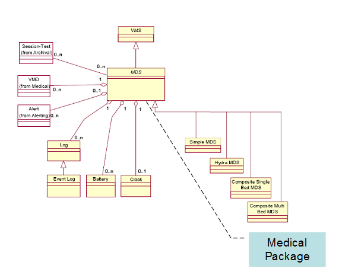

Figure A-1: System Package Model

The mapping from 11073 to HL7 will be described by focusing on the Medical Package defined by the Medical Device System shown in Figure A-1: System Package Model and elaborated in Figure A-2: Medical Package Model.

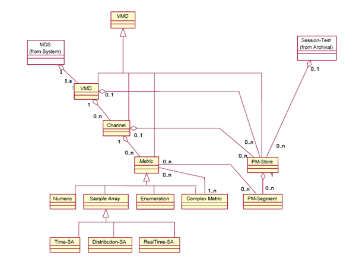

Figure A-2: Medical Package Model

The HL7 OBX segment provides two fields which are used in mapping the objects shown in Figure A-2: Medical Package Model; these are OBX-3 Observation Identifier and OBX-4 Observation Sub-Id.

OBX-3 is expressed as an HL7 Coded Element With Exceptions (CWE) data type and the details of mapping the 11073 MDC to the HL7 CWE datatype are described in Appendix A.1 ISO/IEEE Nomenclature mapping to HL7 OBX-3.

OBX-4 is used to express the containment level of a particular item expressed in OBX-3. This is done by defining the nodes of the <MDS> <VMD> <CHAN> <METRIC> hierarchy of the containment tree as a set of ordinal numbers expressed in a dotted notation such that each OBX-3 is expressed unambiguously in terms of its containment as defined by OBX-4. This may be supplemented by a further level or levels to distinguish attributes or other subordinate structures as may be specified in particular PCD profiles. See under OBX-4 in Appendix B for the details of the "dotted notation" used to express this containment.

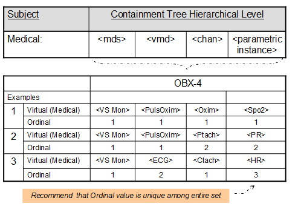

Figure A-3: Example of Mapping Containment to OBX-4

For example, the OBX-4 for the <VS Mon> <ECG> <Ctach> 
 would be expressed as 1.2.1.3.

NOTE: The ordinal numbers in an OBX-4 are not normative for a given parameter (identified in OBX-3) and may vary between implementations. Each OBX-4 Sub-Id must be unique within a given containment and message, but the numbers and mappings may change between messages.

In OBX-2 the valid HL7 types for the mapping are NM, ST, SN, CWE, CF (String may have some implied structure)

The specification of the containment tree provides a mechanism to address dynamic configuration of a PCD. For example, a patient monitor may have one or more "plug-ins" which may be added to and removed from the patient monitor as the patient’s clinical condition changes. These should be individually identifiable by a unique device instance identifier. When a plug-in is removed, the ordinal numbers previously assigned to that plug-in should be reserved. Addition of a new plug-in with a different unique device instance identifier shall result in the assignment of ordinal numbers which have not been reserved. Replacement of the "known" plug-in after its removal shall result in the re-assignment of the same reserved ordinal number to the plug-in that it formerly had. If the DOR system cannot distinguish individual instances of a module, it may treat modules that are functionally equivalent as though they were the same module for the purposes of the above scheme.

=== A.1 ISO/IEEE Nomenclature mapping to HL7 OBX-3

The ISO/IEEE Nomenclature provides an unambiguous coding which is mapped to HL7 OBX-3 as follows:

HL7 OBX-3 is of type CWE consisting of:

Table A.1-1: HL7 Component Table - CWE - Coded With Exceptions

[width="100%",cols="11%,9%,6%,10%,9%,9%,15%,15%,16%",options="header",]
|===
|SEQ |LEN |DT |Usage |Card. |TBL# |Component Name |Comments |Sec Ref
|1 |20 |ST |R |[1..1] | |Identifier |Nomenclature Code |2.A.74
|2 |199 |ST |R |[1..1] | |Text |Reference ID |2.A.74
|3 |20 |ID |R |[1..1] |0396 |Name of Coding System |"MDC" |2.A.35
|4 |20 |ST |RE |[0..1] | |Alternate Identifier | |2.A.74
|5 |199 |ST |RE |[0..1] | |Alternate Text | |2.A.74
|6 |20 |ID |RE |[0..1] |0396 |Name of Alternate Coding System | |2.A.35
|7 |10 |ST |X |[0..0] | |Coding System Version ID | |2.A.74
|8 |10 |ST |X |[0..0] | |Alternate Coding System Version ID | |2.A.74
|9 |199 |ST |X |[0..0] | |Original Text | |2.A.74
|===

Definition: This data type transmits codes, and the text associated with the code.

[width="100%",cols="100%",options="header",]
|===
|Maximum Length: 705
|===

Where:

Nomenclature Code is the string representation of the decimal value corresponding to the context free 32bit representation of the Nomenclature Code

[context-free] Nomenclature Code = (Code Block number * 2**16) + [context-sensitive], where [context-sensitive] is an offset, reflecting a particular variant of an associated "discriminator". The Reference ID is also modified to reflect the variant.

For example, for the "Device Type" Nomenclature, the Device Type discriminator is as follows:

[width="100%",cols="36%,32%,32%",options="header",]
|===
|Ref ID variant |Description |Term Code Offset
|DEV |Not otherwise specified |0
|MDS |Medical Device System |1
|VMD |Virtual Medical Device |2
|CHAN |Channel |3
|===

Nomenclature codes are obtained from IEEE-11073-10101 Medical Device Communications – Nomenclature where available. Additional codes that are not yet standardized are contained in the Rosetta Terminology Mapping (see IHE Devices Technical Framework Volume 3).

The context-free nomenclature code for a term in code block number 1 whose term code=4104 is equal to ((1 * 2**16) + 4104) = 1*65536 + 4104 = 69640 (which uniquely identifies the SpO2 monitor term) with a Reference ID of MDC_DEV_ANALY_SAT_O2. The context-sensitive form for the variant "MDS” is “MDC_DEV_ANALY_SAT_O2_MDS (appending the suffix "MDS"), and the Term Code is 69640+1 = 69641 (adding the Term Code Offset to the base Term Code).

The OBX-3 representation is “69641^MDC_DEV_ANALY_SAT_O2_MDS^MDC"

The Virtual Medical Device variants are: MDC_DEV_ANALY_SAT_O2_VMD 69642, and "69642^ MDC_DEV_ANALY_SAT_O2_VMD^MDC" in OBX-3 representation.

To distinguish between periodic and aperiodic data, map from the IEEE 11073 Metric Access to HL7 and code in OBX-17. This is used where you want to distinguish periodic, aperiodic etc. Metric Category also provides a distinction between manual and automatic.

Examples of device data (as opposed to patient data) that may be included to allow a receiving system to have a better record of the nature and status of a device are:

MDC_ATTR_SYS_TYPE is used to describe the type of device such as monitor, ventilator, infusion pump, and shall be mapped at the MDS level in the OBX with the value described by OBX-3.

MDC_ATTR_ID_MODEL is used to provide device vendor/model and shall be mapped at the MDS level in the OBX with the value described by OBX-3.

The unique identification of the particular instance of the device is put in OBX-18.

MDC_ATTR_VMS_MDS_STAT describes states - disconnected, configuring, operating, terminating, disassociated, reconfiguring.

For PCDs with complex operation states such as an infusion pump with a set of states like "Stopped", "Infusing Primary", "Infusing Secondary", "Bolus", etc., or a ventilator with states "Standby", "Ventilating", etc., the Device Operational Status Enumeration Object is mapped to OBX-3.

See the Rosetta Terminology Mapping documents referenced in IHE Devices Technical Framework Vol. 3 for further examples of device data.

== Appendix B Common Segment Descriptions

=== B.1 MSH – Message Header Segment

See HL7 v2.6: chapter 2 (2.14.9)

This segment defines the intent, source, destination, and some specifics of the syntax of a message.

Table B.1-1: MSH - Message Header

[width="100%",cols="13%,13%,8%,10%,10%,11%,35%",options="header",]
|===
|SEQ |LEN |DT |Usage |Card. |TBL# |Element name
|1 |1 |ST |R |[1..1] | |Field Separator
|2 |4 |ST |R |[1..1] | |Encoding Characters
|3 |227 |HD |R |[1..1] |0361 |Sending Application
|4 |227 |HD |RE |[0..1] |0362 |Sending Facility
|5 |227 |HD |RE |[0..1] |0361 |Receiving Application
|6 |227 |HD |RE |[0..1] |0362 |Receiving Facility
|7 |24 |DTM |R |[1..1] | |Date/Time of Message
|8 |40 |ST |X |[0..0] | |Security
|9 |15 |MSG |R |[1..1] | |Message Type
|10 |199 |ST |R |[1..1] | |Message Control Id
|11 |3 |PT |R |[1..1] | |Processing Id
|12 |60 |VID |R |[1..1] | |Version ID
|13 |15 |NM |RE |[0..1] | |Sequence Number
|14 |180 |ST |X |[0..0] | |Continuation Pointer
|15 |2 |ID |R |[1..1] |0155 |Accept Acknowledgement Type
|16 |2 |ID |R |[1..1] |0155 |Application Acknowledgement Type
|17 |3 |ID |RE |[0..1] |0399 |Country Code
|18 |16 |ID |RE |[0..1] |0211 |Character Set
|19 |705 |CWE |RE |[0..1] | |Principal Language of Message
|20 |20 |ID |X |[0..0] |0356 |Alternate Character Set Handling Scheme
|21 |427 |EI |O |[0..1] | |Message Profile Identifier
|22 |567 |XON |X |[0..0] | |Sending Responsible Organization
|23 |567 |XON |X |[0..0] | |Receiving Responsible Organization
|24 |227 |HD |X |[0..0] | |Sending Network Address
|25 |227 |HD |X |[0..0] | |Receiving Network Address
|===

MSH-1 Field Separator

The IHE Devices Technical Framework requires that applications support HL7-recommended value that is | (ASCII 124).

MSH-2 Encoding Characters

This field contains the four characters in the following order: the component separator, repetition separator, escape character, and subcomponent separator. The IHE Devices Technical Framework requires that applications support HL7-recommended values ^~\& (ASCII 94, 126, 92, and 38, respectively).

MSH-3 Sending Application (HD)

Components: <Namespace ID (IS)> ^ <Universal ID (ST)> ^ <Universal ID Type (ID)>

The intention of this field is to uniquely identify the software application implementing the PCD actor sending this message. For valid methods of accomplishing this, see Hierarchic Designator (HD) Data Type, Appendix Section C.6.

MSH-4 Sending Facility

Components: <Namespace ID (IS)> ^ <Universal ID (ST)> ^ <Universal ID Type (ID)>

For the IHE Devices Technical Framework, when populated, this field shall be implemented as:

First component (required): Namespace ID. The name of the organizational entity responsible for the DOR, typically the provider institution or department operating the DOR.

Second component (optional): The Universal ID (see HL7 v. 2.7 Ch. 2) of the organizational entity responsible for the DOR.

Third component (optional): The Universal ID Type. The codification of these three components is entirely site-defined. It may be detailed in the national extensions of this framework.

MSH-5 Receiving Application (HD)

Components: <Namespace ID (IS)> ^ <Universal ID (ST)> ^ <Universal ID Type (ID)>

For the IHE Devices Technical Framework, when populated, this field shall be implemented as:

First component (required): Namespace ID. The name of the organizational entity responsible for the receiving application.

Second component (optional): The Universal ID (see HL7 v. 2.7 Ch. 2) of the organizational entity responsible for the receiving application.

Third component (optional): The Universal ID Type. The codification of these three components is entirely site-defined. It may be detailed in the national extensions of this framework.

This field is not required for IHE PCD compliance but should be populated at the option of the organization operating the system if the field serves a desired function, such as facilitating the routing of messages.

MSH-6 Receiving Facility

Components: <Namespace ID (IS)> ^ <Universal ID (ST)> ^ <Universal ID Type (ID)>

For the IHE Devices Technical Framework, when populated, this field shall be implemented as:

First component (required): Namespace ID. The name of the organizational entity responsible for the receiving facility.

Second component (optional): The Universal ID (see HL7 v. 2.7 Ch. 2) of the organizational entity responsible for the receiving facility.

Third component (optional): The Universal ID Type. The codification of these three components is entirely site-defined. It may be detailed in the national extensions of this framework.

MSH-7 Date/Time of Message:

The IHE DEV TF requires this field be populated with:

Format: YYYY[MM[DD[HH[MM[SS[.S[S[S[S]]]]]]]]][+/-ZZZZ]

Time zone qualification of the date/time is required. The IHE DEV TF uses the IETF RFC3339 “Unknown Local Offset Convention” to make it possible to distinguish between the case where UTC is the preferred reference point for the specified, denoted with +0000, and the case where the UTC time is known, but the offset to local time is unknown, denoted with -0000. This distinction is sometimes important in devices.

MSH-7 shall be used only to provide time a message is created by the sending system, which is different from, and not be interpreted as, the time an observation is taken. See Section B.8.7 Time Stamps and Time Synchronization for a discussion of general considerations on time stamps in IHE PCD messages.

MSH-9 Message Type

Components: <Message Code (ID)> ^ <Trigger Event (ID)> ^ <Message Structure (ID)>

Definition: This field contains the message type, trigger event, and the message structure ID for the message. All three components are required.

Its content is defined within each transaction-specific section of this document.

For [PCD-01], this field must contain ORU^R01^ORU_R01.

The PCD PIV Profile requires that this field be valued as follows:

* RGV^O15^RGV_O15 for the IOP to IOC message that initiates the [PCD-03] transaction
* ACK^O15^ACK for the IOC to IOP accept acknowledgment message
* RRG^O16^RRG_O16 for the IOC to IOP application acknowledgment message
* ACK^O16^ACK for the IOP to IOC acknowledgment of the IOC to IOP application acknowledgment message
* For [PCD-04], this field must contain ORU^R40^ORU_R40.
* For [PCD-05], this field must contain ORU^R41^ORU_R41.

MSH-10 Message Control Id

Definition: This field contains a number or other identifier that uniquely identifies the message. Each message should be given a unique identifier by the sending system. The receiving system shall echo this ID back to the sending system in the Message Acknowledgment segment (MSA). The combination of this identifier and the name of the sending application (MSH-3) shall be unique across the Healthcare Enterprise.

MSH-11 Processing ID:

Components: <Processing ID (ID)> ^ <Processing Mode (ID)>

Definition: This data type indicates whether to process a message as defined in HL7 Application (level 7) processing rules.

The IHE Devices Technical Framework requires the first component Processing ID be valued based on HL7 Table 0103. Use of the second component Processing Mode is optional but if used is based on HL7 Table 0207.

The value in production systems should be P (Production). When it is desired to recognize and isolate test data, the value D (Debugging) may be used.

MSH-12 Version ID

Components: <Version ID (ID)> ^ <Internationalization Code (CWE)> ^ <International Version ID (CWE)>

Definition: This field is matched by the receiving system to its own version to be sure the message will be interpreted correctly.

The DEV TF is based on HL7 V2.6. Where specific elements of later versions are required, they have been used and their usage flagged.

Although HL7 allows international affiliate versions to be specified the IHE Devices Technical Framework uses only the core version (first component of the field).

MSH-13 Sequence Number (ID), required but may be empty:

Definition: A non-null value in this field implies that the sequence number protocol is in use. The sequence number protocol is not used in IHE PCD.

MSH-15 Accept Acknowledgement Type

Definition: This field identifies the conditions under which accept acknowledgments are required to be returned in response to this message. Required. Refer to HL7 Table 0155 - Accept/application acknowledgment conditions for valid values. The receiving system must send (or not send) acknowledgements as specified by this field.

In [PCD-01], [PCD-04], and [PCD-05] transactions, this field shall be valued as AL.

In [PCD-03] transactions, see Section 3.3.4.4.1

MSH-16 Application Acknowledgement Type

Definition: This field identifies the conditions under which application acknowledgments are required to be returned in response to this message. Required for enhanced acknowledgment mode. Refer to HL7 Table 0155 - Accept/application acknowledgment conditions for valid values. For [PCD-01] and [PCD-05] transactions this field shall be valued as NE. The ACM AR Actor should use MSH-16 in [PCD-04] to indicate whether or not the AR Actor is prepared to receive [PCD-05] transactions. Set MSH-16 of the [PCD-04] transaction to other than NE to receive [PCD-05] transaction (and other error indications) or set it to NE to indicate to the AM Actor that [PCD-05] transactions are not to be sent. The receiving system must send (or not send) acknowledgements as specified by this field.

For [PCD-03] transactions, see Section 3.3.4.4.1

MSH-17 Country Code

Definition: This field contains the country of origin for the message. It will be used primarily to specify default elements, such as currency denominations. The values to be used are those of ISO 3166. The ISO 3166 table has three separate forms of the country code: HL7 specifies that the 3-character (alphabetic) form be used for the country code.

MSH-18 Character Set (ID)

Definition: This field contains the character set for the entire message. Refer to HL7 Table 0211 - Alternate character sets for valid values.

An HL7 message uses field MSH-18-character set to specify the character set(s) in use. Valid values for this field are specified in HL7 Table 0211, "Alternate Character Sets". MSH-18-character set may be left blank or may contain a single value. If the field is left blank, the character set in use is understood to be the 7-bit ASCII set, decimal 0 through decimal 127 (hex 00 through hex 7F). This default value may also be explicitly specified as ASCII.

Any encoding system, single-byte or multi-byte may be specified as the default character encoding in MSH-18-character set. If the default encoding is other than 7-bit ASCII, sites shall document this usage in the dynamic conformance profile or other implementation agreement. This is particularly effective in promoting interoperability between nations belonging to different HL7 Affiliates, while limiting the amount of testing required to determine the encoding of a message.

See HL7 V2.6 for the semantics for alphabetic languages other than English (2.15.9.18.1) and for non-alphabetic languages (2.15.9.18.2)

The DEV TF requires this field to be valued if the character set is other than ASCII. If the character set is ASCII the field may be null or have the value of ASCII. A single character set is required for a given message.

MSH-19 Principal Language of Message

Components: <Identifier (ST)> ^ <Text (ST)> ^ <Name of Coding System (ID)> ^<Alternate Identifier (ST)> ^ <Alternate Text (ST)> ^ <Name of Alternate Coding System (ID)>

Definition: This field contains the principal language of the message. Codes come from ISO 639.

The PCD uses a default of en^English^ISO639 if the field is empty.

MSH-21 Message Profile Identifier

Components: <Entity Identifier (ST)> ^ <Namespace ID (IS)> ^ <Universal ID (ST)> ^<Universal ID Type (ID)>

For DEV TF, this field is required in non-ACK messages to allow identification of a specific message profile, particularly for testing purposes (it is superfluous and therefore not required in ACK messages). PCD message profiles are assigned ISO OIDs by the Devices Technical Committee and the appropriate Message Profile Identifiers are to be used here in conformant messages. When multiple message profiles are listed in this field they should be (vendor specific, country specific) constraints of the PCD profile. Note that the overriding of PCD profile constraints is only allowed in national extensions to this framework.

Assigned OIDs for PCD messages (note that for convenience of reference this table includes OIDs for some messages that are not yet in Final Text status and are therefore not described in this Final Text Technical Framework document):

[width="100%",cols="31%,69%",options="header",]
|===
|Assigned OID |PCD Message
|1.3.6.1.4.1.19376.1.6.1.1.1 |Device to Enterprise Communications PCD-01 Communicate PCD Data message (also used for observations in response to a PCD-02 PCD Data Query)
|1.3.6.1.4.1.19376.1.6.1.2.1 |Device to Enterprise Communications PCD-02 PCD Data Query
|1.3.6.1.4.1.19376.1.6.1.3.1 |Point-of-care Infusion Verification PCD-03 Communicate Infusion Order message
|1.3.6.1.4.1.19376.1.6.1.3.2 |Point-of-care Infusion Verification RRG^O16^RRG_O16 Pharmacy/Treatment Give Acknowledgment Message
|1.3.6.1.4.1.19376.1.6.1.9.1 |Implantable Device - Cardiac Communicate IDC Observations
|1.3.6.1.4.1.19376.1.6.1.4.1 |Alert Communication Management PCD-04 Report Alert message
|1.3.6.1.4.1.19376.1.6.1.5.1 |Alert Communication Management PCD-05 Report Alert Status message
|1.3.6.1.4.1.19376.1.6.1.6.1 |Alert Communication Management PCD-06 Disseminate Alert
|1.3.6.1.4.1.19376.1.6.1.7.1 |Alert Communication Management PCD-07 Report Alert Dissemination Status
|===

The ISO OID in the table should be used as the universal ID (EI-3). The Universal ID Type (EI-4) for ISO OIDs is “ISO”. In IHE PCD profiles, the Entity Identifier (EI-1) is optional and may contain a human-readable name for the profile in the form “IHE_PCD_XXX” where XXX identifies the IHE PCD transaction, for example, IHE_PCD_001 for [PCD-01]. Namespace Identifier (EI-2) is also optional, but may contain “IHE PCD” to identify the source of the profile for a human reader. It is emphasized that these suggested values are only for human readability and shall play no role in processing. Processing which depends on the Message profile identifier in the receiving application or in a test system shall base its recognition of the profile solely on the ISO OID (Universal ID, EI-3).

Example: IHE_PCD_001^IHE PCD^1.3.6.1.4.1.19376.1.6.4.4.1^ISO

=== B.2 MSA – Message Acknowledgement Segment

See HL7 v2.6: chapter 2 (2.14.8)

This segment contains information sent while acknowledging another message.

Table B.2-1: MSA - Message Acknowledgement

[width="100%",cols="14%,9%,9%,12%,10%,12%,34%",options="header",]
|===
|SEQ |LEN |DT |Usage |Card. |TBL# |Element name
|1 |2 |ID |R |[1..1] |0008 |Acknowledgement code
|2 |20 |ST |R |[1..1] | |Message Control Id
|3 |80 |ST |X |[0..0] | |Text Message
|5 |1 |ID |X |[0..0] | |Delayed Acknowledgment Type
|6 |705 |CWE |X |[0..0] |0357 |Error Condition
|===

*MSA-1 Acknowledgment Code*

This field indicates the result of the processing of the message it is acknowledging.

Table B.2-2: HL7 table 0008 - Acknowledgement code

[width="100%",cols="13%,43%,44%",options="header",]
|===
|Value |Description |Comment
|CA |Enhanced mode: Accept acknowledgment: Commit Accept |The message has been reviewed and accepted.
|CE |Enhanced mode: Accept acknowledgment: Error |The message has been rejected for an error.
|CR |Enhanced mode: Accept acknowledgment: Commit Reject |The message has been rejected by the receiving system
|AA |Original mode Application Acknowledgment:Accept. Enhanced mode: Application acknowledgement: Accept |The receiving system accepted and integrated the message.
|AR |Original mode Application Acknowledgment:Reject. Enhanced mode: Application acknowledgement: Reject |The receiving system rejected the message
|AE |Original mode Application Acknowledgment: Error. Enhanced mode: Application acknowledgement: Error |The receiving system rejected the message for an error.
|===

MSA-2 Message Control ID

Definition: This field contains the message control ID from the MSH-10 - Message Control ID of the incoming message for which the acknowledgement is sent.

MSA-3 Text Message

See the ERR segment.

=== B.3 ERR – Error Segment

HL7 v2.6, Chapter 2 (2.14.5)

This segment is used to add error comments to acknowledgment messages.

Table B.3-1: ERR - Error segment

[width="100%",cols="11%,9%,11%,14%,12%,14%,29%",options="header",]
|===
|SEQ |LEN |DT |Usage |Card. |TBL# |Element name
|1 |493 |ELD |B |[0..1] | |Error Code and Location
|3 |705 |CWE |R |[1..1] |0357 |HL7 Error Code
|4 |2 |ID |R |[1..1] |0516 |Severity
|5 |705 |CWE |RE |[0..1] |0533 |Application Error Code
|6 |80 |ST |C |0..1 | |Application Error Parameter
|===

Notes: ERR-1 is included in HL7 v2.6 for backward compatibility only. Within the context of IHE PCD, this field shall not be used.

ERR-3 and ERR-4 are required by HL7 v2.6

*Use of Error Segment in the PIV Profile.* This list of error codes that can occur during the processing of a PCD-03 message is consolidated from participating pump vendors. The application acknowledgment from the IOC should contain the Code and Text in ERR-5.1 and ERR-5.2 respectively. ERR-5.9 can also be used to contain additional text related to the error.

Note that there should be no expectation that each pump vendor or pump model will support all of the codes in this list.

[width="100%",cols="15%,42%,43%",options="header",]
|===
|Code |Text |Example
|9001 |Unknown infuser or channel |e.g., incorrect infuser or channel ID
|9002 |Infuser/channel is currently infusing |
|9003 |Missing required program parameter(s) (ParameterName1, ParameterName2, ...) |e.g., Give Amount Minimum (RXG-5) - volume to be infused - is missing
|9004 |Invalid program parameter(s) (ParameterName1, ParameterName2, ...) |e.g., volume units are not mL
|9005 |Parameter (ParameterName) outside of allowable range (MinValue to MaxValue) |e.g., ordered rate greater than pump maximum
|9006 |Infuser is powered off |
|9007 |Infuser is offline or unable to connect to infuser |e.g., infuser not on network or weak wireless signal
|9008 |Invalid units for parameter (ParameterName) |e.g., Give Strength Volume Units (RXG-24) contains a medication unit value instead of volume units
|9009 |Dose/Rate Units do not match drug library |e.g., ordered units = mL/hr; drug library units =mcg/kg/min
|9010 |Unable to match medication to drug library |e.g., Medication does not exist in drug library
|9011 |Patient weight mismatch |e.g., patient weight known by pump differs from weight sent in [PCD-03]
|9012 |Patient ID mismatch |e.g., patient ID known by pump differs from ID sent in [PCD-03]
|9013 |Unable to program medication as piggyback |e.g., medication not configured for piggyback administration in drug library
|9014 |Dose rate or VTBI exceeds maximum |e.g., greater than pump maximum
|9015 |Request timed out |
|9016 |Other error |Used when other errors are not applicable
|9017 |Infuser cannot accept program |Infuser is in a state where it cannot accept program; e.g., alarming or in standby
|9018 |Parameter (ParameterName) does not match drug library    |e.g., Give Strength Units (RXG-18) = mg, drug library = mEq
|9019 |Patient weight missing |Drug is weight-based or BSA-based, but patient weight OBX is missing
|9020 |Patient height missing |Drug is BSA-based, but patient height OBX is missing 
|9021 |Care area or profile mismatch |Care area or profile not cleared on pump; or pump is set to a different care area
|9022 |Requested infusion program is stale |The value of ORC.9 is older than what the IOC will allow to program the pump
|9023 |Program rejected by user |Program rejected by user prior to starting infusion
|9024 |Drug library hard limit exceeded |e.g., dose exceeds maximum allowable for medication
|9025 |Lockout interval missing |Lockout Interval is required when Patient Dose is present
|9026 |Dose limit missing |PCA dose limit is required but missing
|9027 |Patient BSA missing |Drug is BSA-based but BSA OBX is missing
|9028 |Tubing, cassette, or syringe not installed on pump |Used when required by pump
|9029 |Care area or profile not selected |Used when required by pump
|9030 |Current medication cannot be interrupted |Medication on primary cannot be interrupted by a piggyback
|9031 |Patient ID missing or invalid |
|9032 |Pump is in delayed start |
|9033 |Pump is alarming |
|9034 |Not enough fluid or medication in container to deliver bolus |Applies to bolus from existing infusion only
|9035 |Parent order ID does not match the currently programmed order |Applies to bolus from existing infusion only
|9036 |Medication does not match the currently programmed order |Applies to bolus from existing infusion only
|9037 |Medication concentration does not match the currently programmed order |Applies to bolus from existing infusion only
|9038 |Bolus order type is not supported |ORC-1 = “CH” not supported by pump
|9039 |Medication does not support bolus |Medication in drug library not configured for bolus
|9040 |Bolus dose units do not match the currently programmed order |e.g., “mg” instead of “mL”
|9041 |Unable to parse multistep program |Applies to multistep infusion only
|9042 |Medication is not configured for loading dose |Applies to multistep infusion only
|9043 |Medication does not support multistep |Applies to multistep infusion only
|9044 |Multistep order type is not supported |Applies to multistep infusion only
|===

ERR-5 Application Error Code

Application specific codes for infusion-related errors resulting from a [PCD-03] transaction, identifying the specific error that occurred, are given in the IHE PCD Application Error Table. New codes may be added from time to time through the IHE Change Proposal Process. The IHE PCD website should be consulted for the latest approved table (http://wiki.ihe.net/index.php?title=PumpErrorCodes[[.underline]#http://wiki.ihe.net/index.php?title=PumpErrorCodes#]).

ERR-6 Application Error Parameter

Additional information to be used with application specific codes calling for the input of Parameter names or values as called for in the IHE PCD Application Error Table.

=== B.4 NTE - Notes and Comment Segment

HL7 v2.6 : chapter 2 (2.4.10)

This segment is used for sending notes and comments.

The IHE Devices Technical Framework limits the use of this segment to only one purpose: to comment the observations and the orders. Therefore, in the messages of this Integration Profile, NTE segments appear only following either OBR or OBX segments.

Information that can be coded in OBX segments or OBR segments shall not be sent in a NTE segment.

Detail of the fields used by the NTE segment in the PCD Observation Message is given below.

Table B.4-1: NTE - Notes and Comment segment

[width="100%",cols="14%,10%,8%,10%,12%,10%,36%",options="header",]
|===
|SEQ |LEN |DT |Usage |Card. |TBL# |Element name
|1 |4 |SI |R |[1..1] | |Set ID – NTE
|2 |8 |ID |X |[0..0] | |Source of Comment
|3 |65536 |FT |RE |[0..1] | |Comment
|4 |705 |CWE |X |[0..0] | |Comment Type
|5 |3220 |XCN |X |[0..0] | |Entered by
|6 |24 |DTM |X |[0..0] | |Entered Date/Time
|7 |24 |DTM |X |[0..0] | |Expiration Date
|===

NTE-1 Set ID

This field may be used where multiple NTE segments are used in a message. Their numbering must be described in the application message definition.

NTE-3 Comment

This field contains the text of the comment. This text may be formatted. In order to delete an existing comment, the field shall contain empty quotation marks: "“.

Comment text of identical type and source shall be included in the same occurrence of an NTE segment, and not be split over multiple segments.

*NTE Notes and Comment Segment in PCD-04 Message*

By site-specific agreement between implementers of the Alert Reporter and Alert Manager Actors, additional information not provided for in other segments may be included in the NTE Notes and Comment segments. Site or system specific indications are optionally passed in this manner to the Alert Manager for us by its message dispatching logic, or to pass additional information through the Alert Manager to the Alert Communicator to communications endpoints.

Optional ad-hoc annotation text to be included in the alert notification text message sent from the ACM Alert Manager to the ACM Alert Communicator is to be included in an occurrence of an NTE segment in association with the OBX segment which identifies the alert indication. This text doesn’t replace any alert notification text synthesized by the ACM AM from alert data provided to the ACM Alert Manager by the Report Alert PCD-04 message.

Table B.4-2: HL7 Attribute Table – NTE – Notes and Comment

[width="100%",cols="12%,10%,8%,9%,9%,10%,42%",options="header",]
|===
|SEQ |LEN |DT |OPT |RP/# |TBL# |ELEMENT NAME
|3 |65536 |FT |O |Y | |Comment
|===

*NTE-3 Comment (FT)*

This field contains the comment conveyed by the segment.

=== B.5 PID - Patient Identification segment

HL7 v2.6: chapter 3 (3.4.2)

The PID segment is used by all applications as the primary means of communicating patient identification information. This segment contains permanent patient identifying and demographic information that, for the most part, is not likely to change frequently.

Patient Care Devices or gateway systems providing PCD observation reports are not ordinarily primary interfaces for detailed patient demographic information. Another information system such as a master patient index will generally be the source of authoritative information sent in the PID segment. Getting this data is out of scope for this IHE Devices Technical Framework: IHE Information Technology Infrastructure Technical Framework should be consulted for standards-based means for tracing a feed of ADT events (Patient Identify Feed) or querying this information based on information available at the point of care such as a bar-code scan of a patient identity wristband (Patient Data Query). In the context of the IHE Patient Care domain, this general problem is referred to as Patient Identity Binding and has been the subject of a Technical Framework Supplement in the past. At present, this data requirement is delegated to IHE Information Technology Infrastructure profiles.

Reliable patient identity information is essential for correctly associating Patient Care Device data with the patient, which is obviously critical for safe and effective treatment. Consequently, unique identifiers and additional confirmatory factors such as patient name are listed as required by this profile.

Table B.5-1: PID - Patient Identification segment

[width="100%",cols="12%,9%,9%,11%,15%,10%,34%",options="header",]
|===
|SEQ |LEN |DT |Usage |Card. |TBL# |Element name
|1 |4 |SI |X |[0..0] | |Set ID - PID
|2 |20 |CX |X |[0..0] | |Patient ID
|3 |250 |CX |C |[0..6] | |Patient Identifier List
|4 |20 |CX |X |[0..0] | |Alternate Patient ID - PID
|5 |250 |XPN |C |[0..6] | |Patient Name
|6 |250 |XPN |RE |[0..1] | |Mother’s Maiden Name
|7 |24 |DTM |RE |[0..1] | |Date/Time of Birth
|8 |1 |IS |RE |[0..1] |0001 |Administrative Sex
|9 |250 |XPN |X |[0..0] | |Patient Alias
|10 |705 |CWE |RE |[0..1] |0005 |Race
|11 |250 |XAD |RE |[0..1] | |Patient Address
|12 |4 |IS |RE |[0..1] |0289 |County Code
|13 |250 |XTN |RE |[0..2] | |Phone Number - Home
|14 |250 |XTN |X |[0..1] | |Phone Number - Business
|15 |705 |CWE |RE |[0..1] |0296 |Primary Language
|16 |705 |CWE |RE |[0..1] |0002 |Marital Status
|17 |705 |CWE |RE |[0..1] |0006 |Religion
|18 |705 |CX |RE |[0..1] | |Patient Account Number
|19 |16 |ST |X |[0..0] | |SSN Number - Patient
|20 |25 |DLN |RE |[0..1] | |Driver's License Number - Patient
|21 |705 |CX |RE |[0..1] | |Mother's Identifier
|22 |705 |CWE |RE |[0..1] |0189 |Ethnic Group
|23 |705 |ST |RE |[0..1] | |Birth Place
|24 |1 |ID |RE |[0..1] |0136 |Multiple Birth Indicator
|25 |2 |NM |RE |[0..1] | |Birth Order
|26 |705 |CWE |RE |[0..1] |0171 |Citizenship
|27 |705 |CWE |RE |[0..1] |0172 |Veterans Military Status
|28 |705 |CWE |RE |[0..1] |0212 |Nationality
|29 |24 |DTM |RE |[0..1] | |Patient Death Date and Time
|30 |1 |ID |RE |[0..1] |0136 |Patient Death Indicator
|31 |1 |ID |RE |[0..1] |0136 |Identity Unknown Indicator
|32 |20 |IS |RE |[0..1] |0445 |Identity Reliability Code
|33 |24 |DTM |RE |[0..1] | |Last Update Date/Time
|34 |241 |HD |RE |[0..1] | |Last Update Facility
|35 |705 |CWE |RE |[0..1] |0446 |Species Code
|36 |250 |CWE |C |[0..1] |0447 |Breed Code
|37 |80 |ST |C |[0..1] | |Strain
|38 |705 |CWE |RE |[0..2] |0429 |Production Class Code
|39 |705 |CWE |RE |[0..1] |0171 |Tribal Citizenship
|===

The following describes the IHE PCD usage of those fields which have a usage other than X in the above table and have IHE PCD usage notes added to the general definitions in the HL7 2.6 standard.

PID-3 Patient Identifier List

Definition: This field contains the list of identifiers (one or more) used by the healthcare facility to uniquely identify a patient (e.g., medical record number, billing number, birth registry, national unique individual identifier, etc.). In Canada, the Canadian Provincial Healthcare Number is used in this field.

Component PID-3.1 (in terms of the CX data type, CX-1) "ID number", is required except where noted under particular transactions. PID-3.4 (CX-4) "Assigning authority", and PID-3.5 (CX-5) "Identifier Type Code" are required for each identifier if they are known (for example if they are ordinarily included in ADT messages at the institution), but may be empty if they are not known. See Appendix CX Data Type. Note that PID-3.4 is an Entity Identifier data type, so it may have subcomponents.

The workflow and mechanism by which patient identification is bound to the data from a particular PCD device is outside of the scope of the IHE PCD Framework. Common implementations employ either automated or manual entry based on information provided by an authoritative source of patient identity.

The IHE PCD recognizes that it is critical for data to be associated with the correct patient, thus the general rule that at least PID-3 and PID-5 be available for at least two-factor patient identification, but that there are also situations like emergency admissions where it may be desirable to collect data before an authoritative patient identification is available, for later association with the patient’s other data. Only after appropriate study, risk analysis, and defined risk mitigation measures determined by the provider institution in consultation with the manufacturers of the systems involved, a defined method for deferred association of patient data could be designed. In such a case, these fields, instead of being populated with authoritative patient identity information, could be populated with agreed-on special values (like an automatically generated “stat admit” patient identifier and a well-known special value in PID-5 indicating the temporary situation) pending the later human-validated merging of the data.

The IHE PCD recognizes that for some use cases, such as medication administration, additional identification information or other patient demographic information is required in addition to an organizationally assigned unique identifier. Patient name, date of birth, gender, and other information are commonly used to provide the additional patient identification context for these use cases. Additional patient demographic information is provided by the fields of the PID segment and the patient location, which is often a key element in PCD communications, is provided in the PV1-3 element.

PID-5 Patient Name

Definition: This field contains the names of the patient; the primary or legal name of the patient is reported first. Therefore, the name type code in this field should be "L - Legal" if such a name is available. If no name is available, the name type code should be "U – unspecified", and the other components should be empty. All other codes in HL7 Table 0200 – Name Type are also acceptable. Note that "last name prefix" is synonymous to "own family name prefix" of previous versions of HL7, as is "second and further given names or initials thereof" to "middle initial or name". Multiple given names and/or initials are separated by spaces.

The workflow and mechanism by which patient name is bound to the data from a particular PCD device is outside of the scope of this version of the IHE PCD Framework. Common implementations employ either automated or manual entry based on information provided by an authoritative source of patient identity. The workflow and transactions to bind patient name are included on the IHE PCD Roadmap for consideration in future versions of the IHE PCD Framework.

See Appendix C.8 XPN Type for further information.

PID-6 Mother’s Maiden Name

Definition: This field contains the family name under which the mother was born (i.e., before marriage). It is used to distinguish between patients with the same last name.

See Appendix C.8 XPN Type for further information.

PID-7 Date/Time of Birth

See Appendix C.4, DTM – date/time for further information on how the specification of times in IHE PCD differs from the HL7 v. 2.6 representation

PID-8 Administrative Sex

Definition: This field contains the patient’s sex. Refer to HL7 User-defined Table 0001 - Administrative Sex for suggested values.

Table B.5-2: HL7 User-defined Table 0001 - Administrative Sex

[width="100%",cols="32%,36%,32%",options="header",]
|===
|Value |Description |Comment
|F |Female |
|M |Male |
|O |Other |
|A |Ambiguous |
|N |Not applicable |
|===

PID-10 Race (CWE)

Definition: This field refers to the patient’s race. Refer to User-defined Table 0005 - Race for suggested values. The second triplet of the CWE data type for race (alternate identifier, alternate text, and name of alternate coding system) is reserved for governmentally assigned codes.

Table B.5-3: HL7 User-defined Table 0005 - Race

[width="100%",cols="17%,60%,23%",options="header",]
|===
|Value |Description |Comment
|1002-5 |American Indian of Alaska Native |
|2028-9 |Asian |
|2054-5 |Black or African American |
|2076-8 |Native Hawaiian of Other Pacific Islander |
|2106-3 |White |
|2131-1 |Other Race |
|===

PID-11 Patient Address

Components: <Street Address (SAD)> ^ <Other Designation (ST)> ^ <City (ST)> ^ <State or Province (ST)> ^ <Zip or Postal Code (ST)> ^ <Country (ID)> ^ <Address Type (ID)> ^ <Other Geographic Designation (ST)> ^ <County/Parish Code (IS)> ^ <Census Tract (IS)> ^ <Address Representation Code (ID)> ^ <Address Validity Range (DR)> ^ <Effective Date (DTM)> ^ <Expiration Date (DTM)>

Subcomponents for Street Address (SAD): <Street or Mailing Address (ST)> & <Street Name (ST)> & <Dwelling Number (ST)>

Subcomponents for Address Validity Range (DR): <Range Start Date/Time (DTM)> & <Range End Date/Time (DTM)>

Subcomponents for Range Start Date/Time (DTM): <Time (DTM)> & <Degree of Precision (ID)>

Subcomponents for Range End Date/Time (DTM): <Time (DTM)> & <Degree of Precision (ID)>

Subcomponents for Effective Date (DTM): <Time (DTM)> & <Degree of Precision (ID)>

Subcomponents for Expiration Date (DTM): <Time (DTM)> & <Degree of Precision (ID)>

Definition: This field contains the mailing address of the patient. Address type codes are defined by HL7 Table 0190 - Address Type. The PCD only requires the first, third, fourth, and fifth components to be valued with the mailing address and the Address Type to be valued as M.

PID-13 Phone Number – Home

Definition: This field contains the patient’s personal phone numbers. This data type is usually in a repeatable field, to allow a list of numbers. The PCD requires the sequence to be the primary number (for backward compatibility). The PCD constrains this field to 2 repetitions to allow for a phone number and an email address.

See Appendix C.9 XTN Data Type for further information.

PID-15 Primary Language

See HL7 V2.6 Section 3.4.2.15 for details. The DEV TF requires the use of ISO639 for the codes.

PID-16 Marital Status

See HL7 V2.6 Section 3.4.2.16 for details. The DEV TF does not further constrain this field.

PID-17 Religion

See HL7 V2.6 Section 3.4.2.17 for details. The DEV TF does not further constrain this field.

PID-18 Patient Account Number

See HL7 V2.6 Section 3.4.2.18 for details. The DEV TF does not further constrain this field. Additional requirements may be documented in Regional or National appendices to the IHE Devices Technical Framework.

PID-20 Driver’s License Number – Patient

See HL7 V2.6 Section 3.4.2.20 for details. The DEV TF does not further constrain this field.

PID-21 Mother’s Identifier

See HL7 V2.6 Section 3.4.2.21 for details. The DEV TF does not further constrain this field.

PID-22 Ethnic Group:

See HL7 V2.6 Section 3.4.2.22 for details. The DEV TF does not further constrain this field.

PID-23 Birth Place

See HL7 V2.6 Section 3.4.2.23 for details. The DEV TF does not further constrain this field.

PID-24 Multiple Birth Indicator

See HL7 V2.6 Section 3.4.2.24 for details. The DEV TF does not further constrain this field.

PID-25 Birth Order

See HL7 V2.6 Section 3.4.2.25 for details. The DEV TF does not further constrain this field.

PID-26 Citizenship

See HL7 V2.6 Section 3.4.2.26 for details. The DEV TF does not further constrain this field.

PID-27 Veterans Military Status

See HL7 V2.6 Section 3.4.2.27 for details. The DEV TF does not further constrain this field.

PID-28 Nationality

See HL7 V2.6 Section 3.4.2.28 for details. The DEV TF does not further constrain this field.

PID-29 Patient Death Date and Time

Definition: This field contains the date and time at which the patient death occurred.

See Appendix C.4 DTM – date/time for PCD constraints.

PID-30 Patient Death Indicator

See HL7 V2.6 Section 3.4.2.30 for details. The DEV TF does not further constrain this field.

PID-31 Identity Unknown Indicator

Definition: This field indicates whether or not the patient's/person's identity is known. Refer to HL7 Table 0136 - Yes/No Indicator for valid values.

* Y the patient's/person's identity is unknown
* N the patient's/person's identity is known

See HL7 V2.6 Section 3.4.2.31 for details. The DEV TF does not further constrain this field.

PID-32 Identity Reliability Code

See HL7 V2.6 Section 3.4.2.32 for details. The DEV TF does not further constrain this field.

PID-33 Last Update Date/Time

Definition: This field contains the last update date and time for the patient’s/person’s identifying and demographic data, as defined in the PID segment. Receiving systems will use this field to determine how to apply the transaction to their systems. If the receiving system (such as an enterprise master patient index) already has a record for the person with a later last update date/time, then the EMPI receiving system could decide not to apply the patient’s/person’s demographic and identifying data from this transaction.

See Appendix C.4 DTM – date/time for PCD constraints.

PID-34 Last Update Facility

See HL7 V2.6 Section 3.4.2.34 for details. The DEV TF does not further constrain this field.

PID-35 Species Code

See HL7 V2.6 Section 3.4.2.35 for details. The DEV TF does not further constrain this field.

PID-36 Breed Code

See HL7 V2.6 Section 3.4.2.36 for details. The DEV TF does not further constrain this field.

PID-37 Strain

See HL7 V2.6 Section 3.4.2.37 for details. The DEV TF does not further constrain this field.

PID-38 Production Class Code

See HL7 V2.6 Section 3.4.2.38 for details. The DEV TF does not further constrain this field.

PID-39 Tribal Citizenship (CWE)

See HL7 V2.6 Section 3.4.2.39 for details. The DEV TF does not further constrain this field.

==== B.5.1 PID Segment requirements for ACM Transaction PCD-04

This segment is required to be present and is populated with data used to identify the patient associated with the alert in the case where the identity is available from the Alert Source system. If the patient identification is not available from the Alert Source system, the alert may be location source based per ACM use case A1 in which case the PV1 segment identifies the location associated with the alert. Additional information may be present to more unambiguously identify the patient.

Table B.5.1-1: HL7 Attribute Table – PID – Patient Identification

[width="100%",cols="14%,11%,9%,11%,11%,12%,32%",options="header",]
|===
|SEQ |LEN |DT |OPT |RP/# |TBL# |ELEMENT NAME
|3 |250 |CX |O |Y | |Patient Identifier List
|5 |250 |XPN |O |Y | |Patient name
|7 |26 |TSO |O | | |Date/Time of Birth
|8 |1 |IS |O | | |Administrative Sex
|===

*PID-3 Patient Identifier List (CX)*

This information may be used by the Alert Manager in the message sent to the Alert Communicator to identify the patient associated with the alert within site specific HIPAA and electronic patient healthcare information policies.

*PID-5 Patient Name (XPN)*

This information may be used by the Alert Manager in the message sent to the Alert Communicator to identify the patient associated with the alert within site specific HIPAA and electronic patient healthcare information policies. Refer to PID-31 Identity Unknown Indicator for the means to identify that while a PID segment is provided the identity of the patient is unknown.

*PID-7 Date/Time of Birth (TSO)*

This information may be used by the Alert Manager in the message sent to the Alert Communicator to identify the patient associated with the alert within site specific HIPAA and electronic patient healthcare information policies.

*PID-8 Administrative Sex (IS)*

This information may be used by the Alert Manager in the message sent to the Alert Communicator to identify the patient associated with the alert within site specific HIPAA and electronic patient healthcare information policies.

*PID-31 Identity Unknown Indicator (ID)*

Definition: This field indicates whether or not the patient's/person's identity is known. Refer to HL7 Table 0136 - Yes/No Indicator for valid values.

* Y the patient's/person's identity is unknown
* N the patient's/person's identity is known

=== B.6 PV1 - Patient Visit Segment

See HL7 V2.6 Section 3.4.3 for details.

The PV1 segment is used by Registration/Patient Administration applications to communicate information on an account or visit-specific basis. The default is to send account level data. To use this segment for visit level data PV1-51 - Visit Indicator must be valued to ‘V’. The value of PV-51 affects the level of data being sent on the PV1, PV2, and any other segments that are part of the associated PV1 hierarchy (e.g., ROL, DG1, or OBX).

The facility ID, the optional fourth component of each patient location field, is a HD data type that is uniquely associated with the healthcare facility containing the location. A given institution, or group of intercommunicating institutions, should establish a list of facilities that may be potential assignors of patient locations. The list will be one of the institution’s master dictionary lists. Since third parties other than the assignors of patient locations may send or receive HL7 messages containing patient locations, the facility ID in the patient location may not be the same as that implied by the sending and receiving systems identified in the MSH. The facility ID must be unique across facilities at a given site. This field is required for HL7 implementations that have more than a single healthcare facility with bed locations, since the same <point of care> ^ <room> ^ <bed> combination may exist at more than one facility.

Details of the PV1 segment as used in the IHE Devices Technical Framework are given in Table B.6-1: HL7 Attribute Table - PV1 - Patient Visit.

Table B.6-1: HL7 Attribute Table - PV1 - Patient Visit

[width="100%",cols="11%,9%,9%,11%,11%,15%,34%",options="header",]
|===
|SEQ |LEN |DT |Usage |Card. |TBL# |Element name
|1 |4 |SI |X |[0..0] | |Set ID - PV1
|2 |1 |IS |R |[1..1] |0004 |Patient Class
|3 |80 |PL |RE |[0..1] | |Assigned Patient Location
|4 |2 |IS |X |[0..0] |0007 |Admission Type
|5 |250 |CX |X |[0..0] | |Preadmit Number
|6 |80 |PL |X |[0..0] | |Prior Patient Location
|7 |250 |XCN |X |[0..0] |0010 |Attending Doctor
|8 |250 |XCN |X |[0..0] |0010 |Referring Doctor
|9 |250 |XCN |X |[0..0] |0010 |Consulting Doctor
|10 |3 |IS |X |[0..0] |0069 |Hospital Service
|11 |80 |PL |X |[0..0] | |Temporary Location
|12 |2 |IS |X |[0..0] |0087 |Preadmit Test Indicator
|13 |2 |IS |X |[0..0] |0092 |Re-admission Indicator
|14 |6 |IS |X |[0..0] |0007 |Admit Source
|15 |2 |IS |X |[0..0] |0009 |Ambulatory Status
|16 |2 |IS |X |[0..0] |0099 |VIP Indicator
|17 |250 |XCN |X |[0..0] |0010 |Admitting Doctor
|18 |2 |IS |X |[0..0] |0018 |Patient Type
|19 |250 |CX |RE |[0..1] | |Visit Number
|20 |50 |FC |X |[0..0] |0064 |Financial Class
|21 |2 |IS |X |[0..0] |0032 |Charge Price Indicator
|22 |2 |IS |X |[0..0] |0045 |Courtesy Code
|23 |2 |IS |X |[0..0] |0046 |Credit Rating
|24 |2 |IS |X |[0..0] |0044 |Contract Code
|25 |8 |DT |X |[0..0] | |Contract Effective Date
|26 |12 |NM |X |[0..0] | |Contract Amount
|27 |3 |NM |X |[0..0] | |Contract Period
|28 |2 |IS |X |[0..0] |0073 |Interest Code
|29 |4 |IS |X |[0..0] |0110 |Transfer to Bad Debt Code
|30 |8 |DT |X |[0..0] | |Transfer to Bad Debt Date
|31 |10 |IS |X |[0..0] |0021 |Bad Debt Agency Code
|32 |12 |NM |X |[0..0] | |Bad Debt Transfer Amount
|33 |12 |NM |X |[0..0] | |Bad Debt Recovery Amount
|34 |1 |IS |X |[0..0] |0111 |Delete Account Indicator
|35 |8 |DT |X |[0..0] | |Delete Account Date
|36 |3 |IS |X |[0..0] | |Discharge Disposition
|37 |47 |DLD |X |[0..0] |0113 |Discharged to Location
|38 |705 |CWE |X |[0..0] |0114 |Diet Type
|39 |2 |IS |X |[0..0] |0115 |Servicing Facility
|40 |1 |IS |X |[0..0] |0116 |Bed Status
|41 |2 |IS |X |[0..0] |0117 |Account Status
|42 |80 |PL |X |[0..0] | |Pending Location
|43 |80 |PL |X |[0..0] | |Prior Temporary Location
|44 |24 |DTM |RE |[0..1] | |Admit Date/Time
|45 |24 |DTM |X |[0..0] | |Discharge Date/Time
|46 |12 |NM |X |[0..0] | |Current Patient Balance
|47 |12 |NM |X |[0..0] | |Total Charges
|48 |12 |NM |X |[0..0] | |Total Adjustments
|49 |12 |NM |X |[0..0] | |Total Payments
|50 |250 |CX |X |[0..0] |file:///D:\Google%20Drive\01_IHE\Users\al.PROTOLINK\Users\usd04734\Documents\Data\Protocols\IHE_PCD\TFV2History\2014TFV2ForPub\l%20%22HL70203%22[0203] |Alternate Visit ID
|51 |1 |IS |RE |[0..1] |0326 |Visit Indicator
|===

PV1-2 Patient Class

Definition: This field is used by systems to categorize patients by site. It does not have a consistent industry-wide definition. It is subject to site-specific variations. Refer to Table B.6-2 HL7 User-defined Table 0004 - Patient Class for IHE PCD suggested values.

Table B.6-2: HL7 User-defined Table 0004 - Patient Class

[width="100%",cols="25%,42%,33%",options="header",]
|===
|Value |Description |Comment
|E |Emergency |
|I |Inpatient |
|O |Outpatient |
|P |Preadmit |
|R |Recurring patient |
|B |Obstetrics |
|U |Unknown |
|===

PV1-3 Assigned Location

IHE PCD definition: This field contains the patient’s initial assigned location or the location to which the patient is being moved, if known. The first component may be the nursing station for inpatient locations, or clinic or department, for locations other than inpatient.

For IHE PCD usage, see Appendix C.7 PL Data Type.

PV1-19 Visit Number

IHE PCD definition: This field contains the unique number assigned to each patient visit.

PV1-44 Admit Time / Date

HL7 Definition: This field contains the admit date/time. It is to be used if the event date/time is different than the admit date and time, i.e., a retroactive update. This field is also used to reflect the date/time of an outpatient/emergency patient registration. IHE PCD does not further constrain this field.

PV1-51 Visit Indicator

HL7 definition: This field specifies the level on which data are being sent. It is the indicator used to send data at two levels, visit and account. IHE PCD implementations shall send an ‘A’ or no value when the data in the message are at the account level, or ‘V’ to indicate that the data sent in the message are at the visit level.

The value of this element affects the context of data sent in PV1, PV2 and any associated hierarchical segments (e.g., DB1, AL1, DG1, etc.).

==== B.6.1 PV1 Patient Visit Segment in ACM Transaction PCD-04

This segment is used to identify a patient location associated with the alert. Real Time Location Services (RTLS) or GPS equipment or personnel location information is not passed in this segment. It is passed from the Alert Reporter to the Alert Manager via an OBX segment.

If the Patient Identification (PID) segment is present in the alert data and it contains an identified patient as in ACM use case A2, use a more reliable source of current information, rather than this segment, where possible.

Table B.6.1-1: HL7 Attribute Table – PV1 – Patient Visit

[width="100%",cols="13%,9%,8%,9%,9%,10%,42%",options="header",]
|===
|SEQ |LEN |DT |OPT |RP/# |TBL# |ELEMENT NAME
|*3* |*80* |*PL* |*O* | | |*Assigned Patient Location*
|===

*PV1-3 Assigned Patient Location (PL)*

This field contains the location associated with the alert. It is typically a location established by an external system such as ADT, as in the patient assigned bed location as used in association with a patient station of a nurse call system. This may not be the current location of the relevant patient.

=== B.7 OBR – Observation Request segment

In the reporting of clinical data, the Observation Request Segment (OBR) serves as the 'report header' for the ORDER_OBSERVATION segment group, which in its simplest form is an OBR segment followed by a set of OBX segments which represent observations associated with the 'order' represented by the OBR segment. It identifies the observation set represented by the following atomic observations. It includes the relevant ordering information when that applies and many of the attributes that apply to all of the following observations.

A Report Alert [PCD-04] transaction contains at most one alert indication.

The OBR segment is used to uniquely identify the alert indication and the descendent alert status update indications.

Table B.7-1: OBR segment

[width="100%",cols="15%,11%,14%,11%,10%,10%,29%",options="header",]
|===
|SEQ |LEN |DT |Usage |Card. |TBL# |Element name
|1 |4 |SI |R |[1..1] | |Set ID OBR
|2 |427 |EI |C |[0..1] | |Placer Order Number
|3 |427 |EI |R |[1..1] | |Filler Order Number
|4 |705 |CWE |R |[1..1] | |Universal Service Identifier
|5 |2 |ID |X |[0..0] | |Priority - OBR
|6 |24 |DTM |X |[0..0] | |Requested Date/Time
|7 |24 |DTM |RE |[0..1] | |Observation Date/Time
|8 |24 |DTM |RE |[0..1] | |Observation End Date / Time
|9 |722 |CQ |X |[0..0] | |Collection Volume
|10 |3220 |XCN |R2 |[0..1] | |Collection Identifier
|===

OBR-1 Set ID OBR

Definition: For the first order transmitted in each message, the sequence number shall be 1; for the second order, it shall be 2; and so on.

OBR-2 Placer Order Number

Definition: This field has the Entity Identifier data type. The first component (EI-1, Entity Identifier) is a string that identifies an individual order (e.g., OBR). It is assigned by the placer (ordering application). It identifies an order uniquely among all orders from a particular ordering application. The second through fourth components contain the application ID of the placing application in the same form as the HD data type. The second component, Namespace ID, is a user-defined coded value that will be uniquely associated with an application. A given institution or group of intercommunicating institutions should establish a unique list of applications that may be potential placers and fillers and assign unique application IDs. The components are separated by component delimiters.

This field is conditionally required as described in HL7, where the placer id may be sent in either the ORC or the OBR segment. If the observation is in response to an order, then the ordering application’s placer number and naming system should be returned here. If there is no placer number from an ordering application, for example in a "standing" order that is documented as a hospital specific protocol, then the Device Observation Reporter will leave this field empty.

The DEV TF requires at a minimum that Entity Identifier (EI-1) and Namespace ID (EI-2) be valued and recommends that the Namespace Id (EI-2) shall refer to the locally unique application identifier assigned to the Device Observation Reporter application implementing IHE PCD actors which fill the role of an ordering application such as the DOR. In order to avoid conflicting Ids in any context, it is desirable, though not required, that the assigning application be identified according to a Universal ID system by giving a value for Universal ID (EI-3) and Universal ID type (EI-4). If EI-3 and EI-4 are valued, then EI-2 (Namespace ID) is not required.

See Appendix C.5 EI Data Type for further information.

See HL7 V2.6 Section 7.4.1.2 for details. The DEV TF does not further constrain this field.

*OBR-3 Filler Order Number*

Definition: This field is the order number associated with the filling application. This is a permanent identifier for an order and its associated observations. It is a special case of the Entity Identifier data type. The first component (EI-1, Entity Identifier) is a string that identifies an order detail segment (e.g., OBR). It is assigned by the order filler (receiving) application. This string must uniquely identify the order (as specified in the order detail segment) from other orders in a particular filling application (e.g., patient monitoring gateway). This uniqueness must persist over time. The second through fourth components contain the filler application ID, in the form of the HD data type. The second component (Namespace ID, EI-2) is a user-defined coded value that uniquely defines the application from other applications on the network. The Namespace ID of the filler order number always identifies the actual filler of an order.

The DEV TF requires that the Universal ID (EI-3) be valued with a Unique ID for the application identifier assigned to the application implementing IHE actors supporting the role of an order filler such as the DOR (Device Observation Reporter). The Universal ID Type (EI-4) shall be valued with the appropriate type notation corresponding to the Unique ID. The preferred Universal ID type for IHE PCD is the EUI-64 code. The Universal ID type (EI-4) is then "EUI-64". In cases where an EUI-64 is not available, less preferred Universal IDs for the application may be used as detailed in Appendix C.5 EI Data Type. For compatibility with older receiving systems, the DEV TF recommends that the Entity Identifier (EI-1) be valued with a duplicate of the Universal ID as in EI-3. The Namespace ID (EI-2) is not required but for backward compatibility may be valued with a "legacy" locally unique identifier for the filler application.

In the transactions of the Alert Communication Management Profile ([PCD-04], [PCD-05],[PCD-06], [PCD-07]), the EI data type value in the case of [PCD-04] and [PCD-05] transactions which are HL7 v2 based and the alert identifier in the case of [PCD-06] and [PCD-07] transactions which are WCTP based serves as the unique alert instance identifier for status updates to an alert indication identified in the Filler Assigned Identifier component of the OBR-29.2 Parent field. This value _shall_ be a fully described actor instance unique (EI and HD data type conformant value) and is assigned by the Alert Source and is used by system actors to associate updates to a particular alert identified by the Filler Assigned Identifier component of the OBR-29.2 Parent field.

For the [PCD-04] transactions where the alert phase is indicated as start, start_only, or present the Filler Assigned Identifier component of the OBR-29 Parent field _shall_ be empty. Absence of a value in component OBR-29.2 Filler Assigned Identifier _shall_ not be used as indicative of the PCD-04 transaction as being the initial alert. Initial PCD-04 Report Alert identification _shall_ be through the alert phase indication. For [PCD-04] transactions where alert phase is not start, start_only, or present, the Filler Assigned Identifier component OBR-29.2 Parent _shall_ contain the value from OBR-3 Filler Order Number of the [PCD-04] where alert phase was start, start_only, or resent (while conforming to the value delimiters for the transition from component in OBR-3 to subcomponent in OBR-29.2). This permits the Alert Manager (AM) and Alert Consumer (ACON) Actors to associate all subsequent [PCD-04] transactions, such alert phase updates, alarm status updates, or alarm inactivation state values with the identification of the original [PCD-04] transaction.

For an Alert Reporter (AR) Actor to match a received [PCD-05] to the [PCD-04] that the AR sent to originate the alert the sub-components of OBR-29.2 of the received [PCD-05] shall respectively be compared with components of OBR-3 of the sent [PCD-04]. The contents of OBR-3 are at the component level. The contents of OBR-29.2 are at the sub-component level. Due to the difference in delimiters and positioning a simple string compare of field content is not sufficient. Both values are EI data types and all parts of the data type shall be compared for equality, including absence of lower level parts.

<Entity Identifier (ST)>

<Namespace ID (IS)>

<Universal ID (ST)>

<Universal ID Type (ID)>

Table B.7-2: ACM Alert Identifier Coordination Across HL7 Transactions

[width="100%",cols="24%,24%,24%,28%",options="header",]
|===
|Transaction |Alert Phase a|
OBR-3

(EI data type at component level)

a|
OBR-29.2

(EI data type at sub-component level)

a|
PCD-04 Report Alert

Initial alert indication

|start, start_only, present |Alert instance identifier |_Shall_ be empty
a|
PCD-04 Report Alert

Alert update

|other than start, start_only, present |Alert update identifier |Alert instance identifier from Initial alert indication
a|
PCD-05 Report Alert Status

All occurrences

|All phase indications |PCD-05 unique identifier associated with the instance PCD-05 transaction |Alert instance identifier from Initial alert indication
|===

The ACM AM and AC actors interoperate using the WCTP protocol and not HL7. WCTP protocol message ID utilizes a different system-to-system unique identifier basis than does HL7. Just as HL7 the WCTP protocol has its own requirements for unique parent to child message identification for initiation/submit/update (messageID and transactionID) and unique message identification for response/status update/reply (responseToMessageID and transactionID).

Table B.7-3: ACM Alert_Identifier Coordination Across WCTP Transactions

[width="100%",cols="19%,16%,17%,48%",options="header",]
|===
|Transaction |Alert Phase |WCTP Transaction |WCTP XML Element
a|
PCD-06 Disseminate Alert

Initial alert indication

|start, start_only, present |wctp-SubmitRequest a|
WCTP identifiers

messageID

HL7 identifiers within WCTP transaction

<wctp-IHEPCDACMObservation

alertTimestamp=“alertTimestamp”

fillerOrderNumber=“fillerOrderNumber”

parentFillerOrderNumber=“parentFillerOrderNumber”

a|
PCD-06 Disseminate Alert

Alert update

|other than start, start_only, present |wctp-SubmitRequest a|
HL7 identifiers within WCTP transaction

<wctp-IHEPCDACMObservation

alertTimestamp=“alertTimestamp”

fillerOrderNumber=“fillerOrderNumber”

parentFillerOrderNumber=“parentFillerOrderNumber”

a|
PCD-07 Report Dissemination Alert Status - synchronous

Initial alert indication

|start, start_only, present |wctp-Confirmation a|
Synchronous response to wctp-SubmitRequest

HL7 identifiers not passed

WCTP request/response messageID and transactionID not passed

a|
PCD-07 Report Dissemination Alert Status - asynchronous

All occurrences

|all a|
wctp-StatusInfo or

wctp-MessageReply

a|
HL7 identifiers within WCTP not passed back

WCTP messageID and transactionID

Must be mapped by AM and AC actors to their HL7 counterparts

|===

*OBR-4 Universal Service ID*

Definition: This field shall contain the identifier code for the requested observation/test/battery. This can refer to specific existing orders, or nonspecific “standing” orders. “Universal” procedure codes from a code set recognized by HL7 should be used when available. Locally defined codes may be used by agreement where standardized codes are not available. Check descriptions of particular PCD transactions for other requirements or recommendations.

When reporting events related to "standing" orders, as is common in patient monitoring, these codes may describe a generic service, for example:

Examples of SNOMED CT (HL7 Universal ID Type SCT) terms appropriate for use in this field:

266706003^Continuous ECG monitoring^SCT

359772000^glucose monitoring at home^SCT

182777000^monitoring of patient ^SCT

In some contexts, the service identifier used in this field may usefully contain information on which the receiving system can base decisions about further processing for the message, including not processing the message if the content is not wanted (e.g., waveform information that the receiving system is not able to use).

MDC codes are preferred to SNOMED CT terms; however, local codes are also permissible if no MDC code or SNOMED CT term is defined,, but users of this Technical Framework who encounter a situation where a new type of service related to patient care devices is identified should submit a description of the service to the PCD Technical Committee so that provisional codes can be defined, and permanent codes requested from an appropriate standards development organization.

An accepted "legacy" usage is for OBR-4 to contain an EUI-64 identification for the sending system. This was required in previous versions of this Technical Framework. This is acceptable as a local code for a "service" that consists of sending the PCD data that the particular system is configured to send, and which is understood by the receiving system, by local agreement.

In communications related to infusion orders, the “service” identified in OBR-4 is the substance to be administered: when a device generates a PCD-01 message as a result of a PCD-03 request/order, then the requested Give Code from that order should be reflected back in the OBR-4 field. The sender may use an equivalent code for the same requested item. The sender may not use a code that equates to a different item than what was requested. When the [PCD-01] is not related to a [PCD-03] order, this code should reflect the service being rendered for the patient (i.e., the medication), when known. If a medication has been selected on the pump, the value of the code will relate to the medication as it is defined in the pump’s drug library. As long as the pump drug library is in synch with the receiving system, the value will match the receiving system’s code for the substance being administered. If no medication has been selected on the pump, this field can be populated with a local “unknown medication” identifier and description. Alternatively, “999999” can be used as the identifier and “Medication Unknown” can be used as the description.

In the transactions of the Alert Communication Management Profile, this field contains the identifier code for the packaged message content type, such as ALARM, WAVEFORM, EVENT, PROCEDURE, TREND, etc.

See Appendix A ISO/IEEE 11073 Mapping to HL7 for further details.

See HL7 V2.6 Section 7.4.1.4 for details related to OBR-4

*OBR-7 Observation Date/Time*

Specifies the time point or start of time interval for all OBX segments within the scope of this OBR segment, that is, OBX segments that are part of the ORDER_OBSERVATION segment group, that do not specify an overriding time point in OBX-14. (The presence of an overriding time point in OBX-14 signals an episodic measurement such as noninvasive blood pressure. The absence of an overriding time point in OBX-14 implies that this is an instance of a periodically sampled observation with a time stamp given by OBR-7. This distinction can also be made explicitly in OBX-17 Observation Method (see entry for that field, below). See also Appendix B.8.7 for a discussion of general considerations concerning time stamps in IHE PCD messages, and Appendix C.4 for details on the time zone offset in the DTM data type in IHE Devices Technical Framework.

*OBR-8 Observation End Date/Time*

If OBR-8 is not specified, OBR-7 specifies the _default time point_ for all OBX segments within its scope that do not specify an overriding time point in OBX-14. See also Appendix B.8.7 for a discussion of general considerations concerning time stamps in IHE PCD messages.

If OBR-7 and OBR-8 are both specified, OBR-7 specifies the mathematically ‘closed’ interval boundary at the start of the time interval and OBR-8 specifies the mathematically ‘open’ end of the time interval. The interval [OBR-7, OBR-8) serves as the _default time interval_ for all OBX segments within its scope that do not specify an overriding time point in OBX-14.

A single-valued OBX-5 is assumed to occur at time OBR-7 by default, and a multi-valued OBX-5 containing _N_ values is assumed to be divided into _N_ equal time sub-intervals, with the _Nth_ value occurring at the beginning of each time sub-interval.

The default time interval [OBR-7, OBR-8) is equivalent the HL7 V3 representation where inclusive="true" specifies a ‘closed’ boundary and inclusive="false" specifies an ‘open’ boundary for the ten second interval shown below.

<effectiveTime>

<low value="20100101091820.000+0000" inclusive="true" />

<high value="20100101091830.000+0000" inclusive="false" />

</effectiveTime>

*OBR-10 Collector Identifier*

When a specimen is required for the study, this field is available to identify the person, department, or facility that collected the specimen. Refer to the HL7 v2.6 specification for details of the XCN data type. IHE PCD does not further constrain this field.

*OBR-17 Order Callback Phone Number (XTN) 00250*

This field is the telephone number for reporting a status or a result using the standard format with extension and/or beeper number when applicable. This can be used to pass the nurse call system patient station telephony call back information to the caregiver. If the structure of the telephony dial string is not known then the call back number should be in the Unformatted Telephone number (ST) component of the field.

*OBR-28 Result Copies To (XCN) 00260*

This field should not be used in Report Alert [PCD-04] transactions to indicate PIN/Carrier or other recipients for alert dissemination. Instead, the Participant Information (PRT) segment introduced in HL7 v. 2.7 may be used in accordance with its definition in the base standard.

*OBR-29 Parent (EIP) 00261*

For the ACM Profile, alert onset Report Alert [PCD-04] instance transactions, those with Alert Phase (Event Current Phase) FACET values of _start_, _start_only_, _tpoint_, or _present_, the EI data type value in the OBR-29.2 Parent Result Observation Identifier field, the Filler Assigned Identifier component shall be either empty or contain the same value as in OBR-3 Filler Order Number. The presence or absence of a value in this component shall not be utilized as indication of alert onset.

For all other Report Alert [PCD-04] instance transactions, Alert Phase (Event Current Phase) FACET values other than _start_, _start_only_, _tpoint_, and _present_, the EI data type value in the OBR-29.2 Parent Result Observation Identifier field, the Filler Assigned Identifier component shall contain the EI data type value from OBR-3 Filler Order Number from the Report Alert [PCD-04] transaction instance associated with alert onset, the alert instance unique identifier.

If the Alert Manager (AM) Actor is not present for or has no record of the alert instance unique identifier and then receives a follow-on phase indication then the Alert Manager will utilize the value in OBR-29.2 Parent Result Observation Identifier field, the Filler Assigned Identifier component as the alert instance unique identifier.

When transcribing the components of the OBR-3 field value to the OBR-29.2 all subcomponents shall be transcribed and the component delimiters (^) replaced with subcomponent delimiters (&).

Table B.7-4: Report Alert [PCD-04] Alert Instance Identification Versus Transaction Identification

[width="100%",cols="23%,29%,48%",options="header",]
|===
|Alert Phase FACET (Event Current Phase) |OBR-3 Filler Order Number |OBR-29.2 Parent Result Observation Identifier, Filler Assigned Identifier component
|_start_, _start_only_, _tpoint_, _present_ (indicates alert onset) |Unique transaction identifier (also in this instance the Alert instance unique identifier) |Either empty or a transcription of the OBR-3 component values to subcomponents while replacing the component delimiters (^) with subcomponent delimiters (&)
|all other Alert Phase values |Unique transaction identifier |Alert instance unique identifier, transcription of the value from OBR-3 from alert onset [PCD-04] transaction instance
|===

See the alert start and end example in E.3.2 Alert - Qualitative (non-numeric) Alarm the Infusion Pump, Fluid Line Occlusion, Technical Alarm Indication

==== B.7.1 OBR Observation Request Segment in ACM Transaction [PCD-04]

A Report Alert [PCD-04] transaction contains at most one alert indication.

Additional OBR/OBX segment groupings may appear in the Report Alert [PCD-04] transaction as the inclusion of a Waveform Content Module (WCM) to communicate waveform evidentiary data. See the Waveform Content Module (WCM) document for segment and field details.

The OBR segment is used to uniquely identify the alert indication and the descendent alert status update indications.

Table B.7.1-1: HL7 Attribute Table – OBR – Observation Result

[width="100%",cols="13%,9%,8%,9%,9%,10%,42%",options="header",]
|===
|SEQ |LEN |DT |OPT |RP/# |TBL# |ELEMENT NAME
|2 |22 |EI |O | | |Placer Order Number
|3 |22 |EI |R | | |Filler Order Number
|4 |705 |CWE |R | | |Universal Service Identifier
|7 |24 |DTM |RE | | |Observation Date/Time
|16 |3220 |XCN |O |Y | |Ordering Provider
|17 |250 |XTN |O |Y/2 | |Order Callback Phone Number
|28 |3220 |XCN |O |Y | |Result Copies To
|29 |855 |EIP |R | | |Parent Result Observation Identifier
|===

*OBR-2 Placer Order Number (EI) 00216*

This field identifies an individual order (e.g., OBR) and is the same as ORC-2.

*OBR-3 Filler Order Number (EI) 00217*

In Report Alert [PCD-04] transactions of the Alert Communication Management Profile the Observation Request (OBR) segment the EI data type content of the OBR-3 Filler Order Number field serves to identify alert associated transactions. For the Report Alert [PCD-04] transaction the EI data type encoded value is sourced by the Alert Reporter (AR) Actor, may originate with the Alert Source, and shall be unique for each instance of a Report Alert [PCD-04] transaction. The Report Alert [PCD-04] transaction instance value in OBR-3 Filler Order Number associated with the onset of an alert, as indicated by Alert Phase (Event Current Phase) FACET indication values of start, start_only, tpoint, or present) shall be referenced as the alert instance unique identifier.OBR-4 Universal Service Identifier (CWE) 00238

This field contains the identification of the packaged message content,

196616^MDC_EVT_ALARM^MDC

The original value of ALARM^ALARM is deprecated in favor of the assigned code.

*OBR-7 Observation Date/Time (DTM) 00241*

This field identifies the point in time at which the Alert Reporter committed itself to packaging up the Report Alert transaction information to be sent to the Alert Manager. The alert date and time for initial indications, updates, and endings shall be in the OBX-14 Observation Date/Time field of the OBX segment associated with the Event Identification observation. OBR-8 Observation End Date/Time is not used to indicate the end of an alert since the Alert Report transaction itself is a point in time with zero duration.

*OBR-17 Order Callback Phone Number (XTN) 00250*

This field is the telephone number for reporting a status or a result using the standard format with extension and/or beeper number when applicable. This can be used to pass the nurse call system patient station telephony call back information to the caregiver. If the structure of the telephony dial string is not known then the call back number should be in the Unformatted Telephone number (ST) component of the field.

*OBR-28 Result Copies To (XCN) 00260*

This field should not be used in Report Alert [PCD-04] transactions to indicate PIN/Carrier or other recipients for alert dissemination. Instead use the Participant Information (PRT) segment.

*OBR-29 Parent (EIP) 00261*

For the ACM Profile, alert onset Report Alert [PCD-04] instance transactions, those with Alert Phase (Event Current Phase) FACET values of _start_, _start_only_, _tpoint_, or _present_, the EI data type value in the OBR-29.2 Parent Result Observation Identifier field, the Filler Assigned Identifier component shall be either empty or contain the same value as in OBR-3 Filler Order Number. The presence or absence of a value in this component shall not be utilized as indication of alert onset.

For all other Report Alert [PCD-04] instance transactions, Alert Phase (Event Current Phase) FACET values other than _start_, _start_only_, _tpoint_, and _present_, the EI data type value in the OBR-29.2 Parent Result Observation Identifier field, the Filler Assigned Identifier component shall contain the EI data type value from OBR-3 Filler Order Number from the Report Alert [PCD-04] transaction instance associated with alert onset, the alert instance unique identifier.

When transcribing the components of the OBR-3 field value to the OBR-29.2 all subcomponents shall be transcribed and the component delimiters (^) replaced with subcomponent delimiters (&).

See the alert start and end example in E.3.2 Alert - Qualitative (non-numeric) Alarm the Infusion Pump, Fluid Line Occlusion, Technical Alarm Indication

=== B.8 OBX – Observation Result Segment

Refer to HL7 v2.6: Section 7.4.2

The HL7 OBX segment is used to transmit a single observation or observation fragment. For special considerations concerning OBX field usage in [PCD-03] transactions, see Section 3.3.4.4.8.

It is important to note that the values used for the OBX fields depend upon whether the OBX is being used to provide information about the device(s) from which measurements are derived or to provide information related to the measurement metrics and related information. The IHE DEV TF defines the appropriate coding for usage in a device related or metric related context. Each OBX shall be coded for a specific context – device related or metric related.

Table B.8-1: OBX segment

[width="100%",cols="18%,8%,9%,13%,11%,10%,31%",options="header",]
|===
|SEQ |LEN |DT |Usage |Card. |TBL# |Element name
|1 |4 |SI |R |[1..1] | |Set ID – OBX
|2 |3 |ID |C |[0..1] |0125 |Value Type
|3 |705 |CWE |R |[1..1] | |Observation Identifier
|4 |20 |ST |R |[1..1] | |Observation Sub-ID
|5 |99999 |Varies |C |[0..1] | |Observation Value
|6 |705 |CWE |C |[0..1] | |Units
|7 |60 |ST |CE |[0..1] | |References Range
|8 |5 |IS |CE |[0..1] |0078 |Abnormal Flags
|9 |5 |NM |X |[0..0] | |Probability
|10 |2 |ID |CE |[0..1] |0080 |Nature of Abnormal Test
|11 |1 |ID |R |[1..1] |0085 |Observation Result Status
|12 |24 |DTM |X |[0..0] | |Effective Date of Reference Range
|13 |20 |ST |X |[0..0] | |User Defined Access Checks
|14 |24 |DTM |RE |[0..1] | |Date/Time of the Observation
|15 |705 |CWE |RE |[0..1] | |Producer's ID
|16 |3220 |XCN |RE |[0..1] | |Responsible Observer
|17 |705 |CWE |RE |[0..n] | |Observation Method
|18 |427 |EI |RE |[0..1] | |Equipment Instance Identifier
|19 |24 |DTM |CE |[0..1] | |Date/Time of the Analysis
|20 |705 |CWE |RE |[0..*] |0163 |Observation Site
|===

*OBX-1 Set ID - OBX*

This field contains the sequence number of the OBX in this message, i.e., 1st OBX Set ID = 1, 2nd OBX set ID = 2, etc., regardless of whether the OBX refers to a device or a metric value.

*OBX-2 Value Type*

Condition Predicate: must be valued if the value of OBX-11 is not X.

The Value Type field shall be filled according to HL7 Version 2.6 standard (table 0125). For example, if the result is ">300" the Value Type "SN" (Structured Numeric) SHALL be used instead of the "ST" (String) value type that was used in previous versions of HL7. For example, if reporting a displayed I:E ratio of 1:2, the Value Type "SN" (Structured Numeric) MAY be used in lieu of the "NM" (Numeric) datatype, e.g., |^1^:^2|, to express the ratio in a clinically familiar format (the "ST" value type SHALL NOT be used in this case). See the details and the examples in the HL7 V2.6 (7.4.2). For an observation that consists of a time measurement (e.g., bleeding time) the TM Value Type is preferred to NM, but this is not made mandatory.

Refer to TF-3 for details of the data types used in the mappings.

*OBX-3 Observation Identifier*

Identifies the type of device providing the related values. This is required if structured device (and if relevant, subdevice) identification is provided in the message. For the DEV TF, this shall be used for all devices capable of providing structured device information. For the IHE PCD transactions, implementations shall use the terms defined in the current version of the Harmonized Rosetta Terminology (Volume 3 of the Technical Framework contains further details and references on the Rosetta Terminology Mapping as well as important information on system responsibilities regarding terminology). The Rosetta codes are based on terms from the ISO/IEEE 11073 Nomenclature where available, and where the Nomenclature does not currently contain a matching term, gives provisional vendor-neutral terms to be submitted to the IEEE 11073 Upper Layers Committee as suggestions for adoption into the Nomenclature. If a term cannot be found in this way and a matching term is available in LOINC, then the next preference is to use the LOINC term. If LOINC also does not support a term then SNOMED CT or another coding scheme recognized by the HL7 standard takes precedence if a matching term is available. In the cases where such resources are not explicitly identified by standards, implementations may, by local arrangement, utilize any resource (including proprietary or local) to achieve compatibility among the systems involved, provided also that any licensing/copyright requirements are satisfied

In the case where the nomenclature term does not convey the distinction between an observation measurement and a setting for a quantity that may be either, see OBX-17 Observation Method for a way of encoding the distinction.

In the case where the nomenclature item does not distinguish between a manually initiated (episodic) measurement and one that is automatically initiated on a schedule (periodic measurement), the OBX-17 Observation Method may also be used to add this information.

*OBX-4 Observation Sub-ID*

This field shall be used to distinguish between multiple OBX segments and represent the hierarchical (containment) relations among the segments. It does so by providing an unambiguous mapping from observation contained in the OBX segment to the IEEE 11073 containment tree for the Medical Device System sourcing the observation (see Appendix A Mapping ISO/IEEE 11073 Domain Information Model to HL7).

==== B.8.1 OBX-4 in a 'flattened' representation of a device

A 'map' of the hierarchical structure of the device representation, in other words the device's containment tree can be constructed from the set of OBX-4 values in a full observation report of all metrics the device produces. The highest (most inclusive) hierarchical level is the Medical Device System (MDS), representing the whole device. In the simplest, "flattened", representation of a device, it is the only level that is present. In the flattened representation, no Virtual Medical Devices (VMD) and no channels are identified in the hierarchy. Every metric is treated as contained only by the MDS, and it has an OBX-4 value of <n>.0.0.<m>, where <n> is the unsigned number chosen to identify the MDS (for simplicity, our examples will use 1 to identify the first or sole MDS, but other numbers may be applied), and the unsigned number <m>identifies the particular metric, and must be different for each metric. The flattened representation has only one device-related OBX segment, the one representing the MDS.

==== B.8.2 OBX-4 in a hierarchical representation of a device

Examples of the disadvantages of the flattened representation are that:

It doesn't allow making the sometimes vital distinction between channels in an infusion pump.

* It doesn't allow distinguishing two measurements with the same OBX-3 Observation Identifier coming from the same MDS, which is possible in a complex monitoring situation, so that one of them is typically dropped.
* It doesn't allow for the logical representation of VMDs for a subsystem module of a modular device, which in turn allows for the traceability of a measurement to a particular module. It also allows giving information about the module itself such as its serial number.

In a full hierarchical representation these limitations are removed because the metrics are represented as belonging not only to a particular MDS, but also to a particular VMD, and, when desired, as belonging to a particular channel, and each one of higher-level entities has a device-related OBX segment identifying it, which can be correlated with the OBX-4 values in the OBX segments of the metrics it produces.

The implementer of a Device Observation Reporter may choose the hierarchical representation for a particular device, simplifying to a flattened representation if it meets the needs of the use case. When a content model is specified for the class of device in Volume 3 of the IHE Devices Technical Framework, the model should be used as the basis for the representation.

==== B.8.3 'Device-related' and 'metric-related' OBX segments in hierarchy are tied together by their OBX-4 values

The MDS, and any VMD and channels included in the models, shall each be represented by a 'device-related' OBX which gives OBX-3 the MDC code for the kind of MDS, VMD, or channel that it is. The set of device-related OBX segments show the hierarchical structure or containment tree of the device. For metric related data, this field is used to associate metrics to MDS and potentially VMD and channel hierarchically, and to each other. The dotted notation provided for in HL7 Ch7, 7.4.2.4, Fig 4 shall be used as follows: <MDS>.<VMD>.<Channel>.<Metric> [.FACET [.SUBFACET]], where the optional facet and subfacet entries are used only when specified for a particular profile, and distinguish multiple information items related to the same metric according to a specific scheme documented with the particular profile.

For device related OBX segments that convey information about hierarchical levels higher than METRIC (that is, information about an MDS, VMD, or Channel), the entries in the dotted notation concerning the lower dot-levels (that is, VMD, Channel or metric levels for an MDS, channel and METRIC for a VMD, and so forth) have no meaning and this should be signified by setting them to zero. So, for information relating to the first MDS, OBX-4 should be 1.0.0.0. Receiving systems shall recognize from such trailing zeros in OBX-4 that the segment is device-related, and the information applies to an MDS, VMD, or channel rather than a metric.

This scheme allows the VMD, CHAN, METRIC and FACET information to be associated with ‘ancestor’ information higher up in the observation hierarchy. This is especially critical for devices like infusion pumps that have multiple channels with the same METRIC level identifiers. The scheme uses simple dotted decimal numeric identifiers where each number is a nonnegative integer. These must create unique n-tuples for each OBX. (That is, each OBX in a set grouped within the scope of an OBR segment must have a distinct value of OBX-4).

The OBX-4 Sub-ID is not normative for a given metric (identified in OBX-3). For example, an OBX-4 of 1.2.3.4 is not fixed to “heart rate.” If a parameter is included in multiple places within a containment (i.e., OBX-3 has the same value), the OBX-4 Sub-ID for each place will be unique, distinguishing each instance. Different systems may generate different OBX-4 identifiers for the same metric – the only requirement is that the OBX-4 uniquely identifies each instance of a metric within a containment.

In the OBX-4 field of a metric OBX, the special value ‘0’ implies an ‘anonymous’ placeholder for the corresponding position in the containment hierarchy. This would be used for an unspecified VMD and/or CHAN (but note that when the '0' is part of a sequence of trailing '0' entries signifying that the dotted notation identifies data related to an MDS, VMD, or channel rather than a metric as described above).

IEEE 11073-20601 for Personal Health Devices uses a 'flattened' device representation and thus does not use the VMD or CHAN levels, so these levels will be '0', consistent with the rule just given. For example, an OBX-4 value of 1.0.0.1 could be used, for the observation hierarchy MDC_DEV_SPEC_PROFILE_ PULS_OXIM/<no VMD>/<No channel>/MDC_PULS_OXIM_PULS_RATE.

The values of the 'dotted notations' of the OBX segments associated with a particular OBR (forming an ORDER_OBSERVATION segment group) establish a nested hierarchical arrangement representing the containment of lower-level within higher-level constructs (for example, all metric OBXs with a dotted notation beginning with '1.2' belong to the second VMD of the first MDS). This is exploited to support a form of inheritance for time stamps (see Section B.7.2 Time Stamps and Time Synchronization) so that, for example, a time stamp given in OBX-14 at the channel level applies to all metrics contained within that channel unless overridden by a time stamp in OBX-14 in the metric itself.

*Expected future usage, not supported in current version of the Technical Framework*: If it is desired to add OBX segments giving values for attributes of an MDS, VMD, or channel, that is, information about the MDS, VMD or channel itself rather than a contained metric (for example, the battery state of a portable monitor which applies to the whole device rather than to a particular metric, or the off-on state of a module corresponding to a VMD), the OBX segments giving the information should immediately follow the relevant 'device-related' OBX segment, and should have as its OBX-4 value the OBX-4 value of the relevant MDS, VMD, or channel, followed by a non-zero facet number. Multiple attributes of this kind shall have distinct facet numbers.

==== B.8.4 Dictionary ordering of 'device-related' and 'metric-related' OBX segments

To facilitate processing and use of this containment hierarchy, OBX segments should be arranged in "dictionary order" of dotted notations. This implies that, although numbers assigned to MDS, VMD, and channels need not constrained to start at one and step upward by one (although for simplicity the examples in this document will usually do so), the magnitude of the numbers are significant as they will be used as the basis of sorting. Dictionary order means for example that all metrics belonging to the second channel should appear together in order of their metric-level element of the dotted notation (x.y.2.1, x.y.2.2, etc.) after any metrics belonging to the first channel (x.y.1.z) and before any metrics belonging to the third channel (x.y.3.z). Similarly, all OBX segments belonging to the first VMD should be placed before those belonging to the second, and so on. This scheme may be used for '0' values in any position simply by inserting them in the sort order before '1' values (simple numeric sort within dot position). Note that this is not a simple string sort, because of the possibility that the numbers in a particular level may be more than a single digit long (e.g., 1.11.2.3).

This ‘dictionary order’ should also be applied to device-related as well as to metric OBX segments: all MDS device-related segments for the first device should precede all VMD device-related segments for the first VMD of the first device, which in turn should precede any channel device-related segment(s) for the first channel, if any, of the first device (recall that channels are optional), and any channel segments should precede all the metric OBX segments of the first VMD and channel of the first device. The order goes to the second channel of the first VMD if any, and so on until the contents of all the channels of the first VMD have been given, then device-related segments for the second VMD, and so on in a similar fashion. (In programming terms, this is a depth-first traversal of the 11073 “containment tree” of the objects in the device).

The following illustration shows the OBX-4 values in a legal "dictionary order" message. It is merely one illustration and not normative. For example, the numbers don't need to start at one and increase by one at each level. The aspects that are required are:

[arabic]
. Each OBX segment has a distinct OBX-4 value and no device or metric OBX segment is repeated within an ORDER_OBSERVATION segment group (that is, under one OBR segment).

[arabic, start=8]
. A distinct value for an OBX-4 component of an OBX-4 value implies that the corresponding element (MDS, VMD, Channel, Metric) is distinct, and the same value of a component always implies the same corresponding entity in all OBX segments.
. The sequences of MDS, VMD, Channel, and Metric numbers in the OBX-4 value shall be in dictionary (lexicographic) order following the usual mathematical definition (see, for example, https://en.wikipedia.org/wiki/Lexicographical_order). An acceptable variation is to include all device-related OBX segments with their OBX-4 values in dictionary order, followed by all metric OBX segments in lexicographic order – this also achieves the design goal of having all references from metric OBX segments to device-related segments be references to information sent earlier in the data stream.
. If follows from this and the structure and rules already given for OBX-4 components, that the metric OBX segments follow their corresponding device-related OBX segments.

"Dictionary order" illustration

[width="100%",cols="22%,78%",options="header",]
|===
|OBX-4 value |Comment
|1.0.0.0 |MDS 'device-related' OBX
|1.1.0.0 |VMD 1 within MDS 1 'device-related' OBX
|1.1.1.0 |Channel 1 within VMD 1 within MDS 1 'device-related' OBX
|1.1.1.1 |Metric 1 within Channel 1 within VMD 1 within MDS 1 metric OBX
|1.1.1.2 |Metric 2 within Channel 1 within VMD 1 within MDS 1 metric OBX
|1.1.2.0 |Channel 2 within VMD 1 within MDS 1 'device-related' OBX
|1.1.2.1 |Metric 1 within Channel 2 within VMD 1 within MDS 1 metric OBX
|1.2.0.0 |VMD 2 within MDS 1 'device-related' OBX
|1.2.0.1 |Metric 1 within VMD 2 within MDS 1 metric OBX (Note: this VMD has no channels, so channel entry in OBX-4 is zero and no device-related OBX segment for channel is included)
|2.0.0.0 |MDS 2 'device-related' OBX
| |(and so on)
|===

==== B.8.5 OBX-4 Sub-id in Alert Communication Management transactions ([PCD-04], [PCD-06], [PCD-07])

The 11073 MDS indication is in the OBX-5 Observation Value field of the observation segment occurrence whose OBX-4 Sub-ID field dot notation element 1 maps to the 11073 MDS value.

The 11073 VMD indication is in the OBX-5 Observation Value field of the observation segment occurrence whose OBX-4 Sub-ID field dot notation element 2 maps to the 11073 VMD value.

The 11073 CHANNEL indication is in the OBX-5 Observation Value field of the observation segment occurrence whose OBX-4 Sub-ID field dot notation element 3 maps to the 11073 CHANNEL value.

The 11073 NU indication is in the OBX-5 Observation Value field of the observation segment occurrence whose OBX-4 Sub-ID field dot notation element 4 (METRIC) maps to the 11073 NU value.

In the Alert Communications Management Profile, a fifth element, <FACET>, was originally added to distinguish the additional attributes of an alert, such as Alert State, Phase, Inactivation State, and Evidentiary Data that must be conveyed in associated additional OBX segments beyond the first. They shall be in Facet value sequential ascending order.

As of IEEE 11073-10101a the ACM Profile now has official MDC codes and REFIDs for the alert basic containment observations. Use of these official values is required for implementations going forward. Use of <FACET> is retained for backward compatibility for existing implementations.

The FACET are identified by their associated OBX-3 Observation Identifier. Refer to the OBX-3 Value column in Table B.8.5-1 for the value of OBX-3. For identification of physiological (numeric) alarms versus technical (non-numeric) alarms refer to the value of OBX-8 Abnormal Flags for the Event Identification Facet.

Table B.8.5-1: Observation Sub-ID Facets

[width="100%",cols="12%,21%,46%,21%",options="header",]
|===
|Facet value |Facet name |OBX-3 Value |Comments
|1 |Event identification |In the case of physiologic alarm type of alerts, this is the associated MDC value for the alert. In the case of technical alarm type alerts and advisory type alerts this is 196616^MDC_EVT_ALARM^MDC and OBX-5 contains the specific identification of the alert. |This facet specifies the MDC event code for the alert
|2 |Source identification |For numeric alarms = MDC nomenclature for the source of the alarm, for technical alarms = 68480^MDC_ATTR_ALERT_SOURCE^MDC |Identifies the physiological measurement or technical source responsible for the alert.
|3 |Event phase |68481^MDC_ATTR_EVENT_PHASE^MDC |Whether the stimulus for the message is the beginning, end, or some other state or state transition of the alert.
|4 |Alert state |68482^MDC_ATTR_ALARM_STATE^MDC a|
Indicates the state of the underlying alert condition at the patient care device:

inactive \| +
active \| +
latched (no longer active but persisted to allow caregivers to be notified of transient but significant events)

|5 |Inactivation State |68483^MDC_ATTR_ALARM_INACTIVATION_STATE^MDC |Indicates whether visual or aural indications at the patient care device are inactivated.
|6 |Alarm Priority* |68484^MDC_ATTR_ALARM_PRIORITY^MDC a|
Shall be a separate OBX segment occurrence if not a component OBX-8 Abnormal Flags:

This specifies the alarm priority, with possible values of

PN = not indicated

PL = Low

PM = Medium

PH = High

|7 |Alert Type* |68485^MDC_ATTR_ALERT_TYPE^MDC a|
Shall be a separate OBX segment occurrence if not a component of OBX-8 Abnormal Flags: This specifies the alert type, with possible values of

SP = Alert is Alarm – Physiological

ST = Alert is Alarm – Technical

SA = Alert is Advisory

|===

*Alarm Priority and Alert Type inclusion location is either-or. Either both are indicated in components of the same OBX-8 Abnormal Flags field of the OBX segment occurrence associated with the alert indication or both as separate OBX segment occurrences, one for MDC_ATTR_ALERT_TYPE and one for MDC_ATTR_ALARM_PRIORITY. The OBX-8 components approach is deprecated. All new implementations are to use the separate OBX segments approach. The effectivity is such that the Alert Manager shall implement the new approach in addition to the original approach. The new approach takes precedent over the original approach. If both approaches are present, the Alert Manager shall ignore the original approach.

Table B.8.5-2: Report Alert PCD-04 Facet Usage by Alert Type

[width="100%",cols="37%,24%,20%,19%",options="header",]
|===
|Facet Name |Facet Usage by Alert Type | |
| a|
Alarm

Physiologic

a|
Alarm

Technical

|Advisory
|Event Identification |R |R |R
|Source Identification |R |R |R
|Event Phase |R |R |R
|Alert State |R |R |R
|Inactivation State |R |R |R
|Alarm Priority* |R |R |R
|Alert Type* |R |R |R
|===

Where O = optional and R = required.

*Originally contained in OBX-8 Abnormal Flags, implementations going forward should include as separate OBX segments.

The following table maps ISO 60601-1-8 alarm signal states to IHE ACM PCD-04 attributes and values.

Table B.8.5-3: ISO 60601-1-8 Alarm condition and alarm signal states mapping to IHE ACM PCD-04 attributes

[width="100%",cols="20%,17%,63%",options="header",]
|===
|ISO 60601-1-8 |ISO Value |IHE ACM PCD-04 IEEE 11073-10101a attribute and value
|*Alarm Condition State* | |*68482^MDC_ATTR_ALARM_STATE^MDC (multiple is ok)*
| |Off |(off – need to CP ACM/DEV TF to add value)
| |Inactive |Inactive
| |Active |Active
| |Latched |Latched (may be indicated with other enumeration values)
|*Alarm condition type* | |*8485^MDC_ATTR_ALERT_TYPE^MDC*
| |Physiological |SP – Physiological
| |Technical |ST – Technical
| |(Information?) |SA – Advisory [alert, but not an alarm]
|*Alarm type class* | |Indicated in alert indication MDC/REFID
| |Threshold |
| |Event |
|*Alarm Limit Violation* | |Indicated in the alert indication MDC/REFID
| |High |
| |Low |
| |event description |
|*Alarm Condition Priority* | |*68484^MDC_ATTR_ALARM_PRIORITY^MDC*
| |High |PH – High
| |Medium |PM – Medium
| |Low |PL – Low
| |Information |(PI – need to CP ACM/DEV TF to add value)
| |(not-indicated) |PN – Not Indicated
| |(not-known) |(PU – need to CP ACM/DEV TF to add value)
|*Alarm signal inactivation state* | |*68483^MDC_ATTR_ALARM_INACTIVATION_STATE^MDC*
| |none (enable?) |enabled (note the “d” on the end)
| |audio-paused |audio-paused
| |audio-off |audio-off
| |alarm-paused |alarm-paused
| |alarm-off |alarm-off
| |acknowledged |alert-acknowledged – per ACM/DEV TF CP #126
|Phase is not an attribute | |*68481^MDC_ATTR_EVENT_PHASE^MDC*
| | |tpoint, start, start_only, continue, end, present, update, escalate, inactivate, acknowledged – per ACM/DEV TF CP #126, deescalate, reset, stop, (ACM/DEV TF CP to add *_information_* or maybe *_no_alert_* phase indication for signaling of AIS updates not in the presence of active alerts)
|Source is an implied attribute | |*68480^MDC_ATTR_ALERT_SOURCE^MDC*
| | |VMD, plus preferably CHAN
|===

*OBX-5 Observation Value*

Definition: This field contains the value observed by the observation producer. OBX-2-value type contains the data type for this field according to which observation value is formatted. It is not a required field because some systems will report only the normality or abnormality (OBX-8), especially in product experience reporting. The length of the observation field is variable, depending upon OBX-3-value type. This field may repeat for multipart, single answer results with appropriate data types, e.g., CWE, TX, and FT data types.

When the Observation Value is numeric, IHE PCD adopts the convention that the number of digits to the right of the decimal point shall reflect the precision ascribed by the device to the measurement and such digits shall not be arbitrarily dropped from string representations of the value. So, if the measurement has, say, two significant digits after the decimal point and happens to include one or more trailing zeros, the string representing the measurement shall include the trailing zeros to reflect precision, even though they do not change the numeric value.

For the DEV TF this field is required for metric related segments and is null for device related segments.

*OBX-5 Observation Value in PCD-04 and other Alert Communications transactions*

This field contains the value observed by the Alert Reporter. Its meaning differs according to the facet identified in OBX-4 Sub-ID (see above). The following sections give the details for each facet.

In all cases, OBX-2-value type contains the data type for this field according to which observation value is formatted. It is not a required field because some systems will report only the abnormal flags for the observation (OBX-8). The length of the observation field is variable, depending upon OBX-3-value type. This field may repeat for multipart, single answer results with appropriate data types, e.g., CWE, TX, and FT data types.

*Event Identification Facet*

The identity of alerts is represented by event codes from ISO/IEEE 11073-10101 nomenclature for alerts (Block E).

For the ACM Profile in the PCD-04 message, the OBX instance associated with the Event Identification Facet (where OBX-5 is equal to 196616^MDC_EVT_ALARM^MDC or the identification of the physiologic limit exceed for physiologic alarms), can be followed by an optional OBX instance to communicate Alert Reporter Actor originated display text/print text. where OBX-3 is 68546^MDC_ATTR_ALERT_TEXT^MDC.. The data type for the OBX-5 value shall be either string (ST) or formatted text (FT). The permits inclusion of text formatting indications or the inclusion of characters from international character sets. The Alert Manager will optionally use the Alert Reporter provided text as a suffix to the Alert Manager synthesized alert text to be included in the alert text to be communicated to the Alert Communicator alert notification recipients. The Alert Manager (AM) shall include a separator character (commonly space) or character sequence (commonly space dash space) between the Alert Manager (AM) synthesized text and the Alert Reporter (AR) provided annotation text.

This capability permits the Alert Reporter to contribute text specifically for inclusion into the Alert Manager synthesized alert notification text. This can be useful in the case of textual information not well integrated into an HL7 standard data item. It can also be used as a foreign language mapping of the alert reason for which the Alert Manager requires abstraction. This abstraction is meaningful in scenarios where the Alert Reporter, the alerting medical device, and the alert notification recipients are in one country, and the Alert Manager is centralized in a different country.

The alert notification text is expected to be rapidly actionable. To that end the additional text supplied by the AR should be relatively short.

The AR provided additional text is not expected to be utilized for communicating alert remedies. Remedies would be expected to utilize a distinctly different MDC and REFID.

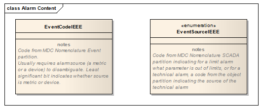

Figure B.8.5-1: Event Identification Facet (Informative)

*Source identification Facet*

For an event code corresponding with a metric alarm, this segment identifies the particular measurement that is the source of the alarm by its MDC nomenclature code in OBX-3 Observation Identifier. If it has a numeric value, it shall be in OBX-5 Observation Value, and if available the alarm range set in the device will be encoded in OBX-7 Reference Range.

For a technical alert, this facet specifies the subsystem that is the source of the event by its MDC object code in OBX-5 Observation Value, and by its dotted sub-ID notation according to the DEC specification for OBX-4 Observation Sub-ID.

*Event Phase Facet*

Each occurrence contains one of the following phase indications of the alert from the EventCurrentPhase enumeration:

Table B.8.5-4: Event Phase Coordinated Definitions

[width="100%",cols="22%,21%,57%",options="header",]
|===
|future assignment |assigned |definition
|tpoint | |time-point
|start |_START |start (of an interval event/alert) – an end is expected
|start_only | |start – continue and end are not to be expected
|continue | |continuation  (of an ongoing interval event/alert)
|end |_END |end  (of an interval event/alert)
|present | |event/alert is active at this time
|update | |Update
|escalate | |escalation of an ongoing alert/alarm
|inactivate | |Inactivation (e.g., silence)
|acknowledged | |Alert acknowledged at the source device
|deescalate | |de-escalation of an ongoing alert/alarm
|reset | |clear latched alarm
|stop |_STOP |pause an event/alert; could restart with same ID later
|update |_CHANGE |similar to CHANGED
|update |_CHANGED |similar to CHANGE
|update |_CLEARED |similar to _CHANGED, except implication that some aspect of the device has been cleared
|stop |_COMPL |last phase of a START_, (_STOP, _START)*, _COMPL sequence
|===

Values in the “Assigned” column are in the 11073 standard. “Future assignments” indicates values in common use not yet in the 11073 standard.

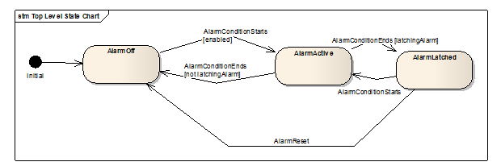

Figure B.8.5-2: Event Phase

The EventCurrentPhase identifies the state transition or state that the current alert message is indicating: a *_tpoint_* event is a time point event with no duration, a *_continue_* event indicates that this message does not represent a state transition but rather reports the continuation of an event that started at some previous time. An *_update_* indicates a change other than a state transition in a previously reported alert, such as a further change in an out-of-limit metric. The phases *_escalate_* and *_de-escalate_* represent changes in alert priority as assessed by the patient care device.

*State transitions*

A message representing an alert is sent aperiodically, when the alert undergoes a state transition that may be significant for notification (alert start, alert end, escalation or de-escalation of priority as evaluated by the alert source).

By site agreement, messages representing current state of alerts may optionally also be sent as alerts (Report Alert [PCD-04] transactions) at other times, as for example on a periodic timed basis, or when systems are restarted, or after a loss of communication is restored and a list of currently active alerts is sent out by the Alert Reporter (AR) Actor to refresh the Alert Manager (AM) Actor.

Additionally by site agreement, messages representing the last unacknowledged alert status updates from the Alert Manager (AM) Actor to the Alert Reporter (AR) Actor may optionally be sent as report alert status (Report Alert Status [PCD-05]) transactions at other times, as for example when systems are restarted, or after a loss of communication is restored and a list of unacknowledged report alert status transaction is sent out by the Alert Manager (AM) Actor to update the Alert Reporter (AR) Actor.

For these synchronization, recovery, or retransmission transactions the message content should be the same as the original transmission, including no indications of phase or state change from the original transmission, with the exception that the message transmission timestamp (MSH-7 Date/time of Message), the message control identifier (MSH-10 Message Control ID), and the message sequence number (MSH-13 Sequence Number), shall be instance unique to the retransmission and not the original transmission. This permits traceability and independent acknowledgement of the retransmission.

*Alert current state facet*

The value of the AlertState facet reflects whether the alert condition currently exists (inactive or active) or if the alert condition formerly existed, does not now exist, but is “latched” or held by the alert source so that caregivers may be notified of transient but significant conditions.

image:extracted-media-tf2/media/image40.emf[extracted-media-tf2/media/image40,width=623,height=258]

Figure B.8.5-3: Alert Current State

*Inactivation state facet*

The AlertInactivationState reflects the current state of the visual and aural alert indications at the alert source.

This may be empty. May contain the value 'enabled', meaning that both visual and aural alert indications are enabled at the device. May be repeated, to indicate separately the state of visual indications at the device by including zero or one of the values:

* alarm-paused
* alarm-off

and zero or one of the values:

* audio-paused
* audio-off

If neither 'alarm-paused' nor 'alarm-off' is included, the visual alarm indication is assumed to be enabled regardless of whether 'enabled' is also present.

If neither 'audio-paused' nor 'audio-off' is included, the aural alert indication is assumed to be enabled regardless of whether 'enabled' is also present.

If the optional state indication ‘acknowledged’ is included, it indicates that the alert has been acknowledged at the alert source device. This indication offers no assurance of a resolution time for the active alert. This is independent of ‘audio-paused’ and ‘audio-off’ and is a latched status indication until the alert ends.

*OBX-6 Units*

See HL7 2.6 Section 7.4.2.6 for further information.

For the DEV TF:

Condition predicate: If OBX-5 is populated with a numeric value then OBX-6 must contain an appropriate value. For Device Related if OBX-7 is being used for operating range then populate.

The units used should be in conformance with the Rosetta Terminology (see DEV TF-3 for further details and references). The preferred format is an MDC value, secondly a UCUM value.

*OBX-7 Reference Range*

For metric related segments, this should be used to provide the value ‘alarm’ ranges set with respect to the observed value metric in this OBX, although this is not strictly a reference range in the sense of the examples given in HL7.

For device related segments this may be used to provide the device measurement range capability – NOT the metric value ‘alarm’ ranges which shall be in the appropriate observed value metric OBX, as indicated above.

*OBX-8 Abnormal Flags*

This field can be used to provide zero or more codes (IS data type) to augment the interpretation of the observation. Codes beyond the first are included as repetitions (using the repetition separator character, the tilde ("~").

The following abbreviations in the OBX-8 Abnormality Flags field can be used to indicate the type of abnormality, its priority as indicated by the source patient care device, and whether it is a physiological alarm based on monitoring observations from the patient, or a technical alert indicating a condition of the patient care device and not the patient which nonetheless requires caregiver action.

Table B.8.5-5: Abnormal Flags, Abnormality Types

[width="100%",cols="51%,49%",options="header",]
|===
|Abnormality Type |Abbreviation
|Normal, not abnormal |N
|Below low normal |L
|Below lower panic limits |LL
|Above high normal |H
|Above higher panic limits |HH
|Abnormal (for non-numeric results) |A
|===

Correspondence between IEEE 11073-10201 MeasurementStatus and representation in Abnormal Flags Field

Table B.8.5-6: Measurement Status

[width="100%",cols="74%,14%,12%",options="header",]
|===
|MeasurementStatus ::= BITS-16 \{ ... } |OBX-8footnote:[The HL7 V2.6 IS data type is limited to 5 chars and so these mnemonics cannot be used. Although HL7 V2.7 replaces the IS datatype with the CWE datatype and longer mnemonics we need to restrict this to be compatible with HL7 V2.6 for now. OBX-8 can be a repeated field with ~ separators.] |OBX-11
|No bits set raw device measurement; measurement okay, has not been reviewed nor validated | |R
|invalid(0), |INV |X
|questionable(1), |QUES |R
|not-available(2), |NAV |X
|calibration-ongoing(3), |CAL |R
|test-data(4), |TEST |R
|demo-data(5), |DEMO |R
|validated-data(8), -- relevant, e.g., in an archive | |F
|early-indication(9), -- early estimate of value |EARLY |R
|msmt-ongoing(10), -- indicates that a new measurement is just being taken -- (episodic) |BUSY |X
|msmt-state-in-alarm(14), -- indicates that the metric has an active alarm condition |ALACT |R
|msmt-state-al-inhibited(15) -- metric supports alarming and alarms are turned off -- (optional) |ALINH |R
|===

Further details of missing or invalid data can be given with codes based on nullFlavors:

Table B.8.5-7: Missing or Invalid Data Codes for OBX-8

[width="100%",cols="62%,38%",options="header",]
|===
|Missing or Invalid Data Type |Code
|No information |NI
|Not applicable, no proper value |NA
|Temporarily not available. Information is not available at this time, but it is expected that it will be available later. |NAV
|Numeric measurement function is available but has been deactivated by user. |OFF
|Masked (as for security) |MSK
|value not in domain |OTH
|Not a number |NAN
|Positive infinity |PINF
|Negative infinity |NINF
|===

This is a repeatable field and values from the above tables may be combined by entering them as repetitions of the field, for example, a field value of 'H~PH~SP' would signify a physiological measurement with an abnormally high value, constituting a high priority alert condition.

*OBX-8 Abnormal Flags in PCD-04 and other Alert Communications transactions*

The following abbreviations in the OBX-8 Abnormality Flags field can be used to indicate the type of abnormality, its priority as indicated by the alert source, and whether the alert is a physiological alarm based on monitoring observations from the patient, or a technical alarm indicating a condition of the patient care device and not the patient which nonetheless requires caregiver action, an advisory, or a combination if simultaneous.

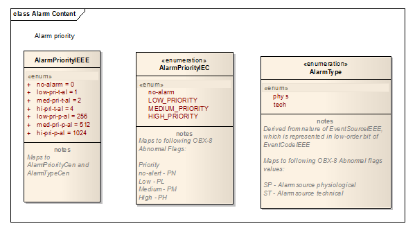

Alarm Priority and Type (Informative)

Table B.8.5-8: Abnormal Flags, Alert Priority

[width="100%",cols="51%,49%",options="header",]
|===
|Alert Priority |Abbreviation
|no-alarm |PN
|low priority |PL
|medium priority |PM
|high priority |PH
|===

Table B.8.5-9: Abnormal Flags, Alert Source

[width="100%",cols="51%,49%",options="header",]
|===
|Alert Source |Abbreviation
|alarm – physiological |SP
|alarm – technical |ST
|advisory |SA
|===

This is a repeatable field and values from the above table may be combined by entering them as repetitions of the field, for example, a field value of 'H~PH~SP' would signify a physiological measurement with an abnormally high value, constituting an alert that is a high priority physiological alarm condition. These values shall be recorded in the OBX-8 field of the OBX segment occurrence associated with the OBX segment identified by the Facet value (1) associated with Event Identification.

Table B.8.5-10: 11073-10201 AlertType to OBX-8 Abnormal Flags mappings

[width="100%",cols="51%,49%",options="header",]
|===
|Alert Type |OBX-8 Value
|no-alert |PN
|low-pri-t-al |PL~ST
|med-pri-t-al |PM~ST
|hi-pri-t-al |PH~ST
|low-pri-p-al |PL~SP
|med-pri-p-al |PM~SP
|hi-pri-p-al |PH~SP
|===

*OBX-11 Observation Result Status*

This field should be filled according to HL7 Table 0085 described in Chapter 7 of HL7. For the IHE DEV TF, the possible values for this field for this profile are shown in Table B.8-7: HL7 Table 0085 selected values. The value of X is used for device related segments where OBX-7 is not used to express the device measurement range capability. Certain values of OBX-8 Abnormal Flags are semantically linked to OBX-11 Observation Results Status; see the table under OBX-8 for these cases.

Table B.8.5-11: HL7 Table 0085 selected values

[width="100%",cols="19%,28%,53%",options="header",]
|===
|Value |Description |Comment
|C |Record coming over is a correction and thus replaces a final result |
|D |Deletes the OBX record |
|F |Final results; Can only be changed with a corrected result. |
|P |Preliminary results |
|R |Results entered -- not verified |
|S |Partial results |
|U |Results status change to final without retransmitting results already sent as ‘preliminary.’ |
|W |Post original as wrong, e.g., transmitted for wrong patient |
|X |Results cannot be obtained for this observation |
|===

==== B.8.6 OBX-11 Observation Result Status in Report Alert [PCD-04]

The field shall be populated with the result status of the Report Alert transaction. Once a Report Alert transaction is sent it is by definition final, not held for later revision, and given that state and status of indications are updated through additional Report Alert transactions specific to the ACM Profile the only possible value is “F” indicating final.

*OBX-14 Date/Time of the Observation:*

If this field is present in a 'metric' observation, its value overrides the time stamp in OBR-7. This should only be populated to signal an episodic observation such as noninvasive blood pressure. For periodically sampled observations where the time stamp for all observations in the message is the same and is given in OBR-7, OBX-14 should not be populated. See also Appendix Section 0 B.8.7 Time Stamps and Time Synchronization for a general discussion of time stamps in IHE PCD messages.

This implies that time stamp may be 'inherited' from the OBR, which is in effect a higher-level grouping element for the OBX segments it contains (i.e., that form part of the same ORDER_OBSERVATION segment group), unless the time stamp is overridden. In a similar way, an OBX segment applying to a higher level in the MDS-VMD-channel-metric hierarchy establishes a default time stamp for its contained lower-level elements unless overridden by associating a time stamp with the lower-level element. So metric observations get their time stamps from their nearest 'ancestor' which has a time stamp in OBX-14 unless they have a time stamp of their own in OBX-14. Channel-level OBXs with filled OBX-14 fields establish a default time stamp for their contained metric observations.

For the DEV TF the value is the same as OBX-19 Date/Time of the Analysis, but should be used in preference to OBX-19 if time of the particular observation is relevant and is different than OBR-7 (that is, in the case of an episodic observation). The OBX-14 time stamp may be duplicated in OBX-19 if local needs dictate.

*OBX-16 Responsible Observer*

For the DEV TF:

The identifier values for the Operator ID field may null, if unknown or unspecified at the sending device.

Table B.8.6-1: Extended composite ID number and name for persons

[width="100%",cols="12%,9%,9%,11%,15%,10%,34%",options="header",]
|===
|SEQ |LEN |DT |Usage |Card. |TBL# |Component name
|1 |15 |ST |R |[1.1] | |ID Number
|2 |194 |FN |RE |[0..1] | |Family Name
|3 |30 |ST |RE |[0..1] | |Given Name
|===

*OBX-17 Observation Method*

For metric related segments observation methods are in many cases implicit in device related MDC Ref_ID/codes; use of OBX17 is superfluous if given there. However, if observation method is needed and no device detail is shown then the method shall be given here.

The preferred format is an MDC value, secondly a LOINC value.

This field is repeatable and may be used with multiple coded elements to reflect different aspects of the methods used to make an observation (for example, an episodic as opposed to continuous, periodic measurement for, say, cardiac output).

The observation may be identified as to whether it is measured, calculated, or a setting, using these codes based on IEEE 11073 MetricCategory:

Table B.8.6-2: MetricCategory Codes

[width="100%",cols="64%,36%",options="header",]
|===
|MetricCategory ::= BITS-16 \{ ... } |OBX-17
|mcat-unspec(0), |UNSPEC^mcat-unspec^MDC
|auto-measurement(1), |AMEAS^auto-measurement^MDC
|manual-measurement(2), |MMEAS^manual-measurement^MDC
|auto-setting(3), |ASET^auto-setting^MDC
|manual-setting(4), |MSET^manual-setting^MDC
|auto-calculation(5), |ACALC^auto-calculation^MDC
|manual-calculation(6), -- relevant, e.g., in an archive |MCALC^manual-calculation^MDC
|===

This field can convey the distinction between measurements (AMEAS or MMEAS) settings (MMEAS or MSET), as well as whether the measurement or setting was initiated by an operator (MMEAS, as in an episodic measurement, MSET, as in a manual setting) or automatically, as in a periodic measurement (AMEAS).

If omitted, the default value is AMEAS.

The observation may provide additional information about the measure mode:

Table B.8.6-3: MeasureMode Codes

[width="100%",cols="64%,36%",options="header",]
|===
|MeasureMode |OBX-17
|mode-auscultatory-ref, +
mode-invasive-ref |AUSRFS^mode-auscultatory-ref^MDC, +
INVRFS^mode-invasive-ref^MDC
|===

The MeasureMode “mode-auscultatory-ref” and “mode-invasive-ref” indicates the reference measurement method / equipment used in clinical investigations for this observation. An example is the Non-invasive Blood Pressure (NBP) measurement. +
When none of the reference modes are specified in the OBX-17, the reference measurement method / equipment is either unknown, does not apply for this observation, or the measurement is not involved in a clinical investigation.

*OBX-18 Equipment Instance Identifier*

This field identifies the Equipment Instance (e.g., infusion pump, physiological monitor) responsible for the production of the observation. This is to provide specific traceability for the source of the observation, and so identification should identify the equipment at the lowest practical subsystem level where this applies: for example, the individual removable module in a physiological monitor. This allows an observation or a trouble indication to be traced to its source as specifically as possible.

Future implementation note: as of HL7 V2.7, this field is retained for backward compatibility only. This field will be represented through the PRT segment. Future versions of the IHE Devices Technical Framework will require the use of this segment, which will also provide for including the Unique Device Identification adopted by the U.S. F.D.A. and being considered by regulatory agencies in other jurisdictions.

For the DEV TF:

The preferred format is an EUI-64 Device ID. The Device Identifier should be globally unique.

Every device should be identified by a universally unique identifier in the format specified by IEEE for the EUI-64 identifier (e.g., "1234567890ABCDEF"). To allow the Observation Reporting interface to be employed with ‘legacy’ Devices, this field may also be populated by a combination of serial number, model, and manufacturer (see Section C.5 EI Data Type for details of how this may be done). If the EUI-64 identifier is available, it should be recorded in the ‘universal ID’ component of this field. If it is not available, the manufacturer’s unique device identifier (e.g., serial number) should be recorded in ‘Entity Identifier’ component (EI-1), with the model identification in the Namespace ID (EI-2), and the manufacturers identity in the universal ID (EI-3) using an OID or URI scheme (which should be identified in the universal ID type, EI-4).

Note that OBX-18 is repeatable, and HL7 suggests that where a hierarchical identification of the equipment is desired (e.g., module or VMD within Medical Device System) that the lowest-level equipment be sent first, followed by higher levels in succession.

A permissible optimization is to not send the full hierarchy with every observation, but rather the identification should be sent at the highest level of device related OBX possible: i.e., MDS, then VMD, and then Channel. Inheritance should be assumed, i.e., for multivalued results from the same Device, this field is required only in the first OBX segment.

For metric related data this field is not required – unless no device hierarchy, and therefore related OBXs, is being declared; in which case the device ID should be provided here if available. Inheritance should be assumed, i.e., for multivalued results from the same Device, this field is required only in the first OBX segment.

Device identifiers shall be reported in OBX-18, data type ‘EI’ (Entity Identifier), for the MDS level for PCD devices and DEV_SPEC_PROFILE for PHD devices.

Table B.8.6-4: HL7 Component Table - EI – Entity Identifier

[width="100%",cols="17%,11%,9%,12%,13%,38%",options="header",]
|===
|SEQ |LEN |DT |OPT |TBL# |COMPONENT NAME
|1 |199 |ST |R | |Entity Identifier
|2 |20 |IS |RE |0363 |Namespace ID
|3 |199 |ST |C | |Universal ID
|4 |6 |ID |C |0301 |Universal ID Type
|===

____
*Example 1: EUI-64*
____

This is the preferred and most concise representation of an EUI-64.

|0123456789ABCDEF^^0123456789ABCDEF^EUI-64|

____
*Example 2: Vendor-specific identifier string in OBX-18.1*
____

The EUI-64 form of identifier discussed above is required in production environments. In debug and test environments the following form of identifier is acceptable, and it may also be used if desired in addition to EUI-64 as a repeat of this field since OBX-18 is repeatable. All four OBX-18 components may be used to indicate a vendor-specific identifier string plus an identifier from HL7 Table 0301 - Universal ID type. Here EI-1 (Entity Identifier is the serial number of the equipment, EI-2 (Namespace ID) identifies the equipment model, EI-3 (Universal ID) identifies the manufacturer using a DNS domain name under the control of the manufacturer, and EI-4 (Universal ID Type) identifies the type of Universal ID contained in EI-3.

|123456^ICU_MONITOR^megacorp.com^DNS|.

See the discussion of the EI data type in Appendix C.5 for further details and examples.

*OBX-19 Date/Time of the Analysis*

Conditional Predicate: May be used if duplicate of OBX-14 is needed in this field by receiving system.

For the DEV TF use OBX-14 preferentially if device time is relevant. Information in OBX-14 may be duplicated here if local needs dictate.

*OBX-20 Observation Site*

Components: <Identifier (ST)> ^ <Text (ST)> ^ <Name of Coding System (ID)> ^ <Alternate Identifier (ST)> ^ <Alternate Text (ST)> ^ <Name of Alternate Coding System (ID)> ^ <Coding System Version ID (ST)> ^ <Alternate Coding System Version ID (ST)> ^ <Original Text (ST)>

Definition: This field typically contains the body site(s) where the measurement being reported was obtained. This field should not be used for a specimen source or specimen collection site.

This information is of particular importance if the clinical meaning of a value is modified either directly by the site (for example, is the temperature central or peripheral?) or if the site of one measurement impacts the value of another measurement (for example, is the finger SpO2 probe on the same arm as the NIBP cuff?). In most cases these observations are performed directly upon the patient and do not involve a specimen.

Any nationally recognized coding system might be used for this field including SNOMED or MDC; alternatively, the HL7 Table 0163 may be used. Veterinary medicine may choose the tables supported for the components of this field as decided by their industry.

==== B.8.7 Time Stamps and Time Synchronization

Medical device data observations conveyed by the IHE PCD DEC Technical Frameworks should where feasible use ‘consistent time’ for MSH-7, OBR-7, OBR-8 and OBX-14, where ‘consistent time’ is based on a known reference time source such as NTP or similar service. Since medical devices may use local clocks that are not synchronized to ‘consistent time’, a standardized representation for disclosing how the device time(s) were mapped to ‘consistent time’ is required to provide traceability between the two.

In order to facilitate the correlation of transmitted observations, each observation should contain a time stamp from a consistent, isochronous time-base, either by default reference to [OBR-7, OBR-8) or by an overriding value in OBX-14. Since many medical devices have only a sense of local time, and this local time may not be equivalent to the local time of the DOR, it is a responsibility of the DOR to ensure the reported times within an Observation Result message are consistent. This means that all observation times reported SHOULD be UTC, as indicated by including a time zone offset of +0000, but it is permissible to use local time with the required correct time zone offset included in the timestamp representation since this can readily be converted to UTC whatever the time zone of the receiving system. In order to preserve the original time marking provided by the device, the Observation Result message SHALL contain a synchronization time element such as MDC_ATTR_TIME_ABS at the Medical Device System level which discloses the device’s notion of time, as described in the following table. The DOR SHALL use this device time as the basis for correcting the timestamps from the device (for example, for OBX-14) to the DOR’s ‘consistent time’.

[width="99%",cols="6%,1%,2%,1%,2%,,2%,,14%,65%,7%",options="header",]
|===
| | | | | | | | |*Msg Segment* |*Description and comments* |*Status*
| | | | | | | | |MSH...... |*MSH-7* Date/Time of Message created/sent (DTM__~DOR~__) |M
| | | | | | | | |PID...... | |M
| | | | | | | | |OBR...... |[*OBR-7*, *OBR-8*) Default time interval for child OBXs (DTM__~DOR~__) |M
| | | | | | | | |OBX.. 0.0.0.1 |MDC_TIME_SYNC_PROTOCOL (time sync protocol used by the DOR) |O
| | | | | | | | |OBX.. 0.0.0.2 |MDC_TIME_ACCURACY (known or estimated accuracy of DOR time) |O
| | | | | | | | |*OBX.. 1* |*MDS for device #1* |M
| | | | | | | | |OBX.. 1.0.0.1 |MDC_TIME_CAP_STATE (BITS-16, using MdsTimeCapState) |O
| | | | | | | | |OBX.. 1.0.0.2 |MDC_TIME_SYNC_PROTOCOL (from nom-part-infrastructure) |O
| | | | | | | | |OBX.. 1.0.0.3 |MDC_TIME_SYNC_ACCURACY (device absolute time accuracy) |O
| | | | | | | | |OBX.. 1.0.0.4 |MDC_ATTR_TIME_ABS (*displayed* time) and *OBX-14* (DTM__~DOR~__) |C[multiblock footnote omitted]
| | | | | | | | |OBX.. 1.0.0.5 |MDC_ATTR_TIME_REL (*relative* time) and *OBX-14* (DTM__~DOR~__) |C
| | | | | | | | |OBX.. 1.0.0.6 |MDC_ATTR_TIME_HI_RES (*hi-res rel* time) and *OBX-14* (DTM__~DOR~__) |C
| | | | | | | | |OBX.. 1.0.0.7 |OBX-14 (DTM__~DOR~__, _optional_, overrides default (OBR-7, OBR-8] time interval |
| | | | | | | | |OBX.. 1.0.0.7.1 |OBX-14 |
| | | | | | | | |OBR...... |[*OBR-7*, *OBR-8*) Default time interval for child OBXs (DTM__~DOR~__) |M
| | | | | | | | |*OBX.. 2* |*MDS for device #2* |M
|===

Notes:

Status column gives Presence Qualifier, M: mandatory, O: option, C: conditional.

The dotted numbers represent the object hierarchy value of OBX-4 and are provided as example values only.

{empty}a. DTM__~DOR~__ is the datetime of the DOR, reported with an IHE PCD modification of the HL7 V2.6 ‘date/time’ data type differing in the specification of the time zone offset. See Appendix C.4 for details. A time stamp resolution of at least one second and a time zone offset are required, e.g., *YYYYMMDDHHMMSS*[.S[S[S[S**]]]]+/-ZZZZ** (required items shown in bold font).

{empty}b. Within the time scope of each OBR and the time interval expressed in [OBR-7, OBR-8), time discontinuities in the MDC_ATTR_TIME_ABS displayed time are prohibited. Discontinuities due to daylight savings or other clock adjustments require that data on the new displayed timeline shall be sent as a separate OBR.

{empty}c. The OBR establishes the default time context for all its child OBXs but can be overridden by a time stamp in OBX-14.

{empty}d. The time interval specified by [OBR-7, OBR-8) is a mathematically ‘closed’ interval for OBR-7 and ‘open’ for OBR-8. A datum that occurs exactly at the time specified by OBR-8 would be sent in the next time epoch. This allows subsequent OBR segments to represent a continuous sequence of time. For encoding a simple set of episodic measurement, if there is no logical "end" of the observation period, OBR-8 may be set to the message creation time to indicate the logical upper limit for the contained observations.

HL7 time stamps sent in MSH-7, OBR-7, OBR-8 and OBX-14 should in most situations be ‘consistent time’ based on NTP or any other reference time source that provides traceability to NTP when this is feasible. As a consequence, it is strongly encouraged that the gateway or application device (AHD) support synchronized time as an NTP or SNTP (or other time service) client so that it can (1) apply consistent time stamps to the data reported over the WAN interface and (2) provide a time synchronization service to the agents connected to it.

The MDC_ATTR_TIME_ABS (in OBX-3) observation provides traceability between the displayed time shown on the device, as a DTM datatype in OBX-5, and the corresponding gateway or AHD time reported in OBX-14.

The MDC_ATTR_TIME_REL and MDC_ATTR_TIME_HI_RES (in OBX-3) observations provide traceability between the relative or hi-resolution relative values, reported as an integer value in OBX-5, and the corresponding AHD time reported in OBX-14. The units-of-measure are s or ms, expressed as MDC units.

==== B.8.8 Device Time Synchronization Capabilities

OBX-2: CWE

OBX-3: 68219^MDC_TIME_CAP_STATE^MDC

OBX-5: Valid device time capabilities include (one or more):

Table B.8.8-1: OBX-5 Values for Device Time Synchronization Capabilities

[width="100%",cols="51%,49%",options="header",]
|===
|OBX-5 values (one or more ...) |Description
|<0 or 1>^mds-time-capab-real-time-clock(0), |device supports an internal RTC
|<0 or 1>^mds-time-capab-set-clock(1), |device supports Set Time Action
|<0 or 1>^mds-time-capab-relative-time(2), |device supports RelativeTime
|<0 or 1>^mds-time-capab-high-res-relative-time(3), |device supports HighResRelativeTime
|<0 or 1>^mds-time-capab-sync-abs-time(4), |device syncs AbsoluteTime
|<0 or 1>^mds-time-capab-sync-rel-time(5), |device syncs RelativeTime
|<0 or 1>^mds-time-capab-sync-hi-res-relative-time(6), |device syncs HiResRelativeTime
|<0 or 1>^mds-time-state-abs-time-synced(8), |AbsoluteTime is synced
|<0 or 1>^mds-time-state-rel-time-synced(9), |RelativeTime is synced
|<0 or 1>^mds-time-state-hi-res-relative-time-synced(10), |HiResRelativeTime is synced
|<0 or 1>^mds-time-mgr-set-time(11) |manager is encouraged to set the time
|===

==== B.8.9 Device and/or DOR Synchronization Protocol 

Beyond the use of the MDC_ATTR_TIME_ABS, MDC_ATTR_TIME_REL, and MDC_ATTR_TIME_HI_RES time code observations, a DOR Device Observation Report MAY provide additional information about the device clocks, or its own clock, by communicating the MDC_TIME_SYNC_PROTOCOL of a given device.

OBX-2: CWE

OBX-3: 68220^MDC_TIME_SYNC_PROTOCOL^MDC

OBX-5: Valid synchronization profiles include (choice of one):

Table B.8.9-1: OBX-5 Values for Device and/or DOR Synchronization Protocol

[width="100%",cols="39%,36%,11%,14%",options="header",]
|===
|OBX-5 values (choice of one) |Synchronization Protocol |Part::Code |Default
|532224^MDC_TIME_SYNC_NONE^MDC |An uncalibrated and unsynchronized local clock source |8::7936 |± 300 s (5 min)
|––––––^MDC_TIME_SYNC_EBWW^MDC |A manually set time, by ‘eyeball and wristwatch’footnote:[The ‘EBWW’ code was defined in ISO/IEEE 11073-30200, indicating a local time-of-day clock that was manually set by the ‘eyeball and wristwatch’ method.] |–:–––– |± 120 s (2 min)
|532225^MDC_TIME_SYNC_NTPV3^MDC |Network Time Protocol Version 3.0 (RFC1305) |8::7937 |calculate
|532226^MDC_TIME_SYNC_NTPV4^MDC |Network Time Protocol Version 4.0 (under dev) |8::7938 |calculate
|532227^MDC_TIME_SYNC_SNTPV4^MDC |Simple Network Time Protocol v4 (RFC2030) |8::7939 |estimate
|532228^MDC_TIME_SYNC_SNTPV4330^MDC |Simple Network Time Protocol v4 (RFC4330) |8::7940 |estimate
|532229^MDC_TIME_SYNC_BTV1^MDC |Bluetooth Medical Device Profile |8::7941 |not absolutefootnote:[The synchronization accuracy of the Bluetooth BTV1 clock to an absolute time reference should be reported using MDC_ATTR_TIME_HI_RES, and OBX-5 should contain the value of the BTV1 clock.]
|––––––^MDC_TIME_SYNC_NCK^MDC |HL7 V2 ‘NCK’ System Clock Segment in NMD msg |–:–––– |+ 5 s, - 0 s
|––––––^MDC_TIME_SYNC_GPS^MDC |Global Positioning Service (GPS) |–:–––– |calculate
|===

=== B.9 ORC – Common Order Segment

In [PCD-03], the Common Order segment (ORC) is used to transmit fields that are common to all orders (all types of services that are requested). In [PCD-01], ORC segments are not sent.

Table B.9-1: HL7 Attribute Table – ORC – Common Order

[width="100%",cols="14%,12%,11%,13%,10%,9%,31%",options="header",]
|===
|SEQ |LEN |DT |Usage |Card. |TBL# |ELEMENT NAME
|1 |2 |ID |R |[1..1] |0119 |Order Control
|2 |427 |EI |R |[1..1] | |Placer Order Number
|3 |427 |EI |X |[0..0] | |Filler Order Number
|4 |22 |EI |RE |[0..1] | |Placer Group Number
|5 |2 |ID |RE |[0..1] |0038 |Order Status
|6 |1 |ID |RE |[0..1] |0121 |Response Flag
|7 |705 |TQ |X |[0..0] | |Quantity/Timing
|8 |200 |EIP |RE |[0..1] | |Parent
|9 |24 |DTM |R |[1..1] | |Date/Time of Transaction
|10 |3220 |XCN |RE |[0..*] | |Entered By
|11 |250 |XCN |RE |[0..*] | |Verified By
|12 |3220 |XCN |RE |[0..*] | |Ordering Provider
|13 |80 |PL |RE |[0..1] | |Enterer's Location
|14 |250 |XTN |RE |[0..2] | |Call Back Phone Number
|15 |24 |DTM |RE |[0..1] | |Order Effective Date/Time
|16 |705 |CWE |RE |[0..1] | |Order Control Code Reason
|17 |705 |CWE |RE |[0..1] | |Entering Organization
|18 |705 |CWE |RE |[0..1] | |Entering Device
|19 |705 |XCN |R |[1..1] | |Action By
|20 |705 |CWE |RE |[0..1] |0339 |Advanced Beneficiary Notice Code
|21 |250 |XON |RE |[0..*] | |Ordering Facility Name
|22 |250 |XAD |RE |[0..*] | |Ordering Facility Address
|23 |250 |XTN |RE |[0..*] | |Ordering Facility Phone Number
|24 |250 |XAD |RE |[0..*] | |Ordering Provider Address
|25 |705 |CWE |RE |[0..1] | |Order Status Modifier
|26 |60 |CWE |RE |[0..1] |0552 |Advanced Beneficiary Notice Override Reason
|27 |24 |DTM |RE |[0..1] | |Filler's Expected Availability Date/Time
|28 |705 |CWE |RE |[0..1] |0177 |Confidentiality Code
|29 |705 |CWE |RE |[0..1] |0482 |Order Type
|30 |705 |CNE |RE |[0..1] |0483 |Enterer Authorization Mode
|===

The following describes the IHE PCD usage of those fields which have a usage other than X in the above table.

*ORC-1 Order Control*

Definition: Determines the function of the order segment. The DEV TF requires that this field be valued as RE, XO, or CH according to the table below when the RGV^O15^RGV_O15 Pharmacy/Treatment Give Message is used to send information from the Infusion Order Programmer (IOP) to the Infusion Order Consumer (IOC).

[width="100%",cols="25%,75%",options="header",]
|===
|ORC-1 Value |Use
|RE |Start of a new bag, bottle, or container
|XO |Change of dose or rate on a currently programmed infusion (not valid for PCA)
|CH |Program a bolus from an existing infusion
|===

*ORC-2 Placer Order Number*

Definition: This field contains either the pharmacy system order number, the BPOC system order ID, or the BPOC administration event ID. This field is a case of the Entity Identifier data type. The first component required is a string that identifies an individual order (e.g., OBR). It is assigned by the placer (ordering application). It identifies an order uniquely among all orders from a particular ordering application. The second through fourth components contain the application ID of the placing application in the same form as the HD data type. The second component, namespace ID, is a user-defined coded value that will be uniquely associated with an application. A given institution or group of intercommunicating institutions should establish a unique list of applications that may be potential placers and fillers and assign unique application IDs. The components are separated by component delimiters.

See Appendix C.5, "EI Data Type" for further information.

See HL7 V2.6 Section 7.4.1.2 for details. This field is required for [PCD-03].

*ORC-3 Filler Order Number*

Components: <Entity Identifier (ST)> ^ <Namespace ID (IS)> ^ <Universal ID (ST)> ^ <Universal ID Type (ID)>

See HL7 V2.6 Section 4.5.1.3 for details. The DEV TF does not further constrain this field.

*ORC-4 Placer Group Number*

See HL7 V2.6 Section 4.5.1.4 for details. The DEV TF does not further constrain this field.

*ORC-5 Order Status*

See HL7 V2.6 Section 4.5.1.5 for details. The DEV TF does not further constrain this field.

*ORC-6 Response Flag*

See HL7 V2.6 Section 4.5.1.6 for details. The DEV TF does not further constrain this field.

*ORC-8 Parent (EIP) 00222*

Components: <Placer Assigned Identifier (EI)> ^ <Filler Assigned Identifier (EI)>

Subcomponents for Placer Assigned Identifier (EI): <Entity Identifier (ST)> & <Namespace ID (IS)> & <Universal ID (ST)> & <Universal ID Type (ID)>

Subcomponents for Filler Assigned Identifier (EI): <Entity Identifier (ST)> & <Namespace ID (IS)> & <Universal ID (ST)> & <Universal ID Type (ID)>

Definition: This field relates a child to its parent when a parent-child relationship exists. The parent-child mechanism is described under _HL7 Table 0119 - Order control codes_ .

The first component has the same format as ORC-2-placer order number (Section _4.5.1.2,_ "_Placer Order Number_ (EI) 00216"). The second component has the same format as ORC-3-filler order number 4.5.1.3Filler Order Number (Section , "(EI) 00217"). The components of the placer order number and the filler order number are transmitted in sub-components of the two components of this field.

ORC-8-parent is the same as OBR-29-parent. If the parent is not present in the ORC, it must be present in the associated OBR. (This rule is the same for other identical fields in the ORC and OBR and promotes upward and ASTM compatibility.) This is particularly important when results are transmitted in an ORU message. In this case, the ORC is not required, and the identifying filler order number must be present in the OBR segments.

*ORC-9 Date/Time of Transaction*

The time in this field should be the time the clinician initiated the program request, not the time the IOP generated the message. The IOC may use this field to determine if the request is stale or too old.

See HL7 V2.6 Section 4.5.1.9 for details. The DEV TF does not further constrain this field.

*ORC-10 Entered By*

See HL7 V2.6 Section 4.5.1.10 for details. The DEV TF does not further constrain this field

*ORC-11 Verified By*

See HL7 V2.6 Section 4.5.1.11 for details. The DEV TF does not further constrain this field.

*ORC-12 Ordering Provider*

See HL7 V2.6 Section 4.5.1.12 for details. The DEV TF does not further constrain this field.

*ORC-13 Enterer's Location*

See HL7 V2.6 Section 4.5.1.13 for details. The DEV TF does not further constrain this field.

*ORC-14 Call Back Phone Number*

See HL7 V2.6 Section 4.5.1.14 for details. The DEV TF does not further constrain this field.

*ORC-15 Order Effective Date/Time*

See HL7 V2.6 Section 4.5.1.15 for details. The DEV TF does not further constrain this field.

*ORC-16 Order Control Code Reason*

See HL7 V2.6 Section 4.5.1.16 for details. The DEV TF does not further constrain this field.

*ORC-17 Entering Organization*

See HL7 V2.6 Section 4.5.1.17 for details. The DEV TF does not further constrain this field.

*ORC-18 Entering Device*

See HL7 V2.6 Section 4.5.1.18 for details. The DEV TF does not further constrain this field.

*ORC-19 Action By*

Components: <ID Number (ST)> ^ <Family Name (FN)> ^ <Given Name (ST)> ^ <Second and Further Given Names or Initials Thereof (ST)> ^ <Suffix (e.g., JR or III) (ST)> ^ <Prefix (e.g., DR) (ST)> ^ <DEPRECATED-Degree (e.g., MD) (IS)> ^ <Source Table (IS)> ^ <Assigning Authority (HD)> ^ <Name Type Code (ID)> ^ <Identifier Check Digit (ST)> ^ <Check Digit Scheme (ID)> ^ <Identifier Type Code (ID)> ^ <Assigning Facility (HD)> ^ <Name Representation Code (ID)> ^ <Name Context (CWE)> ^ <DEPRECATED-Name Validity Range (DR)> ^ <Name Assembly Order (ID)> ^ <Effective Date (DTM)> ^ <Expiration Date (DTM)> ^ <Professional Suffix (ST)> ^ <Assigning Jurisdiction (CWE)> ^ <Assigning Agency or Department (CWE)>

Definition: This field contains the identity of the caregiver who initiated the event.

Subfield XCN-1 "ID number" is required for each identifier.

*ORC-20 Advanced Beneficiary Notice Code*

See HL7 V2.6 Section 4.5.1.20 for details. The DEV TF does not further constrain this field.

*ORC-21 Ordering Facility Name*

See HL7 V2.6 Section 4.5.1.21 for details. The DEV TF does not further constrain this field.

*ORC-22 Ordering Facility Address*

See HL7 V2.6 Section 4.5.1.22 for details. The DEV TF does not further constrain this field.

*ORC-23 Ordering Facility Phone Number*

See HL7 V2.6 Section 4.5.1.23 for details. The DEV TF does not further constrain this field.

*ORC-24 Ordering Provider Address*

See HL7 V2.6 Section 4.5.1.24 for details. The DEV TF does not further constrain this field.

*ORC-25 Order Status Modifier*

See HL7 V2.6 Section 4.5.1.25 for details. The DEV TF does not further constrain this field.

*ORC-26 Advanced Beneficiary Notice Override Reason*

See HL7 V2.6 Section 4.5.1.26 for details. The DEV TF does not further constrain this field.

*ORC-27 Filler's Expected Availability Date/Time*

See HL7 V2.6 Section 4.5.1.27 for details. The DEV TF does not further constrain this field.

*ORC–28 Confidentiality Code*

See HL7 V2.6 Section 4.5.1.28 for details. The DEV TF does not further constrain this field.

*ORC–29 Order Type*

See HL7 V2.6 Section 4.5.1.29 for details. The DEV TF does not further constrain this field.

*ORC–30 Enterer Authorization Mode*

See HL7 V2.6 Section 4.5.1.30 for details. The DEV TF does not further constrain this field.

==== B.9.1 ORC Observation Control Segment in ACM Transaction [PCD-04]

This segment is optionally used to convey order request information for alerts involving notification of order request or order result. In addition, this segment may allow the association of the completed observation results reported in OBX segments with a particular previous order request.

Table B.9.1-1: HL7 Attribute Table – ORC – Observation Control

[width="100%",cols="13%,9%,8%,9%,9%,10%,42%",options="header",]
|===
|SEQ |LEN |DT |OPT |RP/# |TBL# |ELEMENT NAME
|2 |22 |EI |O | | |Placer Order Number
|12 |250 |XCN |O |Y | |Ordering Provider
|14 |250 |XTN |O |Y/2 | |Call Back Phone Number
|===

*ORC-2 Placer Order Number (EI) 00216*

This field is the placer application's order number.

*ORC-12 Ordering Provider (XCN) 00226*

This field contains the identity of the person who is responsible for creating the request (i.e., ordering physician). ORC-12-ordering provider is the same as OBR-16-ordering provider. If the ordering provider is not present in the ORC, it may be present in the associated OBR. This is particularly important when results are transmitted in an ORU message. In this case, the ORC is not required, and the identifying filler order number may be present in the OBR segment.

*ORC-14 Call Back Phone Number (XTN) 00228*

This field contains the telephone number to call for clarification of a request or other information regarding the order. ORC-14-call back phone number is the same as OBR-17-order callback phone number. If the structure of the telephony dial string is not known then the call back number should be in the Unformatted Telephone number (ST) component of the field.

==== B.9.2 ORC Observation Control Segment in PIV Application Acknowledgment (RRG^O16^RRG_O16 Pharmacy/Treatment Give Acknowledgement)

In the PIV application acknowledgement, this segment is optionally used by the IOC to contain the order number and other information that is provided in the PCD-03 message.

Table B.9.2-1: HL7 Attribute Table – ORC – Observation Control

[width="100%",cols="11%,10%,9%,9%,11%,11%,39%",options="header",]
|===
|SEQ |LEN |DT |OPT |RP/# |TBL# |ELEMENT NAME
|2 |22 |EI |R |[1..1] | |Placer Order Number
|9 |24 |DTM |O |[0..1] | |Date/Time of Transaction
|19 |705 |XCN |O |[0..1] | |Action By
|===

*ORC-2 Placer Order Number (EI) 00216*

This field is the placer application's order number.

*ORC-9 Date/Time of Transaction*

The time in this field should be the time the clinician initiated the program request, not the time the IOP generated the message. The IOC may use this field to determine if the request is stale or too old.

See HL7 V2.6 Section 4.5.1.9 for details. The DEV TF does not further constrain this field.

*ORC-19 Action By*

Components: <ID Number (ST)> ^ <Family Name (FN)> ^ <Given Name (ST)> ^ <Second and Further Given Names or Initials Thereof (ST)> ^ <Suffix (e.g., JR or III) (ST)> ^ <Prefix (e.g., DR) (ST)> ^ <DEPRECATED-Degree (e.g., MD) (IS)> ^ <Source Table (IS)> ^ <Assigning Authority (HD)> ^ <Name Type Code (ID)> ^ <Identifier Check Digit (ST)> ^ <Check Digit Scheme (ID)> ^ <Identifier Type Code (ID)> ^ <Assigning Facility (HD)> ^ <Name Representation Code (ID)> ^ <Name Context (CWE)> ^ <DEPRECATED-Name Validity Range (DR)> ^ <Name Assembly Order (ID)> ^ <Effective Date (DTM)> ^ <Expiration Date (DTM)> ^ <Professional Suffix (ST)> ^ <Assigning Jurisdiction (CWE)> ^ <Assigning Agency or Department (CWE)>

Definition: This field contains the identity of the caregiver who initiated the event.

Subfield XCN-1 "ID number" is required for each identifier.

=== B.10 PRT Participation Information Segment

The PRT section is currently prescribed only in certain transitions in the ACM Profile, as follows. In the future, it may be used to contain identifying information from the Unique Device Identification pattern of the US FDA. (see Section B.10.3).

The Participation Information segment contains the data necessary to add, update, correct, and delete from the record persons, organizations, or locations (participants) participating in the activity being transmitted.

The hierarchical positional location of the PRT segment within the HL7 message indicates the relationship. When the segment is used following the OBR segment, then the participations relate to the relevant participations in the observation.

The base version of HL7 for IHE PCD transactions is version 2.6. The PRT segment was not included in version 2.6, but rather was newly added in version 2.7 and extended significantly in version 2.8.2. To avoid unnecessary changes to other profiles, the IHE PCD Technical Committee determined that the base version would continue to be 2.6 for the present, but the PRT segment would draw on balloted later versions for needed semantics.

==== B.10.1 PRT Participation Information Segment in ACM Transaction [PCD-04]

A Report Alert [PCD-04] transaction can optionally contain multiple occurrences of the Participation Information (PRT) segment to indicate additional alert notification recipients in addition to any alert notification recipients identified internally by the Alert Manager (AM). Use of the PRT segment is an extraction from HL7 v2.8. However, segment optionality and repeat indications are specific to the PCD-04 message. There is one recipient per PRT segment occurrence. The group of PRT segments optionally identifying the additional recipients is in the PCD-04 message after the OBR segment identifying the alert and before any OBX observation segments associated with the alert.

The content of a PRT segment shall resolve to an unambiguous single recipient, be it an identified person in PRT-5 or a communication endpoint device destination identified by its telecommunication address in PRT-15. If both PRT-5 and PRT-15 are populated the Alert Manager may send the alert notification to additional endpoint communication devices associated with the person identified in PRT-5.

*Use of OBX segment instance to filter PCD-05 transactions sent from AM to AR*

In an ACM Report Alert [PCD-04] transaction an optional instance of the OBX segment with an OBX-3 Observation Identifier indication of MDC_ATTR_ALERT_DISSEM_STATUS_FILTER provides for communication of a filter to constrain the types alert dissemination status update Report Alert Status [PCD-05] transactions sent by the Alert Manager (AM) Actor to the AR Actor in response to the Alert Manager (AM) Actor receiving Report Alert Dissemination Status [PCD-07] transactions from the Alert Communicator (AC) Actor. The value in OBX-5 Observation Value of the OBX instance is a recurrence of string data type values indicating the only alert dissemination status update Report Alert Status [PCD-05] transactions to be sent to the Alert Reporter (AR) Actor by the Alert Manager (AM) Actor. The string values used in the filter are defined the Participation (PRT) segment values of the Report Alert Status [PCD-05] transaction. If the OBX-5 Observation Value field is empty then no Report Alert Status [PCD-05] transactions will be sent to the Alert Reporter (AR) by the Alert Manager (AM) Actor in association with the carrying Report Alert [PCD-04] transaction. If there is no such indicating OBX segment instance in the Report Alert [PCD-04] transaction then the Alert Manager (AM) Actor is not filtered and may send as many types of alert status indcating Report Alert Status [PCD-05] transactions as defined for the deployed Alert Manager (AM) Actor.

Table B.10.1-1: HL7 Attribute Table – PRT – Participation Information

[width="100%",cols="12%,9%,9%,9%,9%,10%,42%",options="header",]
|===
|SEQ |LEN |DT |OPT |RP/# |TBL# |ELEMENT NAME
|1 |1..4 |EI |R |N | |Participation Instance ID
|2 |2..2 |ID |R | |0287 |Action Code
|3 | |CWE |O | | |Action Reason
|4 | |CEW |R | |0912 |Participation
|5 | |XCN |C |N | |Participation Person
|6 | |CWE |O | | |Participation Person Provider Type
|7 | |CWE |O | |0406 |Participation Organization Unit Type
|8 | |XON |O |N | |Participation Organization
|9 | |PL |O |N | |Participation Location
|10 | |EI |O |N | |Participation Device
|11 | |DTM |O | | |Participation Begin Date/Time (arrival Time)
|12 | |DTM |O | | |Participation End Date/Time (departure time)
|13 | |CWE |O | | |Participation Qualitative Duration
|14 | |XAD |O |N | |Participation Address
|15 | |XTN |C |N | |Participation Telecommunication Address
|===

*PRT-1 Participation Instance ID (EI) 02379*

This field contains a unique identifier of the specific participation record.

*PRT-2 Action Code (ID) 00816*

For the PCD-04 message this field shall contain the value AD indicating Add.

*PRT-3 Action Reason (CWE) 02380*

For the PCD-04 message this field is optional.

*PRT-4 Participation (CWE) 02381*

For [PCD-04] this field shall contain Alert Reporter indicating Alert Recipient. This is an addition to HL7 v2.8 Table 0912 specifically for the PCD-04 message such that PRT segment occurrences identifying alert recipients can be unambiguously identified for processing, independent of unrelated to alert processing PRT segments containing RCT (indicating Result Copies To).

*PRT-5 Participation Person (XCN) 02382*

This is the identification of the person that is the recipient of the alert notification. If this field is populated it shall unambiguously resolve to one person. If this field is populated and PRT-15 is not populated it presumes the Alert Manager will internally resolve the person to their currently assigned endpoint communication device or devices.

*PRT-6 Participation Person Provider Type (CWE) 02383*

For the PCD-04 message this field is optional.

*PRT-7 Participation Organization Unit Type (CWE) 02384*

For the PCD-04 message this field is optional.

*PRT-8 Participation Organization (XON) 02385*

For the PCD-04 message this field is optional.

*PRT-9 Participation Location (PL) 02386*

For the PCD-04 message this field is not used.

*PRT-10 Participation Device (EI) 02348*

For the PCD-04 message this field is not used.

*PRT-11 Participation Begin Date/Time (DTM) 02387*

For the PCD-04 message this field is not used.

*PRT-12 Participation End Date/Time (DTM) 02388*

For the PCD-04 message this field is not used.

*PRT-13 Participation Qualitative Duration (CWE) 02389*

For the PCD-04 message this field is not used.

*PRT-14 Participation Address (XAD) 02390*

For the PCD-04 message this field is not used.

*PRT-15 Participation Telecommunication Address (XTN) 02391*

This field optionally contains the telecommunication identification of the alert notification recipient’s telecommunication device (phone #, carrier and PIN, etc.). If this field is populated it shall unambiguously resolve to one endpoint communication device. If this field is not populated then PRT-5 Participation Person shall be populated, and it is presumed the Alert Manager will internally resolve the person to their currently assigned endpoint communication device or devices.

If the field value represents a telecommunications carrier identification and PIN reference, the carrier identification string goes in the fourth component Communication Address and the PIN string goes in the seventh component Local Number. If the field value represents a telephony dial string it can either be split into its XTN data type components or it can be a dial string in the twelfth component Unformatted Telephone number.

==== B.10.2 PRT Participation Information Segment in ACM Transaction [PCD-05]

A Report Alert Dissemination [PCD-05] transaction can optionally contain at most one occurrence of the Participation Information (PRT) segment to indicate the location associated with an alert notification dissemination status update, for example delivered or read receipt, or the location where an endpoint communication device operator response took place, for example accept or reject. Whether or not the Alert Manager (AM) includes this information in a PCD-05 transaction is dependent upon the AM Actor having a source for this information. The source can be either from the Alert Communicator (AC) Actor in PCD-07 Report Dissemination Alert Status transaction content or by the AM Actor integrating as a Medical Equipment Management (MEM) Location Services (LS) Location Observation Consumer (LOC) profile actor and receiving PCD-16 Report Location Observation (RLO) transactions and copying PRT segment information into the PCD-05. When location information is from a PCD-16 transaction it is the last known location which may not be the same location as would be provided in a PCD-07 transaction.

Use of the PRT segment is an extraction from HL7 v2.8 with field optionality and cardinality specific to the PCD-05 message.

Table B.10.2-1: HL7 Attribute Table – PRT – Participation Information

[width="100%",cols="12%,9%,9%,9%,9%,10%,42%",options="header",]
|===
|SEQ |LEN |DT |OPT |RP/# |TBL# |ELEMENT NAME
|1 |1..4 |EI |R |N | |Participation Instance ID
|2 |2..2 |ID |R | |0287 |Action Code
|3 | |CWE |R | | |Action Reason
|4 | |CEW |R | |0912 |Participation
|5 | |XCN |R |N | |Participation Person
|6 | |CWE |R | | |Participation Person Provider Type
|7 | |CWE |O | |0406 |Participation Organization Unit Type
|8 | |XON |O |N | |Participation Organization
|9 | |PL |CE |N | |Participation Location
|10 | |EI |O |N | |Participation Device
|11 | |DTM |R | | |Participation Begin Date/Time (arrival Time)
|12 | |DTM |O | | |Participation End Date/Time (departure time)
|13 | |CWE |O | | |Participation Qualitative Duration
|14 | |XAD |O |N | |Participation Address (postal address)
|15 | |XTN |C |N | |Participation Telecommunication Address
|===

*PRT-1 Participation Instance ID (EI) 02379*

This field contains a unique identifier of the specific participation record.

*PRT-2 Action Code (ID) 00816*

For the PCD-05 message this field shall contain the value AD indicating Add.

*PRT-3 Action Reason (CWE) 02380*

For the PCD-05 message the PRT-3.1 Action Reason – Identifier component _shall_ be populated with the string RESPONSE. For the PCD-05 message the PRT-3.2 Action Reason – Text component _shall_ be populated with a string value from the following table which correlates with values from the PCD-07 response status and shall be one of the following.

[width="100%",cols="37%,63%",options="header",]
|===
|PRT-3.2 value |PCD-07 response status
|RECEIVED |PCD-06 received and verified by ACM AC Actor
|UNDELIVERABLE |ACM AC Actor unable to deliver notification to endpoint communication device
|DELIVERED |ACM AC delivered notification to endpoint communication device
|READ |Application on endpoint communication device has presented the notification to the operator and the operator may have manually indicated read receipt
|CALLBACKSTART |Endpoint communication device telephony dial back started
|CALLBACKEND |Endpoint communication device telephony dial back ended
|ACCEPTED |Endpoint communication device operator has accepted responsibility for the alert
|ACCEPTEDPOSITIVE |Endpoint communication device operator has accepted responsibility for the alert and has indicated that the alert is actionable
|ACCEPTEDNOTRELEVANT |Endpoint communication device operator has accepted responsibility for the alert and has indicated it as not actionable
|ACCEPTEDFALSE |Endpoint communication device operator has accepted responsibility for the alert has indicated that it is not a true alert
|REJECTED |Endpoint communication device operator has declined responsibility for the alert
|CANCELLED |[reserved, not implemented]
|COMPLETED |Endpoint communication device operator has indicated completion of the clinical workflow step associated with the alert notification
|ACTIONURI a|
An actionURI provided in the PCD-06 associated with the PCD-07 has been activated (the endpoint device operator clicked on the provided link and therefore activated it) in which case PRT-3.2 _shall_ have three repeated occurrences.

The second occurrence – Identifier shall contain the string ACTIONURI. The – Text _shall_ contain the actionURL from the PCD-0

6.

The third occurrence – Identifier shall contain the string ACTIONURIPURPOSE. The – Text _shall_ contain the actionURIPurpose from the PCD-07

|===

PRT-3.3 Name of Coding System is IHE_PCD_ACM.

*PRT-4 Participation (CWE) 02381*

Identifier = ‘AAP” Alert Acknowledging Provider

Text = “Alert Acknowledging Provider”

*PRT-5 Participation Person (XCN) 02382*

This is the identification of the person that was the intended recipient of the alert notification as communicated by the values ParticipantName and ParticipantID. This may refer to a specific person or it may refer to a shift changed shared device or a display device or it may refer to a person or device known only to the AC Actor. If this field is populated it shall unambiguously resolve to one person. When this field is populated and PRT-15 is not populated it presumes the Alert Manager has internally resolved the person to their currently assigned endpoint communication device or devices.

*PRT-6 Participation Person Provider Type (CWE) 02383*

For the PCD-05 message this is STF-4 StaffType. For example, to encode a nurse as the type of provider person consider using

NURSE^Nurse^HL70182

If table HL70182 has not been loaded in the verification tool use “HL7nnnn”.

*PRT-7 Participation Organization Unit Type (CWE) 02384*

For the PCD-05 message this field is optional.

*PRT-8 Participation Organization (XON) 02385*

For the PCD-05 message this field is optional.

*PRT-9 Participation Location (PL) 02386*

For the PCD-05 message this field contains the location associated with the alert notification dissemination status update, where the alert dissemination status update took place, for example delivered or read, or where the endpoint communication device operator response took place, for example accept or reject.

*PRT-10 Participation Device (EI) 02348*

For the PCD-05 this is the world unique identification of the endpoint communication device and not of the alerting medical device.

*PRT-11 Participation Begin Date/Time (DTM) 02387*

For the PCD-05 this contains the reformatted for conformance timestamp from the underlying WCTP status update message of the PCD-07 transaction.

The syntax of WCTP timestamps and PCD (HL7) timestamps is not identical. Some reformatting is required to map the WCTP timestamp to a PCD timestamp.

*PRT-12 Participation End Date/Time (DTM) 02388*

For the PCD-05 message this field is not used.

*PRT-13 Participation Qualitative Duration (CWE) 02389*

For the PCD-05 message this field is not used.

*PRT-14 Participation Address (XAD) 02390*

For the PCD-05 message this field is optional. A value in this field may be useful if the endpoint communication device operator is accessing the communication device from outside the healthcare facility in which case the AC Actor may be able to optionally provide a value for the field in the form of an XAD data type conformant postal service address.

*PRT-15 Participation Telecommunication Address (XTN) 02391*

This field contains the telecommunication identification of the alert notification recipient’s telecommunication device (phone #, carrier and PIN, etc.) from the WCTP recipientID from the PCD-07 transaction. If this field is populated it shall unambiguously resolve to one endpoint communication device. If this field is not populated then PRT-5 Participation Person shall be populated, and it is presumed that the Alert Manager has internally resolved the person to their currently assigned endpoint communication device or devices.

If the field value represents a telecommunications carrier identification and PIN reference, the carrier identification string goes in the fourth component Communication Address and the PIN string goes in the seventh component Local Number. If the field value represents a telephony dial string it can either be split into its XTN data type components or it can be a dial string in the twelfth component Unformatted Telephone number.

Note that XTN.1 was withdrawn as of HL7 v2.6. The field value should be formatted as per the HL7 2.6 form of the XGN datatype and leave XTN.1 empty.

==== B.10.3 Future PRT segment use to support Unique Device Identifiers in the PCD Profiles

Because of the importance of the recently defined Unique Device Identifier from the US FDA, which was developed with extensive international consultation and is thus likely to be of international importance as well, the IHE PCD Technical Committee is preparing to enable the use of this device identification in addition to the IEEE EUI-64 it has previously prescribed for device identification. This relies on changes and additions to the PRT segment added in HL7 version 2.8.2. For the usage of PRT fields in ACM transactions PCD-04 and PCD-05, the instructions in sections B.10.01 (for PCD-04) and B.10.2 (for PCD-05) take precedence over this section in the case of conflict.

In future versions of this Technical Framework, the PRT segment will be used to convey device identification information formerly in the OBX-18 field of the OBX segment, which from V2.7 of HL7 is retained for backward compatibility only. The material discussed under PRT-10 and PRT-16-20 below covers semantics to support inclusion of the FDA Universal Device Identifier (UDI). The use of UDI is not yet required in this version of the Technical Framework but are expected to be required when the requirement is considered timely by the IHE PCD Technical and Planning Committees. In this revision, this information is informative only and this use of the PRI segment is not required in order to make a valid message in the current version of this Technical Framework. Implementers should take note and prepare to support this segment. Implementers should consider supporting this optional usage as soon as is practicable for them, to prepare for early testing. For a Device Observation Consumer, it is advisable as a first step to check at a minimum that the PRT segments are accepted without causing unexpected behavior or error messages even if they are not yet semantically processed.

Table B.10.3-1: HL7 Attribute Table - PRT – Participation Information

[width="100%",cols="17%,11%,10%,9%,9%,10%,34%",options="header",]
|===
|SEQ |LEN |DT |OPT |RP/# |TBL# |ELEMENT NAME
|1 |1..4 |EI |C |N | |Participation Instance ID
|2 |2..2 |ID |R | |file:///D:\Google%20Drive\01_IHE\00_DocumentPublication\PCD\2016-10\V282_Word\V282_CH02C_CodeTables.doc#HL70287[0287] |Action Code
|3 | |CWE |O | | |Action Reason
|4 | |CWE |R | |file:///D:\Google%20Drive\01_IHE\00_DocumentPublication\PCD\2016-10\V282_Word\V282_CH02C_CodeTables.doc#HL70912[0912] |Participation
|5 | |XCN |C |Y | |Participation Person
|6 | |CWE |C | | |Participation Person Provider Type
|7 | |CWE |C | |file:///D:\Google%20Drive\01_IHE\00_DocumentPublication\PCD\2016-10\V282_Word\V282_CH02C_CodeTables.doc#HL70406[0406] |Participant Organization Unit Type
|8 | |XON |C |Y | |Participation Organization
|9 | |PL |C |Y | |Participant Location
|10 | |EI |C |Y | |Participation Device
|11 | |DTM |O | | |Participation Begin Date/Time (arrival time)
|12 | |DTM |O | | |Participation End Date/Time (departure time)
|13 | |CWE |O | | |Participation Qualitative Duration
|14 | |XAD |C |Y | |Participation Address
|15 | |XTN |O |Y | |Participant Telecommunication Address
|16 | |EI |O | | |Participant Device Identifier
|17 | |DTM |O | | |Participant Device Manufacture Date
|18 | |DTM |O | | |Participant Device Expiry Date
|19 | |ST |O | | |Participant Device Lot Number
|20 | |ST |O | | |Participant Device Serial Number
|21 | |EI |O | | |Participant Device Donation Identification
|22 | |CNE |C | | |Participation Device Type
|===

*PRT-1 Participation Instance ID (EI) 02379*

Components:<Entity Identifier (ST)> ^ <Namespace ID (IS)> ^ <Universal ID (ST)> ^ <Universal ID Type (ID)>

Definition: This field contains a unique identifier of the specific participation record.

In the case of waypoints tracked for a shipment, it identifies the waypoint.

Condition: The identifier is required for traceability

*PRT-2 Action code (ID) 00816*

Definition: This field reveals the intent of the message. Refer to HL7 Table 0287 – Problem/goal action code HL7 Table 0287 – Problem/goal action code for valid values.

*PRT-3 Action Reason (CWE) 02380*

Components:<Identifier (ST)> ^ <Text (ST)> ^ <Name of Coding System (ID)> ^ <Alternate Identifier (ST)> ^ <Alternate Text (ST)> ^ <Name of Alternate Coding System (ID)> ^ <Coding System Version ID (ST)> ^ <Alternate Coding System Version ID (ST)> ^ <Original Text (ST)> ^ <Second Alternate Identifier (ST)> ^ <Second Alternate Text (ST)> ^ <Name of Second Alternate Coding System (ID)> ^ <Second Alternate Coding System Version ID (ST)> ^ <Coding System OID (ST)> ^ <Value Set OID (ST)> ^ <Value Set Version ID (DTM)> ^ <Alternate Coding System OID (ST)> ^ <Alternate Value Set OID (ST)> ^ <Alternate Value Set Version ID (DTM)> ^ <Second Alternate Coding System OID (ST)> ^ <Second Alternate Value Set OID (ST)> ^ <Second Alternate Value Set Version ID (DTM)>

Definition: This field indicates the reason why the person, organization, location, or device is assuming (or changing) the role (e.g., shift change, new primary nurse, etc.).

Table B.10.3-2: Communication Status Enumeration from Report Dissemination Alert Status PCD-07

[width="100%",cols="11%,23%,66%",options="header",]
|===
|Req. |Value for PRT-3-2 |Description
|R |Received |Received by Alert Communicator (AC)
|R |Undeliverable |Undeliverable to endpoint
|R |Delivered |Delivered to endpoint
|R |Read |Read at endpoint
|R |Accepted |Accepted by endpoint
|O |AcceptedPositive |Accepted by endpoint as true positive
|O |AcceptedNotRelevant |Accepted by endpoint as true positive however not clinically relevant
|O |AcceptedFalse |Accepted by endpoint as false positive
|R |Rejected |Rejected by endpoint
|O |Cancelled |Cancelled by endpoint (does not cancel at alert source)
|O |CancelledOther |Cancelled by other than endpoint (does not cancel alert at source)
|O |CallbackStart |Callback start at endpoint (start of telephony call to alert indicated destination)
|O |CallbackEnd |Callback end at endpoint (end of telephony call to alert indicated destination)
|===

*PRT-4 Participation (CWE) 02381*

Components:<Identifier (ST)> ^ <Text (ST)> ^ <Name of Coding System (ID)> ^ <Alternate Identifier (ST)> ^ <Alternate Text (ST)> ^ <Name of Alternate Coding System (ID)> ^ <Coding System Version ID (ST)> ^ <Alternate Coding System Version ID (ST)> ^ <Original Text (ST)> ^ <Second Alternate Identifier (ST)> ^ <Second Alternate Text (ST)> ^ <Name of Second Alternate Coding System (ID)> ^ <Second Alternate Coding System Version ID (ST)> ^ <Coding System OID (ST)> ^ <Value Set OID (ST)> ^ <Value Set Version ID (DTM)> ^ <Alternate Coding System OID (ST)> ^ <Alternate Value Set OID (ST)> ^ <Alternate Value Set Version ID (DTM)> ^ <Second Alternate Coding System OID (ST)> ^ <Second Alternate Value Set OID (ST)> ^ <Second Alternate Value Set Version ID (DTM)>

Definition: This field indicates the functional involvement with the activity being transmitted (e.g., Case Manager, Evaluator, Transcriber, Nurse Care Practitioner, Midwife, Physician Assistant, etc.). Refer to HL7 Table 917 for valid values.

Table B.10.3-3: HL7 Table 0912 - Participation

[width="100%",cols="16%,41%,43%",options="header",]
|===
|Value |Description |Used with
|AD |Admitting Provider |PV1-17 Admitting doctor
|AI |Assistant/Alternate Interpreter |
|AAP |Alert Acknowledging Provider |PCD ACM Report Alert Status [PCD-05]
|AP |Administering Provider |RXA-10 Administering Provider
|ARI |Assistant Result Interpreter |
|AT |Attending Provider |PV1-7 Attending doctor
|AUT |AUT Author/Event Initiator |ORC-19 Action By
|CP |Consulting Provider |
|DP |Dispensing Provider |RXD-10 Dispensing Provider
|EP |Entering Provider (probably not the same as transcriptionist?) |ORC-10 Entered By
|EQUIP |Equipment |
|FHCP |Family Health Care Professional |
|MDIR |Medical Director |OBX-25 Performing Organization Medical Director
|OP |Ordering Provider |ORC-12 Ordering Provider, OBR-16 Ordering Provider, RXO-14 Ordering Provider's DEA Number, RXE-13 Ordering Provider's DEA Number, ORC-24 Ordering Provider Address
|PB |Packed by |
|PH |Pharmacist (not sure how to dissect Pharmacist/Treatment Supplier's Verifier ID) |RXE-14 Pharmacist/Treatment Supplier's Verifier ID
|PI |Primary Interpreter |
|PO |Performing Organization |
|POMD |Performing Organization Medical Director |
|PP |Primary Care Provider |
|PRI |Principal Result Interpreter |
|RCT |Results Copies To |
|RO |Responsible Observer |OBX-16 Responsible Observer
|RP |Referring Provider |PV1-8 Referring doctor
|RT |Referred to Provider |
|SB |Send by |
|SC |Specimen Collector |OBR-10 Collector Identifier
|TN |Technician |
|TR |Transcriptionist |
|VP |Verifying Provider |ORC-11 Verified By
|VPS |Verifying Pharmaceutical Supplier (not sure how to dissect Pharmacist/Treatment Supplier's Verifier ID) |RXE-14 Pharmacist/Treatment Supplier's Verifier ID
|VTS |Verifying Treatment Supplier (not sure how to dissect Pharmacist/Treatment Supplier's Verifier ID) |RXE-14 Pharmacist/Treatment Supplier's Verifier ID
|WAY |Waypoint |
|WAYR |Waypoint Recipient |
|===

*PRT-5 Participation Person (XCN) 02382*

Components:<Person Identifier (ST)> ^ <Family Name (FN)> ^ <Given Name (ST)> ^ <Second and Further Given Names or Initials Thereof (ST)> ^ <Suffix (e.g., JR or III) (ST)> ^ <Prefix (e.g., DR) (ST)> ^ <WITHDRAWN Constituent> ^ <DEPRECATED-Source Table (CWE)> ^ <Assigning Authority (HD)> ^ <Name Type Code (ID)> ^ <Identifier Check Digit (ST)> ^ <Check Digit Scheme (ID)> ^ <Identifier Type Code (ID)> ^ <Assigning Facility (HD)> ^ <Name Representation Code (ID)> ^ <Name Context (CWE)> ^ <WITHDRAWN Constituent> ^ <Name Assembly Order (ID)> ^ <Effective Date (DTM)> ^ <Expiration Date (DTM)> ^ <Professional Suffix (ST)> ^ <Assigning Jurisdiction (CWE)> ^ <Assigning Agency or Department (CWE)> ^ <Security Check (ST)> ^ <Security Check Scheme (ID)>

Subcomponents for Family Name (FN): <Surname (ST)> & <Own Surname Prefix (ST)> & <Own Surname (ST)> & <Surname Prefix from Partner/Spouse (ST)> & <Surname from Partner/Spouse (ST)>

Subcomponents for Source Table (CWE): <Identifier (ST)> & <Text (ST)> & <Name of Coding System (ID)> & <Alternate Identifier (ST)> & <Alternate Text (ST)> & <Name of Alternate Coding System (ID)> & <Coding System Version ID (ST)> & <Alternate Coding System Version ID (ST)> & <Original Text (ST)> & <Second Alternate Identifier (ST)> & <Second Alternate Text (ST)> & <Name of Second Alternate Coding System (ID)> & <Second Alternate Coding System Version ID (ST)> & <Coding System OID (ST)> & <Value Set OID (ST)> & <Value Set Version ID (DTM)> & <Alternate Coding System OID (ST)> & <Alternate Value Set OID (ST)> & <Alternate Value Set Version ID (DTM)> & <Second Alternate Coding System OID (ST)> & <Second Alternate Value Set OID (ST)> & <Second Alternate Value Set Version ID (DTM)>

Subcomponents for Assigning Authority (HD): <Namespace ID (CWE)> & <Universal ID (ST)> & <Universal ID Type (ID)>

Subcomponents for Namespace ID (CWE): <Identifier (ST)> & <Text (ST)> & <Name of Coding System (ID)> & <Alternate Identifier (ST)> & <Alternate Text (ST)> & <Name of Alternate Coding System (ID)> & <Coding System Version ID (ST)> & <Alternate Coding System Version ID (ST)> & <Original Text (ST)> & <Second Alternate Identifier (ST)> & <Second Alternate Text (ST)> & <Name of Second Alternate Coding System (ID)> & <Second Alternate Coding System Version ID (ST)> & <Coding System OID (ST)> & <Value Set OID (ST)> & <Value Set Version ID (DTM)> & <Alternate Coding System OID (ST)> & <Alternate Value Set OID (ST)> & <Alternate Value Set Version ID (DTM)> & <Second Alternate Coding System OID (ST)> & <Second Alternate Value Set OID (ST)> & <Second Alternate Value Set Version ID (DTM)>

Subcomponents for Assigning Facility (HD): <Namespace ID (CWE)> & <Universal ID (ST)> & <Universal ID Type (ID)>

Subcomponents for Namespace ID (CWE): <Identifier (ST)> & <Text (ST)> & <Name of Coding System (ID)> & <Alternate Identifier (ST)> & <Alternate Text (ST)> & <Name of Alternate Coding System (ID)> & <Coding System Version ID (ST)> & <Alternate Coding System Version ID (ST)> & <Original Text (ST)> & <Second Alternate Identifier (ST)> & <Second Alternate Text (ST)> & <Name of Second Alternate Coding System (ID)> & <Second Alternate Coding System Version ID (ST)> & <Coding System OID (ST)> & <Value Set OID (ST)> & <Value Set Version ID (DTM)> & <Alternate Coding System OID (ST)> & <Alternate Value Set OID (ST)> & <Alternate Value Set Version ID (DTM)> & <Second Alternate Coding System OID (ST)> & <Second Alternate Value Set OID (ST)> & <Second Alternate Value Set Version ID (DTM)>

Subcomponents for Name Context (CWE): <Identifier (ST)> & <Text (ST)> & <Name of Coding System (ID)> & <Alternate Identifier (ST)> & <Alternate Text (ST)> & <Name of Alternate Coding System (ID)> & <Coding System Version ID (ST)> & <Alternate Coding System Version ID (ST)> & <Original Text (ST)> & <Second Alternate Identifier (ST)> & <Second Alternate Text (ST)> & <Name of Second Alternate Coding System (ID)> & <Second Alternate Coding System Version ID (ST)> & <Coding System OID (ST)> & <Value Set OID (ST)> & <Value Set Version ID (DTM)> & <Alternate Coding System OID (ST)> & <Alternate Value Set OID (ST)> & <Alternate Value Set Version ID (DTM)> & <Second Alternate Coding System OID (ST)> & <Second Alternate Value Set OID (ST)> & <Second Alternate Value Set Version ID (DTM)>

Subcomponents for Assigning Jurisdiction (CWE): <Identifier (ST)> & <Text (ST)> & <Name of Coding System (ID)> & <Alternate Identifier (ST)> & <Alternate Text (ST)> & <Name of Alternate Coding System (ID)> & <Coding System Version ID (ST)> & <Alternate Coding System Version ID (ST)> & <Original Text (ST)> & <Second Alternate Identifier (ST)> & <Second Alternate Text (ST)> & <Name of Second Alternate Coding System (ID)> & <Second Alternate Coding System Version ID (ST)> & <Coding System OID (ST)> & <Value Set OID (ST)> & <Value Set Version ID (DTM)> & <Alternate Coding System OID (ST)> & <Alternate Value Set OID (ST)> & <Alternate Value Set Version ID (DTM)> & <Second Alternate Coding System OID (ST)> & <Second Alternate Value Set OID (ST)> & <Second Alternate Value Set Version ID (DTM)>

Subcomponents for Assigning Agency or Department (CWE): <Identifier (ST)> & <Text (ST)> & <Name of Coding System (ID)> & <Alternate Identifier (ST)> & <Alternate Text (ST)> & <Name of Alternate Coding System (ID)> & <Coding System Version ID (ST)> & <Alternate Coding System Version ID (ST)> & <Original Text (ST)> & <Second Alternate Identifier (ST)> & <Second Alternate Text (ST)> & <Name of Second Alternate Coding System (ID)> & <Second Alternate Coding System Version ID (ST)> & <Coding System OID (ST)> & <Value Set OID (ST)> & <Value Set Version ID (DTM)> & <Alternate Coding System OID (ST)> & <Alternate Value Set OID (ST)> & <Alternate Value Set Version ID (DTM)> & <Second Alternate Coding System OID (ST)> & <Second Alternate Value Set OID (ST)> & <Second Alternate Value Set Version ID (DTM)>

Definition: This field contains the identity of the person who is represented in the participation that is being transmitted.

If this attribute repeats, all instances must represent the same person.

Condition: At least one of the Participation Person, Participation Organization, Participation Location, or Participation Device fields must be valued.

*PRT-6 Participation Person Provider Type (CWE) 02383*

Components:<Identifier (ST)> ^ <Text (ST)> ^ <Name of Coding System (ID)> ^ <Alternate Identifier (ST)> ^ <Alternate Text (ST)> ^ <Name of Alternate Coding System (ID)> ^ <Coding System Version ID (ST)> ^ <Alternate Coding System Version ID (ST)> ^ <Original Text (ST)> ^ <Second Alternate Identifier (ST)> ^ <Second Alternate Text (ST)> ^ <Name of Second Alternate Coding System (ID)> ^ <Second Alternate Coding System Version ID (ST)> ^ <Coding System OID (ST)> ^ <Value Set OID (ST)> ^ <Value Set Version ID (DTM)> ^ <Alternate Coding System OID (ST)> ^ <Alternate Value Set OID (ST)> ^ <Alternate Value Set Version ID (DTM)> ^ <Second Alternate Coding System OID (ST)> ^ <Second Alternate Value Set OID (ST)> ^ <Second Alternate Value Set Version ID (DTM)>

Definition: This field contains a code identifying the provider type for the participating person. This attribute correlates to the following master file attribute: STF-4 Staff Type. Coded values from the correlated master file table are used; the user defined master file table is used as the coding system for this attribute. For example, if you are using values from STF-2 Staff Type, the coding system would be HL70182 which is the table number for the user defined Staff Type table. This field is included in this segment to support international requirements. When ROL is used in an encounter message, it is not intended as a master file update.

Condition: This field may only be valued if PRT-5 Participation Person is valued.

*PRT-7 Participation Organization Unit Type (CWE) 02384*

Components:<Identifier (ST)> ^ <Text (ST)> ^ <Name of Coding System (ID)> ^ <Alternate Identifier (ST)> ^ <Alternate Text (ST)> ^ <Name of Alternate Coding System (ID)> ^ <Coding System Version ID (ST)> ^ <Alternate Coding System Version ID (ST)> ^ <Original Text (ST)> ^ <Second Alternate Identifier (ST)> ^ <Second Alternate Text (ST)> ^ <Name of Second Alternate Coding System (ID)> ^ <Second Alternate Coding System Version ID (ST)> ^ <Coding System OID (ST)> ^ <Value Set OID (ST)> ^ <Value Set Version ID (DTM)> ^ <Alternate Coding System OID (ST)> ^ <Alternate Value Set OID (ST)> ^ <Alternate Value Set Version ID (DTM)> ^ <Second Alternate Coding System OID (ST)> ^ <Second Alternate Value Set OID (ST)> ^ <Second Alternate Value Set Version ID (DTM)>

Definition: This field identifies the environment in which the participant acts in the role specified in PRT-3 Action Reason. In the case of a person, the environment is not the specialty for the provider. The specialty information for the provider is defined in the PRA segment.

This attribute is included in the PRT segment to allow communication of this data when the participant information may not have been communicated previously in a master file or to provide better context. Refer to _User-defined table 0406 - Organization unit type_. This field is included in this segment to support international requirements and is not intended as a master file update.

*T-8 Participation Organization (XON) 02385*

Components:<Organization Name (ST)> ^ <Organization Name Type Code (CWE)> ^ <WITHDRAWN Constituent> ^ <Identifier Check Digit (NM)> ^ <Check Digit Scheme (ID)> ^ <Assigning Authority (HD)> ^ <Identifier Type Code (ID)> ^ <Assigning Facility (HD)> ^ <Name Representation Code (ID)> ^ <Organization Identifier (ST)>

Subcomponents for Organization Name Type Code (CWE): <Identifier (ST)> & <Text (ST)> & <Name of Coding System (ID)> & <Alternate Identifier (ST)> & <Alternate Text (ST)> & <Name of Alternate Coding System (ID)> & <Coding System Version ID (ST)> & <Alternate Coding System Version ID (ST)> & <Original Text (ST)> & <Second Alternate Identifier (ST)> & <Second Alternate Text (ST)> & <Name of Second Alternate Coding System (ID)> & <Second Alternate Coding System Version ID (ST)> & <Coding System OID (ST)> & <Value Set OID (ST)> & <Value Set Version ID (DTM)> & <Alternate Coding System OID (ST)> & <Alternate Value Set OID (ST)> & <Alternate Value Set Version ID (DTM)> & <Second Alternate Coding System OID (ST)> & <Second Alternate Value Set OID (ST)> & <Second Alternate Value Set Version ID (DTM)>

Subcomponents for Assigning Authority (HD): <Namespace ID (CWE)> & <Universal ID (ST)> & <Universal ID Type (ID)>

Subcomponents for Namespace ID (CWE): <Identifier (ST)> & <Text (ST)> & <Name of Coding System (ID)> & <Alternate Identifier (ST)> & <Alternate Text (ST)> & <Name of Alternate Coding System (ID)> & <Coding System Version ID (ST)> & <Alternate Coding System Version ID (ST)> & <Original Text (ST)> & <Second Alternate Identifier (ST)> & <Second Alternate Text (ST)> & <Name of Second Alternate Coding System (ID)> & <Second Alternate Coding System Version ID (ST)> & <Coding System OID (ST)> & <Value Set OID (ST)> & <Value Set Version ID (DTM)> & <Alternate Coding System OID (ST)> & <Alternate Value Set OID (ST)> & <Alternate Value Set Version ID (DTM)> & <Second Alternate Coding System OID (ST)> & <Second Alternate Value Set OID (ST)> & <Second Alternate Value Set Version ID (DTM)>

Subcomponents for Assigning Facility (HD): <Namespace ID (CWE)> & <Universal ID (ST)> & <Universal ID Type (ID)>

Subcomponents for Namespace ID (CWE): <Identifier (ST)> & <Text (ST)> & <Name of Coding System (ID)> & <Alternate Identifier (ST)> & <Alternate Text (ST)> & <Name of Alternate Coding System (ID)> & <Coding System Version ID (ST)> & <Alternate Coding System Version ID (ST)> & <Original Text (ST)> & <Second Alternate Identifier (ST)> & <Second Alternate Text (ST)> & <Name of Second Alternate Coding System (ID)> & <Second Alternate Coding System Version ID (ST)> & <Coding System OID (ST)> & <Value Set OID (ST)> & <Value Set Version ID (DTM)> & <Alternate Coding System OID (ST)> & <Alternate Value Set OID (ST)> & <Alternate Value Set Version ID (DTM)> & <Second Alternate Coding System OID (ST)> & <Second Alternate Value Set OID (ST)> & <Second Alternate Value Set Version ID (DTM)>

Definition: The organization that is involved in the participation. If PRT-5 Participation Person is valued, it reflects the affiliation of the individual participating as identified in PRT-4 Participation. Otherwise, the organization is directly participating as identified in PRT-4 Participation.

If this attribute repeats, all instances must represent the same organization.

Condition: At least one of the Participation Person, Participation Organization, Participation Location, or Participation Device fields must be valued.

*PRT-9 Participation Location (PL) 02386*

Components:<Point of Care (HD)> ^ <Room (HD)> ^ <Bed (HD)> ^ <Facility (HD)> ^ <Location Status (IS)> ^ <Person Location Type (IS)> ^ <Building (HD)> ^ <Floor (HD)> ^ <Location Description (ST)> ^ <Comprehensive Location Identifier (EI)> ^ <Assigning Authority for Location (HD)>

Subcomponents for Point of Care (HD): <Namespace ID (CWE)> & <Universal ID (ST)> & <Universal ID Type (ID)>

Subcomponents for Namespace ID (CWE): <Identifier (ST)> & <Text (ST)> & <Name of Coding System (ID)> & <Alternate Identifier (ST)> & <Alternate Text (ST)> & <Name of Alternate Coding System (ID)> & <Coding System Version ID (ST)> & <Alternate Coding System Version ID (ST)> & <Original Text (ST)> & <Second Alternate Identifier (ST)> & <Second Alternate Text (ST)> & <Name of Second Alternate Coding System (ID)> & <Second Alternate Coding System Version ID (ST)> & <Coding System OID (ST)> & <Value Set OID (ST)> & <Value Set Version ID (DTM)> & <Alternate Coding System OID (ST)> & <Alternate Value Set OID (ST)> & <Alternate Value Set Version ID (DTM)> & <Second Alternate Coding System OID (ST)> & <Second Alternate Value Set OID (ST)> & <Second Alternate Value Set Version ID (DTM)>

Subcomponents for Room (HD): <Namespace ID (CWE)> & <Universal ID (ST)> & <Universal ID Type (ID)>

Subcomponents for Namespace ID (CWE): <Identifier (ST)> & <Text (ST)> & <Name of Coding System (ID)> & <Alternate Identifier (ST)> & <Alternate Text (ST)> & <Name of Alternate Coding System (ID)> & <Coding System Version ID (ST)> & <Alternate Coding System Version ID (ST)> & <Original Text (ST)> & <Second Alternate Identifier (ST)> & <Second Alternate Text (ST)> & <Name of Second Alternate Coding System (ID)> & <Second Alternate Coding System Version ID (ST)> & <Coding System OID (ST)> & <Value Set OID (ST)> & <Value Set Version ID (DTM)> & <Alternate Coding System OID (ST)> & <Alternate Value Set OID (ST)> & <Alternate Value Set Version ID (DTM)> & <Second Alternate Coding System OID (ST)> & <Second Alternate Value Set OID (ST)> & <Second Alternate Value Set Version ID (DTM)>

Subcomponents for Bed (HD): <Namespace ID (CWE)> & <Universal ID (ST)> & <Universal ID Type (ID)>

Subcomponents for Namespace ID (CWE): <Identifier (ST)> & <Text (ST)> & <Name of Coding System (ID)> & <Alternate Identifier (ST)> & <Alternate Text (ST)> & <Name of Alternate Coding System (ID)> & <Coding System Version ID (ST)> & <Alternate Coding System Version ID (ST)> & <Original Text (ST)> & <Second Alternate Identifier (ST)> & <Second Alternate Text (ST)> & <Name of Second Alternate Coding System (ID)> & <Second Alternate Coding System Version ID (ST)> & <Coding System OID (ST)> & <Value Set OID (ST)> & <Value Set Version ID (DTM)> & <Alternate Coding System OID (ST)> & <Alternate Value Set OID (ST)> & <Alternate Value Set Version ID (DTM)> & <Second Alternate Coding System OID (ST)> & <Second Alternate Value Set OID (ST)> & <Second Alternate Value Set Version ID (DTM)>

Subcomponents for Facility (HD): <Namespace ID (CWE)> & <Universal ID (ST)> & <Universal ID Type (ID)>

Subcomponents for Namespace ID (CWE): <Identifier (ST)> & <Text (ST)> & <Name of Coding System (ID)> & <Alternate Identifier (ST)> & <Alternate Text (ST)> & <Name of Alternate Coding System (ID)> & <Coding System Version ID (ST)> & <Alternate Coding System Version ID (ST)> & <Original Text (ST)> & <Second Alternate Identifier (ST)> & <Second Alternate Text (ST)> & <Name of Second Alternate Coding System (ID)> & <Second Alternate Coding System Version ID (ST)> & <Coding System OID (ST)> & <Value Set OID (ST)> & <Value Set Version ID (DTM)> & <Alternate Coding System OID (ST)> & <Alternate Value Set OID (ST)> & <Alternate Value Set Version ID (DTM)> & <Second Alternate Coding System OID (ST)> & <Second Alternate Value Set OID (ST)> & <Second Alternate Value Set Version ID (DTM)>

Subcomponents for Building (HD): <Namespace ID (CWE)> & <Universal ID (ST)> & <Universal ID Type (ID)>

Subcomponents for Namespace ID (CWE): <Identifier (ST)> & <Text (ST)> & <Name of Coding System (ID)> & <Alternate Identifier (ST)> & <Alternate Text (ST)> & <Name of Alternate Coding System (ID)> & <Coding System Version ID (ST)> & <Alternate Coding System Version ID (ST)> & <Original Text (ST)> & <Second Alternate Identifier (ST)> & <Second Alternate Text (ST)> & <Name of Second Alternate Coding System (ID)> & <Second Alternate Coding System Version ID (ST)> & <Coding System OID (ST)> & <Value Set OID (ST)> & <Value Set Version ID (DTM)> & <Alternate Coding System OID (ST)> & <Alternate Value Set OID (ST)> & <Alternate Value Set Version ID (DTM)> & <Second Alternate Coding System OID (ST)> & <Second Alternate Value Set OID (ST)> & <Second Alternate Value Set Version ID (DTM)>

Subcomponents for Floor (HD): <Namespace ID (CWE)> & <Universal ID (ST)> & <Universal ID Type (ID)>

Subcomponents for Namespace ID (CWE): <Identifier (ST)> & <Text (ST)> & <Name of Coding System (ID)> & <Alternate Identifier (ST)> & <Alternate Text (ST)> & <Name of Alternate Coding System (ID)> & <Coding System Version ID (ST)> & <Alternate Coding System Version ID (ST)> & <Original Text (ST)> & <Second Alternate Identifier (ST)> & <Second Alternate Text (ST)> & <Name of Second Alternate Coding System (ID)> & <Second Alternate Coding System Version ID (ST)> & <Coding System OID (ST)> & <Value Set OID (ST)> & <Value Set Version ID (DTM)> & <Alternate Coding System OID (ST)> & <Alternate Value Set OID (ST)> & <Alternate Value Set Version ID (DTM)> & <Second Alternate Coding System OID (ST)> & <Second Alternate Value Set OID (ST)> & <Second Alternate Value Set Version ID (DTM)>

Subcomponents for Comprehensive Location Identifier (EI): <Entity Identifier (ST)> & <Namespace ID (IS)> & <Universal ID (ST)> & <Universal ID Type (ID)>

Subcomponents for Assigning Authority for Location (HD): <Namespace ID (CWE)> & <Universal ID (ST)> & <Universal ID Type (ID)>

Subcomponents for Namespace ID (CWE): <Identifier (ST)> & <Text (ST)> & <Name of Coding System (ID)> & <Alternate Identifier (ST)> & <Alternate Text (ST)> & <Name of Alternate Coding System (ID)> & <Coding System Version ID (ST)> & <Alternate Coding System Version ID (ST)> & <Original Text (ST)> & <Second Alternate Identifier (ST)> & <Second Alternate Text (ST)> & <Name of Second Alternate Coding System (ID)> & <Second Alternate Coding System Version ID (ST)> & <Coding System OID (ST)> & <Value Set OID (ST)> & <Value Set Version ID (DTM)> & <Alternate Coding System OID (ST)> & <Alternate Value Set OID (ST)> & <Alternate Value Set Version ID (DTM)> & <Second Alternate Coding System OID (ST)> & <Second Alternate Value Set OID (ST)> & <Second Alternate Value Set Version ID (DTM)>

Definition: This field specifies the physical location (e.g., nurse station, ancillary service location, clinic, or floor) that is participating. If either PRT-5 Participation Person or PRT-8 Participation Organization is valued, it reflects the location of the individual or organization participating as identified in PRT-4 Participation. Otherwise, the location is directly participating as identified in PRT-4 Participation.

If this attribute repeats, all instances must represent the same organization.

Condition: At least one of the Participation Person, Participation Organization, Participation Location, or Participation Device fields must be valued.

*PRT-10 Participation Device (EI) 02348*

Components:<Entity Identifier (ST)> ^ <Namespace ID (IS)> ^ <Universal ID (ST)> ^ <Universal ID Type (ID)>

Definition: Identifier for the device participating. This may reflect an unstructured or a structured identifier such as FDA UDI, RFID, IEEE EUI-64 identifiers, or bar codes.

If this attribute repeats, all instances must represent the same device.

Condition: At least one of the Participation Person, Participation Organization, Participation Location, or Participation Device fields must be valued.

For the Report Alert Status [PCD-05] transaction the Entity Identifier is the PIN/Carrier or device communication ID and namespace ID is the Alert Communicator (AC) or Alert Manager (AM) ID.

Future implementation notes: as of HL7 V2.7, identifying devices in the OBX-18 field of the OBX segment is retained for backward compatibility only. This field will be represented through the PRT segment. Future versions of the IHE Devices Technical Framework will require the use of this segment, which will also provide for including the Unique Device Identification adopted by the U.S. F.D.A. and being considered by regulatory agencies in other jurisdictions.

If this field contains an FDA UDI, it shall contain the entire Human Readable Form of the UDI. For example, a GS1-based UDI would be represented as follows:

|(01)00643169001763(17)160712(21)21A11F4855^^2.16.840.1.113883.3.3719^ISO|

A HIBCC-based example would be represented as follows:

|+H123PARTNO1234567890120/$$420020216LOT123456789012345/SXYZ4567890123 45678/16D20130202C^^2.16.840.1.113883.3.3719^ISO

An ICCBBA-based example would be represented as follows:

|=/A9999XYZ100T0944=,000025=A99971312345600=>014032=}013032\T\,1000000000000XYZ123^^2.16.840.1.113883.3.3719^ISO|

Or for ICCBBA for blood bags only an example would be represented as follows:

|=)1TE123456A\T\)RZ12345678^^2.16.840.1.113883.3.3719^ISO|

The identifier root shall be the OID assigned to UDI. For example, for FDA UDIs the root shall be 2.16.840.1.113883.3.3719, and the extension shall be the Human Readable Form appropriate for the style of content. When captured as a simple string, the string shall be the Human Readable Form appropriate for the style of content. The content style can be determined from the leading characters of the content:

UDIs beginning with:

‘(‘ are in the GS1 Human Readable style;

‘0-9’ are a GS1 DI (containing only the DI value, no PI or GS1 AI);

‘+‘ are in the HIBCC Human Readable style;

‘=‘ or ‘&’ are in the ICCBBA Human Readable style.

Note: If “&” is used in the UDI while one of the delimiters in MSH.2 includes “&” as well, it must be properly escaped per Chapter 2.7.

The exchange of UDI sub-elements in PRT-16 through PRT-21 is not required when the full UDI string is provided in PRT.10. Whether to include some or all these fields as well when PRT-10 is present with a UDI that the rules are subject to specific implementation guides that will have to consider the patient safety implications of potentially conflicting data.

When a UDI is provided and sub-elements are also provided, then for those sub-elements that are valued, the content must match the content encoded in the UDI if it is encoded within the UDI.

Caution: The UDI may contain personally identifying information in the form of the device serial number which may be used to link to other information on a patient. Standard practice for exchanging potentially identifying content should be exercised when exchanging UDIs which contain a serial number.

Note: PRT.10 is a repeating field. Additional device identifiers, such as an IEEE EUI-64 may also be contained in this field.

*PRT-11 Participation Begin Date/Time (DTM) 02387*

Definition: This field contains the date/time when the participation began.

In the case of waypoints, this reflects the time a shipment arrives at the waypoint.

*PRT-12 Participation End Date/Time (DTM) 02388*

Definition: This field contains the date/time when the participation ended.

In the case of waypoints, this reflects the time a shipment departs from the waypoint.

*PRT-13 Participation Qualitative Duration (CWE) 02389*

Components:<Identifier (ST)> ^ <Text (ST)> ^ <Name of Coding System (ID)> ^ <Alternate Identifier (ST)> ^ <Alternate Text (ST)> ^ <Name of Alternate Coding System (ID)> ^ <Coding System Version ID (ST)> ^ <Alternate Coding System Version ID (ST)> ^ <Original Text (ST)> ^ <Second Alternate Identifier (ST)> ^ <Second Alternate Text (ST)> ^ <Name of Second Alternate Coding System (ID)> ^ <Second Alternate Coding System Version ID (ST)> ^ <Coding System OID (ST)> ^ <Value Set OID (ST)> ^ <Value Set Version ID (DTM)> ^ <Alternate Coding System OID (ST)> ^ <Alternate Value Set OID (ST)> ^ <Alternate Value Set Version ID (DTM)> ^ <Second Alternate Coding System OID (ST)> ^ <Second Alternate Value Set OID (ST)> ^ <Second Alternate Value Set Version ID (DTM)>

Definition: This field contains the qualitative length of time for participation (e.g., until the next assessment, four days, until discharge, etc.).

*PRT-14 Participation Address (XAD) 02390*

Components:<Street Address (SAD)> ^ <Other Designation (ST)> ^ <City (ST)> ^ <State or Province (ST)> ^ <Zip or Postal Code (ST)> ^ <Country (ID)> ^ <Address Type (ID)> ^ <Other Geographic Designation (ST)> ^ <County/Parish Code (CWE)> ^ <Census Tract (CWE)> ^ <Address Representation Code (ID)> ^ <WITHDRAWN Constituent> ^ <Effective Date (DTM)> ^ <Expiration Date (DTM)> ^ <Expiration Reason (CWE)> ^ <Temporary Indicator (ID)> ^ <Bad Address Indicator (ID)> ^ <Address Usage (ID)> ^ <Addressee (ST)> ^ <Comment (ST)> ^ <Preference Order (NM)> ^ <Protection Code (CWE)> ^ <Address Identifier (EI)>

Subcomponents for Street Address (SAD): <Street or Mailing Address (ST)> & <Street Name (ST)> & <Dwelling Number (ST)>

Subcomponents for County/Parish Code (CWE): <Identifier (ST)> & <Text (ST)> & <Name of Coding System (ID)> & <Alternate Identifier (ST)> & <Alternate Text (ST)> & <Name of Alternate Coding System (ID)> & <Coding System Version ID (ST)> & <Alternate Coding System Version ID (ST)> & <Original Text (ST)> & <Second Alternate Identifier (ST)> & <Second Alternate Text (ST)> & <Name of Second Alternate Coding System (ID)> & <Second Alternate Coding System Version ID (ST)> & <Coding System OID (ST)> & <Value Set OID (ST)> & <Value Set Version ID (DTM)> & <Alternate Coding System OID (ST)> & <Alternate Value Set OID (ST)> & <Alternate Value Set Version ID (DTM)> & <Second Alternate Coding System OID (ST)> & <Second Alternate Value Set OID (ST)> & <Second Alternate Value Set Version ID (DTM)>

Subcomponents for Census Tract (CWE): <Identifier (ST)> & <Text (ST)> & <Name of Coding System (ID)> & <Alternate Identifier (ST)> & <Alternate Text (ST)> & <Name of Alternate Coding System (ID)> & <Coding System Version ID (ST)> & <Alternate Coding System Version ID (ST)> & <Original Text (ST)> & <Second Alternate Identifier (ST)> & <Second Alternate Text (ST)> & <Name of Second Alternate Coding System (ID)> & <Second Alternate Coding System Version ID (ST)> & <Coding System OID (ST)> & <Value Set OID (ST)> & <Value Set Version ID (DTM)> & <Alternate Coding System OID (ST)> & <Alternate Value Set OID (ST)> & <Alternate Value Set Version ID (DTM)> & <Second Alternate Coding System OID (ST)> & <Second Alternate Value Set OID (ST)> & <Second Alternate Value Set Version ID (DTM)>

Subcomponents for Expiration Reason (CWE): <Identifier (ST)> & <Text (ST)> & <Name of Coding System (ID)> & <Alternate Identifier (ST)> & <Alternate Text (ST)> & <Name of Alternate Coding System (ID)> & <Coding System Version ID (ST)> & <Alternate Coding System Version ID (ST)> & <Original Text (ST)> & <Second Alternate Identifier (ST)> & <Second Alternate Text (ST)> & <Name of Second Alternate Coding System (ID)> & <Second Alternate Coding System Version ID (ST)> & <Coding System OID (ST)> & <Value Set OID (ST)> & <Value Set Version ID (DTM)> & <Alternate Coding System OID (ST)> & <Alternate Value Set OID (ST)> & <Alternate Value Set Version ID (DTM)> & <Second Alternate Coding System OID (ST)> & <Second Alternate Value Set OID (ST)> & <Second Alternate Value Set Version ID (DTM)>

Subcomponents for Protection Code (CWE): <Identifier (ST)> & <Text (ST)> & <Name of Coding System (ID)> & <Alternate Identifier (ST)> & <Alternate Text (ST)> & <Name of Alternate Coding System (ID)> & <Coding System Version ID (ST)> & <Alternate Coding System Version ID (ST)> & <Original Text (ST)> & <Second Alternate Identifier (ST)> & <Second Alternate Text (ST)> & <Name of Second Alternate Coding System (ID)> & <Second Alternate Coding System Version ID (ST)> & <Coding System OID (ST)> & <Value Set OID (ST)> & <Value Set Version ID (DTM)> & <Alternate Coding System OID (ST)> & <Alternate Value Set OID (ST)> & <Alternate Value Set Version ID (DTM)> & <Second Alternate Coding System OID (ST)> & <Second Alternate Value Set OID (ST)> & <Second Alternate Value Set Version ID (DTM)>

Subcomponents for Address Identifier (EI): <Entity Identifier (ST)> & <Namespace ID (IS)> & <Universal ID (ST)> & <Universal ID Type (ID)>

Definition: This field contains addresses associated with the participation. The address can repeat to indicate alternate addresses or an alternate expression of the same address.

Condition: The address must be present if the Participation is Performing Organization Medical Director.

*PRT-15 Participation Telecommunication Address (XTN) 02391*

Components:<WITHDRAWN Constituent> ^ <Telecommunication Use Code (ID)> ^ <Telecommunication Equipment Type (ID)> ^ <Communication Address (ST)> ^ <Country Code (SNM)> ^ <Area/City Code (SNM)> ^ <Local Number (SNM)> ^ <Extension (SNM)> ^ <Any Text (ST)> ^ <Extension Prefix (ST)> ^ <Speed Dial Code (ST)> ^ <Unformatted Telephone number (ST)> ^ <Effective Start Date (DTM)> ^ <Expiration Date (DTM)> ^ <Expiration Reason (CWE)> ^ <Protection Code (CWE)> ^ <Shared Telecommunication Identifier (EI)> ^ <Preference Order (NM)>

Subcomponents for Expiration Reason (CWE): <Identifier (ST)> & <Text (ST)> & <Name of Coding System (ID)> & <Alternate Identifier (ST)> & <Alternate Text (ST)> & <Name of Alternate Coding System (ID)> & <Coding System Version ID (ST)> & <Alternate Coding System Version ID (ST)> & <Original Text (ST)> & <Second Alternate Identifier (ST)> & <Second Alternate Text (ST)> & <Name of Second Alternate Coding System (ID)> & <Second Alternate Coding System Version ID (ST)> & <Coding System OID (ST)> & <Value Set OID (ST)> & <Value Set Version ID (DTM)> & <Alternate Coding System OID (ST)> & <Alternate Value Set OID (ST)> & <Alternate Value Set Version ID (DTM)> & <Second Alternate Coding System OID (ST)> & <Second Alternate Value Set OID (ST)> & <Second Alternate Value Set Version ID (DTM)>

Subcomponents for Protection Code (CWE): <Identifier (ST)> & <Text (ST)> & <Name of Coding System (ID)> & <Alternate Identifier (ST)> & <Alternate Text (ST)> & <Name of Alternate Coding System (ID)> & <Coding System Version ID (ST)> & <Alternate Coding System Version ID (ST)> & <Original Text (ST)> & <Second Alternate Identifier (ST)> & <Second Alternate Text (ST)> & <Name of Second Alternate Coding System (ID)> & <Second Alternate Coding System Version ID (ST)> & <Coding System OID (ST)> & <Value Set OID (ST)> & <Value Set Version ID (DTM)> & <Alternate Coding System OID (ST)> & <Alternate Value Set OID (ST)> & <Alternate Value Set Version ID (DTM)> & <Second Alternate Coding System OID (ST)> & <Second Alternate Value Set OID (ST)> & <Second Alternate Value Set Version ID (DTM)>

Subcomponents for Shared Telecommunication Identifier (EI): <Entity Identifier (ST)> & <Namespace ID (IS)> & <Universal ID (ST)> & <Universal ID Type (ID)>

Definition: The waypoint telecommunication address field carries telecommunications addresses for the waypoint. These telecommunications addresses are used to contact the waypoint for additional information regarding the receipt of the shipment. The address can repeat to indicate alternate addresses or an alternate expression of the same address.

*PRT-16 Participation Device Identifier (EI) 03476*

Components: <Entity Identifier (ST)> ^ <Namespace ID (IS)> ^ <Universal ID (ST)> ^ <Universal ID Type (ID)>

Definition: Provides the U.S. FDA UDI device identifier (DI) element.

This is the first component in the UDI and acts as the look up key for the Global Unique Device Identification Database (GUDID) and may be used for retrieving additional attributes.

When exchanging Device Identifiers (DI) the root shall be the OID, or standards’ appropriate corollary to the OID, assigned to DI and the extension shall be the Human Readable Form of the content. For example, for DIs the root shall be:

GS1 DIs: 2.51.1.1

HIBCC DIs: 1.0.15961.10.816

ICCBBA DIs: 2.16.840.1.113883.6.18.1.17 for Blood containers and 2.16.840.1.113883.6.18.1.34 otherwise.

Example: |00643169001763^^2.51.1.1^ISO|

*PRT-17 Participation Device Manufacture Date (DTM) 03477*

Definition: Date and time when the device was manufactured.

Note: The user system may need to convert the date and optional hour from the UDI Human Readable Form to a timestamp style data type, augmenting the date as required to provide for a complete date and optionally the hour.

Example: |20140401|

*PRT-18 Participation Device Expiry Date (DTM) 03478*

Definition: Date and time when the device is no longer approved for use. Not generally applicable in IHE PCD transactions.

Note: The user system may need to convert the date and optional hour from the UDI Human Readable Form to a timestamp style data type, augmenting the date as required to provide for a complete date and optionally the hour.

Example: |20160712|

*PRT-19 Participation Device Lot Number (ST) 03479*

Definition: Alphanumeric string that identifies the device’s production lot number.

Example: |123ABC|

*PRT-20 Participation Device Serial Number (ST) 03480*

Definition: Manufacturer’s serial number for this device.

CAUTION: See the related privacy considerations discussion in PRT.10.

Example: |21A11F4855|

== Appendix C Common Data Types

This section describes PCD constraints of commonly used HL7 data types.

HL7 OBX-2 defines the Value Type that is used to express the value in OBX-5 based on HL7 Table 0125.

The DEV Technical Framework constrains the allowable value type to those shown in Table C-1.

Table C-1: PCD Constrained HL7 Table 0125

[width="100%",cols="20%,50%,30%",options="header",]
|===
|Value |Description |Comment
|CNE |Coded with No Exceptions |
|CWE |Coded with Exceptions |
|CF |Coded Element with Formatted Values |
|DR |Date Range |
|DTM |Date/Time |
|ED |Encapsulated Data |
|FT |Formatted Text |
|NA |Numeric Array |
|NM |Numeric |
|PN |Person Name |
|SN |Structured Numeric |
|ST |String Data |
|TM |Time |
|XCN |Extended Composite Name and Number for Persons |
|XPN |Extended Person Name |
|===

=== C.1 CNE Data Type – coded with no exceptions

Used when a field must represent a distinct value (a code) from a closed set of acceptable values, where all the values must be drawn from code sets accepted by HL7, where the authority determining acceptance is the HL7 Vocabulary Work Group.

Definition: Specifies a coded element and its associated detail. The CNE data type is used when a required or mandatory coded field is needed. The specified HL7 table or imported or externally defined coding system must be used and may not be extended with local values.

Table C.1-1: CNE-Coded Element

[width="100%",cols="10%,8%,8%,10%,14%,9%,41%",options="header",]
|===
|SEQ |LEN |DT |Usage |Card. |TBL# |Component name
|1 |20 |ST |R |[1..1] | |Identifier
|2 |199 |ST |R |[1..1] | |Text
|3 |20 |ID |RE |[0..1] |0396 |Name of Coding System
|4 |20 |ST |RE |[0..1] | |Alternate Identifier
|5 |199 |ST |RE |[0..1] | |Alternate Text
|6 |20 |ID |RE |[0..1] |0396 |Name of Alternate Coding System
|7 |10 |ST |C |[0..1] | |Coding System Version ID
|8 |10 |ST |O |[0..1] | |Alternate Coding System Version ID
|9 |199 |ST |O |[0..1] | |Original Text
|===

=== C.2 CWE Data Type – coded with exceptions

Used when a field must represent a distinct value (a code) from a closed set of acceptable values, but where some values may be drawn from outside code sets accepted by HL7. In IHE PCD, to promote interoperability, where possible such values should be submitted to, and sanctioned by, the IHE PCD Technical Committee before use.

Definition: Specifies a coded element and its associated detail. The CWE data type is used when 1) more than one table may be applicable or 2) the specified HL7 or externally defined table may be extended with local values. See HL7 v2.6 2.A.13 for details.

Note that this data type allows for a primary and an alternate coding system. This can be used to identify coded values from two value sets, such as measurement identifiers for the same measurement from both the MDC (ISO/IEEE 11073) and SNOMED CT systems, or units of measure from both MDC and UCUM systems.

Table C.2-1: CWE-Coded Element

[width="100%",cols="15%,13%,9%,11%,10%,10%,32%",options="header",]
|===
|SEQ |LEN |DT |Usage |Card. |TBL# |Component name
|1 |40 (See Note) |ST |RE |[0..1] | |Identifier
|2 |199 |ST |R |[1..1] | |Text
|3 |20 |ID |RE |[0..1] |0396 |Name of Coding System
|4 |20 |ST |RE |[0..1] | |Alternate Identifier
|5 |199 |ST |RE |[0..1] | |Alternate Text
|6 |20 |ID |RE |[0..1] |0396 |Name of Alternate Coding System
|7 |10 |ST |C |[0..1] | |Coding System Version ID
|8 |10 |ST |O |[0..1] | |Alternate Coding System Version ID
|9 |199 |ST |O |[0..1] | |Original Text
|===

Note: HL7 Ch. 2A calls for a length limit of 20 on component 1 of CWE, but some codes required in this Technical Framework are longer, hence this deviation.

=== C.3 CX Data Type

Table C.3-1: CX-Extended Composite ID with check digit

[width="100%",cols="14%,13%,8%,10%,14%,9%,32%",options="header",]
|===
|SEQ |LEN |DT |Usage |Card. |TBL# |Component name
|1 |15 |ST |R |[1..1] | |ID Number
|2 |4 |ST |RE |[0..1] | |Identifier Check Digit
|3 |3 |ID |RE |[0..1] |0061 |Check Digit Scheme
|4 |227 |HD |RE |[0..1] |0363 |Assigning Authority
|5 |5 |ID |RE |[0..1] |0203 |Identifier Type Code
|6 |227 |HD |RE |[0..1] | |Assigning Facility
|7 |8 |DT |RE |[0..1] | |Effective Date
|8 |8 |DT |RE |[0..1] | |Expiration Date
|9 |705 |CWE |RE |[0..1] | |Assigning Jurisdiction
|10 |705 |CWE |RE |[0..1] | |Assigning Agency or Department
|===

The constraints above particularly apply to the Patient Identifiers carried in the PID segment.

In the context of this PCD Framework, the Assigning Authority and the Identifier Type Code are considered to be important components for disambiguating identifiers, so these should be included whenever they are known.

A common value of the Identifier Type Code for a Patient Identifier assigned by the healthcare organization (PID-5) is "PI". Other values are defined in Table 0203 of HL7 2.6 section 2.A.14.5

Example: 12345^^^Saint-John Hospital^PI

=== C.4 DTM – date/time

Table C.4-1: HL7 Component Table - DTM – Date/Time

[width="100%",cols="10%,9%,8%,9%,10%,20%,19%,15%",options="header",]
|===
|SEQ |LEN |DT |OPT |TBL# |COMPONENT NAME |COMMENTS |SEC.REF.
| |24 | | | |Date/Time | |2.A.22
|===

HL7 Format: YYYY[MM[DD[HH[MM[SS[.S[S[S[S]]]]]]]]][+/-ZZZZ]

The time zone (+/-ZZZZ) is represented as +/-HHMM offset from Coordinated Universal Time (UTC). Note that while the general HL7 V2.6 definition does not require the time zone indication to be present in all cases, in all IHE PCD profiles, the time zone is required.

The IHE DEV TF uses the IETF RFC3339 “Unknown Local Offset Convention” to make it possible to distinguish between the case where UTC is the preferred reference point for the specified time, denoted with +0000, and the case where the UTC time is known, but the offset to local time is unknown, denoted with -0000. This distinction is in some cases important to represent in device data.

=== C.5 Entity Identifier (EI) Data Type

Table C.5-1: EI-Entity Identifier

[width="100%",cols="12%,9%,9%,11%,15%,10%,34%",options="header",]
|===
|SEQ |LEN |DT |Usage |Card. |TBL# |Component name
|1 |199 |ST |RE |[1..1] | |Entity Identifier
|2 |20 |IS |RE |[0..1] |0363 |Namespace ID
|3 |199 |ST |RE |[0..1] | |Universal ID
|4 |6 |ID |RE |[0..1] |0301 |Universal ID Type
|===

Definition: The Entity Identifier defines a given entity uniquely within a specified series of identifiers. A piece of equipment or an information system would be an example of an entity to be uniquely identified. In addition to the unique identifier in the first component, called somewhat confusingly by the same name as the data type itself, the Entity Identifier, the EI data type has 3 additional components that identify the ‘assigning authority’ that assigned the Entity Identifier. These function quite similarly to the three components of the Hierarchical Designator data type (see Appendix C.6, HD Data Type).

Identifiers do not serve their purpose if they cannot be used to distinguish unambiguously all of the entities of a particular kind in the context in which they are applied. The HL7 specification discusses two kinds of identifiers: local and universal. Local identifiers only need to be unique within a limited scope agreed to by the sending and receiving systems, say, a particular hospital. The limitations of such a scheme are obvious: once you try to use such an identifier outside of its scope, another identifier in the wider scope may conflict with it (if, say, Alice Hospital and Barry Hospital merge and both have a monitor identified as "Monitor101").

A sort of intermediate but still local kind of identifier supplements the Entity Identifier with a Namespace ID. So, the merged hospital could use a Namespace ID of "AH" for equipment names created in Alice Hospital and "BH" for ones from Barry Hospital. But as you go to wider scopes, such as a statewide reporting system, this intermediate system could still result in identifier clashes.

Universal identifiers avoid this problem by always including a unique identifier for the 'assigning authority' that created and manages the Entity Identifier. A Universal ID system must have a foolproof method for unambiguously identifying the 'assigning authority' over a 'universal' scope. Just allowing every assigning authority to name itself can still lead to name clashes. But there are a number of well-defined identifier systems that are designed to always yield unique identifiers. One that is familiar to programmers is the GUID, which gives a long hexadecimal number that can be generated on any suitably programmed computer with virtual certainty that the same number will not have been, and will not in the future be, generated by that computer or any other computer. EUI-64, ISO OIDs and URIs identifiers are other identifier schemes also are created according to well-defined rules such that each identifier system is intended to avoid applying the same identifier to the more than one entity no matter how wide the scope of applicability is.

In other contexts, in PCD profiles, the ‘assigning authority’, as identified by Namespace ID (EI-2), Universal ID (EI-3), and Universal ID type (EI-4) is required. Assigning authorities in PCD profiles may, depending on context and need, be standards development organizations, manufacturers, software systems, or provider institutions. See the descriptions of particular fields with a data type of EI elsewhere in the Technical Framework.

Either Namespace ID (EI-2), giving a local identifier namespace, or (preferably) both Universal ID (EI-3), and Universal ID type (EI-4) are required.

When only Namespace ID (EI-2) is valued, the identification of the assigning authority is only local. Particularly when there are several concurrent assigning authorities within the healthcare enterprise, this Namespace ID will indicate which assigning authority provided the Entity Identifier (EI-1).

In preference to such a local ID, IHE PCD strongly recommends a Universal ID. In such a Universal ID, IHE PCD recommends that Namespace ID (EI-2) always be populated, but it is optional when both Universal ID (EI-3), and Universal ID type (EI-4) are given. When EI-3 and EI-4 identify the manufacturer, EI-2 may be used for the model identification, to further qualify the Entity Identifier (EI-1) which shall contain a unique identifier for the instance of the device, either an EUI-64 (in which case EI-1 will duplicate the information in EI-3) or a manufacturer’s serial number.

In IHE PCD, the order of preference for systems of Universal ID is: EUI-64, OID and URI. In addition to this order of preference, it is noted that any IHE PCD system running in a production environment shall only use an EUI-64 Universal ID. Systems running in test environments or certification environments are allowed to use an OID or URI Universal ID

Identifying with an EUI-64. Namespace ID (EI-2) is optional in this case and may contain a locally unique name for the application implementing PCD actor(s). Universal ID (EI-3) contains the EUI-64 identifier as a hexadecimal string. The IEEE defined 64-bit extended unique identifier (EUI-64) is a concatenation of the 24-bit company_id value assigned by the IEEE Registration Authority, and a 40-bit extension identifier assigned by the organization having that company_id assignment. The Universal ID Type (EI-4) contains the value EUI-64.

Identifying with an ISO OID. When an ISO OID is used, "Namespace ID" (EI-2) contains either a local name of the assigning authority or the device model number when a patient care device is being identified, "Universal ID" (EI-3) contains its universal OID, and "Universal ID Type" (EI-4) containing the value ISO.

Identifying with a URI. The Universal Resource Identifier, defined in IETF RFC3306, encompasses the familiar Uniform Resource Locator (the URL “internet address” of a website, for example), and the Universal Resource Name, which need not identify a web resource but uniquely identifies an entity according to a number of unique identifier schemes, including some of the others listed, such as ISO OIDs (which can be made into URIs simply by prefixing the OID string with “urn:oid:”). The URI is placed in the Universal ID (EI-3) component and the Universal ID type (EI-4) is "URN".

When identifying a piece of equipment, an EUI-64 has the advantage of being inherently unique to the piece of equipment, and containing the identity of the manufacturer.

Refer to discussion and examples of the use of Entity Identifiers to identify equipment sourcing medical device data in the description of HL7 field OBX-18 in Appendix B.8.

IHE PCD constrains the length of the first component to 20 characters. National extensions can extend this length up to a maximum of 199.

=== C.6 Hierarchic Designator (HD) Data Type

Definition: The basic definition of the HD is that it identifies an (administrative or system or application or other) entity that has responsibility for managing or assigning a defined set of instance identifiers (such as placer or filler number, patient identifiers, provider identifiers, etc.). This entity could be a particular health care application such as a registration system that assigns patient identifiers, a governmental entity such as a licensing authority that assigns professional identifiers or drivers’ license numbers, or a facility where such identifiers are assigned.

In the context of IHE PCD profiles, the HD data type appears directly as the data type for sending and receiving applications, and sending and receiving facilities, in the MSH segment (MSH fields MSH-3, MSH-4, MSH-5, and MSH-6).

The Hierarchic Designator (HD) data type also essentially forms part of the Entity Identifier (EI) data type which has other important roles in IHE PCD profile such as giving a placer or filler order number in OBR. The EI data type is made up of an Entity Identifier component (EI-1), plus additional components in the same form as the HD data type (EI-2 Namespace ID, corresponding to HD-1, EI-3 Universal ID corresponding to HD-2, and EI-4 Universal ID Type corresponding to HD-3). These additional components serve to identify the 'assigning authority' that is the source of the Entity Identifier. The EI data type is important in this Technical Framework for combining an identification of a particular entity (such as an information system) with the identification of the 'assigning authority' which assigned that particular identifier. See Appendix Section C.5 for details of this usage.

Table C.6-1: HD-Hierarchic designator

[width="100%",cols="12%,9%,9%,11%,15%,10%,34%",options="header",]
|===
|SEQ |LEN |DT |Usage |Card. |TBL# |Component name
|1 |20 |IS |RE |[0..1] |0300 |Namespace ID
|2 |999 |ST |RE |[0..1] | |Universal ID
|3 |6 |ID |RE |[0..1] |0301 |Universal ID Type
|===

The Namespace ID (HD-1) in HL7 in general may be populated with a strictly local identifier, which only needs to be understood in the same way by the individual sending and receiving applications. Where it is possible, IHE PCD discourages the use of such local identifiers and instead encourages the use of "Universal" types of identifier, specified by Universal ID and Universal ID Type, which carry a semantic context that can be understood widely in a context not limited to a single institution, with no risk of conflicting duplicate identifiers if the Universal ID system is used properly. The Universal ID (HD-2) should be a well-formed identifier according to a generally recognized system of identification such as the IEEE EUI-64 for hardware or software systems, or an ISO OID. The Universal ID type (HD-3) specifies which Universal ID system the Universal ID (HD-2) is drawn from.

The DEV TF requires that a field of Data Type HD be populated with:

* Either "Namespace ID" (HD-1) alone, which in this case contains a local identifier of the assigning entity.
* Or, preferably, with a recognized system of Universal IDs such as an EUI-64 or an ISO OID as Universal IDs. See the discussion under EI data type, Appendix Section C.5 for the application of Universal ID systems in IHE PCD profiles (note that the component names Namespace ID, Universal ID, and Universal ID Type are the same in HD and EI data types, but since the EI data type has an extra component, Entity Identifier, at the beginning, the component numbers are not the same between HD and EI).

=== C.7 PL Data Type

Table C.7-1: PL-Person Location

[width="100%",cols="10%,8%,8%,10%,14%,9%,41%",options="header",]
|===
|SEQ |LEN |DT |Usage |Card. |TBL# |Component name
|1 |20 |IS |RE |[0..1] |0302 |Point of Care
|2 |20 |IS |RE |[0..1] |0303 |Room
|3 |20 |IS |RE |[0..1] |0304 |Bed
|4 |227 |HD |RE |[0..1] | |Facility
|5 |20 |IS |RE |[0..1] |0306 |Location Status
|6 |20 |IS |CE |[0..1] |0305 |Person Location Type
|7 |20 |IS |RE |[0..1] |0307 |Building
|8 |20 |IS |RE |[0..1] |0308 |Floor
|9 |199 |ST |RE |[0..1] | |Location Description
|10 |427 |EI |RE |[0..1] | |Comprehensive Location Identifier
|11 |227 |HD |RE |[0..1] | |Assigning Authority for Location
|===

IHE PCD Definition: This data type is used to specify a patient location within a healthcare institution, or other setting where healthcare is provided. Which components are valued depends on the needs of the site. For example, for a patient treated at home, only the person location type is valued.

*Component 1: Point of Care (IS), required but may be empty:*

HL7 definition: This component specifies the code for the point where patient care is administered. It is related to PL.6 Person Location Type (e.g., nursing unit or department or clinic). After floor, it is the most general patient location designation.

HL7 user-defined table 0302 does not suggest any values. The codification of points of care will be defined at the site level in acute care settings.

*Component 2: Room (IS), required but may be empty:*

HL7 definition: This component specifies the code for the patient's room. After point of care, it is the most general person location designation.

HL7 user-defined table 0303 does not suggest any values. The codification of rooms shall be defined at the site level in acute care settings.

*Component 3: Bed (IS), required but may be empty:*

HL7 definition: This component specifies the code for the patient's bed. After room, it is the most general person location designation.

HL7 user-defined table 0304 does not suggest any values. The codification of beds shall be defined at the site level in acute care settings.

*Component 4: Facility (HD), required but may be empty:*

HL7 definition: This component is subject to site interpretation but generally describes the highest level physical designation of an institution, medical center or enterprise. It is the most general person location designation.

The codification of facilities shall be defined at the highest level, according to the context of use of the PCD profile (acute care setting, ambulatory domain, etc.).

*Component 6: Person Location Type (IS), conditional but may be empty:*

IHE PCD condition: PL.6 is only populated if none of the other components of the PL data type are populated.

HL7 definition: Person location type is the categorization of the person’s location defined by facility, building, floor, point of care, room or bed. Although not a required field, when used, it may be the only populated field. It usually includes values such as nursing unit, department, clinic, SNF, physician’s office. Refer to _HL7 User-defined Table 0305 - Person location type_ for suggested values.

Table C.7-2: HL7 User-defined Table 0305 - Person Location Type

[width="100%",cols="20%,50%,30%",options="header",]
|===
|Value |Description |Comment
|C |Clinic |
|D |Department |
|H |Home |
|N |Nursing Unit |
|O |Provider’s Office |
|P |Phone |
|S |SNF |
|===

National extensions of this profile may further constrain on extend this table.

*Component 7: Building (IS), required but may be empty:*

HL7 definition: This component specifies the code for the building where the person is located. After facility, it is the most general person location designation.

HL7 user-defined table 0307 does not suggest any values. The codification of buildings shall be defined at the site level in acute care settings.

*Component 8: Floor (IS), required but may be empty:*

HL7 definition: This component specifies the code for the floor where the person is located. After building, it is the most general person location designation.

HL7 user-defined table 308 does not suggest any values. The codification of floors shall be defined at the site level in acute care settings.

*Component 9: Location description (ST), required but may be empty:*

HL7 definition: This component describes the location in free text.

*Component 10: Comprehensive Location Identifier (EI), required but may be empty:*

HL7 definition: The unique identifier that represents the physical location as a whole without regard for the individual components. This accommodates sites that may have a different method of defining physical units or who may code at a less granular level. For example, point of care, room, and bed may be 1 indivisible code.

*Component 11: Assigning Authority for Location (HD), required but may be empty:*

HL7 definition: The entity that creates the data for the individual physical location components. If populated, it should be the authority for all components populated. Refer to HL7 User-defined Table 0363 - Assigning authority for suggested values for the first sub-component of the HD component, <namespace ID>.

By site agreement, implementers may continue to use HL7 User-defined Table 0300 - Namespace ID for the first sub-component.

=== C.8 XPN Data Type

Table C.8-1: XPN-Extended Person Name

[width="100%",cols="12%,9%,9%,11%,15%,10%,34%",options="header",]
|===
|SEQ |LEN |DT |Usage |Card. |TBL# |Component name
|1 |194 |FN |RE |[0..1] | |Family Name
|2 |30 |ST |RE |[0..1] | |Given Name
|3 |30 |ST |RE |[0..1] | |Second and Further Given Names or Initials Thereof
|4 |20 |ST |RE |[0..1] | |Suffix (e.g., JR or III)
|5 |20 |ST |RE |[0..1] | |Prefix (e.g., DR)
|6 |6 |IS |X |[0..0] |0360 |Degree (e.g., MD)
|7 |1 |ID |R |[1..1] |0200 |Name Type Code
|8 |1 |ID |RE |[0..1] |0465 |Name Representation Code
|9 |705 |CWE |RE |[0..1] |0448 |Name Context
|10 |49 |DR |X |[0..0] | |Name Validity Range
|11 |1 |ID |RE |[0..1] |0444 |Name Assembly Order
|12 |24 |DTM |RE |[0..1] | |Effective Date
|13 |24 |DTM |RE |[0..1] | |Expiration Date
|14 |199 |ST |RE |[0..1] | |Professional Suffix
|===

This data type is usually in a repeatable field, to allow a list of names. Examples: Legal name, display name.

Subfield 1 "Family Name" is required if known to the sender.

Subfield 7 "Name Type Code" is required. The PAM Profile allows these values from HL7 Table 0200 – Name type:

Table C.8-2: HL7 Table 0200 - Name Type

[width="100%",cols="18%,51%,31%",options="header",]
|===
|Value |Description |Comment
|A |Alias Name |
|B |Name at Birth |
|C |Adopted Name |
|D |Display Name |
|I |Licensing Name |
|L |Legal Name |
|M |Maiden Name |
|N |Nickname /"Call me" Name/Street Name |
|R |Registered Name (animals only) |
|S |Coded Pseudo-Name to ensure anonymity |
|T |Indigenous/Tribal/Community Name |
|U |Unspecified |
|===

This table may be further defined and restrained in national extensions of this profile.

Subfields 6 (Degree) and 10 (Name Validity Range) are deprecated in HL7 v2.6, therefore not supported by the PCD profile.

=== C.9 XTN Data Type

Table C.9-1: XTN-Extended Telecommunication Number

[width="100%",cols="12%,9%,9%,11%,15%,10%,34%",options="header",]
|===
|SEQ |LEN |DT |Usage |Card. |TBL# |Component name
|1 |199 |ST |X | | |Telephone Number
|2 |3 |ID |R |[1..1] |0201 |Telecommunication Use Code
|3 |8 |ID |R |[1..1] |0202 |Telecommunication Equipment Type
|4 |199 |ST |RE |[0..1] | |Email Address
|5 |3 |NM |RE |[0..1] | |Country Code
|6 |5 |NM |RE |[0..1] | |Area/City Code
|7 |9 |NM |RE |[0..1] | |Local Number
|8 |5 |NM |RE |[0..1] | |Extension
|9 |199 |ST |RE |[0..1] | |Any Text
|10 |4 |ST |RE |[0..1] | |Extension Prefix
|11 |6 |ST |X |[0..0] | |Speed Dial Code
|12 |199 |ST |X |[0..0] | |Unformatted Telephone number
|13 |24 |DTM |X |[0..0] | |Effective Start Date
|14 |24 |DTM |X |[0..0] | |Expiration Date
|15 |705 |CWE |X |[0..0] |0868 |Expiration Reason
|16 |705 |CWE |X |[0..0] |0618 |Protection Code
|17 |427 |EI |X |[0..0] | |Shared Telecommunication Identifier
|18 |2 |NM |X |[0..0] | |Preference Order
|===

Subfield 2 "Telecommunication Use Code" is required and is valued as either PRN "Primary Residence Number" or NET "Network (email) address. See HL7 Table 201.

Subfield 3 "Telecommunication Equipment Type" is required and is valued as PH "Telephone", Internet "Internet Address: Use Only If Telecommunication Use Code Is NET", or X.400 "X.400 email address: Use Only If Telecommunication Use Code Is NET". See HL7 Table 202.

== Appendix D Reserved

== Appendix E Examples of Messages

These message examples illustrate the uses cases defined in DEV TF-1. They are informative only, not authoritative and not representative of messages in actual implementations but are only examples to illustrate general aspects of the use cases and the mapping of ISO/IEEE 11073 to HL7. Implementers should test all messages against the NIST test tooling for IHE PCD.

=== E.1 PCD-01 Case C1: Communicate periodic data to Clinical Information System (CIS)

Periodic and episodic data from all of the patient care devices associated with a particular patient are typically communicated to a CIS (Device Observation Consumer) by a monitoring gateway server (the DOR). Examples include data from a bedside monitor, point of care lab devices, ventilators, and infusion pumps. Discrete and data are communicated to the CIS. The primary intent is communication of structured data; however, provisions are made for inclusion of unstructured data. The patient associated with the data is identified and the data is time stamped with a consistent time across the respective patient care devices.

==== E.1.1 Example of PCD-01 Observation Report (Physiological Monitor)

An observation result from a physiological monitor.

MSH|^~\&|PAT_DEVICE_PHILIPS_C|Philips|||20150122182658+0000||ORU^R01^ORU_R01|HP0122182658686QQ000CND119C0WS61|P|2.6|||AL|NE||8859/1|EN^English^ISO639||IHE_PCD_001^IHE PCD^1.3.6.1.4.1.19376.1.6.1.1.1^ISO

PID|||HO2009001^^^^MR||Hon^Albert^""^^^^L||19610101|M

PV1||I|HO Surgery^OR^1

OBR|1||201512218265601|69965^MDC_DEV_MON_PHYSIO_MULTI_PARAM_MDS^MDC|||20150122182656

OBX|1|ST|69965^MDC_DEV_MON_PHYSIO_MULTI_PARAM_MDS^MDC|1.0.0.0|||||||X|||||||e86c094f-f751-4acf-92b2-38f11c1f6f57-Device

OBX|2|ST|70686^MDC_DEV_PRESS_BLD_NONINV_VMD^MDC|1.1.0.0|||||||X|||||||0600dc750001

OBX|3|ST|70675^MDC_DEV_PULS_CHAN^MDC|1.1.1.0|||||||X

OBX|4|NM|150021^MDC_PRESS_BLD_NONINV_SYS^MDC|1.1.1.5|117|266016^MDC_DIM_MMHG^MDC|90-160||||X|||20150122115000

OBX|5|NM|150022^MDC_PRESS_BLD_NONINV_DIA^MDC|1.1.1.6|82|266016^MDC_DIM_MMHG^MDC|||||X|||20150122115000

OBX|6|NM|150023^MDC_PRESS_BLD_NONINV_MEAN^MDC|1.1.1.7|90|266016^MDC_DIM_MMHG^MDC|||||X|||20150122115000

OBX|7|ST|4262^MDC_DEV_ECG_VMD^MDC|1.2.0.0|||||||X|||||||0600dc750001

OBX|8|ST|4263^MDC_DEV_ECG_CHAN^MDC|1.2.1.0|||||||X

OBX|9|NM|147842^MDC_ECG_CARD_BEAT_RATE^MDC|1.2.1.1|80|264864^MDC_DIM_BEAT_PER_MIN^MDC|50-120||||X

OBX|10|NM|147232^MDC_ECG_TIME_PD_QT_GL^MDC|1.2.1.14|360|264338^MDC_DIM_MILLI_SEC^MDC|||||X

OBX|11|NM|147236^MDC_ECG_TIME_PD_QTc^MDC|1.2.1.15|416|264338^MDC_DIM_MILLI_SEC^MDC|<500||||X

OBX|12|NM|151562^MDC_RESP_RATE^MDC|1.2.1.19|30|264928^MDC_DIM_RESP_PER_MIN^MDC|8-45||||X

OBX|13|ST|184327^MDC_ECG_STAT_RHY^MDC|1.2.1.21|MDC_ECG_SINUS_RHY||||||X

OBX|14|ST|69642^MDC_DEV_ANALY_SAT_O2_VMD^MDC|1.3.0.0|||||||X|||||||0600dc750001

OBX|15|ST|70771^MDC_DEV_ANALY_PERF_REL_CHAN^MDC|1.3.1.0|||||||X

OBX|16|NM|150456^MDC_PULS_OXIM_SAT_O2^MDC|1.3.1.1|99|262688^MDC_DIM_PERCENT^MDC|90-100||||X

*OBX|17|NM|150448^MDC_PULS_OXIM_PERF_REL^MDC|1.3.1.3|3.9|262656^MDC_DIM_DIMLESS^MDC|||||X*

==== E.1.2 Example of PCD-01 Episodic Observation Report

Note that time stamps are present in the metric OBX segments (OBX-14). These override the timestamps at higher levels (here the channel level OBX and the containing OBR, which happen to be the same in this case but would be overridden by the lower-level time stamp if they were not). Note also that the dotted notation in OBX-4 on the MDS, VMD, and channel device data OBX segments have trailing zeroes below the hierarchical level they apply to (e.g., MDS has nonzero MDS-level value, followed by zeroes at the VMD, channel, and metric level).

MSH|^~\&|ACME_Gateway^080019FFFE3ED02D^EUI-64|ACME Healthcare|||20110602050000+0000||ORU^R01^ORU_R01|0104ef190d604db188c3|P|2.6|||AL|NE||UNICODE UTF-8|||PCD_DEC_001^IHE PCD^1.3.6.1.4.1.19376.1.6.1.1.1^ISO

PID|||12345^^^A^MR||BEDS^TEDSONS^^^^^L

PV1||U|COLWELL^^SOLAR

OBR|1|080019FFFE3ED02D20110602045842^ACME_Gateway^080019FFFE3ED02D^EUI-64|080019FFFE3ED02D20110602045842^ACME_Gateway^080019FFFE3ED02D^EUI-64|182777000^monitoring of patient^SCT|||20110602045842+0000

OBX|1||69965^MDC_DEV_MON_PHYSIO_MULTI_PARAM_MDS^MDC|1.0.0.0|||||||X

OBX|2||70686^MDC_DEV_PRESS_BLD_NONINV_VMD^MDC|1.16.0.0|||||||X

OBX|3||70687^MDC_DEV_PRESS_BLD_NONINV_CHAN^MDC|1.16.1.0|||||||X|||20110602045842

OBX|4|NM|150021^MDC_PRESS_BLD_NONINV_SYS^MDC|1.16.1.1|111|mm[Hg]^mm[Hg]^UCUM|||||R|||20110602045842||||080019FFFE3ED02D172.16.172.135^GATEWAY_ACME

OBX|5|NM|150022^MDC_PRESS_BLD_NONINV_DIA^MDC|1.16.1.2|60|mm[Hg]^mm[Hg]^UCUM|||||R|||20110602045842||||080019FFFE3ED02D172.16.172.135^GATEWAY_ACME

OBX|6|NM|150023^MDC_PRESS_BLD_NONINV_MEAN^MDC|1.16.1.3|80|mm[Hg]^mm[Hg]^UCUM|||||R|||20110602045842||||080019FFFE3ED02D172.16.172.135^GATEWAY_ACME

OBX|7|NM|149546^MDC_PULS_RATE_NON_INV^MDC|1.16.1.4|63|\{beat}/min^\{beat}/min^UCUM|||||R|||20110602045842||||080019FFFE3ED02D172.16.172.135^GATEWAY_ACME

=== E.2 Examples of transaction [PCD-03]: Communicate Infusion Order

This example illustrates the use of [PCD-03].

==== E.2.1 Storyboard

[width="100%",cols="32%,30%,38%",options="header",]
|===
|Objects |Attributes |
|Patient a|
Legal Name: John Doe

ID: 98765

Sex: M

Date of birth: January 1, 1966

Weight: 85.0 kg

|
|Nurse a|
Jane Adams

ID: N0001

|
|Medication a|
Example 1

ID: 1234

Name: Dopamine

Volume to be infused: 250 mL

Concentration: 400 mg / 250 mL

Dose: 10 mcg/kg/min

a|
Example 2

ID: 5678

Name: Normal Saline

Volume to be infused: 500 mL

Rate: 13.3 mL/hr

|Pump |ID: A0001 |
|===

==== E.2.2 Interaction Diagram

==== E.2.3 Messages

*Example 1*

Order #12345 for Patient ID 98765 (John Doe), Dopamine, volume to be infused 250 ml at 10 mcg/kg/min, concentration of 400 mg in 250 ml, patient weight 85.0 kg, Pump ID A0001, administered by nurse N0001.

*Communicate Infusion Order*

[width="100%",cols="100%",options="header",]
|===
a|
MSH\|^~\&\|IOPVENDOR^1234560000000001^EUI-

64\|IOPVENDOR\|IOCVENDOR^6543210000000001^EUI-64\|IOCVENDOR\|20080101123456-

0600\|\|RGV^O15^RGV_O15\|1\|P\|2.6\|\|\|AL\|AL\|\|ASCII\|EN^English^ISO659\|\|IHE_PCD_PIV_001

PID\|\|\|98765^^^IHE^PI\|\|Doe^John^^^^^L\|\|19660101000000-0600\|M

ORC\|RE\|12345\|\|\|\|\|\|\|20080101123446-0600\|\|\|\|\|\|\|\|\|\|N0001

RXG\|1\|\|\|1234^Dopamine\|250\|\|263762^MDC_DIM_MILLI_L^MDC^mL^mL^UCUM \|\|\|\|\|\|\|\|10\|3

475^ug/kg/min^UCUM^265619^MDC_DIM_MICRO_G_PER_KG_PER_MIN^MDC\|400\|1746^mg^UCUM

^263890^MDC_DIM_MILLI_G^MDC\|\|\|\|\|250\|263762^MDC_DIM_MILLI_L^MDC^mL^mL^UCUM

RXR\|^IV^HL70162\|\|^IVP^HL70164\|^IV^HL70165

OBX\|1\|\|69986^MDC_DEV_PUMP_INFUS_VMD^MDC\|\|\|\|\|\|\|\|X\|\|\|\|\|\|\|A0001^^6543210000000001^EUI-64

OBX\|2\|NM\|68063^MDC_ATTR_PT_WEIGHT^MDC\|\|85.0\|kg^kg^UCUM^263875^MDC_DIM_KILO_G^MDC

|===

*Accept Acknowledgement*

[width="100%",cols="100%",options="header",]
|===
a|
MSH\|^~\&\|IOCVENDOR^6543210000000001^EUI-64\|IOCVENDOR\|IOPVENDOR^1234560000000001^EUI-64\|IOPVENDOR\|20080101123456-0600\|\|ACK^O15^ACK\|1\|P\|2.6\|\|\|NE\|NE\|\|ASCII\|EN^English^ISO659\|\|IHE_PCD_PIV_001

MSA\|CA\|1

|===

*Application Acknowledgment*

[width="100%",cols="100%",options="header",]
|===
a|
MSH\|^~\&\|IOCVENDOR^6543210000000001^EUI-64\|IOCVENDOR\|IOPVENDOR^1234560000000001^EUI-64\|IOPVENDOR\|20080101123456-0600\|\| RRG^O16^RRG_O16\|1\|P\|2.5\|\|\|AL\|NE\|\|ASCII\|EN^English^ISO659\|\|IHE_PCD_PIV_001 

MSA\|AA\|1

|===

*Example 2*

Order #12345 for Patient ID 98765 (John Doe), Normal Saline, volume to be infused 500 ml at rate of 13.3 ml/hr, Pump ID A0001, administered by nurse N0001.

*Communicate Infusion Order*

[width="100%",cols="100%",options="header",]
|===
|MSH\|^~\&\|IOPVENDOR^1234560000000001^EUI-64\|IOPVENDOR\|IOCVENDOR^6543210000000001^EUI-64\|IOCVENDOR\|20080101123456-0600\|\|RGV^O15^RGV_O15\|2\|P\|2.6\|\|\|AL\|AL\|\|ASCII\|EN^English^ISO659\|\|IHE_PCD_PIV_001 +
PID\|\|\|98765^^^IHE^PI\|\|Doe^John^^^^^L\|\|19660101000000-0600\|M +
ORC\|RE\|12345\|\|\|\|\|\|\|20080101123446-0600\|\|\|\|\|\|\|\|\|\|N0001 +
RXG\|1\|\|\|5678^Normal Saline\|500\|\|263762^MDC_DIM_MILLI_L^MDC^mL^mL^UCUM \|\|\|\|\|\|\|\|13.3\|3122^mL/h^UCUM^265266^MDC_DIM_MILLI_L_PER_HR^MDC +
RXR\|^IV^HL70162\|\|^IVP^HL70164\|^IV^HL70165 +
OBX\|1\|\|69986^MDC_DEV_PUMP_INFUS_VMD^MDC\|\|\|\|\|\|\|\|X\|\|\|\|\|\|\|A0001^^6543210000000001^EUI-64
|===

*Accept Acknowledgement*

[width="100%",cols="100%",options="header",]
|===
|MSH\|^~\&\|IOCVENDOR^6543210000000001^EUI-64\|IOCVENDOR\|IOPVENDOR^1234560000000001^EUI-64\|IOPVENDOR\|20080101123456-0600\|\|ACK^O15^ACK\|102\|P\|2.6\|\|\|NE\|NE\|\|ASCII\|EN^English^ISO659\|\|IHE_PCD_PIV_001 +
MSA\|CA\|2
|===

The infusion server cannot find the give code id in the infusion formulary. The infusion server issues an application acknowledgment reject message to the IOP.

*Application Acknowledgment*

[width="100%",cols="100%",options="header",]
|===
|MSH\|^~\&\|IOCVENDOR^6543210000000001^EUI-64\|IOCVENDOR\|IOPVENDOR^1234560000000001^EUI-64\|IOPVENDOR\|20080101123456- 0600\|\| +
RRG^O16^RRG_O16\|102\|P\|2.6\|\|\|AL\|NE\|\|ASCII\|EN^English^ISO659\|\|IHE_PCD_PIV_001 +
MSA\|AR\|2 +
ERR\|\|\|207^ Application internal error\|F\|9010^Unable to match medication to drug library
|===

=== E.3 ACM [PCD-04] Example Messages

==== E.3.1 Alert - Numeric Limit Alarm

*Patient Monitoring Device, Low SPO2 Alarm Indication, Start*

[width="100%",cols="100%",]
|===
|MSH\|^~\&\|MINDRAY_EGATEWAY^00A037EB2175780F^EUI-
|64\|MINDRAY\|AM_PHILIPS_IEM^00095CFFFE741952^EUI-64\|PHILIPS\|20120111150457-
|0600\|\|ORU^R40^ORU_R40\|1\|P\|2.6\|\|\|AL\|NE\|\|UNICODE UTF-8\|\|\|IHE_PCD_ACM_001^IHE
|PCD^1.3.6.1.4.1.19376.1.6.4.4.1^ISO
|PID\|\|\|HO2009001^^^Hospital^PI\|\|Hon^Albert^^^^^L\|\|18991230\|M
|PV1\|\|I\|HO Surgery^OR^1
|OBR\|1\|1^MINDRAY_EGATEWAY^00A037EB2175780F^EUI64\|↵
|1^MINDRAY_EGATEWAY^00A037EB2175780F^EUI64\|
|196616^MDC_EVT_ALARM^MDC\|\|\|20120111150457-
|0600\|\|\|\|\|\|\|\|\|\|\|\|\|\|\|\|\|\|\|\|\|\|^1&MINDRAY_EGATEWAY&00A037EB2175780F&EUI-64
|OBX\|1\|ST\|196670^MDC_EVT_LO^MDC\|1.3.1.150456.1\|Low
|SpO2\|\|\|L~PM~SP\|\|\|F\|\|\|20120111150457-0600\|\|\|\|F1519EFX^SHENZHEN_DEVICE^mindray.com^DNS
|OBX\|2\|NM\|150456^MDC_PULS_OXIM_SAT_O2^MDC\|1.3.1.150456.2\|88\|262688^MDC_DI
|M_PERCENT^MDC\|90-96\|\|\|\|F\|\|\|20120111150457-0600
|OBX\|3\|ST\|68481^MDC_ATTR_EVENT_PHASE^MDC\|1.3.1.150456.3\|start\|\|\|\|\|\|F
|OBX\|4\|ST\|68482^MDC_ATTR_ALARM_STATE^MDC\|1.3.1.150456.4\|active\|\|\|\|\|\|F
|OBX\|5\|ST\|68483^MDC_ATTR_ALARM_INACTIVATION_STATE\|1.3.1.150456.5\|enabled\|\|\|\|\|F
|===

Note: The use of DNS as the standards base indication for OBX-18 Equipment Instance Identifier is acceptable for Connectathon use; however, in live deployments it would be expected to be a formally registered value, such as an EUI-64.

==== E.3.2 Alert - Qualitative (non-numeric) Alarm

Infusion Pump, Fluid Line Occlusion, Technical Alarm Indication Start

MSH|^~\&|PAT_DEVICE_BBRAUN^0012211839000001^EUI-

64|BBRAUN|AM_Philips_IEM^ 00095CFFFE741952 ^EUI-64|Philips|20120109175417-

0600||ORU^R40^ORU_R40|6346172845752460251|P|2.6|||AL|NE||ASCII|EN^English^ISO639||

IHE_PCD_ACM_001^IHE PCD^1.3.6.1.4.1.19376.1.6.4.4.1^ISO

PID|||HO2009003^^^AA1^PI||Hon^Amy^^^^^L|Coburn^^^^^^L|19610301000000-0600|F

PV1||I|HO 3 West ICU^10^1

OBR|1|634617284575713662^PAT_DEVICE_BBRAUN^0012211839000001^EUI-

64|E0001_27^PAT_DEVICE_BBRAUN^0012211839000001^EUI-64|196616^MDC_EVT_ALARM^MDC|||20120109175417-0600

OBX|1|CWE|196616^MDC_EVT_ALARM^MDC|1.0.0.0.1|196940^MDC_EVT_FLUID_LINE_OCCL^MDC^^^^^^Occlusion|||ST|||F|||||||P6013^^0012210000000000^EUI-64

OBX|2|CWE|68480^MDC_ATTR_ALERT_SOURCE^MDC|1.0.0.0.2|

69985^MDC_DEV_PUMP_INFUS_MDS^MDC||||||F|||20120109175417-0600

OBX|3|ST|68481^MDC_ATTR_EVENT_PHASE^MDC|1.0.0.0.3|start||||||F

OBX|4|ST|68482^MDC_ATTR_ALARM_STATE^MDC|1.0.0.0.4|active||||||F

OBX|5|ST|68483^MDC_ATTR_ALARM_INACTIVATION_STATE|1.0.0.0.5|enabled|||||F

*Infusion Pump, Fluid Line Occlusion, Technical Alarm Indication, End*

MSH|^~\&|PAT_DEVICE_BBRAUN^0012211839000001^EUI-

64|BBRAUN|AM_Philips_IEM^00095CFFFE741952^EUI-64|Philips|20120109175426-

0600||ORU^R40^ORU_R40|6346172846620706282|P|2.6|||AL|NE||ASCII|EN^English^ISO639||

IHE_PCD_ACM_001^IHE PCD^1.3.6.1.4.1.19376.1.6.1.4.1^ISO

PID|||HO2009003^^^AA1^PI||Hon^Amy^^^^^L|Coburn^^^^^^L|19610301000000-

0600|F

PV1||I|HO 3 West ICU^10^1

OBR|1|634617284662070628^PAT_DEVICE_BBRAUN^0012211839000001^EUI-

64|E0001_34^PAT_DEVICE_BBRAUN^0012211839000001^EUI-64|196616^MDC_EVT_ALARM^MDC|||20120109175426-

0600||||||||||||||||||||||^E0001_27&PAT_DEVICE_BBRAUN&0012211839000001&EUI-64

OBX|1|CWE|196616^MDC_EVT_ALARM^MDC|1.0.0.0.1|196940^MDC_EVT_FLUID_LINE_OCCL^MDC^^^^^^Occlusion|||ST|||F|||||||P6013^^0012210000000000^EUI-64

OBX|2|CWE|68480^MDC_ATTR_ALERT_SOURCE^MDC|1.0.0.0.2|69985^MDC_DEV_PUMP_INFUS_MDS^MDC||||||F|||20120109175426-0600

OBX|3|ST|68481^MDC_ATTR_EVENT_PHASE^MDC|1.0.0.0.3|end||||||F

OBX|4|ST|68482^MDC_ATTR_ALARM_STATE^MDC|1.0.0.0.4|inactive||||||F

OBX|5|ST|68483^MDC_ATTR_ALARM_INACTIVATION_STATE|1.0.0.0.5|enabled|||||F

*Alert – Advisory of undocumented timeout prior to surgical procedure*

MSH|^~\&|CONTENT_CONSUMER_LIVEDATA|LIVEDATA|AM_Philips_IEM|Philips|20120109175426-

0600||ORU^R40^ORU_R40| 1233532926265-02|P|2.6|||NE|AL||ASCII|EN^English^ISO639||

IHE_PCD_ACM_001^IHE PCD^1.3.6.1.4.1.19376.1.6.1.4.1^ISO

PID|||HO2009003^^^AA1^PI||Hon^Amy^^^^^L|Coburn^^^^^^L|19610301000000-

0600|F

PV1||I|HO 3 West ICU^10^1

OBR|1||12345-2^LIVEDATA|196616^MDC_EVT_ALARM^MDC|||20120109175426-0600||||||||||8664693239

OBX|1|CWE|0^MDCX_DOCUMENTATION_ERROR^MDC|2.1.2.1.1|Timeout not documented|||SA~PM|||R||20120109175426-0600

OBX|2|CWE|684800^MDC_ATTR_ALERT_SOURCE^MDC |1.0.0.0.2|Procedure not documented on time|||SA~PM|||R||20120109175426-0600

OBX|3|ST|684810^MDC_ATTR_EVENT_PHASE^MDC |2.1.2.1.3|start||||||R

OBX|4|ST|684820^MDC_ATTR_ALARM_STATE^MDC |2.1.2.1.4|active||||||R

== Appendix F HL7 Message Profiling Convention

For the material formerly in this Appendix, readers should refer to https://profiles.ihe.net/GeneralIntro/ch-E.html[IHE Technical Frameworks General Introduction Appendix E].

== Appendix G – HL7 Implementation Notes

For general HL7 Implementation Notes, it is important that the reader study https://profiles.ihe.net/GeneralIntro/ch-E.html[IHE Technical Frameworks General Introduction Appendix E]. Only considerations specific to IHE DEV profiles will be covered here.

=== G.1 Acknowledgment Modes

ACKNOWLEDGMENT MESSAGES

Acknowledgment messages may be defined on an application basis. However, the simple general acknowledgment message (ACK) may be used where the application does not define a special message (application level acknowledgment) and in other cases as described in Section 2.9 of the HL7 specification, "Message Processing Rules".

The IHE PCD transaction [PCD-03] supports ‘enhanced mode’ acknowledgements. See discussion under [PCD-03] transactions as well as in B.1 MSH – Message Header Segment and B.2 MSA – Message Acknowledgement Segment

=== G.2 Use of OSI Object Identifier (OID)

OSI Object identifiers (OIDs) are universal identifiers used in HL7 in a number of contexts.

Unlike GUIDs or UUIDs, which are generated by a completely uncentralized process (using an algorithm that can run on any computer that is extremely unlikely to ever generate the same ID twice), OIDs are generated by a hierarchical network of entities each of which is the ultimate authority for its own part of the tree. See http://ihe.net/uploadedFiles/Documents/ITI/IHE_ITI_TF_Vol2x.pdf[ITI TF-2x]: Appendix B for general specifications for OID syntax, and for obtaining an OID root for your organization.

The IHE PCD Technical Committee may issue OIDs from its reserved OID arc for the registration IHE PCD profiles, or for such other purposes as the Committee determines.

The following OID has been assigned to IHE PCD: 1.3.6.1.4.1.19376.1.6

ISO/IEEE 11073 nomenclature terms have OIDs from the arc 1.2.840.10004.1.1.1.0.0.1

HL7 allocates OIDs from the arc 2.16.840.1.113883 (joint-iso-itu-t.country.us.organization.hl7). HL7 maintains an OID registry at http://www.hl7.org/oid/index.cfm.

== Appendix H – IHE Integration Statements

For material formerly in this Appendix, readers should now refer to https://profiles.ihe.net/GeneralIntro/ch-F.html[IHE Technical Frameworks General Introduction Appendix F].

== Appendix I – Message Transport using MLLP

IHE PCD HL7 V2 messages _may_ be sent using the HL7-defined "Minimal Lower Layer Protocol" (MLLP). At the present time, MLLP is used by all IHE PCD actors operating behind a hospital firewall, and the selection of MLLP versus other transport options is based on implementation or one-time configuration.

Guidance regarding MLLP is provided by the https://profiles.ihe.net/ITI/TF/Volume2/ch-C.html#C.2.1[ITI TF-2: C.2.1] _Network Guidelines_, which in turn reference the Minimal Lower Layer Protocol defined in Appendix C of the HL7 Implementation Guide.

== Appendix J – Message Transport using WS*

IHE PCD HL7 V2 messages _may_ be sent over Web Services (WS*).

The https://profiles.ihe.net/ITI/TF/Volume2/ch-V.html[ITI TF-2: Appendix V] provides guidance regarding the appropriate WSDL files, schema and sample XML messages. The following artifacts are provided here as informative implementations and should match the versions found in the IHE Google Drive https://drive.google.com/drive/u/0/folders/1aHW4ChzRzaYSoyewi9zGIRHwVphgXQst[TF_Implementation_Material] for PCD. If a later version is available on the IHE Google Drive, it should be used.

=== J.1 Sample WSDL file and schema

The Web Services Description Language (WSDL) is a W3C standard designed to define a web service through concrete endpoints and operations. The https://profiles.ihe.net/ITI/TF/Volume2/ch-V.html[ITI TF-2: Appendix V] provides guidance on deriving WSDL files from an IHE transaction.

Non-normative illustrative examples of a WSDL file «DeviceObservationConsumer.wsdl» and schema «DeviceObservationConsumer.xsd» are shown below:

[width="100%",cols="100%",options="header",]
|===
|DeviceObservationConsumer.wsdl
a|
<?xml version="1.0" encoding="UTF-8"?>

<wsdl:definitions name="DeviceObservationConsumer"

targetNamespace="urn:ihe:pcd:dec:2010"

xmlns:soap12="http://schemas.xmlsoap.org/wsdl/soap12/"

xmlns:wsdl="http://schemas.xmlsoap.org/wsdl/"

xmlns:xsd="http://www.w3.org/2001/XMLSchema"

xmlns:wsaw="http://www.w3.org/2006/05/addressing/wsdl"

xmlns:tns="urn:ihe:pcd:dec:2010">

<wsdl:types>

<xsd:schema>

<xsd:import namespace="urn:ihe:pcd:dec:2010" schemaLocation="DeviceObservationConsumer.xsd"/>

</xsd:schema>

</wsdl:types>

<wsdl:message name="CommunicatePCDData_Message">

<wsdl:documentation>Communicate PCD Data</wsdl:documentation>

<wsdl:part name="body" element="tns:CommunicatePCDData"/>

</wsdl:message>

<wsdl:message name="CommunicatePCDDataResponse_Message">

<wsdl:documentation>Communicate PCD Data Response</wsdl:documentation>

<wsdl:part name="body" element="tns:CommunicatePCDDataResponse"/>

</wsdl:message>

<wsdl:portType name="DeviceObservationConsumer_PortType">

<wsdl:operation name="CommunicatePCDData">

<wsdl:input message="tns:CommunicatePCDData_Message" wsaw:Action="urn:ihe:pcd:2010:CommunicatePCDData"/>

<wsdl:output message="tns:CommunicatePCDDataResponse_Message" wsaw:Action="urn:ihe:pcd:2010:CommunicatePCDDataResponse"/>

</wsdl:operation>

</wsdl:portType>

<wsdl:binding name="DeviceObservationConsumer_Binding_Soap12" type="tns:DeviceObservationConsumer_PortType">

<soap12:binding style="document" transport="http://schemas.xmlsoap.org/soap/http"/>

<wsaw:UsingAddressing wsdl:required="true"/>

<wsdl:operation name="CommunicatePCDData">

<soap12:operation soapAction="urn:ihe:pcd:2010:CommunicatePCDData" soapActionRequired=""/>

<wsdl:input>

<soap12:body use="literal"/>

</wsdl:input>

<wsdl:output>

<soap12:body use="literal"/>

</wsdl:output>

</wsdl:operation>

</wsdl:binding>

<wsdl:service name="DeviceObservationConsumer_Service">

<wsdl:port name="DeviceObservationConsumer_Port_Soap12" binding="tns:DeviceObservationConsumer_Binding_Soap12">

<soap12:address location="http://www.example.org/"/>

</wsdl:port>

</wsdl:service>

</wsdl:definitions>

|===

Note: the element <wsaw:UsingAddressing wsdl:required="true"/> is required for strict conformance to https://profiles.ihe.net/ITI/TF/Volume2/ch-V.html[ITI TF-2: Appendix V] (and is required by IHE testing tools), but readers are warned that some web services infrastructure implementation will not use or recognize it, so it is well if feasible to be prepared to include it or not, to be prepared to deal with both situations.

[width="100%",cols="100%",options="header",]
|===
|DeviceObservationConsumer.xsd
a|
<?xml version="1.0" encoding="UTF-8"?>

<schema xmlns="http://www.w3.org/2001/XMLSchema" xmlns:tns="urn:ihe:pcd:dec:2010" targetNamespace="urn:ihe:pcd:dec:2010">

<element name="CommunicatePCDData" type="tns:UnsolicitedObservationResult"/>

<element name="CommunicatePCDDataResponse" type="tns:GeneralAckowledgement"/>

<simpleType name="UnsolicitedObservationResult">

<restriction base="string"/>

</simpleType>

<simpleType name="GeneralAckowledgement">

<restriction base="string"/>

</simpleType>

</schema>

|===

=== J.2 Sample PCD-01 message and response

In addition to the WSDL-related rules found in https://profiles.ihe.net/ITI/TF/Volume2/ch-V.html[ITI TF-2: Appendix V], the framework contains a number of conformance constraints for web service consumers and providers. These rules were developed to improve IHE-related web service interoperability and PCD implementations using web services are required to comply.

Note that the contents of the urn:ihe:pcd:dec:2010:CommunicatePCDData element must contain the entire contents of a valid PCD-01 Observation Result message. However, based on the character restrictions of XML and web services, there are a number of characters that cannot be used in their literal form (see http://www.w3.org/International/questions/qa-controls%22%20%5Cl%20%22support[[.underline]#http://www.w3.org/International/questions/qa-controls#support#] for more information).

Restricted characters, such as "&” and "<cr>", must be escaped using XML predefined character entity references wherever possible (e.g., &amp;). For restricted characters that have no predefined character entity references, numeric character references should be used instead (e.g., &#d;). Messages containing characters which are prohibited from use in XML in both literal and escaped format are prohibited from being sent using the WS* transport profile.

For a complete list of excluded characters, please see the XML specification at http://www.w3.org/TR/xml/%22%20%5Cl%20%22syntax[[.underline]#http://www.w3.org/TR/xml/#syntax#]

Examples of a Communicate PCD Data message «CommunicatePCDData.xml» and a typical response «CommunicatePCDDataResponse.xml» are shown below (informative).

[width="100%",cols="100%",options="header",]
|===
|CommunicatePCDData.xml
a|
<?xml version="1.0" encoding="UTF-8"?>

<soapenv:Envelope xmlns:soapenv="http://www.w3.org/2003/05/soap-envelope">

<soapenv:Header xmlns:wsa="http://www.w3.org/2005/08/addressing">

<wsa:To soapenv:mustUnderstand="true">

http://localhost:9097/org.openhealthtools.stepstone.backend.gateway/DeviceObservationConsumer_Service

</wsa:To>

<wsa:From soapenv:mustUnderstand="true">

<wsa:Address>

http://www.w3.org/2005/08/addressing/anonymous

</wsa:Address>

</wsa:From>

<wsa:MessageID soapenv:mustUnderstand="true">

urn:uuid:A52590343911955D1A1251497585530

</wsa:MessageID>

<wsa:Action soapenv:mustUnderstand="true">

urn:ihe:pcd:2010:CommunicatePCDData

</wsa:Action>

</soapenv:Header>

<soapenv:Body>

<CommunicatePCDData xmlns="urn:ihe:pcd:dec:2010">

MSH\|^~\&amp;\|AcmeInc^ACDE48234567ABCD^EUI-64\|\|\|\|20090713090030+0500\|\|ORU^R01^ORU_R01\|MSGID1234\|P\|2.6\|\|\|NE\|AL\|\|\|\|\|IHE PCD ORU-R01 2006^HL7^2.16.840.1.113883.9.n.m^HL7&#xD;

PID\|\|\|789567^^^Imaginary Hospital^PI\|\|Doe^John^Joseph^^^^L^A\|\|\|M&#xD;

OBR\|1\|AB12345^AcmeAHDInc^ACDE48234567ABCD^EUI-64\|CD12345^AcmeAHDInc^ACDE48234567ABCD^EUI-64\|528391^MDC_DEV_SPEC_PROFILE_BP^MDC\|\|\|20090813095715+0500&#xD;

OBX\|1\|\|528391^MDC_DEV_SPEC_PROFILE_BP^MDC\|1\|\|\|\|\|\|\|R\|\|\|\|\|\|\|0123456789ABCDEF^EUI-64&#xD;

OBX\|2\|\|150020^MDC_PRESS_BLD_NONINV^MDC\|1.0.1\|\|\|\|\|\|R\|\|\|20090813095715+0500&#xD;

OBX\|3\|NM\|150021^MDC_PRESS_BLD_NONINV_SYS^MDC\|1.0.1.1\|120\|266016^MDC_DIM_MMHG^MDC\|\|\|\|R&#xD;

OBX\|4\|NM\|150022^MDC_PRESS_BLD_NONINV_DIA^MDC\|1.0.1.2\|80\|266016^MDC_DIM_MMHG^MDC\|\|\|\|R&#xD;

OBX\|5\|NM\|150023^MDC_PRESS_BLD_NONINV_MEAN^MDC\|1.0.1.3\|100\|266016^MDC_DIM_MMHG^MDC\|\|\|\|R&#xD;

</CommunicatePCDData>

</soapenv:Body>

</soapenv:Envelope>

|===

[width="100%",cols="100%",options="header",]
|===
|CommunicatePCDDataResponse.xml
a|
<?xml version="1.0" encoding="UTF-8"?>

<soapenv:Envelope xmlns:soapenv="http://www.w3.org/2003/05/soap-envelope">

<soapenv:Header xmlns:wsa="http://www.w3.org/2005/08/addressing">

<wsa:Action>

urn:ihe:pcd:2010:CommunicatePCDDataResponse

</wsa:Action>

<wsa:RelatesTo>

urn:uuid:F8C3FF2964F94E404E1251145112405

</wsa:RelatesTo>

</soapenv:Header>

<soapenv:Body>

<CommunicatePCDDataResponse xmlns="urn:ihe:pcd:dec:2010">

MSH\|^~\&amp;\|Stepstone\|\|AcmeInc^ACDE48234567ABCD^EUI64\|\|20090726095731+0500\|\|ACK^A01^ACK\|AMSGID1234\|P\|2.6\|&#xD;

MSA\|AA\|MSGID1234\|Message Accepted\|&#xD;

</CommunicatePCDDataResponse>

</soapenv:Body>

</soapenv:Envelope>

|===

== Appendix K – Message Transport Using WCTP (ACM Transactions [PCD-06] and PCD-07)

The following appendix covers the messages exchanged between an IHE PCD ACM Alert Manager and an Alert Communicator using the WCTP protocol

=== K.1 Abbreviations and definitions

*HTTP* – HyperText Transport Protocol

*WCTP* – Wireless Communications Transfer Protocol – the protocol between the ACM Alert Manager and the ACM Alert Communicator Actors.

**MCR (**Multiple Choice Response) – the means to pass a message with selectable responses from the ACM Alert Manager to the ACM Alert Communicator.

*XML* – eXtensible Markup Language

*What is WCTP*

WCTP is the protocol between the ACM Alert Manager and the ACM Alert Communicator Actors. It makes use of an optionally securable (authentication and encryption) HTTP transport layer to convey XML-based WCTP protocol exchanges between a WCTP client (the ACM Alert Manager) and the WCTP server (the ACM Alert Communicator).

=== K.2 Pre-Configuration

The HTTP source to destination is assumed to be resolved through pre-configuration.

Whether or not secure http (HTTPS) is used or not is resolved through pre-configuration

The WCTP PollerID and security password used to identify the message send requestor (not the request itself) are assumed to be resolved through pre-configuration.

The URI values for the WCTP senderID and sendResponseToID are assumed to be resolved through pre-configuration.

=== K.3 Endpoint Device Addressing

Endpoint entity (wireless device) addressing can be per WCTP (often the phone number of the endpoint device), but in any event it is presumed to be pre-configured so that there is a match from Alert Manager (AM) to Alert Communicator (AC).

=== K.4 Polling Versus Push Responses

The decision as to whether polling or push response is used for status updates is assumed to be resolved through pre-configuration. WCTP would be best used in its web push response form rather than polling for responses so as to maintain responsiveness of status updates and replies.

Some WCTP implementations have minimum tolerable poll intervals to reduce overall polling of the WCTP gateway server, the Alert Communicator (AC).

=== K.5 Constraints

The use of WCTP for ACM does not require Message Response Redirection.

Sub-second timing is not expected to be needed by ACM use of WCTP.

The WCTP messageID is used to track the status of a message that was sent from the Alert Manager to the Alert Communicator.

The WCTP notifyWhen element should indicate notifyWhenDelivered (notify upon delivery to device) and notify upon read receipt.

If WCTP version query is not supported then a request for version query must not be ignored. It must be responded to with a Not Supported WCTP confirmation response.

=== K.6 Transactions

Table K.6-1: WCTP requests and responses

[width="100%",cols="37%,21%,23%,19%",options="header",]
|===
|Request a|
Alert Communicator Actor

(WCTP Server)

a|
Alert Manager Actor

(WCTP Client)

|Needed
| |Receives |Submits |
|wctp-ClientQuery |Yes |No |No (polling)
|wctp-LookupSubscriber |Yes |No |No
|wctp-LookupResponse |No |Yes |No
|wctp-DeviceLocation |Yes |No |No
|wctp-DeviceLocationResponse |No |Yes |No
|wctp-MessageReply |Yes |Yes |Yes
|wctp-PollForMessages |Yes |No |No
|wctp-ReturnToSvc |Yes |No |Yes
|wctp-SendMsgMulti |Yes |No |No
|wctp-StatusInfo |Yes |Yes |No
|wctp-SubmitClientMessage |Yes |No |Yes
|wctp-SubmitRequest |Yes |Yes |No
|wctp-VersionQuery |Yes |Yes |Yes
|===

=== K.7 WCTP XML Element Common Data Items

Some message exchanges are administrative in nature, similar to TCP open, accept, and acknowledgement messages which are not documented as a part of HL7, while others have a direct and obvious place in the ACM Profile as transactions, such as [PCD-06] and [PCD-07].

Please note, XML constant strings are presented in normal text. XML data to be filled in during implementation is presented in *bold red* text.

The format of WCTP conformant timestamps (*timestamp*) is: yyyy-mm-ddThh:mm:ss.ttt

All times are UTC. WCTP does not support the ability to indicate a time zone offset.

Hours (*hh)* in 24-hour format, and *.ttt* is the optional number of milliseconds

Example: 2011-01-19T20:33:52

A *push response URI* is the URI (URL minus the HTTP://) used to identify the HTTP POST destination for WCTP replies and status updates.

The *notification text* value is the actual text message to be presented to the wireless device operator.

The *sender ID* is the security identification of the IHE ACM to the WCTP receiver.

The *security code* is essentially the password to go with the security sender ID.

The *message ID* is the identification of the overall message to the ACM Alert Communicator by the Alert Manager.

The *transaction ID* is the lower level transaction identification making up the message.

The *recipient PIN* is the identification of the destination device as per the ACM Alert Communicator.

The *e-mail address* is the optional ACM Alert Manager contact information e-mail address.

The *phone number* is the optional ACM Alert Manager contact information voice telephony phone number.

The *web site* is the optional ACM Alert Manager contact information web site.

The *info string* is the optional ACM Alert Manager contact information comment.

The *priority* is any of HIGH, NORMAL, or LOW with a default of NORMAL.

The *presentation ID* is the optional alphanumeric field for coordinating presentation, behaviors, sorting, etc. between the ACM Alert Communicator and ACM Alert Manager. The AC and AM should coordinate expected values.

The *sequence number* is a sequential value used for tracking polling requests and responses used during Virtual Pre-Connectathon testing.

The *batch size* is the numeric maximum count of responses a WCTP client (ACM Alert Manager) expects from a WCTP poll request to a WCTP server (ACM Alert Communicator). A common value is 500.

The *WCTP version* indicates the expected version of WCTP XML message content supported.

Table K.7-1: WCTP version values

[width="100%",cols="34%,33%,33%",options="header",]
|===
|Value |Indicating WCTP version |MCR support
|wctp-dtd-v1r1 |1.1 |None
|wctp-dtd-v1r2 |1.2 |Unpaired
|wctp-dtd-v1r3 |1.3 |Paired
|wctp-dtd-ihepcd-pcd06-v1r1 |IHEPCD-PCD06-V1R1 |Paired
|wctp-dtd-ihepcd-pcd06-v1r2 |IHEPCD-PCD06-V1R2 |Paired
|===

The *WCTP DTD* identifies the URL of the DTD (Data Type Definition) for the indicated version of WCTP supported.

Table K.7-2: WCTP DTD values

[width="100%",cols="50%,32%,18%",options="header",]
|===
|Value |Indicating WCTP version |MCR support
|http://dtd.wctp.org/wctp-dtd-v1r1.dtd |1.1 |None
|http://dtd.wctp.org/wctp-dtd-v1r2.dtd |1.2 |Unpaired
|http://dtd.wctp.org/wctp-dtd-v1r3.dtd |1.3 |Paired
a|
IHE Google Drive at

https://drive.google.com/drive/u/0/folders/1i0u3N9c9puOuVniNAZ5mI7K1FyH8zfGD[IHE Documents>Devices/2^nd^ FTP Transfer>Profiles>ACM>]

wctp-dtd-ihepcd-pcd06-v1r1.dtd

|IHEPCD-PCD06-V1R1 |Paired
a|
IHE Google Drive at:

Ihttps://drive.google.com/drive/u/0/folders/1i0u3N9c9puOuVniNAZ5mI7K1FyH8zfGD[HE Documents>Devices/2^nd^ FTP Transfer>Profiles>ACM>]wctp-dtd-ihepcd-pcd06-v1r2.dtd

|IHEPCD-PCD06-V1R2 |Paired
|===

The IHEPCD-PCD06-V1R1 value is used to signal the willingness of the Alert Communicator to the Alert Manager to support communication of waveform evidentiary data and/or waveform graphical snippets sent from the Alert Manager to the Alert Communicator in the PCD-06 message.

The *Next Poll Interval* is the number of seconds the ACM Alert Manager (WCTP client) should wait before again polling the ACM Alert Communicator (WCTP server). The ACM Alert Communicator (WCTP server) dictates this value to reduce the aggregate polling load on the WCTP server by all WCTP polling clients. Given that there are typically not many ACM Alert Manager instances per ACM Alert Communicator instance, this interval can be kept to a small single digit number of seconds. In typical WCTP wide area communication deployments, there are often hundreds if not maybe thousands of WCTP clients per WCTP server.

The graphics format and graphical image attachments are IHE DEV domain specific extensions to WCTP version 1.3 to convey waveform graphical snippets.

The *graphics format* indicates the format of the graphical image information, and the value can be any one of SVG, JPEG, PNG, or BMP as agreed between the ACM Alert Manager vendor and the ACM Alert Communicator vendor.

The *graphical image* is a base-64 encoded string representing one of the evidentiary data static graphical images represented by one of the sets of evidentiary data from the ACM PCD-04 message sent from the ACM Alert Reporter to the ACM Alert Manager.

The *telephony dial string* is an encoded telephony dial string, including any required prefixes, area codes, PBX switch hops, or pauses needed to permit the ACM Alert Communicator endpoint communication device operator to make a telephone call from that device back to a patient’s room or to the observation producer/order filler.

The *status update* is the string indicating the type of status update that the ACM Alert Communicator is reporting back to the ACM Alert Manager in wctp-Notification. Possible values are as QUEUED, DELIVERED, or READ. Additionally, there are the optional IHE PCD ACM Profile specific values for IHEPCDCALLBACKSTART and IHEPCDCALLBACKEND in support of Call Back Number phone dialing by the operator of the ACM Alert Communicator endpoint communication device and the resulting telephony call start and call end, the status of which are useful as logged items in alert response analysis.

The *Send Choice n* is the prompt component of an MCR request. This is the value used by the ACM Alert Communicator to populate buttons, softkeys, or menu choices on the endpoint communication device for selection by the device operator. There can be multiple.

The *Reply Choice n* is the response value component of an MCR request. This value is correlated with its same ordinal occurrence *Send Choice n* value.

The *response text* is the string sent by the endpoint communication device of the ACM Alert Communicator back to the ACM Alert Manager as the response to a notification message sent from the ACM Alert Manager to the ACM Alert Communicator. In the case of an MCR response the text can be predefined. In the case of non-MCR responses the text can be an unexpected value.

The *actionURI* is the optional URI value which can be included in paired and unpaired MCR options. The URI will be opened on the endpoint communication device when the relevant MCR Option is selected. The AC and AM should coordinate expected values.

The *actionURIPurpose* is the optional URI description field which provides additional descriptions of what the actionURI is to be used for. The element is required if an actionURI element is included. The AC and AM should coordinate expected values.

The participant ID is the unique identifier of a participant in this alert indication as per the Alert Communicator. The participant name is the name of the participant. The participant classification is the type of the participant so that the Alert Communicator knows how to process the participant ID. The available values for classification are DEVICE, PATIENT, or STAFF. There can be multiple wctp-IHEPCDACMParticipant elements.

The responder ID is the unique identifier of the person who is assigned to respond to this alert as per the Alert Communicator. It is up to the Alert Communicator whether it chooses to use the recipient PIN, the responder ID, or a combination of both to route messages.

The location of an alert is defined by one or more location elements. These location elements are modeled off of the FHIR^®^footnote:[FHIR is the registered trademark of Health Level Seven International.] Location resource. There are attributes for the identifier, description, type, and physical type. Refer to the FHIR standard for descriptions and available values of these attributes.

The alert timestamp is the timestamp for an alert indication according to the Alert Manager. This corresponds to a value in a Report Alert [PCD-04] transaction, but it is in the format of a WCTP conformant timestamp (yyyy-mm-ddThh:mm:ss.tt). For more information, see Section B.8.7 in the IHE DEV TF Volume 2.

The filler order number is the unique identifier for status updates to an alert indication. This corresponds to a value in a Report Alert [PCD-04] transaction. For more information, see Section B.7.1 in the IHE DEV TF Volume 2.

The parent filler order number is the unique identifier for the original alert indication. This corresponds to a value in a Report Alert [PCD-04] transaction. For more information, see Section B.7.1 in the IHE DEV TF Volume 2.

The value is the numeric result of an alert. This corresponds to an observation in a Report Alert [PCD-04] transaction. For more information, see Section B.8.5 in the IHE DEV TF Volume 2.

Units is the measurement type of the value of an alert. This corresponds to an observation in a Report Alert [PCD-04] transaction. For more information, see Section B.8.5 in the IHE DEV TF Volume 2.

The reference range is the alert range set in the device. This corresponds to a value in a Report Alert [PCD-04] transaction. For more information, see Section B.8.5 in the IHE DEV TF Volume 2.

The abnormality type indicates the type of abnormality described by this alert. This corresponds to an observation in a Report Alert [PCD-04] transaction. For more information, see Section B.8.5 in the IHE DEV TF Volume 2.

The event identification is the MDC event code for the alert. This corresponds to an observation in a Report Alert [PCD-04] transaction. For more information, see Table B.8.5-1.

The source identification is the physiological measurement or technical source responsible for the alert. This corresponds to an observation in a Report Alert [PCD-04] transaction. For more information, see Table B.8.5-1.

The event phase is whether the stimulus for the message is the beginning, end, or some other state or state transition of the alert. This corresponds to an observation in a Report Alert [PCD-04] transaction. An Alert Manager can use this field to inform an Alert Communicator that a PCD-06 message was sent as a result of an escalation or deescalation. For more information, see Table B.8.5-1.

The alert state is the state of the underlying alert condition at the patient care device. This corresponds to an observation in a Report Alert [PCD-04] transaction. For more information, see Table B.8.5-1.

The inactivation state is whether or not visual or aural indications at the patient care device are inactivated. This corresponds to an observation in a Report Alert [PCD-04] transaction. For more information, see Table B.8.5-1.

The alarm priority is the priority of an alert. This corresponds to an observation in a Report Alert [PCD-04] transaction. For more information, see Table B.8.5-1.

The alert type is the type of alert. This corresponds to an observation in a Report Alert [PCD-04] transaction. For more information, see Table B.8.5-1.

Table K.7-3: Mapping alert data elements to [PCD-04] transactions

[width="100%",cols="33%,67%",options="header",]
|===
|Data elements |PCD-04 location
|Alert timestamp a|
Either:

[arabic]
. OBR-7
. OBX-14

|Filler order number |OBR-3
|Parent filler order number |OBR-29
|Value |OBX-5 of OBX segment with Source Identification facet for alerts with a type of Physiological
|Units |OBX-6 of OBX segment with Source Identification facet for alerts with a type of Physiological
|Reference range |OBX-7 of OBX segment with Source Identification facet for alerts with a type of Physiological
|Abnormality type a|
Either:

[arabic]
. OBX-5 of OBX segment with Abnormality Type facet

[arabic, start=3]
. Component of OBX-8 Abnormal Flags field of OBX segment with Event Identification facet

|Event identification |OBX-5 of OBX segment with Event Identification facet
|Source identification a|
Either:

[arabic]
. OBX-3 of OBX segment with Source Identification facet for alerts with a type of Physiological
. OBX-5 of OBX segment with Source Identification facet for other alert types

|Event phase |OBX-5 of OBX segment with Event Phase facet
|Alert state |OBX-5 of OBX segment with Alert State facet
|Inactivation state |OBX-5 of OBX segment with Inactivation State facet
|Alarm priority a|
Either:

[arabic]
. OBX-5 of OBX segment with Alarm Priority facet
. Component of OBX-8 Abnormal Flags field of OBX segment with Event Identification facet

|Alert type a|
Either:

[arabic]
. OBX-5 of OBX segment with Alert Type facet
. Component of OBX-8 Abnormal Flags field of OBX segment with Event Identification facet

|Location – Point of Care |PV1-3.1 maps to a wctp-IHEPCDACMLocation element with a type attribute of “HU” as defined in the FHIR ServiceDeliveryLocationRoleType.
|Location – Room |PV1-3.2 maps to a wctp-IHEPCDACMLocation element with a physical type attribute of “ro” as defined in the FHIR Location Physical Type value set.
|Location – Bed |PV1-3.3 maps to a wctp-IHEPCDACMLocation element with a physical type attribute of “bd” as defined in the FHIR Location Physical Type value set.
|===

The update action is the action that an ACM AC should take for a previous wctp-SubmitRequest message. It is sent by an ACM Alert Manager to an ACM Alert Communicator. The available values are CANCEL, ESCALATE, and DEESCALATE.

=== K.8 WCTP client–server messages and responses

Sections are indicated as message classification – message type – usage indication

The message classification is either Administrative or the IHE PCD ACM message (PCD-06, PCD-07, etc.)

The messages type is the WCTP interface specification operation types.

The usage indication is used to distinctively indicate different uses for the same IHE PCD ACM message, like when MCR is not supported, supported but unpaired, or supported and paired, or to convey ACM Profile proprietary extensions to WCTP like those needed to convey alert associated evidentiary information from the ACM Alert Manager to the ACM Alert Communicator.

==== K.8.1 Administrative – wctp-VersionQuery

This message is used to determine whether or not the WCTP server, the ACM Alert Communicator, supports Multiple Choice Response (MCR) pairs on SubmitRequest messages. See WCTP version above.

<?xml version="1.0"?>

<!DOCTYPE wctp-Operation SYSTEM “WCTP DTD” >

<wctp-Operation wctpVersion=“WCTP version”>

<wctp-VersionQuery inquirer="push response URI" listDTDs="yes"/>

</wctp-Operation>

==== K.8.2 Administrative – wctp-VersionResponse

This message is used when *VersionQuery* operation is not supported.

<?xml version="1.0"?>

<!DOCTYPE wctp-Operation SYSTEM “WCTP DTD”>

<wctp-Operation wctpVersion=“WCTP version” wctpToken="11AA">

<wctp-Confirmation>

<wctp-Failure errorCode="300" errorText="Operation not supported.">

</wctp-Failure>

</wctp-Confirmation>

</wctp-Operation>

The assumption to this response is that the ACM Alert Manager is to use only WCTP 1.1 XML messages and not later, e.g., is no support for MCR.

==== K.8.3 Administrative – wctp-VersionResponse

This message is used when *Version Query* operation is supported.

<?xml version="1.0" encoding="utf-8"?>

<!DOCTYPE wctp-Operation SYSTEM “WCTP DTD”>

<wctp-Operation wctpVersion=“WCTP version”>

<wctp-VersionResponse inquirer="push response URI" responder="responder name" dateTimeOfRsp="timestamp" dateTimeOfReq="timestamp" invalidAfter="timestamp">

<wctp-ContactInfo email="e-mail address" phone="phone number" www="web site" info="info string" />

<wctp-DTDSupport supportType="Supported" dtdName=“WCTP version” verToken="11AA" />

</wctp-VersionResponse>

</wctp-Operation>

A response dtdName of "wctp-dtd-v1r3" indicates support for ACM Profile conformant WCTP version 1.3 which indicates support for Multiple Choice Response (MCR) pairs on WCTP SubmitRequest messages. MCR pairs are used to populate soft keys on wireless device operator interfaces and so that the reply value can be vendor specific and still be presented in a vendor agnostic manner. A response of dtdName of "wctp-dtd-v1r2" indicates support for WCTP 1.2 which supports non-paired MCR.

==== K.8.4 IHE PCD-06 – wctp-SubmitRequest – no MCR

This message is used to send a message from the ACM Alert Manager to the ACM Alert Communicator when MCR is not to be indicated because this is either a test message or the ACM Alert Communicator does not support MCR.

<?xml version="1.0"?>

<!DOCTYPE wctp-Operation SYSTEM “WCTP DTD”>

<wctp-Operation wctpVersion=“WCTP version”>

<wctp-SubmitRequest>

<wctp-SubmitHeader submitTimestamp="timestamp">

<wctp-Originator senderID="sender ID" securityCode="security code"/>

<wctp-MessageControl messageID="message ID" transactionID="transaction ID" allowResponse="true" deliveryPriority="priority" notifyWhenDelivered="true" preformatted="true"/>

<wctp-Recipient recipientID="recipient PIN"/>

</wctp-SubmitHeader>

<wctp-Payload>

<wctp-Alphanumeric>notification text</wctp-Alphanumeric>

</wctp-Payload>

</wctp-SubmitRequest>

</wctp-Operation>

==== K.8.5 IHE PCD-06 – wctp-SubmitRequest – Unpaired MCR

This message is used when the ACM Alert Manager wants to send a message to the ACM Alert Communicator and while MCR is to be indicated the ACM Alert Communicator does not support paired MCR so unpaired MCR is used.

<?xml version="1.0"?>

<!DOCTYPE wctp-Operation SYSTEM “WCTP DTD”>

<wctp-Operation wctpVersion=“WCTP version”>

<wctp-SubmitRequest>

<wctp-SubmitHeader submitTimestamp="timestamp">

<wctp-Originator senderID="sender ID" securityCode="security code"/>

<wctp-MessageControl messageID="message ID" transactionID="transaction ID" allowResponse="true" deliveryPriority="priority" notifyWhenDelivered="true" preformatted="true" notifyWhenRead="true"/>

<wctp-Recipient recipientID="recipient PIN"/>

</wctp-SubmitHeader>

<wctp-Payload>

<wctp-MCR>

<wctp-MessageText>notification text</wctp-MessageText>

<wctp-Choice>Accept</wctp-Choice>

<wctp-Choice>Reject</wctp-Choice>

<wctp-Choice actionURI="uriPrefix://action?id=123" actionURIPurpose=”purpose” >Accept</wctp-Choice>

</wctp-MCR>

</wctp-Payload>

</wctp-SubmitRequest>

</wctp-Operation>

When using unpaired MCR the wctp-Choice value selected by the endpoint device operator is the response data from the WCTP server (the ACM Alert Communicator) back to the WCTP client (the ACM Alert Manager).

Selecting the wctp-Choice with the optional actionURI parameter included will indicate this response back to the AM Actor and open the URI on the device.

==== K.8.6 IHE PCD-06 – wctp-SubmitRequest – Paired MCR

This message is used to send a message from the ACM Alert Manager to the ACM Alert Communicator when the ACM Alert Communicator supports paired MCR.

<?xml version="1.0"?>

<!DOCTYPE wctp-Operation SYSTEM “WCTP DTD”>

<wctp-Operation wctpVersion=“WCTP version”>

<wctp-SubmitRequest>

<wctp-SubmitHeader submitTimestamp="timestamp">

<wctp-Originator senderID="sender ID" securityCode="security code"/>

<wctp-MessageControl messageID="message ID" transactionID="transaction ID" allowResponse="true" deliveryPriority="priority" notifyWhenDelivered="true" preformatted="true" notifyWhenRead="true"/>

<wctp-Recipient recipientID="recipient PIN"/>

</wctp-SubmitHeader>

<wctp-Payload>

<wctp-MCR>

<wctp-MessageText>notification text</wctp-MessageText>

<wctp-ChoicePair>

<wctp-SendChoice>Send Choice 1</wctp-SendChoice>

<wctp-ReplyChoice>Reply Choice 1</wctp-ReplyChoice>

</wctp-ChoicePair>

<wctp-ChoicePair>

<wctp-SendChoice> Send Choice 2</wctp-SendChoice>

<wctp-ReplyChoice Reply Choice 2</wctp-ReplyChoice>

</wctp-ChoicePair>

<wctp-ChoicePair>

<wctp-SendChoice> Send Choice 3</wctp-SendChoice>

<wctp-ReplyChoice> Reply Choice 3</wctp-ReplyChoice>

</wctp-ChoicePair>

<wctp-SendChoice actionURI="uriPrefix://action?id=123" actionURIPurpose=”purpose” >Send Choice 1</wctp-SendChoice>

</wctp-MCR>

</wctp-Payload>

</wctp-SubmitRequest>

</wctp-Operation>

When using a paired MCR the selectable values presented to the endpoint device operator are in the wctp-SendChoice elements. Once selected the correlated reply value sent to the WCTP client (the ACM Alert Manager) is in the wctp-ReplyChoice element.

Selecting the wctp-SendChoice with the optional actionURI parameter included will indicate this response back to the AM Actor and open the URI on the device.

==== K.8.7 IHE PCD-06 – wctp-SubmitRequest – Call Back Phone Number

The following ACM Profile proprietary extensions to the wctp-SubmitRequest are used to convey the HL7 Call Back Phone Number from the ACM Alert Manager to the ACM Alert Communicator.

The WCTP 1.3r1 interface specification that is the basis for ACM Alert Manager – Alert Communicator communication does not support the ability to pass other than a client request contact phone number in association with a message submit request. For this reason the ACM Profile is required to extend the WCTP 1.3r1 interface specification in a backward transparent manner in order to convey the HL7 Call Back Phone Number (OBR-17) from the ACM PCD-04 HL7 message received by the ACM Alert Manager from the ACM Alert Reporter for sending to the ACM Alert Communicator.

In order for the WCTP server (the ACM Alert Communicator) to signal its willingness to receive and potentially support IHE ACM Profile evidentiary data extensions to WCTP 1.3r1, per the extensions mechanism defined in Section 3.6 Protocol Version of the WCTP 1.3r1 interface specification, the DTD response value shall be “wctp-dtd-ihepcd-pcd06-v1r1” to indicate support for reception of the Call Back Phone Number extension to WCTP 1.3r1. This version shall presume at a minimum WCTP version 1.3r1 capabilities, with primary emphasis on the ability of the WCTP server (ACM Alert Communicator) to support paired MCR if sent in a wctp-SubmitRequest message from the WCTP client (the ACM Alert Manager) to the WCTP server (the ACM Alert Communicator).

On wctp-SubmitRequest messages the WCTP 1.3r1 interface specification supports a choice of one of wctp-Alphanumeric (simple text with no MCR), wctp-TransparentData (binary encoded data), or wctp-MCR (simple text accompanied with either unpaired or paired MCR). Since only smarter devices, associated with the newest WCTP implementations, are expected to make use of the additional alert evidentiary information in the PCD-06 transaction and so as to offload simple non-MCR message WCTP implementations from having to ignore the extensions, the wctp-MCR element tree has been selected as the extension point for the WCM related additional XML elements.

In order to pass the Call Back Phone Number used for the ACM nurse call use case for telephony call back to the patient in the room, or for the ACM laboratory results/observations use case for telephony call back to the results provider/order filler for any required results/observation read back, the following additional WCTP XML element is defined specifically to pass the telephony dial back string from the ACM Alert Manager to the ACM Alert Communicator by means able to be more deterministically referenced than simply including the string in the message text sent to the endpoint communication device operator.

Telephony call back functionality can also be implemented via the actionURI element.

<wctp-IHEPCDDialback String=”telephony dial string” />

==== K.8.8 IHE PCD-07 – Synchronous response to wctp-SubmitRequest – Received by communications status update

This message is used by the ACM Alert Communicator to convey immediate request status responses to the ACM Alert Manager while the submit request initiating TCP connection is still open. This is the means by which the PCD-07 status indication of *Received by communications* (accepted by WCTP gateway) is conveyed from the ACM Alert Communicator to the ACM Alert Manager.

The following is an indication of the successful queuing of a message from the ACM Alert Manager to the ACM Alert Communicator.

<?xml version="1.0"?>

<!DOCTYPE wctp-Operation SYSTEM “WCTP DTD”>

<wctp-Operation wctpVersion=“WCTP version” wctpToken="11AA">

<wctp-Confirmation>

<wctp-Success successCode="200" successText="Accepted">comment</wctp-Success>

</wctp-Confirmation>

</wctp-Operation>

The following is an indication of the failed attempt to queue a message from the ACM Alert Manager to the ACM Alert Communicator.

<?xml version="1.0"?>

<!DOCTYPE wctp-Operation SYSTEM “WCTP DTD”>

<wctp-Operation wctpVersion=“WCTP version” wctpToken="11AA">

<wctp-Confirmation>

<wctp-Failure errorCode="500" errorText="Timeout">comment</wctp-Failure>

</wctp-Confirmation>

</wctp-Operation>

Refer to the WCTP interface specification for all possible values for successCode and successText as well as errorCode and errorText.

==== K.8.9 wctp-PollForMessages – general poll (for Pre-Connectathon/Virtual Connectathon testing)

In a Pre-Connectathon or Virtual Connectathon environment where firewalls may not permit the ACM Alert Communicator to post asynchronous status updates and replies across the Internet there is a WCTP polling capability. As polling adds a potentially non-determinant delay in the ACM Alert Manager – Alert Communicator interaction times the use of polling is not for use during IHE Connectathon testing nor should it be used in live deployments where the non-determinant delay could increase patient safety risk.

The following poll is a general poll and not a poll for status or replies for any specific messages.

<?xml version="1.0"?>

<!DOCTYPE wctp-Operation SYSTEM “WCTP DTD”>

<wctp-Operation wctpVersion=“WCTP version”>

<wctp-PollForMessages pollerID="poller ID" securityCode="security code" maxMessagesInBatch="batch size"/>

</wctp-Operation>

==== K.8.10 wctp-PollResponse – general poll (for Pre-Connectathon/Virtual Connectathon testing)

This is the general poll response sent by the ACM Alert Communicator to the ACM Alert Manager when the poll response is that no messages have status updates or replies.

<?xml version="1.0"?>

<!DOCTYPE wctp-Operation SYSTEM “WCTP DTD”>

<wctp-Operation wctpVersion="1.0">

<wctp-PollResponse minNextPollInterval=“Next Poll Interval”>

<wctp-NoMessages/>

</wctp-PollResponse>

</wctp-Operation>

==== K.8.11 wctp-PollResponse message status update (for Pre-Connectathon/Virtual Connectathon testing)

This is the general poll response sent by the ACM Alert Communicator to the ACM Alert Manager when the poll response is that a message has a status update. The value of *status update* can be any of “QUEUED”, “DELIVERED”, or “READ”.

<?xml version="1.0"?>

<!DOCTYPE wctp-Operation SYSTEM “WCTP DTD”>

<wctp-Operation wctpVersion="1.0">

<wctp-PollResponse minNextPollInterval=“Next Poll Interval”>

<wctp-Message sequenceNo="sequence number">

<wctp-StatusInfo>

<wctp-ResponseHeader responseToMessageID="message ID" responseTimestamp="timestamp">

</wctp-ResponseHeader>

<wctp-Notification type="status update" />

</wctp-StatusInfo>

</wctp-Message>

</wctp-PollResponse>

</wctp-Operation>

==== K.8.12 wctp-PollResponse message status update acknowledgement (for Pre-Connectathon/Virtual Connectathon testing)

This is the poll response acknowledgement message sent from the ACM Alert Manager back to the ACM Alert Communicator to let the Alert Communicator know that the message status update has been successfully conveyed from the Alert Communicator to the Alert Manager and that the Alert Communicator can discard status updates for the messages.

<?xml version="1.0"?>

<!DOCTYPE wctp-Operation SYSTEM “WCTP DTD”>

<wctp-Operation wctpVersion=“WCTP version”>

<wctp-PollForMessages pollerID="poller ID" securityCode="security code" maxMessagesInBatch="batch size">

<wctp-MessageReceived sequenceNo="sequence number">

<wctp-Success successCode="200" successText="Message accepted">comment</wctp-Success>

</wctp-MessageReceived>

</wctp-PollForMessages>

</wctp-Operation>

==== K.8.13 wctp-PollResponse (message reply, not in response to an MCR based wctp-SubmitRequest) (for Pre-Connectathon/Virtual Connectathon testing)

<?xml version="1.0"?>

<!DOCTYPE wctp-Operation SYSTEM “WCTP DTD”>

<wctp-Operation wctpVersion="1.0">

<wctp-PollResponse minNextPollInterval=“Next Poll Interval”>

<wctp-Message sequenceNo="sequence number">

<wctp-MessageReply>

<wctp-ResponseHeader responseToMessageID="message ID" responseTimestamp="timestamp">

</wctp-ResponseHeader>

<wctp-Payload>

<wctp-Alphanumeric>response text</wctp-Alphanumeric>

</wctp-Payload>

</wctp-MessageReply>

</wctp-Message>

</wctp-PollResponse>

</wctp-Operation>

==== K.8.14 IHE PCD-07 asynchronous status update (DELIVERED - delivery confirmation)

The value of *_status update_* would be “DELIVERED”.

<?xml version="1.0" encoding="utf-16"?>

<!DOCTYPE wctp-Operation SYSTEM “WCTP DTD”>

<wctp-Operation wctpVersion=“WCTP version”>

<wctp-StatusInfo>

<wctp-ResponseHeader responseTimestamp="timestamp" respondingToTimestamp="timestamp" onBehalfOfRecipientID="recipient PIN">

<wctp-Originator senderID="sender ID" />

<wctp-MessageControl messageID="message ID" transactionID="transaction ID" />

<wctp-Recipient authorizationCode="" />

</wctp-ResponseHeader>

<wctp-Notification type="status update" />

</wctp-StatusInfo>

</wctp-Operation>

==== K.8.15 IHE PCD-07 asynchronous status update (READ - read receipt)

The value of *status update* would be “READ”.

<?xml version="1.0" encoding="utf-16"?>

<!DOCTYPE wctp-Operation SYSTEM “WCTP DTD”>

<wctp-Operation wctpVersion=“WCTP version”>

<wctp-StatusInfo>

<wctp-ResponseHeader responseTimestamp="timestamp" respondingToTimestamp="timestamp" onBehalfOfRecipientID="recipient PIN">

<wctp-Originator senderID="sender ID" />

<wctp-MessageControl messageID="message ID" transactionID="transaction ID" />

<wctp-Recipient authorizationCode="" />

</wctp-ResponseHeader>

<wctp-Notification type="status update" />

</wctp-StatusInfo>

</wctp-Operation>

==== K.8.16 IHE PCD-07 asynchronous reply message with MCR and URI response

<?xml version="1.0" encoding="utf-16"?>

<!DOCTYPE wctp-Operation SYSTEM “WCTP DTD”>

<wctp-Operation wctpVersion=“WCTP version”>

<wctp-MessageReply MCRMessageReply="true">

<wctp-ResponseHeader responseToMessageID="message ID" responseTimestamp="timestamp" respondingToTimestamp="timestamp" onBehalfOfRecipientID="recipient PIN">

<wctp-Originator senderID="sender ID" miscInfo="" />

<wctp-MessageControl messageID="message ID" transactionID="transaction ID" />

<wctp-Recipient recipientID="recipient PIN" />

</wctp-ResponseHeader>

<wctp-Payload>

<wctp-Alphanumeric actionURIPurpose=”purpose”>response text</wctp-Alphanumeric>

</wctp-Payload>

</wctp-MessageReply>

</wctp-Operation>

==== K.8.17 IHE DEV specific WCTP extensions to PCD-06 wctp-SubmitRequest for WCM attachments

WCTP is a text messaging protocol which doesn’t support attachments or graphical images and whose maximum message length is restricted. The IHE DEV domain has extended WCTP 1.3 to support optional attachments as either the ACM [PCD-04] transaction in its entirety and/or as one or more graphical snippet attachments in support of the Waveform Content Module (WCM) capability. This in turn presumes removal of the message length restriction.

The WCTP 1.3r1 interface specification that is the basis for ACM Alert Manager – Alert Communicator communication supports neither non-plain text messages (encoded attachments) in addition to plain text messages or transmissions of graphical images in addition to plan text messages. For this reason the ACM Profile is required to extend the WCTP 1.3r1 interface specification in a backward transparent manner in order to convey the HL7 evidentiary data associated with WCM (for ECG waveform graphic generation by the ACM Alert Communicator) or to convey a graphical image of the HL7 evidentiary data as produced by the ACM Alert Manager for delivery to an ACM Alert Communicator that has not implemented the algorithms for synthesis of the graphic from the evidentiary data.

In order for the WCTP server (the ACM Alert Communicator) to signal its willingness to receive and potentially support these IHE ACM Profile WCM specific extensions to WCTP 1.3r1, per the extensions mechanism defined in Section 3.6 Protocol Version of the WCTP 1.3r1 interface specification, the DTD response value shall be “wctp-dtd-ihepcd-pcd06-v1r1” to indicate support for reception of either or both of the PCD-04 (HL7 evidentiary data) or a graphical image representative of the evidentiary data and for removal of the maximum message length restriction. This version shall presume at a minimum WCTP version 1.3r1 capabilities, with primary emphasis on the ability of the WCTP server (ACM Alert Communicator) to support paired MCR if sent in a wctp-SubmitRequest message from the WCTP client (the ACM Alert Manager) to the WCTP server (the ACM Alert Communicator).

On wctp-SubmitRequest messages the WCTP 1.3r1 interface specification supports a choice of one of wctp-Alphanumeric (simple text with no MCR), wctp-TransparentData (binary encoded data), or wctp-MCR (simple text accompanied with either unpaired or paired MCR). Since only smarter devices, associated with the newest WCTP implementations, are expected to make use of the additional WCM information in the [PCD-06] transaction and so as to offload simple non-MCR message WCTP implementations from having to ignore the extensions, the wctp-MCR element tree has been selected as the extension point for the WCM related additional XML elements.

<wctp-IHEPCD04 xmlns=”urn:ihe:pcd:acm:2015">

IHE PCD-04 HL7 message

</wctp-IHEPCD04>

<wctp-IHEPCDWCMImages>

<wctp-IHEWCMImage Format=”graphics format” Encoding=”base64”>

graphical image

</wctp-IHEWCMImage>

</wctp-IHEPCDWCMImages >

The IHE PCD-04 HL7 message may or may not contain WCM evidentiary data, but it is expected to contain ACM alarm indication data.

Since a single PCD-04 WCM extension can result in more than a single graphics image the wctp-IHEWCMImage can be repeated. Due to endpoint communication device display real estate limitations the ACM Alert Communicator may not be able to display all of the images presented to it by the ACM Alert Manager but shall present the images starting with the first for as many as the ACM Alert Communicator supports for the given endpoint communication device.

Whether or not the ACM Alert Manager sends the rendered images to the ACM Alert Communicator is ACM Alert Manager vendor specific.

The Format specification is required, indicates the format of the graphical image information, and the value can be any one of SVG, JPEG, PNG, or BMP as agreed between the ACM Alert Manager vendor and the ACM Alert Communicator vendor.

If the ACM Alert Communicator does not respond to the wctp-VersionQuery with the WCM supportive DTD response indicating value then the Alert Manager shall not send these extensions to the Alert Communicator.

==== K.8.18 IHE PCD specific WCTP extensions to wctp-SubmitRequest for alert information

The following ACM Profile proprietary extensions to the wctp-SubmitRequest are used to convey alert information from the ACM AM to the ACM AC.

The WCTP 1.3r1 interface specification that is the basis for ACM AM – AC communication does not support the ability to pass alert information in association with a message submit request. For this reason, the ACM Profile is required to extend the WCTP 1.3r1 interface specification in a backward transparent manner in order to convey alert information from the ACM AM to the ACM AC.

In order for the WCTP server (the ACM AC) to signal its willingness to receive and potentially support IHE ACM Profile evidentiary data extensions to WCTP 1.3r1, per the extensions mechanism defined in Section 3.6 Protocol Version of the WCTP 1.3r1 interface specification, the DTD response value shall be “wctp-dtd-ihepcd-pcd06-v1r2” to indicate support for reception of the alert information extension to WCTP 1.3r1. This version shall presume at a minimum WCTP version 1.3r1 capabilities, with primary emphasis on the ability of the WCTP server (ACM AC) to support paired MCR if sent in a wctp-SubmitRequest message from the WCTP client (the ACM AM) to the WCTP server (the ACM AC). This version also includes all optional features present in IHEPCD-PCD06-V1R1.

On wctp-SubmitRequest messages the WCTP 1.3r1 interface specification supports a choice of one of wctp-Alphanumeric (simple text with no MCR), wctp-TransparentData (binary encoded data), or wctp-MCR (simple text accompanied with either unpaired or paired MCR). Since only smarter devices, associated with the newest WCTP implementations, are expected to make use of the additional alert evidentiary information in the [PCD-06] transaction and so as to offload simple non-MCR message WCTP implementations from having to ignore the extensions, the wctp-MCR element tree has been selected as the extension point for additional XML elements.

<wctp-IHEPCDACM>

<wctp-IHEPCDACMParticipants>

<wctp-IHEPCDACMParticipant

participantID=“participantID”

name=“participantName”

classification=“participantClassification” />

</wctp-IHEPCDACMParticipants>

<wctp-IHEPCDACMLocations>

<wctp-IHEPCDACMLocation

identifier=“identifier”

description=“description”

type=“type”

physicalType=“physicalType” />

</wctp-IHEPCDACMLocations>

<wctp-IHEPCDACMResponder

responderID=“responderID” />

<wctp-IHEPCDACMObservation

alertTimestamp=“alertTimestamp”

fillerOrderNumber=“fillerOrderNumber”

parentFillerOrderNumber=“parentFillerOrderNumber”

value=“value”

units=“units”

referenceRange=“referenceRange”

abnormalityType=“abnormalityType”

eventIdentification=“eventIdentification”

sourceIdentification=“sourceIdentification”

eventPhase=“eventPhase”

alertState=“alertState”

inactivationState=“inactivationState”

alarmPriority=“alarmPriority”

alertType=“alertType” />

<wctp-IHEPCDACMPresentation presentationID=“presentationID” />

</wctp-IHEPCDACM>

This extension is optional. If it is present, then the ACM AC can use these values to present additional information to users or categorize PCD-06 messages more effectively.

All of the elements and attributes within this extension are optional. However, the ACM AC can require elements and attributes in this extension if they are necessary to ensure complete functionality. If these elements and attributes are not present, then the message will not be queued.

These values are not required to be pulled directly from a PCD-04 message and can instead be used by an Alert Manager to send additional information to an Alert Communicator.

If there is patient information sent in the PCD-06 message, Alert Managers and Alert Communicators should take care to secure their communications using existing WCTP methodologies.

If the ACM AC does not respond to the wctp-VersionQuery with the supportive DTD response indicating value then the AM shall not send these extensions to the AC.

==== K.8.19 IHE PCD specific WCTP extensions to PCD-07 transactions for alerts

The following ACM Profile proprietary extensions to wctp-StatusInfo and wctp-MessageReply are used to convey alert information from the ACM AC to the ACM AM.

The WCTP 1.3r1 interface specification that is the basis for ACM AM – AC communication does not support the ability to pass alert information in association with a status info response or message reply. For this reason, the ACM Profile is required to extend the WCTP 1.3r1 interface specification in a backward transparent manner in order to convey alert information from the ACM AC to the ACM AM.

In order for the WCTP server (the ACM AC) to signal its willingness to send and potentially support IHE ACM Profile evidentiary data extensions to WCTP 1.3r1, per the extensions mechanism defined in Section 3.6 Protocol Version of the WCTP 1.3r1 interface specification, the DTD response value shall be “wctp-dtd-ihepcd-pcd06-v1r2” to indicate support for sending the alert information. This version shall presume at a minimum WCTP version 1.3r1 capabilities.

The wctp-StatusInfo and wctp-MessageReply element trees have been selected as the extension point for additional XML elements.

<wctp-IHEPCDACM>

<wctp-IHEPCDACMResponder

onBehalfOfResponderID=“responderID” />

</wctp-IHEPCDACM>

This extension is optional and can be used to convey additional information from the ACM AC to the ACM AM that is not in present in WCTP version 1.3r1.

All of the elements and attributes within this extension are optional. However, the ACM AM can require elements and attributes in this extension if they are necessary to ensure complete functionality. If these elements and attributes are not present, then the message will not be queued.

These values are not required to be pulled directly from a PCD-06 message and can instead be used by an Alert Communicator to send additional information to an Alert Manager.

If the ACM AC does not respond to the wctp-VersionQuery with the supportive DTD response indicating value then the AC shall not send these extensions to the AM.

==== K.8.20 IHE PCD-06 wctp-IHEPCDSubmitRequestUpdate

The following ACM Profile proprietary message type, wctp-IHEPCDSubmitRequestUpdate, is used by the ACM AM to update prior PCD-06 wctp-SubmitRequest messages on the ACM AC.

The WCTP 1.3r1 interface specification that is the basis for ACM AM – AC communication does not support the ability for an AM to send the AC updates to previous wctp-SubmitRequest messages. For this reason, the ACM Profile is required to extend the WCTP 1.3r1 interface specification in a backward transparent manner in order for the AM to send updates to the AC.

In order for the WCTP server (the ACM AC) to signal its willingness to receive and potentially support IHE ACM Profile evidentiary data extensions to WCTP 1.3r1, per the extensions mechanism defined in Section 3.6 Protocol Version of the WCTP 1.3r1 interface specification, the DTD response value shall be “wctp-dtd-ihepcd-pcd06-v1r2” to indicate support for receiving updates to previous wctp-SubmitRequest messages. This version shall presume at a minimum WCTP version 1.3r1 capabilities.

This update functionality will be encapsulated in a new element under wctp-Operation.

<?xml version=“1.0”?>

<!DOCTYPE wctp-Operation SYSTEM “WCTP DTD”>

<wctp-Operation wctpVersion=“WCTP version”>

<wctp-IHEPCDSubmitRequestUpdate>

<wctp-SubmitHeader submitTimestamp=“timestamp”>

<wctp-Originator

senderID=“sender ID”

securityCode=“security code”/>

<wctp-MessageControl

messageID=“message ID”

transactionID=“transaction ID”

allowResponse=“true”

deliveryPriority=“priority”

notifyWhenDelivered=“false”

preformatted=“true”

notifyWhenRead=“false”/>

<wctp-Recipient recipientID=“recipient PIN”/>

</wctp-SubmitHeader>

<wctp-Payload>

<wctp-IHEPCDUpdate>

<wctp-IHEPCDMessageToUpdate

messageToUpdate=“message ID”/>

<wctp-IHEPCDUpdateAction

action=“update action”/>

<wctp-IHEPCDACMResponder

responderID=“responderID”/>

</wctp-IHEPCDUpdate>

</wctp-Payload>

</wctp-IHEPCDSubmitRequestUpdate>

</wctp-Operation>

This extension is optional and can be used by the AM to send updates about prior PCD-06 SubmitRequest messages to the AC. The elements wctp-IHEPCDMessageToUpdate and wctp-IHEPCDUpdateAction are required if this message type is used.

Each wctp-IHEPCDSubmitRequestUpdate message contains a unique message ID that is different from the ID of the message that it intends to update. The previous wctp-SubmitRequest message is identified by its message ID, located in the wctp-IHEPCDMessageToUpdate element. Each wctp-IHEPCDSubmitRequestUpdate message updates one previous wctp-SubmitRequest message.

The kind of action that must be done by the ACM AC is specified by the value in the wctp-IHEPCDUpdateAction element. It is up to the AC to determine what this action means in the context of their system.

In response to this message, the ACM AC is expected to send a synchronous PCD-07 response to convey success or failure of message queueing as described in Section K.8.8. No asynchronous responses will be sent because of this message.

If the ACM AC does not respond to the wctp-VersionQuery with the supportive DTD response indicating value then the AM shall not send this message type to the AC.

== Appendix L - Alert (Alarm) Fatigue

Root causes of alert (alarm) fatigue are numerous. Many can be mitigated without automation, such as ECG lead placement and maintenance management.

Even when ACM based automated alert notifications are deployed there can even be increased alert fatigue due to the dissemination of alerts to too many individuals or too many different types of alerts to individuals. Assessment and reduction of over alerting typically requires a hospital or care unit focused investigative team to gather evidentiary information to specifically identify which alerts are to be disseminated and specifically to which job roles or individuals as these change quite often with staff shift changes and dynamically with staff member breaks, tasking availability and communication accessibility.

Alert Source devices and gateways as ACM Alert Reporter (AR) actors can utilize the ACM Report Alert (PCD-04) transaction that it sends to the Alert Manager (AM) as a means of reducing alert audio in care units and across hospitals. The AR can maintain awareness of AR-AM infrastructure usability by sending short duration periodic PCD-04 messages with minimal content which the AM can minimally process and acknowledge as successfully received back to the AR. This forms an Alert Reporter to Alert Manager application level keep-alive mechanism. This provides the AR with a degree of confidence that the AM can receive and can request dissemination of alert notifications. This confidence can form the basis of temporarily holding off on activating the Alert Source local alarm audio if the AM has received and acknowledged the Report Alert (PCD-04) transaction. The hold off delay period would be Alert Source managed and would likely be alert type specific. If there is no active keep-alive or if the AM responds with negative acknowledgement or if the AM doesn’t respond within a small single digit number of seconds the alert source would activate its local alarm audio. Even if the AM acknowledges receipt of the PCD-04 transaction the Alert Source can still maintain an expectation of timeliness of alert resolution at the source and if not resolved within the expected period of time could activate its local alarm audio.

If the Alert Reporter (AR) and Alert Manager (AM) implement the optional Report Alert Dissemination Status (PCD-05) transaction then additional information is available for the AR to mitigate alert fatigue. When the AM sends the Disseminate Alert (PCD-06) transaction to the Alert Communicator (AC) there is a short turnaround acknowledgement by the AC back to the AM that the alert dissemination request has been successfully received. A PCD-05 message indicating this could be used, with appropriate watchdog timer, to hold off activation of source local alert audio as confirmation that the alert has been forwarded to a dissemination solution. This hold off can be further extended if the AC implementation includes support for delivery confirmation, read receipt, and operator accept/reject signaling. If an alert notification successfully makes it all the way to an assigned clinician and that clinician read the alert notification and responds to it with accept that can further hold off activation of the local alarm audio.

When ACM actors are used in conjunction with actors from other IHE profiles, such as Medical Equipment Management Location Services (MEMLS) alert dissemination can be further managed in an automated manner. If the AM additionally implements a Location Observation Consumer (LOC) then when location observations are reported for staff and equipment the AM becomes aware of them. As alert dissemination destinations (clinicians) move out of and into range of known wireless communication attenuation zones the AM could automatically adjust alert dissemination destinations. Through the above deployment efforts, alert (alarm) audio and its associated fatigue can be significantly mitigated without new communication protocols or profiles.

These are the key points.

[arabic]
. The Alert Source always controls its own local alarm audio state, pause, end or extension of a pause.

[arabic, start=11]
. The Alert Source and the Alert Reporter (AR) can use the available context and received triggers to make decisions regarding the audio state.
. In this scenario a local alarm is not cleared by a remote actor.
. Only local resolution of the alerting condition can locally clear the alert.
. This scenario does not comment regarding the state of other cues (visual, haptic).

== Appendix M Infusion Pump Events 

This appendix is intended to provide background information to support a mechanism for the transmission of event information for infusion pumps. Common infusion modalities for infusion pumps may include continuous, piggyback, bolus, multi-step, and intermittent functionality. A major challenge in reporting infusion pump events is that although pumps are able to report programmed and operational parameters, they are typically not “aware” of how or why they are being used clinically. In medical environments there are an enormous number of use cases for administering an infusion using a pump. Even a routine delivery of an amount of fluid may involve several instances where the infusion is paused or stopped and then restarted (either within seconds or after several hours or more). The infusion rate may be changed, or an alarm may cause the infusion to stop until the alarm is addressed. For various practical and clinical reasons, the values programmed on the pump by the clinician may not relate to the volume that the physician ordered, the actual volume of the fluid container that was hung, or the rate at which the infusion was ordered.

All current pump systems do not report event information the same way. The same information may be represented differently, or a different set of information may be reported. Information may be reported periodically or episodically, but not in accordance with a common specification.

As a result, a decision has been made to standardize a small number of basic operational events. In combination with pump mode and status information, these can be used to express the various key operational components of an infusion over time. Systems that receive event information, such as EMR or BCMA systems, have the clinical/medication order information and will need to reconcile the reported operational events with this information.

=== M.1 Basic Infusion Events

It may be helpful to think of an infusion as a series of delivery segments, each of which is bounded by one of the following events:

* Delivery Start
* Delivery Stop
* Delivery Complete
* Channel Relay Programmed

There are also several other operational events not related to fluid delivery:

* Communication Status Change – communication between pump and gateway is lost or resumed
* Program Cleared – pump settings are cleared (indicating that a new program will be initiated)
* Auto-Program Cleared – an auto-program was received on the pump but the programmed settings were cleared on the pump prior to starting delivery
* Patient Change
* Patient ID Change
* Patient Parameter Change (e.g., weight, height, BSA)
* Pump Volume Counters Cleared
* Device Time Changed

The following diagram illustrates a typical scenario where a bag of fluid is infused and a rate change is made:

* An infusion is started at 75 mL/hr. A volume to be infused is programmed (not shown).
* After a period of time the infusion is stopped (paused), perhaps in order to move the patient.
* The infusion is resumed at 100 mL/hr.
* The programmed volume to be infused is met (delivery is complete).
* Pump switches to KVO (keep vein open) mode.
* Pump is stopped.

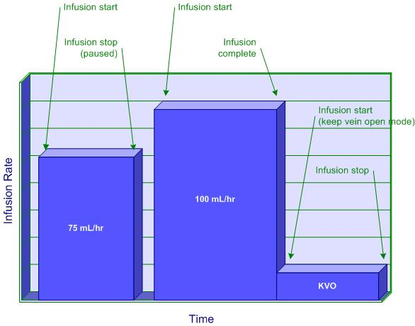

Figure M.1-1: Infusion with a Rate Change

==== M.1.1 Event Message – PCD-10 Communicate Infusion Event Data

The structure of the message differs from the PCD-01 message (ORU^R01) in the following ways

* MSH-9.2 contains a new trigger event code (R42) assigned for infusion event data.
* MSH-21.3 contains the PCD-10 unique profile identifier. The OID identifier assigned to PCD-10 is “1.3.6.1.4.1.19376.1.6.4.10”.

Each PCD-10 message contains only information relevant to the specific device and fluid source on which the event occurred. Each PCD-10 message contains a single event. Only information pertinent to the event is included.

==== M.1.2 Infusion Pump Events

Table M.1.2-1: Infusion Pump Events

[width="100%",cols="25%,47%,28%",options="header",]
|===
|Event |MDC Code |Required by Profile
|Delivery Start |MDC_EVT_PUMP_DELIV_START |Yes
|Delivery Stop |MDC_EVT_PUMP_DELIV_STOP |Yes
|Delivery Complete |MDC_EVT_PUMP_DELIV_COMP |Yes
|Communication Status Change |MDC_EVT_COMM_STATUS_CHANGE |No
|Program Cleared |MDC_EVT_PUMP_PROG_CLEARED |No
|Auto-Program Cleared |MDC_EVT_PUMP_AUTO_PROG_CLEARED |No
|Patient Change |MDC_EVT_PATIENT_CHANGE |No
|Patient ID Change |MDC_EVT_PATIENT_ID_CHANGE |No
|Patient Parameter Change |MDC_EVT_PATIENT_PARAMETER_CHANGE |No
|Pump Volume Counters Cleared |MDC_EVT_PUMP_VOL_COUNTERS_CLEARED |No
|Device Time Changed |MDC_EVT_DEVICE_TIME_CHANGED |No
|Channel Relay Programmed |MDC_EVT_PUMP_PROG_RELAY |Optional
|===

*Relay using 2 pumps / NO power off between Relay:*

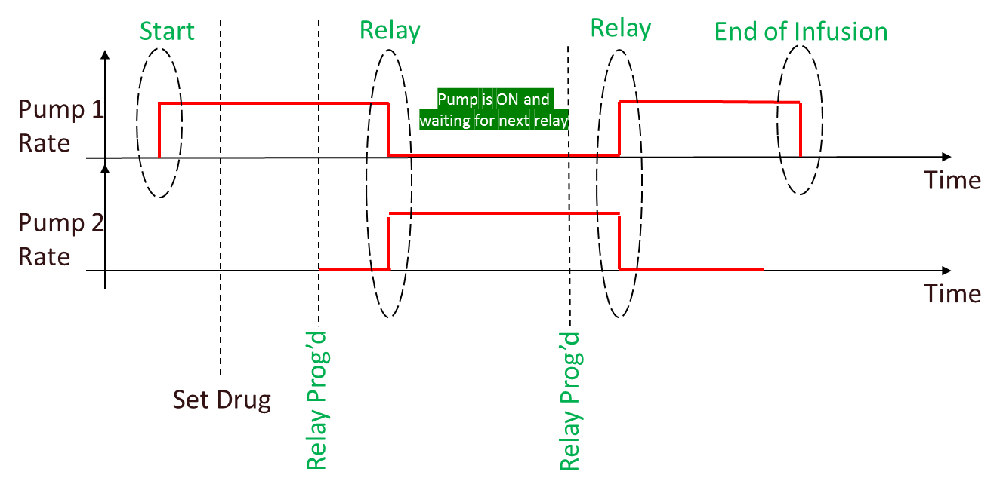

*Relay using 2 pumps / power off between Relay:*

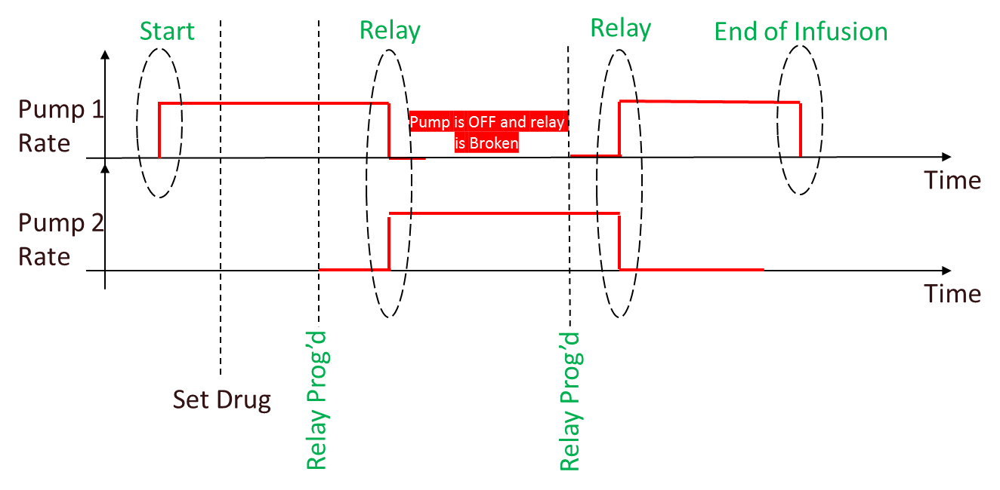

*Relay using 3 pumps:*

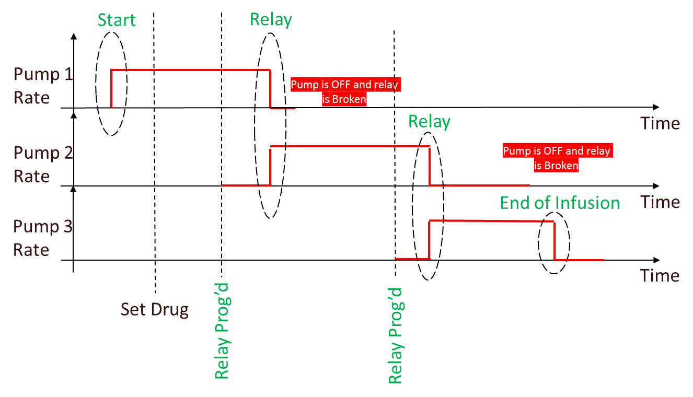

===== M.1.2.1 Infusion Event Parameters

Infusion Event Parameters are defined in separate Infusion Pump Model and Infusion Pump Terms documents. Current versions of these documents can be found on the IHE Patient Care Devices Wiki page entitled “PCD Reference Pages” (http://wiki.ihe.net/index.php?title=Category:PCD_Reference_Pages).

The names of the infusion pump event parameters that are used in subsequent tables correspond to MDC codes as shown in Table M.1.2.1-1 below:

Table M.1.2.1-1: Mapping of Infusion Pump Event Parameters to MDC Codes

[width="100%",cols="45%,55%",options="header",]
|===
|Parameter |MDC Code
|*Pump Delivery Info Parameters:* |
|Infusing Status |MDC_PUMP_INFUSING_STATUS
|Current Pump Fluid Flow |MDC_FLOW_FLUID_PUMP_CURRENT
|Pump Active Sources |MDC_DEV_PUMP_ACTIVE_SOURCES
|*Active Source Parameters:* |
|Current Delivery Status |MDC_DEV_PUMP_CURRENT_DELIVERY_STATUS
|Program Delivery Mode |MDC_DEV_PUMP_PROGRAM_DELIVERY_MODE
|Pump Not Delivering Reason |MDC_DEV_PUMP_NOT_DELIVERING_REASON
|Source Channel Label |MDC_DEV_PUMP_SOURCE_CHANNEL_LABEL
|Rate |MDC_FLOW_FLUID_PUMP
|Dose Rate |MDC_RATE_DOSE
|Volume Programmed |MDC_VOL_FLUID_TBI
|Current Segment Volume Delivered |MDC_VOL_FLUID_DELIV_SEGMENT
|Cumulative Volume Delivered |MDC_VOL_FLUID_DELIV_TOTAL
|Volume Remaining |MDC_VOL_FLUID_TBI_REMAIN
|Time Remaining |MDC_TIME_PD_REMAIN
|TCI Mode |MDC_PUMP_TCI_MODE
|TCI Model used |MDC_PUMP_TCI_MODEL
|TCI Target Concentration |MDC_CONC_TCI_TARGET
|TCI current Plasma concentration |MDC_CONC_TCI_CURRENT_PLASMA
|TCI current Effect concentration |MDC_CONC_TCI_CURRENT_EFFECT
|Channel Relay State |MDC_PUMP_RELAY_STATE
|Channel Relay GUID |MDC_PUMP_RELAY_GUID
|===

For IPEC delivery events, the DOR should send all parameters that are known for the infusion.

The following table outlines the parameters that are typically sent with each Delivery Start, Stop, and Complete event, with additional constraints as noted. Refer to the Infusion Pump Model and Infusion Pump Terms documents for the other parameters that may be reported with each event.

Table M.1.2.1-2: Infusion Pump Delivery Event Parameters

[width="100%",cols="23%,77%",options="header",]
|===
|PARAMETER |NOTES
|*Pump Delivery Info Parameters:* |
|Infusing Status |Required for Delivery Start, Stop, and Complete.
|Current Pump Fluid Flow |Required for Delivery Start, Stop, and Complete.
|Pump Active Sources |Required for Delivery Start, Stop, and Complete.
|*Active Source Parameters:* |
|Current Delivery Status |Required for Delivery Start, Stop, and Complete.
|Program Delivery Mode |Required for Delivery Start, Stop, and Complete.
|Pump Not Delivering Reason |Required for Delivery Stop and Delivery Complete if Current Delivery Status = pump-delivery-status-not-delivering; not applicable for Delivery Start.
|Source Channel Label |Required for Delivery Start, Stop, and Complete.
|Current Segment Volume Delivered ^Note 1^ |For Delivery Stop and Delivery Complete, either this parameter or Cumulative Volume Delivered is required; optional for Delivery Start.
|Cumulative Volume Delivered ^Note 1^ |For Delivery Stop and Delivery Complete, either this parameter or Current Segment Volume Delivered is required; optional for Delivery Start.
|TCI Mode a|
Optional

See ENUM _MDC_PUMP_TCI_MODE below

|TCI Model used a|
Required if MDC_PUMP_TCI_MODE is present and different from pump-tci-none

Free String

|TCI Target Concentration a|
Same definition as MDC_CONC_DRUG

Required if MDC_PUMP_TCI_MODE is present and different from pump-tci-none and pump-tci-user

|TCI current Plasma concentration a|
Same definition as MDC_CONC_DRUG

Required if MDC_PUMP_TCI_MODE is present and is different from pump-tci-none

|TCI current Effect concentration a|
Same definition as MDC_CONC_DRUG

Required if MDC_PUMP_TCI_MODE is present and is different from pump-tci-none

|Channel Relay State a|
Optional

See ENUM _ PUMP_RELAY_STATE below

|Channel Relay GUID |Required if MDC_PUMP_RELAY_STATE is present and is different from pump-relay-none
|===

Note 1: When Pump Active Sources is primary or secondary, this parameter is reported under the corresponding containment group. When Pump Active Sources is PCA, loading, clinician, or intermittent, this parameter is reported under the containment group for the fluid source (primary or secondary).

Enum for TCI Mode: ENUM MDC_PUMP_TCI_MODE

* *pump-tci-none*: pump not in TCI mode (OBX is optional in that case)
* *pump-tci-target-plasma*: pump in TCI plasma target mode
* *pump-tci-target-effect*: pump in TCI effect target mode
* *pump-tci-user*: pump in TCI no target mode

Enum for Channel Relay State: ENUM _PUMP_RELAY_STATE

* *pump-relay-none*: pump not participating in a relay
* *pump-relay-infusing*: pump infusing in a relay
* *pump-relay-waiting*: pump programmed for a relay and waiting to take that relay
* *pump-relay-complete*: pump has just been relayed, and is waiting to be powered off or prepared for next relay

Note: if state is *pump-relay-none*:

* The OBX is optional if there is/was no relay
* The OBX is required if there was a relay and it has been broken for any reason

The following table outlines the parameters that are sent with the Communication Status Change event.

Table M.1.2.1-3: Infusion Pump Communication Status Change Event Parameters

[width="100%",cols="30%,70%",options="header",]
|===
|PARAMETER |NOTES
|Communication Status |Required.
|===

Table M.1.2.1-4: Clinical Scenarios describes the mapping of clinical scenarios to pump events.

Notes:

* The term “delivery segment” refers to the period between a MDC_EVT_PUMP_DELIV_START event and the next MDC_EVT_PUMP_DELIV_STOP or MDC_EVT_PUMP_DELIV_COMP event
* Although the Pump Active Sources parameters can identify multiple sources, there is only one active source at a given time in each of the scenarios in the table
* For Pump Active Sources, the value “pump-source-info-*” indicates that either pump-source-info-primary or pump-source-info-secondary is a valid value for the event
* When Pump Active Sources is one of the following:

* pump-source-info-pca
* pump-source-info-loading
* pump-source-info-clinician
* pump-source-info-intermittent
* parameter values specific to that dose are reported within a corresponding containment group (reflected in the scenarios as “Active Source Parameters (pump-source-info-...)". Parameters that apply to the overall delivery for the active fluid source (such as Cumulative Volume Delivered) are reported within a separate containment group for that source (reflected in the scenarios as “Source Parameters (primary or secondary)”).

* Source Channel Label is assigned a vendor-specific value (e.g., “primary” or “secondary”, ‘A’ or ‘B’, etc.). This is especially useful when Pump Active Sources is not pump-source-info-primary or pump-source-info-secondary (e.g., during a bolus). In that case, the source for the bolus can be identified via Source Channel Label.
* The value of pump-delivery-status-transitioning for Current Delivery Status is applicable to transitional stop and complete events in cases where the medication or fluid associated with the source will continue to be delivered after the transition (e.g., to/from bolus, to KVO, titration, etc.). It should not be used for transitions from piggyback to primary.
* For events where Current Delivery Status = pump-delivery-status-transitioning, the values for Infusing Status and Current Pump Fluid Flow must be consistent, i.e., either:

* Infusing Status = pump-status-infusing and Current Pump Fluid Flow > 0, or
* Infusing Status = pump-status-not-infusing and Current Pump Fluid Flow = 0
* In the scenarios, the terms “pump reported status” and “pump reported rate” are used in place of actual values to indicate that it is vendor-specific as to which of these two combinations of values will be reported.

* Additional clinical scenarios will be added to this table as they are identified.

Table M.1.2.1-4: Clinical Scenarios

[width="100%",cols="17%,26%,37%,20%",options="header",]
|===
|Clinical Scenario |PCD-10 Event |Parameters |Discussion
|New infusion start, followed by eventual transition to KVO, followed by transition from KVO to paused |MDC_EVT_PUMP_DELIV_ START a|
[.underline]#Pump Delivery Info Parameters:#

Infusing Status=pump-status-infusing

Current Pump Fluid Flow=programmed rate

Pump Active Sources=pump-source-info-*

[.underline]#Active Source Parameters:#

Current Delivery Status=pump-delivery-status-delivering

Program Delivery Mode=pump-program-delivery-mode-continuous

Source Channel Label=vendor-specific

Rate=programmed rate

Dose Rate=programmed dose rate

Volume Programmed=volume programmed

Current Segment Volume Delivered=0

Cumulative Volume Delivered=0

Volume Remaining=volume programmed

Time Remaining=based upon Volume Remaining and Rate

|Depending on pump make/model, Rate may not be specific to KVO rate and volume infused may continue to increase after the transition to KVO even though the VTBI has been met
| |MDC_EVT_PUMP_DELIV_ COMP a|
[.underline]#Pump Delivery Info Parameters:#

Infusing Status=pump reported status

Current Pump Fluid Flow=pump reported rate

Pump Active Sources=pump-source-info-*

[.underline]#Active Source Parameters:#

Current Delivery Status=pump-delivery-status-transitioning

Program Delivery Mode=pump-program-delivery-mode-continuous

Source Channel Label=vendor-specific

Rate=programmed rate

Dose Rate=programmed dose rate

Volume Programmed=volume programmed

Current Segment Volume Delivered= volume programmed

Cumulative Volume Delivered=volume programmed

Volume Remaining=0

Time Remaining=0

|
| |MDC_EVT_PUMP_DELIV_ START a|
[.underline]#Pump Delivery Info Parameters:#

Infusing Status=pump-status-infusing

Current Pump Fluid Flow=KVO rate

Pump Active Sources=pump-source-info-*

[.underline]#Active Source Parameters:#

Current Delivery Status=pump-delivery-status-kvo

Program Delivery Mode=pump-program-delivery-mode-continuous

Source Channel Label=vendor-specific

Rate=KVO rate

Dose Rate=n/a

Volume Programmed=0

Current Segment Volume Delivered=0

Cumulative Volume Delivered=volume programmed

Volume Remaining=0

Time Remaining=0

|
| |MDC_EVT_PUMP_DELIV_ STOP a|
[.underline]#Pump Delivery Info Parameters:#

Infusing Status=pump-status-not-infusing

Current Pump Fluid Flow=0

Pump Active Sources=pump-source-info-*

[.underline]#Active Source Parameters:#

Current Delivery Status=pump-delivery-status-not-delivering

Pump Not Delivering Reason=either pump-stopped-by-clinician or pump-stopped-not-specified

Program Delivery Mode=pump-program-delivery-mode-continuous

Source Channel Label=vendor-specific

Rate=KVO rate

Dose Rate=n/a

Volume Programmed=0

Current Segment Volume Delivered= volume delivered since last DELIV_START

Cumulative Volume Delivered=volume programmed plus the amount delivered during KVO

Volume Remaining=0

Time Remaining=0

|
|Start/restart an infusion, followed by pausing the running infusion |MDC_EVT_PUMP_DELIV_ START a|
[.underline]#Pump Delivery Info Parameters:#

Infusing Status=pump-status-infusing

Current Pump Fluid Flow=programmed rate

Pump Active Sources=pump-source-info-*

[.underline]#Active Source Parameters:#

Current Delivery Status=pump-delivery-status-delivering

Program Delivery Mode=pump-program-delivery-mode-*

Source Channel Label=vendor-specific

Rate=programmed rate

Dose Rate=programmed dose rate

Volume Programmed=volume programmed

Current Segment Volume Delivered=0

Cumulative Volume Delivered=sum of “Current Segment Volume Delivered” values across all segments for the delivery prior to this one

Volume Remaining=volume remaining

Time Remaining=based upon Volume Remaining and Rate

|
| |MDC_EVT_PUMP_DELIV_ STOP a|
[.underline]#Pump Delivery Info Parameters:#

Infusing Status=pump-status-not-infusing

Current Pump Fluid Flow=0

Pump Active Sources=pump-source-info-*

[.underline]#Active Source Parameters:#

Current Delivery Status=pump-delivery-status-not-delivering

Pump Not Delivering Reason=either pump-stopped-by-clinician or pump-stopped-not-specified

Program Delivery Mode=pump-program-delivery-mode-*

Source Channel Label=vendor-specific

Rate=programmed rate

Dose Rate=programmed dose rate

Volume Programmed=volume programmed

Current Segment Volume Delivered=volume delivered since last DELIV_START

Cumulative Volume Delivered=sum of “Current Segment Volume Delivered” values across all segments for the delivery, including the one just completed

Volume Remaining=volume remaining

Time Remaining=based upon Volume Remaining and Rate

|
|Rate Change (e.g., titration) while running (NOTE: events associated with the start of the infusion at original rate and pausing or completion at the new rate are not shown) |MDC_EVT_PUMP_DELIV_ STOP a|
[.underline]#Pump Delivery Info Parameters:#

Infusing Status=pump reported status

Current Pump Fluid Flow=pump reported rate

Pump Active Sources=pump-source-info-*

[.underline]#Active Source Parameters:#

Current Delivery Status=pump-delivery-status-transitioning

Program Delivery Mode=pump-program-delivery-mode-*

Source Channel Label=vendor-specific

Rate=old programmed rate

Dose Rate=old programmed dose rate

Volume Programmed=volume programmed

Current Segment Volume Delivered=volume delivered since last DELIV_START

Cumulative Volume Delivered=sum of “Current Segment Volume Delivered” values across all segments for the delivery, including the one just completed

Volume Remaining=volume remaining

Time Remaining=based upon Volume Remaining and Rate

|
| |MDC_EVT_PUMP_DELIV_ START a|
[.underline]#Pump Delivery Info Parameters:#

Infusing Status=pump-status-infusing

Current Pump Fluid Flow=new programmed rate

Pump Active Sources=pump-source-info-*

[.underline]#Active Source Parameters:#

Current Delivery Status=pump-delivery-status-delivering

Program Delivery Mode=pump-program-delivery-mode-*

Source Channel Label=vendor-specific

Rate=new programmed rate

Dose Rate=new programmed dose rate

Volume Programmed=volume programmed

Current Segment Volume Delivered=0

Cumulative Volume Delivered=sum of “Current Segment Volume Delivered” values across all segments for the delivery prior to this one

Volume Remaining=volume remaining

Time Remaining=based upon Volume Remaining and Rate

|
a|
Piggyback start, followed by piggyback end, followed by resumption of the primary infusion (this assumes the pump will revert to the primary rate once piggyback VTBI is achieved)

(Note: events associated with the start of the primary infusion prior to the piggyback and completion of the primary infusion after the piggyback are not shown)

|MDC_EVT_PUMP_DELIV_ STOP a|
[.underline]#Pump Delivery Info Parameters:#

Infusing Status=pump-status-not-infusing

Current Pump Fluid Flow=0

Pump Active Sources=pump-source-info-primary

[.underline]#Active Source Parameters:#

Current Delivery Status=pump-delivery-status-not-delivering

Pump Not Delivering Reason=either pump-stopped-by-clinician, pump-stopped-not-specified, or pump-stopped-switching-source

Program Delivery Mode=pump-program-delivery-mode-*

Source Channel Label=vendor-specific

Rate=primary rate

Dose Rate=primary dose rate

Volume Programmed=primary volume programmed

Current Segment Volume Delivered=volume delivered since last DELIV_START

Cumulative Volume Delivered=sum of “Current Segment Volume Delivered” values across all segments for the primary delivery, including the one just completed

Volume Remaining=primary volume remaining

Time Remaining=based upon Volume Remaining and Rate

a|
The first DELIV_STOP represents the stop of the primary infusion that was running.

If the pump supports automatic transition from primary to secondary (i.e., without a manual pause by the clinician), then the appropriate value for Pump Not Delivering Reason on the first DELIV_STOP event in this scenario is pump-stopped-switching-source. If not, then its value should be either pump-stopped-by-clinician or pump-stopped-not-specified.

| |MDC_EVT_PUMP_DELIV_ START a|
[.underline]#Pump Delivery Info Parameters:#

Infusing Status=pump-status-infusing

Current Pump Fluid Flow=piggyback programmed rate

Pump Active Sources=pump-source-info-secondary

[.underline]#Active Source Parameters:#

Current Delivery Status=pump-delivery-status-delivering

Program Delivery Mode=pump-program-delivery-mode-*

Source Channel Label=vendor-specific

Rate=piggyback programmed rate

Dose Rate=piggyback dose rate

Volume Programmed=piggyback volume programmed

Current Segment Volume Delivered=0

Cumulative Volume Delivered=0

Volume Remaining=piggyback volume programmed

Time Remaining=based upon Volume Remaining and Rate

|
| |MDC_EVT_PUMP_DELIV_ COMP a|
[.underline]#Pump Delivery Info Parameters:#

Infusing Status=pump-status-not-infusing

Current Pump Fluid Flow=0

Pump Active Sources=pump-source-info-secondary

[.underline]#Active Source Parameters:#

Current Delivery Status=pump-delivery-status-not-delivering

Pump Not Delivering Reason=pump-stopped-switching-source

Program Delivery Mode=pump-program-delivery-mode-*

Source Channel Label=vendor-specific

Rate=piggyback programmed rate

Dose Rate=piggyback dose rate

Volume Programmed=piggyback volume programmed

Current Segment Volume Delivered= volume delivered since last piggyback DELIV_START

Cumulative Volume Delivered=sum of “Current Segment Volume Delivered” values across all segments for the piggyback delivery, including the one just completed

Volume Remaining=0

Time Remaining=0

|
| |MDC_EVT_PUMP_DELIV_ START a|
[.underline]#Pump Delivery Info Parameters:#

Infusing Status=pump-status-infusing

Current Pump Fluid Flow=primary rate

Pump Active Sources=pump-source-info-primary

[.underline]#Active Source Parameters:#

Current Delivery Status=pump-delivery-status-delivering

Program Delivery Mode=pump-program-delivery-mode-*

Source Channel Label=vendor-specific

Rate=primary rate

Dose Rate=primary dose rate

Volume Programmed=primary volume programmed

Current Segment Volume Delivered=0

Cumulative Volume Delivered=sum of “Current Segment Volume Delivered” values across all segments for the primary delivery

Volume Remaining=primary volume remaining

Time Remaining=based upon Volume Remaining and Rate

|
a|
Bolus start, followed by bolus end, followed by resumption of continuous rate after the bolus (this assumes the pump will revert to the continuous rate once the bolus VTBI is achieved)

(NOTE: events associated with the start of the continuous infusion prior to the bolus and completion of the continuous infusion after the bolus completes are not shown)

|MDC_EVT_PUMP_DELIV_ STOP a|
[.underline]#Pump Delivery Info Parameters:#

Infusing Status=pump reported status

Current Pump Fluid Flow=pump reported rate

Pump Active Sources=pump-source-info-*

[.underline]#Active Source Parameters (primary or secondary):#

Current Delivery Status=pump-delivery-status-transitioning

Program Delivery Mode=pump-program-delivery-mode-continuous

Source Channel Label=vendor-specific

Rate=continuous rate

Dose Rate=continuous dose rate

Volume Programmed=continuous volume programmed

Current Segment Volume Delivered=continuous volume delivered since last DELIV_START

Cumulative Volume Delivered=sum of “Current Segment Volume Delivered” values across all segments for the continuous delivery, including the one just completed, and any previously completed boluses

Volume Remaining=continuous volume remaining

Time Remaining=based upon Volume Remaining and Rate

|DELIV_STOP – Used if the pump is switching from continuous to bolus. Not needed if starting bolus from a pause or stop.
| |MDC_EVT_PUMP_DELIV_ START a|
[.underline]#Pump Delivery Info Parameters:#

Infusing Status=pump-status-infusing

Current Pump Fluid Flow=bolus programmed rate

Pump Active Sources=pump-source-info-clinician

[.underline]#Source Parameters (primary or secondary):#

Cumulative Volume Delivered=sum of “Current Segment Volume Delivered” values across all segments for the continuous delivery and any previously completed boluses

[.underline]#Active Source Parameters (clinician dose):#

Current Delivery Status=pump-delivery-status-delivering

Program Delivery Mode=pump-program-delivery-mode-continuous

Source Channel Label=vendor-specific

Rate=bolus programmed rate

Dose Rate=bolus dose rate

Volume Programmed=bolus volume programmed

Current Segment Volume Delivered=0

Cumulative Volume Delivered=0

Volume Remaining=bolus volume programmed

Time Remaining=based upon Volume Remaining and Rate

|
| |MDC_EVT_PUMP_DELIV_ STOP a|
[.underline]#Pump Delivery Info Parameters:#

Infusing Status=pump reported status

Current Pump Fluid Flow=pump reported rate

Pump Active Sources=pump-source-info-clinician

[.underline]#Source Parameters (primary or secondary):#

Cumulative Volume Delivered=sum of “Current Segment Volume Delivered” values across all segments for the continuous delivery and any boluses, including the one just completed

[.underline]#Active Source Parameters (clinician dose):#

Current Delivery Status=pump-delivery-status-transitioning

Program Delivery Mode=pump-program-delivery-mode-continuous

Source Channel Label=vendor-specific

Rate=bolus programmed rate

Dose Rate=bolus dose rate

Volume Programmed=bolus volume programmed

Current Segment Volume Delivered=bolus volume delivered since last DELIV_START

Cumulative Volume Delivered=bolus volume programmed

Volume Remaining=0

Time Remaining=0

|
| |MDC_EVT_PUMP_DELIV_ START a|
[.underline]#Pump Delivery Info Parameters:#

Infusing Status=pump-status-infusing

Current Pump Fluid Flow=continuous rate

Pump Active Sources=pump-source-info-*

[.underline]#Active Source Parameters (primary or secondary:#

Current Delivery Status=pump-delivery-status-delivering

Program Delivery Mode=pump-program-delivery-mode-continuous

Source Channel Label=vendor-specific

Rate=continuous rate

Dose Rate=continuous dose rate

Volume Programmed=continuous volume programmed

Current Segment Volume Delivered=0

Cumulative Volume Delivered=sum of “Current Segment Volume Delivered” values across all segments for the continuous delivery and any boluses

Volume Remaining=continuous volume remaining

Time Remaining=based upon Volume Remaining and Rate

|
|Multi-step start, followed by multi-step transition, followed by multi-step stop |MDC_EVT_PUMP_DELIV_ START a|
[.underline]#Pump Delivery Info Parameters:#

Infusing Status=pump-status-infusing

Current Pump Fluid Flow=programmed rate for step 1

Pump Active Sources=pump-source-info-*

[.underline]#Active Source Parameters:#

Current Delivery Status=pump-delivery-status-delivering

Program Delivery Mode=pump-program-delivery-mode-multi-step

Source Channel Label=vendor-specific

Rate=programmed rate for step 1

Dose Rate=programmed dose rate for step 1

Volume Programmed=volume programmed for step 1

Current Segment Volume Delivered=0

Cumulative Volume Delivered=0

Volume Remaining=volume programmed for step 1

Time Remaining=based upon Volume Remaining and Rate

|The transition is handled like a rate change
| |MDC_EVT_PUMP_DELIV_ STOP a|
[.underline]#Pump Delivery Info Parameters:#

Infusing Status=pump reported status

Current Pump Fluid Flow=pump reported rate for step 1

Pump Active Sources=pump-source-info-*

[.underline]#Active Source Parameters:#

Current Delivery Status=pump-delivery-status-transitioning

Program Delivery Mode=pump-program-delivery-mode-multi-step

Source Channel Label=vendor-specific

Rate=programmed rate for step 1

Dose Rate=programmed dose rate for step 1

Volume Programmed=volume programmed for step 1

Current Segment Volume Delivered=volume delivered since last DELIV_START

Cumulative Volume Delivered=sum of “Current Segment Volume Delivered” values across all segments for the delivery, including the one just completed

Volume Remaining=0

Time Remaining=0

|
| |MDC_EVT_PUMP_DELIV_ START a|
[.underline]#Pump Delivery Info Parameters:#

Infusing Status=pump-status-infusing

Current Pump Fluid Flow=programmed rate for step 2

Pump Active Sources=pump-source-info-*

[.underline]#Active Source Parameters:#

Current Delivery Status=pump-delivery-status-delivering

Program Delivery Mode=pump-program-delivery-mode-multi-step

Source Channel Label=vendor-specific

Rate=programmed rate for step 2

Dose Rate=programmed dose rate for step 2

Volume Programmed=volume programmed for step 2

Current Segment Volume Delivered=0

Cumulative Volume Delivered=sum of “Current Segment Volume Delivered” values across all segments for the delivery prior to this one

Volume Remaining=volume programmed for step 2

Time Remaining=based upon Volume Remaining and Rate

|
| |MDC_EVT_PUMP_DELIV_ STOP a|
[.underline]#Pump Delivery Info Parameters:#

Infusing Status=pump-status-not-infusing

Current Pump Fluid Flow=0

Pump Active Sources=pump-source-info-*

[.underline]#Active Source Parameters:#

Current Delivery Status=pump-delivery- not-delivering

Pump Not Delivering Reason=either pump-stopped-by-clinician or pump-stopped-not-specified

Program Delivery Mode=pump-program-delivery-mode-multi-step

Source Channel Label=vendor-specific

Rate=programmed rate for current step

Dose Rate=programmed dose rate for current step

Volume Programmed=volume programmed for current step

Current Segment Volume Delivered=volume delivered since last DELIV_START

Cumulative Volume Delivered=sum of “Current Segment Volume Delivered” values across all segments for the delivery, including the one just completed

Volume Remaining=volume remaining

Time Remaining=based upon Volume Remaining and Rate

|
|Intermittent step start, followed by intermittent step stop |MDC_EVT_PUMP_DELIV_ START a|
[.underline]#Pump Delivery Info Parameters:#

Infusing Status=pump-status-infusing

Current Pump Fluid Flow=programmed rate for step n

Pump Active Sources=pump-source-info-*

[.underline]#Active Source Parameters:#

Current Delivery Status=pump-delivery-status-delivering

Program Delivery Mode=pump-program-delivery-mode-multi-dosing

Source Channel Label=vendor-specific

Rate=programmed rate for step n

Dose Rate=programmed dose rate for step n

Volume Programmed=volume programmed for step n

Current Segment Volume Delivered=0

Cumulative Volume Delivered=sum of “Current Segment Volume Delivered” values across all segments for the delivery prior to this one

Volume Remaining=volume programmed for step n

Time Remaining=based upon Volume Remaining and Rate

|
| |MDC_EVT_PUMP_DELIV_ STOP a|
[.underline]#Pump Delivery Info Parameters:#

Infusing Status=pump-status-not-infusing

Current Pump Fluid Flow=0

Pump Active Sources=pump-source-info-*

[.underline]#Active Source Parameters:#

Current Delivery Status=pump-delivery-status-not-delivering

Pump Not Delivering Reason=either pump-stopped-between-doses or pump-stopped-not-specified

Program Delivery Mode=pump-program-delivery-mode-multi-dosing

Source Channel Label=vendor-specific

Rate=programmed rate for current step

Dose Rate=programmed dose rate for current step

Volume Programmed=volume programmed for current step

Current Segment Volume Delivered=volume delivered since last DELIV_START

Cumulative Volume Delivered=sum of “Current Segment Volume Delivered” values across all segments for the delivery, including the one just completed

Volume Remaining=0

Time Remaining=0

|
a|
Loading dose start, followed by loading dose end, followed by start of continuous (this assumes the pump will start at the continuous rate once the loading dose VTBI is achieved)

(NOTE: the event associated with the completion of the continuous infusion after the bolus completes is not shown)

|MDC_EVT_PUMP_DELIV_ START a|
[.underline]#Pump Delivery Info Parameters:#

Infusing Status=pump-status-infusing

Current Pump Fluid Flow=loading dose programmed rate

Pump Active Sources=pump-source-info-loading

[.underline]#Source Parameters (primary or secondary):#

Cumulative Volume Delivered=0

[.underline]#Active Source Parameters (Loading Dose):#

Current Delivery Status=pump-delivery-status-delivering

Program Delivery Mode=pump-program-delivery-mode-continuous

Source Channel Label=vendor-specific

Rate= loading dose programmed rate

Dose Rate= loading dose rate

Volume Programmed= loading dose volume programmed

Current Segment Volume Delivered=0

Cumulative Volume Delivered=0

Volume Remaining= loading dose volume programmed

Time Remaining=based upon Volume Remaining and Rate

|
| |MDC_EVT_PUMP_DELIV_ STOP a|
[.underline]#Pump Delivery Info Parameters:#

Infusing Status=pump reported status

Current Pump Fluid Flow=pump reported rate

Pump Active Sources=pump-source-info-loading

[.underline]#Source Parameters (primary or secondary):#

Cumulative Volume Delivered=sum of “Current Segment Volume Delivered” values across all segments for the loading dose, including the one just completed

[.underline]#Active Source Parameters (Loading Dose):#

Current Delivery Status=pump-delivery-status-transitioning

Program Delivery Mode=pump-program-delivery-mode-continuous

Source Channel Label=vendor-specific

Rate= loading dose programmed rate

Dose Rate= loading dose rate

Volume Programmed= loading dose volume programmed

Current Segment Volume Delivered=loading dose volume delivered since last DELIV_START

Cumulative Volume Delivered=sum of “Current Segment Volume Delivered” values across all segments for the loading dose, including the one just completed

Volume Remaining=0

Time Remaining=0

|
| |MDC_EVT_PUMP_DELIV_ START a|
[.underline]#Pump Delivery Info Parameters:#

Infusing Status=pump-status-infusing

Current Pump Fluid Flow=continuous rate

Pump Active Sources=pump-source-info-*

[.underline]#Active Source Parameters (primary or secondary):#

Current Delivery Status=pump-delivery-status-delivering

Program Delivery Mode=pump-program-delivery-mode-continuous

Source Channel Label=vendor-specific

Rate=continuous rate

Dose Rate=continuous dose rate

Volume Programmed=continuous volume programmed

Current Segment Volume Delivered=0

Cumulative Volume Delivered=sum of “Current Segment Volume Delivered” values across all segments for the loading dose

Volume Remaining=continuous volume remaining

Time Remaining=based upon Volume Remaining and Rate

|
|Infusion Stopped Due to Alarm | | |Same as “Pause a running infusion” scenario, except that Pump Not Delivering Reason=either pump-stopped-alarming or pump-stopped-not-specified
|Auto-restart after alarm resolved | | a|
e.g., occlusion resolved or AIL

Same as “Start/restart an infusion” scenario

|Nurse restart after alarm resolved | | |Same as “Start/restart an infusion” scenario
|Nurse changes VTBI | | a|
e.g., bag change, hourly check, etc.

Same as “Pause a running infusion” case followed by “Start/restart an infusion” case

|Ramp/taper start, followed by ramp/taper rate change, followed by ramp/taper stop |MDC_EVT_PUMP_DELIV_ START a|
[.underline]#Pump Delivery Info Parameters:#

Infusing Status=pump-status-infusing

Current Pump Fluid Flow=programmed rate for step 1

Pump Active Sources=pump-source-info-*

[.underline]#Active Source Parameters:#

Current Delivery Status=pump-delivery-status-delivering

Program Delivery Mode=pump-program-delivery-mode-ramp-taper

Source Channel Label=vendor-specific

Rate=programmed rate for step 1

Dose Rate=programmed dose rate for step 1

Volume Programmed=volume programmed for entire ramp/taper delivery

Current Segment Volume Delivered=0

Cumulative Volume Delivered=0

Volume Remaining=volume programmed for entire ramp/taper delivery

Time Remaining=based upon Volume Remaining and Rate

|
| |MDC_EVT_PUMP_DELIV_ STOP a|
[.underline]#Pump Delivery Info Parameters:#

Infusing Status=pump reported status

Current Pump Fluid Flow=pump reported rate for step 1

Pump Active Sources=pump-source-info-*

[.underline]#Active Source Parameters:#

Current Delivery Status=pump-delivery-status-transitioning

Program Delivery Mode=pump-program-delivery-mode-ramp-taper

Source Channel Label=vendor-specific

Rate=programmed rate for step 1

Dose Rate=programmed dose rate for step 1

Volume Programmed=volume programmed for entire ramp/taper delivery

Current Segment Volume Delivered=volume delivered since last DELIV_START

Cumulative Volume Delivered=sum of “Current Segment Volume Delivered” values across all segments for the delivery, including the one just completed

Volume Remaining=volume remaining for entire ramp/taper delivery

Time Remaining=based upon Volume Remaining and Rate

|
| |MDC_EVT_PUMP_DELIV_ START a|
based upon[.underline]#Pump Delivery Info Parameters:#

Infusing Status=pump-status-infusing

Current Pump Fluid Flow=programmed rate for step 2

Pump Active Sources=pump-source-info-*

[.underline]#Active Source Parameters:#

Current Delivery Status=pump-delivery-status-delivering

Program Delivery Mode=pump-program-delivery-mode-ramp-taper

Source Channel Label=vendor-specific

Rate=programmed rate for step 2

Dose Rate=programmed dose rate for step 2

Volume Programmed=volume programmed for entire ramp/taper delivery

Current Segment Volume Delivered=0

Cumulative Volume Delivered=sum of “Current Segment Volume Delivered” values across all segments for the delivery prior to this one

Volume Remaining=volume remaining for entire ramp/taper delivery

Time Remaining=based upon Volume Remaining and Rate

|
| |MDC_EVT_PUMP_DELIV_ STOP a|
[.underline]#Pump Delivery Info Parameters:#

Infusing Status=pump-status-not-infusing

Current Pump Fluid Flow=0

Pump Active Sources=pump-source-info-*

[.underline]#Active Source Parameters:#

Current Delivery Status=pump-delivery-status-not-delivering

Pump Not Delivering Reason=either pump-stopped-by-clinician or pump-stopped-not-specified

Program Delivery Mode=pump-program-delivery-mode-ramp-taper

Source Channel Label=vendor-specific

Rate=programmed rate for step 2

Dose Rate=programmed dose rate for step 2

Volume Programmed=volume programmed for entire ramp/taper delivery

Current Segment Volume Delivered=volume delivered since last DELIV_START

Cumulative Volume Delivered=sum of “Current Segment Volume Delivered” values across all segments for the delivery, including the one just completed

Volume Remaining= volume remaining for entire ramp/taper delivery

Time Remaining= based upon Volume Remaining and Rate

|
|Patient ID Change |MDC_EVT_PATIENT_ID_ CHANGE |New Patient ID=PID.3 |
|New Weight or New Height or New BSA (same patient) |MDC_EVT_PATIENT_ PARAMETER_CHANGE a|
Weight=New Patient Weight, or

Body Surface Area=New Patient BSA, or

Height=New Patient Height

|e.g., when weight changed during an active weight-based infusion
a|
Switch to library-based infusion

(NOTE: events associated with the start of the non-library infusion and the completion of the library-based infusion are not shown)

|MDC_EVT_PUMP_DELIV_ STOP a|
[.underline]#Pump Delivery Info Parameters:#

Infusing Status=pump-status-not-infusing

Current Pump Fluid Flow=0

Pump Active Sources=pump-source-info-*

[.underline]#Active Source Parameters:#

Current Delivery Status=pump-delivery-status-not-delivering

Pump Not Delivering Reason=either pump-stopped-by-clinician or pump-stopped-not-specified

Program Delivery Mode=pump-program-delivery-mode-*

Source Channel Label=vendor-specific

Rate=rate of non-library infusion

Dose Rate= dose rate of non-library infusion

Volume Programmed=volume programmed for non-library infusion

Current Segment Volume Delivered=volume delivered since last DELIV_START

Cumulative Volume Delivered=sum of “Current Segment Volume Delivered” values across all segments for the non-library delivery, including the one just completed

Volume Remaining=volume remaining of non-library infusion

Time Remaining=based upon Volume Remaining and Rate

|The library-based infusion is considered a new delivery
| |MDC_EVT_PUMP_DELIV_ START a|
[.underline]#Pump Delivery Info Parameters:#

Infusing Status=pump-status-infusing

Current Pump Fluid Flow=programmed rate of library-based infusion

Pump Active Sources=pump-source-info-*

[.underline]#Active Source Parameters:#

Current Delivery Status=pump-delivery-status-delivering

Program Delivery Mode=pump-program-delivery-mode-*

Source Channel Label=vendor-specific

Rate=rate of library-based infusion

Dose Rate=dose rate of library-based infusion

Volume Programmed=volume programmed for library-based infusion

Current Segment Volume Delivered=0

Cumulative Volume Delivered=0

Volume Remaining=volume programmed for library-based infusion

Time Remaining=based upon Volume Remaining and Rate

|
a|
Switch from library-based infusion

(NOTE: events associated with the start of the library-based infusion and the completion of the non- library-based infusion are not shown)

|MDC_EVT_PUMP_DELIV_ STOP a|
[.underline]#Pump Delivery Info Parameters:#

Infusing Status=pump-status-not-infusing

Current Pump Fluid Flow=0

Pump Active Sources=pump-source-info-*

[.underline]#Active Source Parameters:#

Current Delivery Status=pump-delivery-status-not-delivering

Pump Not Delivering Reason=either pump-stopped-by-clinician or pump-stopped-not-specified

Program Delivery Mode=pump-program-delivery-mode-*

Source Channel Label=vendor-specific

Rate=rate of library infusion

Dose Rate= dose rate of library infusion

Volume Programmed=volume programmed for library infusion

Current Segment Volume Delivered=volume delivered since last DELIV_START

Cumulative Volume Delivered=sum of “Current Segment Volume Delivered” values across all segments for the library delivery, including the one just completed

Volume Remaining=volume remaining of library infusion

Time Remaining=based upon Volume Remaining and Rate

|
| |MDC_EVT_PUMP_DELIV_ START a|
[.underline]#Pump Delivery Info Parameters:#

Infusing Status=pump-status-infusing

Current Pump Fluid Flow=programmed rate of non-library-based infusion

Pump Active Sources=pump-source-info-*

[.underline]#Active Source Parameters:#

Current Delivery Status=pump-delivery-status-delivering

Program Delivery Mode=pump-program-delivery-mode-*

Source Channel Label=vendor-specific

Rate=rate of non-library-based infusion

Dose Rate=dose rate of non-library-based infusion

Volume Programmed=volume programmed for non-library-based infusion

Current Segment Volume Delivered=0

Cumulative Volume Delivered=0

Volume Remaining=volume programmed for non-library-based infusion

Time Remaining=based upon Volume Remaining and Rate

|
|===

[width="100%",cols="18%,25%,37%,20%,",options="header",]
|===
|Clinical Scenario |PCD-10 Event |Parameters |Discussion |
a|
_TCI Infusion – Plasma Target_

*Infusion starts*

Automatic Rate Change

End of Infusion

|MDC_EVT_PUMP_DELIV_ START a|
*[.underline]#Pump Delivery Info Parameters:#*

Infusing Status=pump-status-infusing

Current Pump Fluid Flow=current rate

Pump Active Sources= pump-source-info-primary

*[.underline]#Active Source Parameters:#*

Current Delivery Status=pump-delivery-status-delivering

Program Delivery Mode=pump-program-delivery-mode-continuous

Source Channel Label=vendor-specific

Rate=current rate

Dose Rate=current dose rate

Volume Programmed= initial volume in syringe

Current Segment Volume Delivered=0

Cumulative Volume Delivered=0

Volume Remaining=current volume in syringe

TCI State=pump-tci-target-plasma

TCI Model used= model name

TCI Target Concentration=programmed plasma concentration

TCI current Plasma concentration=current value

TCI current Effect concentration=current value

a|
There is no *Volume Programmed* for TCI, so the Volume Programmed is the initial volume in the syringe.

The pump is always adapting the flowrate, so a *Time* *Remaining* is senseless.

|
a|
_TCI Infusion – Plasma Target_

Infusion starts

*Automatic Rate Change*

End of Infusion

|MDC_EVT_PUMP_DELIV_ STOP a|
*[.underline]#Pump Delivery Info Parameters:#*

Infusing Status=pump-status-infusing

Current Pump Fluid Flow=pump reported rate

Pump Active Sources=pump-source-info-primary

*[.underline]#Active Source Parameters:#*

Current Delivery Status=pump-delivery-status-transitioning

Program Delivery Mode= pump-program-delivery-mode-continuous

Source Channel Label=vendor-specific

Rate=old rate

Dose Rate=old dose rate

Volume Programmed= initial volume in syringe

Current Segment Volume Delivered=volume delivered since last DELIV_START

Cumulative Volume Delivered=sum of “Current Segment Volume Delivered” values across all segments for the delivery, including the one just completed

Volume Remaining= current volume in syringe

TCI State=pump-tci-target-plasma

TCI Model used= model name

TCI Target Concentration=programmed plasma concentration

TCI current Plasma concentration=current value

TCI current Effect concentration=current value

|There will be several Automatic Rate Change |
| |MDC_EVT_PUMP_DELIV_ START a|
*[.underline]#Pump Delivery Info Parameters:#*

Infusing Status=pump-status-infusing

Current Pump Fluid Flow=new rate

Pump Active Sources=pump-source-info-primary

*[.underline]#Active Source Parameters:#*

Current Delivery Status=pump-delivery-status-delivering

Program Delivery Mode= pump-program-delivery-mode-continuous

Source Channel Label=vendor-specific

Rate=new rate

Dose Rate=new dose rate

Volume Programmed= initial volume in syringe

Current Segment Volume Delivered=0

Cumulative Volume Delivered=sum of “Current Segment Volume Delivered” values across all segments for the delivery prior to this one

Volume Remaining= current volume in syringe

TCI State=pump-tci-target-plasma

TCI Model used= model name

TCI Target Concentration=programmed plasma concentration

TCI current Plasma concentration=current value

TCI current Effect concentration=current value

| |
a|
_TCI Infusion – Plasma Target_

Infusion starts

Automatic Rate Change

*End of Infusion*

|MDC_EVT_PUMP_DELIV_ COMP a|
*[.underline]#Pump Delivery Info Parameters:#*

Infusing Status=pump reported status

Current Pump Fluid Flow=pump reported rate

Pump Active Sources= pump-source-info-primary

*[.underline]#Active Source Parameters:#*

Current Delivery Status= pump-delivery-status-not-delivering

Program Delivery Mode=pump-program-delivery-mode-continuous

Source Channel Label=vendor-specific

Rate=last rate

Dose Rate=last dose rate

Volume Programmed=volume programmed

Current Segment Volume Delivered= volume programmed

Cumulative Volume Delivered=volume programmed

Volume Remaining=0

TCI State=pump-tci-target-plasma

TCI Model used= model name

TCI Target Concentration=programmed plasma concentration

TCI current Plasma concentration=current value

TCI current Effect concentration=current value

| |
|Clinical Scenario |PCD-10 Event |Parameters |Discussion |
a|
_Channel Relay_

An Infusion is already started.

*The Channel Relay is Programmed*

The Channel Relay Occurs

End of Channel Relay

Broken Relay

|MDC_EVT_PUMP_PROG_RELAY a|
*[.underline]#Pump Delivery Info Parameters:#*

Infusing Status=pump-status-infusing

Current Pump Fluid Flow=current rate

Pump Active Sources= pump-source-info-primary

*[.underline]#Active Source Parameters:#*

Current Delivery Status=pump-delivery-status-delivering

Program Delivery Mode=pump-program-delivery-mode-continuous

Source Channel Label=vendor-specific

Rate=current rate

Dose Rate=current dose rate

Volume Programmed= initial volume in syringe

Current Segment Volume Delivered=volume delivered since last DELIV_START

Cumulative Volume Delivered=sum of “Current Segment Volume Delivered” values across all segments for the delivery, including the current one

Volume Remaining=current volume in syringe

Time Remaining=based upon Volume Remaining and Rate

Channel Relay State=pump-relay-infusing

Channel Relay GUID=guid

|Infusing Pump |
| |MDC_EVT_PUMP_PROG_RELAY a|
*[.underline]#Pump Delivery Info Parameters:#*

Infusing Status=pump-status-not-infusing

Current Pump Fluid Flow=0

Pump Active Sources= pump-source-info-primary

*[.underline]#Active Source Parameters:#*

Current Delivery Status=pump-delivery-status-not-delivering

Program Delivery Mode=pump-program-delivery-mode-continuous

Source Channel Label=vendor-specific

Rate=programmed rate

Dose Rate=programmed dose rate

Volume Programmed= initial volume in syringe

Current Segment Volume Delivered=0

Cumulative Volume Delivered=0

Volume Remaining=current volume in syringe

[line-through]#Time Remaining=based upon Volume Remaining and Rate#

Channel Relay State=pump-relay-waiting

Channel Relay GUID=same guid as other pump

|Waiting Pump |
a|
_Channel Relay_

An Infusion is already started.

The Channel Relay is Programmed

*The Channel Relay Occurs*

End of Channel Relay

|MDC_EVT_PUMP_DELIV_ STOP a|
*[.underline]#Pump Delivery Info Parameters:#*

Infusing Status=pump-status-not-infusing

Current Pump Fluid Flow=pump reported rate

Pump Active Sources=pump-source-info-primary

*[.underline]#Active Source Parameters:#*

Current Delivery Status=pump-delivery-status-not-delivering

Program Delivery Mode= pump-program-delivery-mode-continuous

Source Channel Label=vendor-specific

Rate=old rate

Dose Rate=old dose rate

Volume Programmed= initial volume in syringe

Current Segment Volume Delivered=volume delivered since last DELIV_START

Cumulative Volume Delivered=sum of “Current Segment Volume Delivered” values across all segments for the delivery, including the one just completed

Volume Remaining= current volume in syringe

Channel Relay State=pump-relay-complete

Channel Relay GUID=same guid as previously

|Pump that finished relay |
| |MDC_EVT_PUMP_DELIV_ START a|
*[.underline]#Pump Delivery Info Parameters:#*

Infusing Status=pump-status-infusing

Current Pump Fluid Flow=current rate

Pump Active Sources=pump-source-info-primary

*[.underline]#Active Source Parameters:#*

Current Delivery Status=pump-delivery-status-delivering

Program Delivery Mode= pump-program-delivery-mode-continuous

Source Channel Label=vendor-specific

Rate=programmed rate

Dose Rate=programmed dose rate

Volume Programmed= initial volume in syringe

Current Segment Volume Delivered=0

Cumulative Volume Delivered=0

Volume Remaining= current volume in syringe

Time Remaining=based upon Volume Remaining and Rate

Channel Relay State=pump-relay-infusing

Channel Relay GUID=same guid as previously

|Pump that started relay |
a|
_Channel Relay_

An Infusion is already started.

The Channel Relay is Programmed

The Channel Relay Occurs

*End of Channel Relay*

Broken Relay

|MDC_EVT_PUMP_DELIV_ COMP a|
*[.underline]#Pump Delivery Info Parameters:#*

Infusing Status= pump-status-not-infusing

Current Pump Fluid Flow=pump reported rate

Pump Active Sources= pump-source-info-primary

*[.underline]#Active Source Parameters:#*

Current Delivery Status= pump-delivery-status-not-delivering

Program Delivery Mode=pump-program-delivery-mode-continuous

Source Channel Label=vendor-specific

Rate=last rate

Dose Rate=last dose rate

Volume Programmed= initial volume in syringe

Current Segment Volume Delivered= volume programmed

Cumulative Volume Delivered=volume programmed

Volume Remaining=0

a|
Last Relay pump.

No other pump has been programmed for Relay

|
a|
_Channel Relay_

An Infusion is already started.

A Relay is already programmed

*Broken Relay*

Example: The Waiting pump is removed

|MDC_EVT_PUMP_PROG_RELAY a|
*[.underline]#Pump Delivery Info Parameters:#*

Infusing Status=pump-status-infusing

Current Pump Fluid Flow=current rate

Pump Active Sources= pump-source-info-primary

*[.underline]#Active Source Parameters:#*

Current Delivery Status=pump-delivery-status-delivering

Program Delivery Mode=pump-program-delivery-mode-continuous

Source Channel Label=vendor-specific

Rate=current rate

Dose Rate=current dose rate

Volume Programmed= initial volume in syringe

Current Segment Volume Delivered=volume delivered since last DELIV_START

Cumulative Volume Delivered=sum of “Current Segment Volume Delivered” values across all segments for the delivery, including the current one

Volume Remaining=current volume in syringe

Time Remaining=based upon Volume Remaining and Rate

Channel Relay State=pump-relay-none

|Infusing Pump |
| |MDC_EVT_COMM_STATUS_CHANGE a|
Communication status=comm-status-offline

Channel Relay State=pump-relay-none

|Waiting Pump |
|===

===== M.1.2.2 Infusion Event Sample Message

*Delivery Start Event*

MSH|^~\&|PAT_DEVICE_PUMPVENDOR^9999990000000000^EUI-64|PUMPVENDOR|DOC_VENDOR|DOC_VENDOR|20151015132107-0500||ORU^R42^ORU_R01|6358051206735492253|P|2.6|||AL|NE||ASCII|en^English^ISO639||IHE_PCD_010^IHE PCD^ 1.3.6.1.4.1.19376.1.6.4.10^ISO

PID|||HO2009002^^^IHE^PI||Hon^Charles^^^^^L|Brooks^^^^^^L|19610201000000-0600|M|||||||||||||||||||||||N

PV1||I|3 West ICU^3002^1

OBR|1|AB12345^PCD-03|CD12345^HL7^ACDE48234567ABCD^EUI-64|2222^Dopamine|||20151015132106-0500

OBX|1||70049^MDC_DEV_PUMP_INFUS_LVP_MDS^MDC|1.0.0.0|||||||X|||||N0002||E0002^^0012210000000000^EUI-64

OBX|2|ST|184517^MDC_PUMP_DRUG_LIBRARY_VERSION^MDC|1.0.0.1|DL1||||||R

OBX|3|CWE|68487^MDC_ATTR_EVT_COND^MDC|1.0.0.2|197288^MDC_EVT_PUMP_DELIV_START^MDC||||||R

OBX|4|ST|68488^MDC_ATTR_EVT_SOURCE^MDC|1.0.0.3|1.1.2.0||||||R

OBX|5||70050^MDC_DEV_PUMP_INFUS_LVP_VMD^MDC|1.1.0.0|||||||X

OBX|6||70067^MDC_DEV_PUMP_DELIVERY_INFO^MDC|1.1.1.0|||||||X

OBX|7|CWE|184519^MDC_PUMP_INFUSING_STATUS^MDC|1.1.1.1|^pump-status-infusing||||||R

OBX|8|NM|158014^MDC_FLOW_FLUID_PUMP_CURRENT^MDC|1.1.1.2|15.4|265266^MDC_DIM_MILLI_L_PER_HR^MDC^mL/h^mL/h^UCUM|||||R

OBX|9|CWE|158016^MDC_DEV_PUMP_ACTIVE_SOURCES^MDC|1.1.1.3|^pump-source-info-primary||||||R

OBX|10||70071^MDC_DEV_PUMP_INFUSATE_SOURCE_PRIMARY^MDC|1.1.2.0|||||||X

OBX|11|CWE|158005^MDC_DEV_PUMP_CURRENT_DELIVERY_STATUS^MDC|1.1.2.1|^pump-delivery-status-delivering||||||R

OBX|12|CWE|158008^MDC_DEV_PUMP_PROGRAM_DELIVERY_MODE^MDC|1.1.2.2|^pump-program-delivery-mode-continuous||||||R

OBX|13|ST|158012^MDC_DEV_PUMP_SOURCE_CHANNEL_LABEL^MDC|1.1.2.3|Primary||||||R

OBX|14|NM|157784^MDC_FLOW_FLUID_PUMP^MDC|1.1.2.4|15.4|265266^MDC_DIM_MILLI_L_PER_HR^MDC^mL/h^mL/h^UCUM|||||R

OBX|15|NM|157924^MDC_RATE_DOSE^MDC|1.1.2.5|5.00|265619^MDC_DIM_MICRO_G_PER_KG_PER_MIN^MDC^ug/kg/min^ug/kg/min^UCUM|||||R

OBX|16|NM|157884^MDC_VOL_FLUID_TBI^MDC|1.1.2.6|250.0|263762^MDC_DIM_MILLI_L^MDC^mL^mL^UCUM|||||R

OBX|17|NM|157993^MDC_VOL_FLUID_DELIV_TOTAL^MDC|1.1.2.7|0.0|263762^MDC_DIM_MILLI_L^MDC^mL^mL^UCUM|||||R

OBX|18|NM|157872^MDC_VOL_FLUID_TBI_REMAIN^MDC|1.1.2.8|250.0|263762^MDC_DIM_MILLI_L^MDC^mL^mL^UCUM|||||R

OBX|19|NM|157916^MDC_TIME_PD_REMAIN^MDC|1.1.2.9|974|264352^MDC_DIM_MIN^MDC^min^min^UCUM|||||R

OBX|20|ST|184514^MDC_DRUG_NAME_LABEL^MDC|1.1.2.10|Dopamine||||||R

OBX|21|NM|157760^MDC_CONC_DRUG^MDC|1.1.2.11|1.6|264306^MDC_DIM_MILLI_G_PER_ML^MDC^mg/mL^mg/mL^UCUM|||||R

OBX|22|ST|184516^MDC_PUMP_DRUG_LIBRARY_CARE_AREA^MDC|1.1.2.12|Crit Care||||||R

OBX|23|NM|68063^MDC_ATTR_PT_WEIGHT^MDC|1.1.2.13|82.0|263875^MDC_DIM_KILO_G^MDC^kg^kg^UCUM|||||R

 

===== M.1.2.3 Definition of Pillar/Rack/Slot topology

A pump can be inserted into exactly one Slot within one Rack contained within one Pillar.

Definitions:

*Rack*: An enclosure which can house two or more pumps. Each rack can be directly connected to one or more racks to make up a “pillar”. +
NOTE: In the examples shown below, each rack is able to hold four pumps.

*Slot*: One pump position in a rack within its containing pillar. Its index can be relative to a single rack or the entire pillar.

*Pillar*: A stack of one or more racks. Each pillar can be attached to a subsequent pillar in a daisy chain fashion. The examples below show two pillars. The connection between these is not shown in the diagrams.

Pillar Orientation**:** Racks that stack in an up/down direction is called a *Vertical* orientation.

____
Racks that stack in a left/right direction is called a *Horizontal* orientation
____

*Pillar (Increasing) Direction*: When counting pillars up from one, this is the direction where the count starts from and counts toward. For a Vertical pillar orientation, the Pillar Increasing Direction can be *Left* or *Right*; for a Horizontal pillar orientation, the Pillar Increasing Direction can be *Up* or *Down*.

*Slot & Rack (Increasing) Direction*: When counting pump slots (&racks) up from one, this is the direction where the count starts from and counts toward. For a Vertical pillar orientation, the Slot Increasing Direction can be *Up* or *Down*; for a Horizontal pillar orientation, the Slot Increasing Direction can be *Left* or *Right*.

MDC_ATTR_ PILLAR_ASSEMBLY –

(Number of Pillars, Number of Racks In Pillars, Number of Slots in Pillars, Pillar Orientation, Pillar Direction, Slot-Rack Direction)

[width="100%",cols="42%,58%",]
|===
|Parameter |MDC Code
| |
|*MDS Attribute:* |
|Specification of the number, size, and orientation of pillars and their indexing directions |*MDC_ATTR_PILLAR_ASSEMBLY*
|===

[width="100%",cols="37%,63%",]
|===
|Parameter |Note
|Number of Pillars |Optional - If a pump resides in a Pillar, this field may contain the number of Pillars present in the pillar system.
|Number of Racks In Pillars a|
Optional – ARRAY of “Number of Pillars” entries

If a pump resides in a Pillar, this field may contain the number of Racks present in each Pillar in the system.

|Number of Slots in Pillars a|
Optional – ARRAY of “Number of Pillars” entries

If a pump resides in a Pillar, this field may contain the number of Pump Slots present in each Pillar in the system.

|Pillar Orientation a|
Optional – If a pump is contained within a pillar, this value may be populated with an ENUM value:

Vertical *pillar-orientation-vertical*

Horizontal *pillar-orientation-horizontal*

|Pillar Direction a|
Optional – If a pump is contained within a pillar, this value may be populated with an ENUM value:

Up… *pillar-direction-up*

Down *pillar-direction-down*

Left *pillar-direction-left*

Right *pillar-direction-right*

|Slot-Rack Direction a|
Optional – If a pump is contained within a pillar, this value may be populated with an ENUM value:

Up… *slot-rack-direction-up*

Down slot-rack-direction-down

Left slot-rack-direction-left

Right slot-rack-direction-right

|===

===== M.1.2.3 Specifying a pump location within a Pillar (and Rack)

MDC_ATTR_PUMP_PILLAR_DETAILS –

(Pillar Index, Rack Index, Rack Slot Index, Pillar Slot Index)

[width="100%",cols="42%,58%",]
|===
|Parameter |MDC Code
|*VMD Attribute:* |
|Location of pump in a Pillar |*MDC_ATTR_PUMP_PILLAR_DETAILS*
|===

[width="100%",cols="42%,58%",options="header",]
|===
|Parameter |Note
|Pillar Index a|
Optional

If a pump resides in a Pillar, this field must contain which pillar the pump is located in.

|Rack Index a|
Optional – If a pump resides in a Pillar, it must also be contained within a Rack, since Pillars consist of one or more Racks. If this field is populated, “Rack Slot Index” must also be populated to specify a unique location within the entire Pillar topology. It indicates which Rack within the specified Pillar that the pump is located in. If rack position is not tracked, this field may be NA.

If this field is specified, “Pillar Slot Index” must be NA.

Only one of the two ways to indicate pump position within a Pillar can be populated with non-NA values:

Both “Rack Index” and “Rack Slot Index” or

“Pillar Slot Index”

|Rack Slot Index a|
Optional – If a pump resides in a Pillar, it must also be contained within a Rack since Pillars consist of one or more Racks. If this field is populated, “Rack Index” must also be populated to specify a unique location within the entire Pillar topology. It indicates which position within the specified Rack and Pillar the pump is located in. If “Rack Index” is NA, this field must also be NA.

If this field is specified, “Pillar Slot Index” must also be NA.

Only one of the two ways to indicate pump position within a Pillar can be populated with non-NA values:

Both “Rack Index” and “Rack Slot Index” or

“Pillar Slot Index”

|Pillar Slot Index a|
Optional – If a pump is contained within a Pillar, this field indicates which position it is located in within that Pillar.

If this field is specified, “Rack Index” and “Rack Slot Index” must be NA.

Only one of the two ways to indicate pump position within a Pillar can be populated with non-NA values:

Both “Rack Index” and “Rack Slot Index” or

“Pillar Slot Index”

|===

Enum: Pillar Orientation *ENUM_PILLAR_ORIENTATION*

• *pillar-orientation-vertical*: pillar consists of pumps/racks that are stacked vertically

• *pillar-orientation-horizontal*: pillar consists of pumps/racks that are stacked horizontally

Enum: Pillar Direction *ENUM_PILLAR_DIRECTION*

• *pillar-direction-up*: pillar indexing increments in the “up” direction

• *pillar-direction-down*: pillar indexing increments in the “down” direction

• *pillar-direction-right*: pillar indexing increments from left to right

• *pillar-direction-left*: pillar indexing increments from right to left

Enum: Slot-Rack Direction *ENUM_SLOT_RACK_DIRECTION*

• *slot-rack-direction-up*: pump slot/rack indexing increments in the “up” direction

• *slot-rack-direction-down*: pump slot/rack indexing increments in the “down” direction

• *slot-rack-direction-right*: pump slot/rack indexing increments from left to right

• *slot-rack-direction-left*: pump slot/rack indexing increments from right to left

For the following diagram, the following settings apply:

____
*MDC_ATTR_PILLAR_ASSEMBLY (2, (3,2), (12,8), pillar-orientation-vertical, pillar-direction-right, slot-rack-direction-up)*

Pillars – *2*, Number Racks – *(3,2)*, Number Slots – *(12, 8)*

_2 connected pillars present Pillar 1 has 3 Racks; Pillar 1 has 12 Slots_

_Pillar 2 has 2 Racks Pillar 2 has 8 Slots_

Pillar Orientation - *VERTICAL,* Pillar Direction – *RIGHT,* Slot-Rack Direction – *UP*

image:extracted-media-tf2/media/image46.emf[extracted-media-tf2/media/image46]
____

The slot highlighted above would have the following values…

____
*MDC_ATTR_PUMP_PILLAR_DETAILS (2, 2, 3, NA)*
____

Pillar *2,* Rack *2,* Rack Slot *3*, Pillar Slot *- NA*

____
*MDC_ATTR_PUMP_PILLAR_DETAILS (2, NA, NA, 7)*
____

Pillar *2,* Rack *NA,* Rack Slot *NA*, Pillar Slot *– 7*

* +
*

For the following diagram, the following settings apply:

____
*MDC_ATTR_PILLAR_ASSEMBLY (2, (3,2), (12,8), pillar-orientation-vertical, pillar-direction-right, slot-rack-direction-down)*

Pillars – *2*, Number Racks – *(3,2)*, Number Slots – *(12, 8)*

_2 connected pillars present Pillar 1 has 3 Racks; Pillar 1 has 12 Slots_

_Pillar 2 has 2 Racks Pillar 2 has 8 Slots_

Pillar Orientation - *VERTICAL,* Pillar Direction – *RIGHT,* Slot-Rack Direction – *DOWN*
____

image:extracted-media-tf2/media/image47.emf[extracted-media-tf2/media/image47]

The slot highlighted above would have the following values…

____
*MDC_ATTR_PUMP_PILLAR_DETAILS (2, 1, 2, NA)*
____

Pillar *2,* Rack *1,* Rack Slot *2*, Pillar Slot *- NA*

____
*MDC_ATTR_PUMP_PILLAR_DETAILS (2, NA, NA, 2)*
____

Pillar *2,* Rack *NA,* Rack Slot *NA*, Pillar Slot *- 2*

For the following diagram, the following settings apply:

____
*MDC_ATTR_PILLAR_ASSEMBLY (2, (3,2), (12,8), pillar-orientation-horizontal, pillar-direction-down,*

*slot-rack-direction-right)*

Pillars – *2*, Number Racks – *(3,2)*, Number Slots – *(12, 8)*

_2 connected pillars present Pillar 1 has 3 Racks; Pillar 1 has 12 Slots_

_Pillar 2 has 2 Racks Pillar 2 has 8 Slots_

Pillar Orientation - *HORIZONTAL,* Pillar Direction – *DOWN,* Slot-Rack Direction – *RIGHT*

image:extracted-media-tf2/media/image48.emf[extracted-media-tf2/media/image48]
____

The slot highlighted above would have the following values…

____
*MDC_ATTR_PUMP_PILLAR_DETAILS (2, 2, 3, NA)*
____

Pillar *2,* Rack *2,* Rack Slot *3*, Pillar Slot *- NA*

____
*MDC_ATTR_PUMP_PILLAR_DETAILS (2, NA, NA, 7)*
____

Pillar *2,* Rack *NA,* Rack Slot *NA*, Pillar Slot *- 7*

For the following diagram, the following settings apply:

____
*MDC_ATTR_PILLAR_ASSEMBLY (2, (3,2), (12,8), pillar-orientation-horizontal, pillar-direction-up, slot-rack-direction-left)*

Pillars – *2*, Number Racks – *(3,2)*, Number Slots – *(12, 8)*

_2 connected pillars present Pillar 1 has 3 Racks; Pillar 1 has 12 Slots_

_Pillar 2 has 2 Racks Pillar 2 has 8 Slots_

Pillar Orientation - *HORIZONTAL,* Pillar Direction – *UP,* Slot-Rack Direction – *LEFT*

image:extracted-media-tf2/media/image49.emf[extracted-media-tf2/media/image49]
____

The slot highlighted above would have the following values…

____
*MDC_ATTR_PUMP_PILLAR_DETAILS (1, 1, 2, NA)*
____

Pillar *1,* Rack *1,* Rack Slot *2*, Pillar Slot *- NA*

____
*MDC_ATTR_PUMP_PILLAR_DETAILS (1, NA, NA, 2)*
____

Pillar *1,* Rack *NA,* Rack Slot *NA*, Pillar Slot *- 2*

== Glossary 

Please see the IHE Technical Frameworks General Introduction, https://profiles.ihe.net/GeneralIntro/ch-D.html[Appendix D - Glossary] for the IHE Glossary.
